# 如何有效实现精确召回曲线下面积(PR-AUC)

> 原文：<https://towardsdatascience.com/how-to-efficiently-implement-area-under-precision-recall-curve-pr-auc-a85872fd7f14?source=collection_archive---------20----------------------->

## 有几行代码能产生真正的魔力

这篇文章基于脸书人工智能研究所在 Detectron 项目范围内发布的 PR-AUC 的实现。我花了一段时间才理解为什么只有几行代码能够执行如此复杂的任务。我来分享一下我的见解。

在上一篇[帖子](/gaining-an-intuitive-understanding-of-precision-and-recall-3b9df37804a7)中，我们介绍了 PR-AUC 的理论背景。在本帖中，我们将通过剖析一个高效的 PR-AUC 实现来加深我们的理解。如果你还不完全熟悉精度、回忆、TP、FP 等概念。请重温上一篇帖子。

我们将再次使用一个仅包含 10 个样本的过于简化的示例。对于每个样本，我们计算神经网络的输出(预测置信度),并将其与相应的基础事实标签放在一个表格中，见表 1。1.然后，我们根据预测的置信度对条目进行排序，如表 1 所示。2.

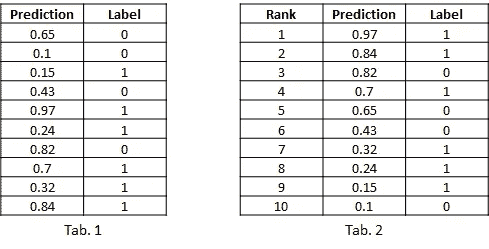

```
**Python code**:
predictions = np.array([0.65,0.1,0.15,0.43,0.97,0.24,0.82,0.7,0.32,0.84])
labels = np.array([0, 0, 1, 0, 1, 1, 0, 1, 1, 1])# sort the entries according to the predicted confidence
id = np.argsort(predictions)[::-1]
predictions = predictions[id]
labels = labels[id]
```

如果我们将阈值选择在第一个和第二个条目之间(0.84

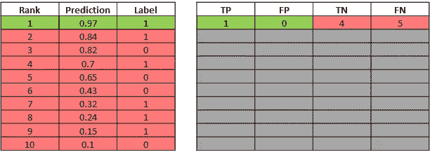

使用基本事实标签，我们可以很容易地推导出所选阈值的 TP、FP、TN 和 FN。要得到 TP，只需计算“标签”列(左表)的绿色行中出现了多少个 1。让 TN 计算“标签”列红色行中的 0，等等。

接下来，我们选择第二个和第三个条目之间的阈值(0.84

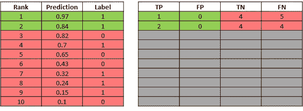

我们可以对表中的所有行执行这个简单的过程。如果现在还不完全清楚这个过程是如何工作的，让我们再举一个例子。我们选择阈值位于第 8 和第 9 个条目之间(0.15

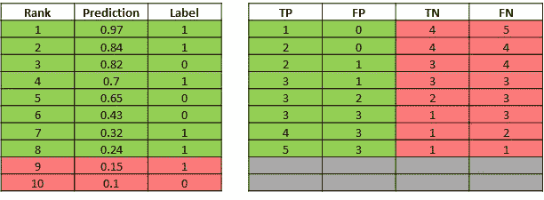

首先请注意，上表中每一行的 TP 值对应于该行(包括该行)以上所有 1 的总和。在 Python 中，这可以很容易地通过累加和来实现。

此外，请注意，上面右表中 TP 和 FP 的总和与左表中的秩条目相同。这并不奇怪，因为在上一篇文章中，我们展示了 TP+FP 是给定阈值的正面预测总数。这是个好消息，因为这意味着对于精度的计算，我们实际上不需要计算 FP(！).因此，通过将列“标签”的累积和除以列“等级”的条目，可以从上面的表中获得精度。

同样，请注意上表中 TP 和 FN 的总和始终为 6。这也不奇怪，因为 TP+FN 是数据集中实际阳性样本的总数。该数字等于标签列中所有条目的总和。因此，为了计算召回率，我们既不需要计算 TN 也不需要计算 FN(！).

接下来，让我们将获得的配方应用于上表的所有条目:

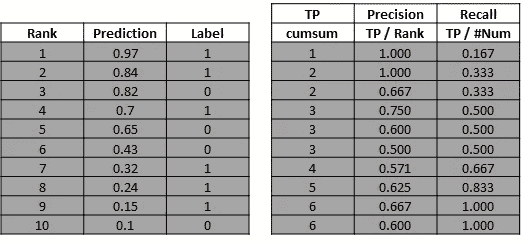

```
**Python code**:
cumsum = np.cumsum(labels)
rank = np.arange(len(cumsum)) + 1
Num = cumsum[-1]prec = cumsum / rank
rec = cumsum / Num
```

当我们绘制精度与回忆的关系图时，我们观察到一个曲折的模式:

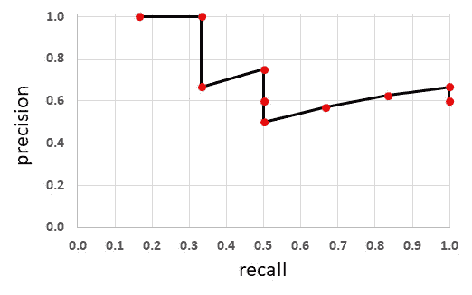

接下来是更高级的部分，我将解释之字形图案的来源。在本节结束时，你应该能够通过查看(已排序的)“标签”栏来定性地绘制精度-召回曲线。这是一个很好的技巧，可以让你对精确回忆曲线有更直观的理解。你自己试几个例子就好了。但是，如果您只对 PR-AUC 的有效实施感兴趣，您可以安全地跳过这一部分。

之字形模式有以下根本原因:每次我们在列“Label”中遇到一个或多个零，列“TP”中的累积和与前一行中的值相同。

因为召回是 TP 除以一个常数，所以召回的值也保持不变。然而，当向下移动一行时,“Rank”列中的值总是增加 1。因为精度是 TP 除以秩，所以精度必须变小。这解释了精确召回曲线的暴跌。

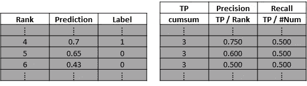

相比之下，每当我们在列“标签”中遇到一个或多个 1 时，当前进到下一行时，列“TP”中的累积和就增加 1。因为召回是 TP 除以一个常数，所以召回的值也必须增加。

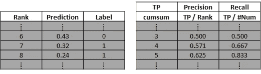

我们可以很容易地证明，在这些情况下，精度的值要么增加，要么保持不变。我们因此想证明下面的表达式:

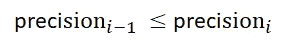

其中 *i =* Rank 就是该行的索引。上述表达式相当于:

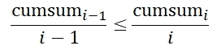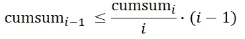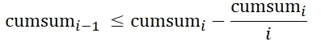

请注意，我们只考虑“标签”列中当前条目(行 *i* )的值为 1 的情况:


或者

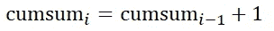

将这个表达式代入上式，我们得到:

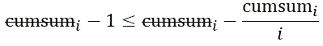

最后:

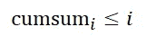

这种说法总是成立的，从下表中可以看出:

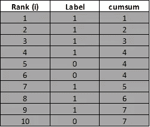

请注意，上面公式中的等式只有在“标签”列中没有出现零时才成立。因此，只要没有遇到零，精度也保持不变(值为 1.0)。

# 前哨值

正如我们将很快看到的那样，Sentinel value 使 PR-AUC 的实施非常有效。

让我们先来看看上面例子中的一个特点。当列“标签”中的第一个条目是 1 时，第一个召回值大于 0。

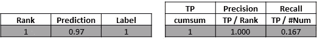

请再看一下上面的图表来验证这一说法。这是不好的，因为当我们在精度-召回曲线上进行积分以获得 PR-AUC 时，我们必须从召回值零开始。

请注意，如果上面示例中的第一个标签是零，我们将获得下图:

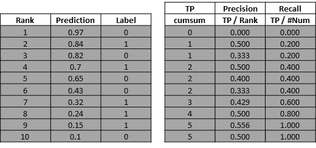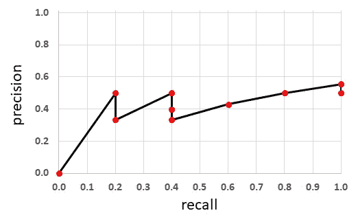

这一次我们从召回值零开始，但是，相应的精度值也是零。因此，我们得到了精确回忆曲线的原点。请进一步注意，如果列“标签”的前 2 个条目为零，我们将在精确召回曲线的原点得到两个重叠点，依此类推。

因此，如果我们在表中添加一个 sentinel 值(precision=0.0，recall=0.0)作为额外的第 0 行，也没有什么坏处。

为了完整起见，我们还将在表的末尾添加一个标记值(precision=0.0，recall=1.0)。请注意，根据定义，最后一行中的 recall 值必须始终为 1.0。

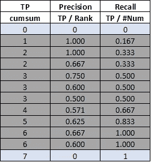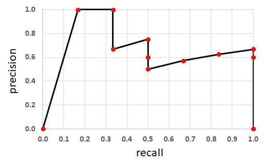

```
**Python code**:
mrec = np.concatenate(([0.], rec, [1.]))
mpre = np.concatenate(([0.], prec, [0.]))
```

为了消除锯齿模式并校正第一个标记值，我们将计算精度的包络。使用我们的表格很容易得到信封。对于每一行，我们计算该行下面所有精度值的最大值，包括该行本身的值。

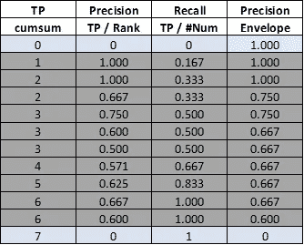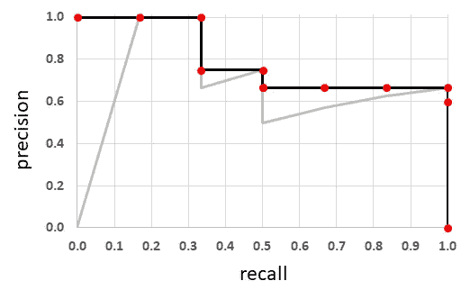

```
**Python code**:
# compute the precision envelope
for i in range(mpre.size - 1, 0, -1):
    mpre[i - 1] = np.maximum(mpre[i - 1], mpre[i])
```

为了计算面积和精确召回曲线，我们将使用矩形划分图形(请注意，矩形的宽度不一定相同)。

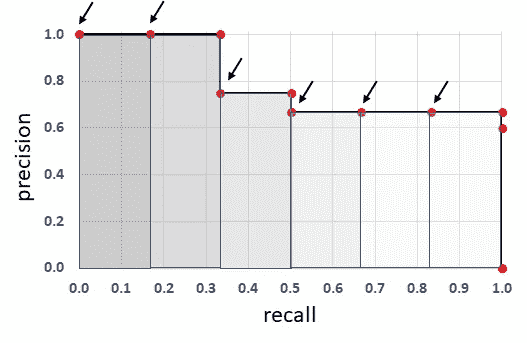

在我们的例子中，只需要 6 个矩形来描述该区域，然而，我们有 12 个点来定义精度-召回曲线。我们如何找到有用的点？请注意，我们只需要位于每个矩形左上角的那些点。幸运的是，所有其他点都有一个属性，即它们后面(表中的下一行)有一个具有相同召回值的点，查看上图中不带小箭头的红色点即可获得该点。因此，在我们的表中，我们必须寻找与下面的行具有不同召回值的行。

```
**Python code**:
i = np.where(mrec[1:] != mrec[:-1])[0]
```

请注意，原点中的重复点(前面提到过)也会被该方法过滤掉。只有原点中的最后一点会被保留。

最后，我们必须计算所有矩形的面积，并将它们相加。矩形的宽度由两个相邻的召回值定义。

```
**Python code:** pr_auc = np.sum((mrec[i + 1] - mrec[i]) * mpre[i + 1])
```

# 更多阅读

[https://neptune.ai/blog/f1-score-accuracy-roc-auc-pr-auc](https://neptune.ai/blog/f1-score-accuracy-roc-auc-pr-auc)

# 参考

[脸书研究 Detectron](https://github.com/facebookresearch/Detectron/blob/master/detectron/datasets/voc_eval.py)
[图(平均平均精度)用于物体检测](https://medium.com/@jonathan_hui/map-mean-average-precision-for-object-detection-45c121a31173)