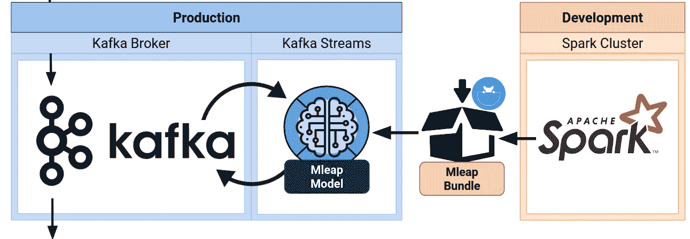
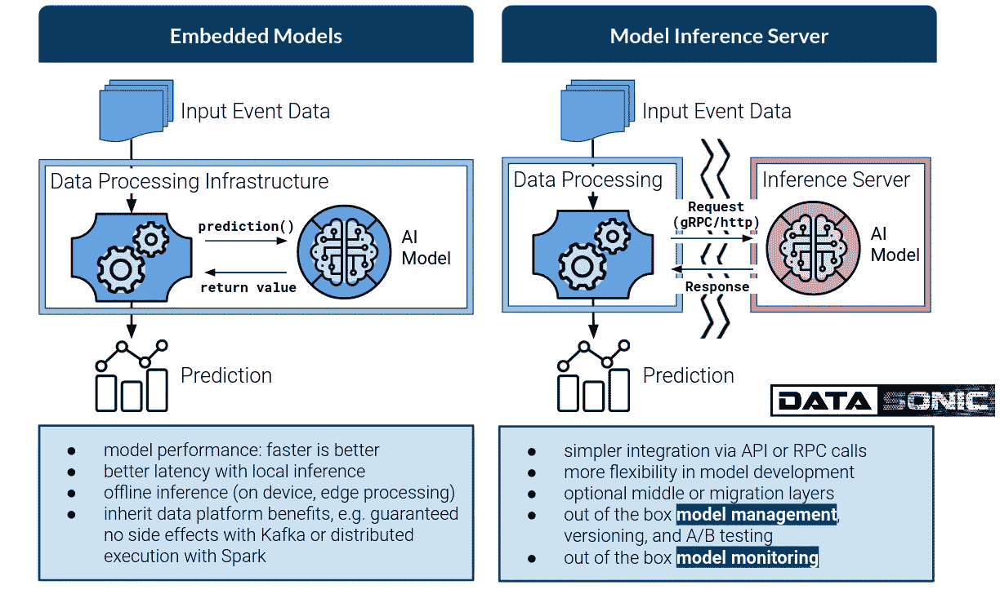
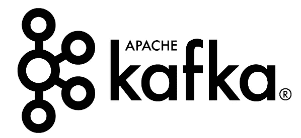
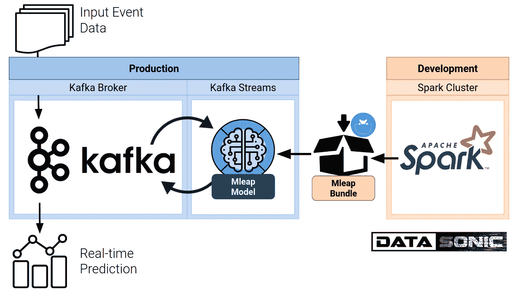
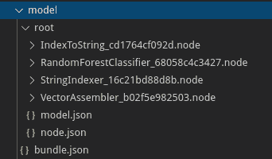
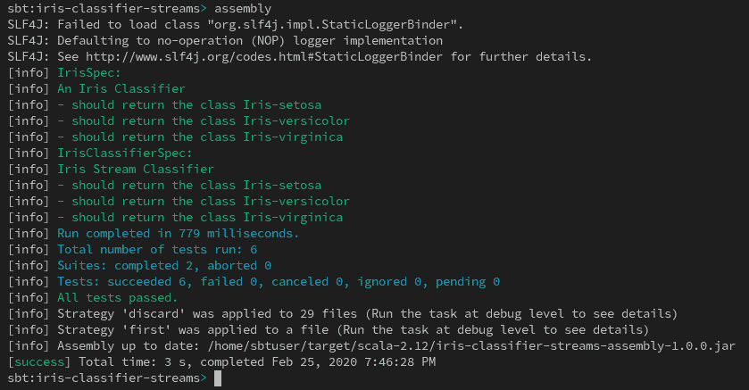
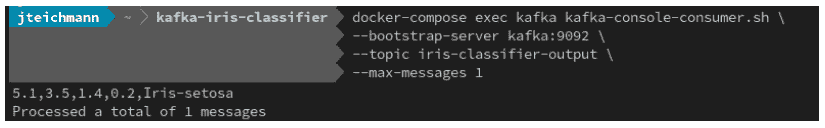
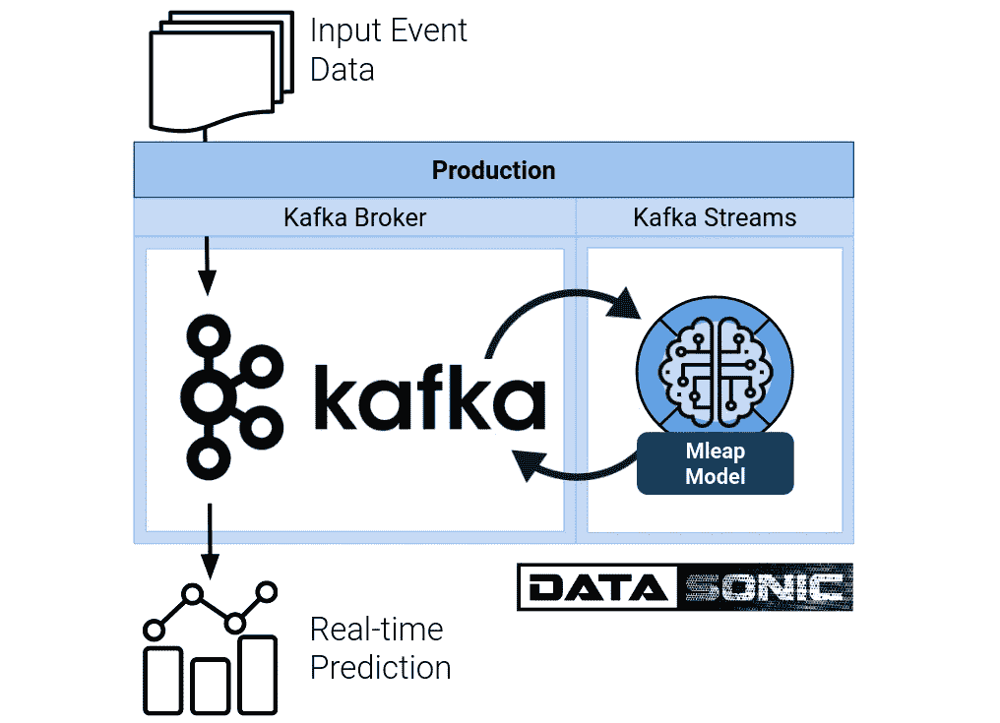

# 如何将 Spark ML 模型作为 Kafka 实时流应用程序嵌入到生产部署中

> 原文：<https://towardsdatascience.com/how-to-embed-a-spark-ml-model-as-a-kafka-real-time-streaming-application-for-production-deployment-933aecb79f3f?source=collection_archive---------11----------------------->



[OC]

# 用于生产评分的 2 种模型部署

今天的数据科学家可以依靠丰富的高质量开源工具、框架和库来训练模型。训练模型从未如此简单，只需几行 Python 代码即可完成。

然而，模型的生产部署仍然是数据科学中最棘手的问题，也是许多数据科学项目难以适应业务并产生影响的原因。Gartner 2019 等行业调查发现，多达 80%的数据科学项目失败。数据科学的成功受到一些通常称为“最后一英里问题”的困扰。

你可以在我之前关于模型开发最佳实践如何缩小数据科学和生产环境之间差距的博客文章中读到:

[](/complete-data-science-project-template-with-mlflow-for-non-dummies-d082165559eb) [## 用 Mlflow 为非傻瓜完成数据科学项目模板。

### 数据科学项目最佳实践，适用于在本地或云中工作的每个人，从刚起步的忍者到大…

towardsdatascience.com](/complete-data-science-project-template-with-mlflow-for-non-dummies-d082165559eb) 

模型开发的最佳工具不一定是大规模生产中模型评分或模型推断的正确选择。为生产中的模型评分和模型推断选择最佳框架，并理解这对模型开发本身的约束和要求是很重要的。虽然最佳开发实践使模型更接近生产环境，但数据科学家仍然必须将模型与最合适的模型服务和评分框架相结合，以实现成功的生产部署。

用于模型服务和评分的框架和平台的选择越来越多，与所有最新的创新和发布保持同步会让人感到势不可挡。幸运的是，所有的解决方案都分为两大类。了解哪种类型最适合您的业务问题将大大简化选择最佳可用选项的过程。



[OC]

模型部署的两个高级类型是(1)嵌入式模型或(2)模型推理服务器。

在嵌入式模型的情况下，模型作为数据处理基础结构的一部分被托管和管理。当模型性能至关重要时，这种部署类型是理想的，因为嵌入式模型速度更快，延迟最低。如果您希望在设备或 edge 上支持离线推理，而不依赖于将数据发送到通常位于云中的独立模型推理服务器，那么也需要嵌入您的模型。嵌入式模型还继承了数据处理框架的优势和能力，例如，将模型嵌入到 Kafka 中可以保证只有一次语义而没有副作用。嵌入模型的目标基础设施的正确选择是

*   Kafka:
    使用无状态模型和类似于精确一次语义的保证对事件数据流进行实时评分。
*   Spark:
    针对大量现有数据对模型进行分布式批量评分
    或对具有宽松实时要求的模型进行小批量评分，但先进的 ELT 步骤和功能工程受益于 SparkSQL
*   数据库内:
    有状态模型对不断变化的数据记录进行评分，比如需要高性能数据库的用户配置文件。选项有 RedisAI、ksqlDB 和 SQL Server。

在专用的模型推理服务器上部署模型也有它的优势:首先，它是最灵活的部署，对模型开发的约束最少。其次，通过 API 和 gRPC 调用与现有的遗留基础设施集成推理服务器和建模微服务也更简单，允许额外的中间层或集成层。但最重要的是，大多数专用的模型推理服务器都带有现成的功能，用于管理和监控生产中的模型。生产中的典型数据科学模型是动态的，具有复杂的生命周期。


[OC]

一个成功的数据科学团队将开发许多不同的现任和挑战者模型，并要求在不断变化的环境中通过持续的基准测试、监控和生产移交来重新培训这些模型。专用的模型推理服务器可以更轻松地实现复杂数据科学模型生命周期的端到端自动化。例如，专用推理服务器和模型微服务的选项有:

*   张量流服务
*   ONNX 运行时
*   模型微服务，例如通过 AWS Sagemaker
*   **会合建筑**

# 卡夫卡的嵌入式模型



建立模型似乎是大多数数据科学项目中最容易的部分。然而，由于企业生产系统的需求，将模型部署到生产中是一个挑战。模型的部署必须解决伸缩和负载平衡问题，以满足不同需求的 SLA，并需要与上游数据系统和下游模型消费者集成。虽然这是一项极其复杂的工程任务

*   为了管理分布式模型，
*   对数据进行实时评分
*   保证每个请求只获得一次分数
*   包括容错和恢复

这些要求在企业部署中很常见。

通过将我们的模型嵌入到 Kafka Streams 应用程序中，我们只需继承 Kafka 的企业特性，就可以满足所有这些需求。

Kafka 是分布式流媒体应用程序的代理，Kafka 可以

1.  将数据作为消息在应用程序之间传递，作为一个 **KStream** 和
2.  将分布式应用程序的状态作为一个**表**进行全局管理。

在商业数据科学家的日常工作中，构建和训练模型的要求与部署用于评分的模型非常不同。模型通常使用 Spark 对大量历史数据进行批量训练，然后部署在生产中进行实时评分。

以下示例显示了如何将在 Spark 中构建和训练的数据科学模型作为 Kafka 流应用程序嵌入到实时评分中。



[OC]

# 创建模型


为了将 Spark 管道部署为 Kafka 流应用程序，我们使用 [Mleap 项目](https://mleap-docs.combust.ml/)来序列化我们的 Spark 管道，而不需要任何 Spark 上下文。

我们将 mleap 包与 pip 或 conda 一起安装在我们的 Jupyter 笔记本中使用，或者将 Python 脚本作为我们的 Spark 驱动程序脚本:

```
pip install mleap
```

下面的代码将 Mleap 添加到我们的 Spark 会话中:

```
from pyspark.sql import SparkSessionspark = (
    SparkSession.builder
    .config('spark.jars.packages', 'ml.combust.mleap:mleap-spark-base_2.11:0.14.0,ml.combust.mleap:mleap-spark_2.11:0.14.0')
    .getOrCreate()
)
```

然后像平常一样使用 Spark，并使用 PySpark ML 包训练一个模型:

```
from pyspark.ml import Pipeline
from pyspark.ml.classification import RandomForestClassifier
from pyspark.ml.feature import IndexToString, StringIndexer, VectorAssembleriris.show(1)
# +---------------+--------------+---------------+--------------+---------------+
# |sepal_length_cm|sepal_width_cm|petal_length_cm|petal_width_cm|          class|
# +---------------+--------------+---------------+--------------+---------------+
# |            7.0|           3.2|            4.7|           1.4|Iris-versicolor|
# +---------------+--------------+---------------+--------------+---------------+labelIndexer = StringIndexer(inputCol="class", outputCol="indexedLabel").fit(iris)
assembler = VectorAssembler(
    inputCols=["sepal_length_cm", "sepal_width_cm", "petal_length_cm", "petal_width_cm"],
    outputCol="features"
)
labelConverter = IndexToString(
    inputCol="prediction", outputCol="predictedLabel",
    labels=labelIndexer.labels
)
rf = RandomForestClassifier(labelCol="indexedLabel", featuresCol="features", numTrees=10)
pipeline = Pipeline(stages=[labelIndexer, assembler, rf, labelConverter])model = pipeline.fit(iris)model.transform(iris.select('sepal_length_cm', 'sepal_width_cm', 'petal_length_cm', 'petal_width_cm')).show(1)# +---------------+--------------+---------------+--------------+-----------------+--------------+-------------+----------+--------------+
# |sepal_length_cm|sepal_width_cm|petal_length_cm|petal_width_cm|         features| rawPrediction|  probability|prediction|predictedLabel|
# +---------------+--------------+---------------+--------------+-----------------+--------------+-------------+----------+--------------+
# |            5.1|           3.5|            1.4|           0.2|[5.1,3.5,1.4,0.2]|[10.0,0.0,0.0]|[1.0,0.0,0.0]|       0.0|   Iris-setosa|
```

在真实的项目中，我们至少会使用测试数据集来验证我们的模型，并使用交叉验证来调整参数。在模型构建和训练的最后，我们有一个拟合的 Spark 管道模型，在上面的代码中称为 model，我们可以使用它来转换数据，以在 Spark 中批量获得预测。

为了将我们的模型从 Spark 中释放出来，并将其移动到 Kafka 流应用程序中进行实时评分，我们使用以下简单代码将其序列化为 Mleap 包:

```
import mleap.pyspark
from mleap.pyspark.spark_support import SimpleSparkSerializermodel.serializeToBundle(
    "file:/home/jovyan/notebooks/model", 
    model.transform(iris)
)
```

它在名为 model:



# 创建 Kafka 流应用程序

通过将我们的模型序列化为 Mleap 包，我们可以创建 Kafka 流应用程序来将我们的模型嵌入到 Kafka 中。我们必须为此创建一个简单的 Scala 应用程序，最重要的是将带有 Mleap 包的模型文件夹移动到 Scala 项目的资源文件夹中。

您可以在我的 Git 存储库中找到完整的代码和项目设置:

[](https://gitlab.com/jan-teichmann/kafka-mleap-iris-classifier) [## Jan Teichmann / kafka-mleap-iris 分类器

### 借助 Mleap 嵌入 Spark ML 管道的 Kafka Streams 应用程序

gitlab.com](https://gitlab.com/jan-teichmann/kafka-mleap-iris-classifier) 

下面的 Scala 代码将我们的 Mleap 捆绑包分解成一个 Mleap 管道模型，并创建一个名为 score()的简单函数，接受 iris 输入数据进行评分。你可以看到 Mleap 非常接近 Spark API。这段代码与 Kafka 无关，只是如何用 Scala 从一个包中加载任何 Mleap 模型。你可以在这里找到关于 Mleap 运行时[的扩展文档。](https://mleap-docs.combust.ml/mleap-runtime/)

```
object IrisModel {val schema: StructType = StructType(
        StructField("sepal_length_cm", ScalarType.Double),
        StructField("sepal_width_cm", ScalarType.Double),
        StructField("petal_length_cm", ScalarType.Double),
        StructField("petal_width_cm", ScalarType.Double),
        StructField("class", ScalarType.String)
    ).getval modelpath = getClass.getResource("/model").getPathval model = (
        for(bundle <- managed(BundleFile(s"jar:$modelpath"))) yield {
            bundle.loadMleapBundle().get
        }
    ).tried.get.rootdef score(
        sepal_length_cm: Double, sepal_width_cm: Double,
        petal_length_cm: Double, petal_width_cm: Double
    ): String = {model.transform(
            DefaultLeapFrame(
                schema, 
                Seq(Row(sepal_length_cm, sepal_width_cm, petal_length_cm, petal_width_cm, "Iris-setosa"))
            )
        ).get.select("predictedLabel").get.dataset.map(_.getString(0)).head

    }}
```

我们可以使用如下简单的单元测试来测试我们的模型是否如预期的那样工作:

```
class IrisSpec extends FlatSpec with Matchers {
  "An Iris Classifier" should "return the class Iris-setosa" in {
    val prediction = IrisModel.score(5.1, 3.5, 1.4, 0.2)
    prediction should be ("Iris-setosa")
  }
  it should "return the class Iris-versicolor" in {
    val prediction = IrisModel.score(6.2, 2.2, 4.5, 1.5)
    prediction should be ("Iris-versicolor")
  }
  it should "return the class Iris-virginica" in {
    val prediction = IrisModel.score(6.1, 2.6, 5.6, 1.4)
    prediction should be ("Iris-virginica")
  }
}
```

下一步，我们创建 Kafka 流应用程序并嵌入我们的模型:

```
object IrisStreamClassifier extends App {import org.apache.kafka.streams.scala.Serdes._
    import org.apache.kafka.streams.scala.ImplicitConversions._val config: Properties = {
        val p = new Properties()
        p.put(StreamsConfig.APPLICATION_ID_CONFIG, "iris-classifier")
        val bootstrapServers = if (args.length > 0) args(0) else "kafka:9092"
        p.put(StreamsConfig.BOOTSTRAP_SERVERS_CONFIG, bootstrapServers)
        p
    }def irisStreamClassifier(
        inputTopic: String, outputTopic: String
    ): Topology = {val builder: StreamsBuilder = new StreamsBuilder()
        val irisInput = builder.stream[String, String](inputTopic)
        val irisScore: KStream[String, String] = irisInput.map(
            (_, value) => {
                val iris_values = value.split(",").map(_.toDouble)
                (null, Seq(value, IrisModel.score(iris_values(0), iris_values(1), iris_values(2), iris_values(3))).mkString(","))
            }
        )
        irisScore.to(outputTopic)
        builder.build()
    }val streams: KafkaStreams = new KafkaStreams(
        irisStreamClassifier(
            "iris-classifier-input",
            "iris-classifier-output"
        ), config
    )
    streams.start()sys.ShutdownHookThread {
        streams.close(Duration.ofSeconds(10))
    }}
```

在 irisStreamClassifier 函数中，我们创建了流拓扑，它接收作为 csv 字符串的 iris 数据流，并通过将分类器应用于每个消息来映射该流。我们将流处理拓扑封装到一个新的 Kafka 流中，以将该拓扑转变为我们使用 streams.start()运行的应用程序

我们可以使用 Kafka 的 TopologyTestDriver 对我们的流应用程序进行单元测试:

```
class IrisClassifierSpec extends FlatSpec with Matchers with BeforeAndAfterAll {
    val config: Properties = {
        val p = new Properties()
        p.put(StreamsConfig.APPLICATION_ID_CONFIG, "integration-test")
        p.put(StreamsConfig.BOOTSTRAP_SERVERS_CONFIG, "dummy config")
        p
    }val driver = new TopologyTestDriver(
        IrisStreamClassifier.irisStreamClassifier("input-topic", "output-topic"), config)val recordFactory = new ConsumerRecordFactory("input-topic", new StringSerializer(), new StringSerializer())override def afterAll() {
        driver.close()
    }

    "Iris Stream Classifier" should "return the class Iris-setosa" in {
        driver.pipeInput(recordFactory.create("5.1,3.5,1.4,0.2"))
        val record: ProducerRecord[String, String] = driver.readOutput("output-topic", new StringDeserializer(), new StringDeserializer())
        record.value() should be("5.1,3.5,1.4,0.2,Iris-setosa")
    }
    it should "return the class Iris-versicolor" in {
        driver.pipeInput(recordFactory.create("6.2,2.2,4.5,1.5"))
        val record: ProducerRecord[String, String] = driver.readOutput("output-topic", new StringDeserializer(), new StringDeserializer())
        record.value() should be("6.2,2.2,4.5,1.5,Iris-versicolor")   
    }
    it should "return the class Iris-virginica" in {
        driver.pipeInput(recordFactory.create("6.1,2.6,5.6,1.4"))
        val record: ProducerRecord[String, String] = driver.readOutput("output-topic", new StringDeserializer(), new StringDeserializer())
        record.value() should be("6.1,2.6,5.6,1.4,Iris-virginica")   
    }
}
```

为了构建我们的应用程序，我们将使用 SBT 并如下定义我们的 build.sbt 项目:

```
name := "iris-classifier-streams"
version := "1.0.0"
scalaVersion := "2.12.10"
exportJars := truelazy val iris = (project in file("."))
    .settings(
        libraryDependencies ++= Seq(
            "org.scalatest" %% "scalatest" % "3.1.0" % Test,
            "org.apache.kafka" % "kafka-streams-test-utils" % "2.4.0" % Test,
            "org.apache.kafka" %% "kafka-streams-scala" % "2.4.0",
            "ml.combust.bundle" %% "bundle-ml" % "0.14.0",
            "ml.combust.mleap" %% "mleap-runtime" % "0.14.0",
            "com.jsuereth" %% "scala-arm" % "2.0",),
        assemblyMergeStrategy in assembly := {
            case PathList("org", "apache", "spark", "unused", "UnusedStubClass.class") => MergeStrategy.first
            case "module-info.class" => MergeStrategy.discard
            case x =>
                val oldStrategy = (assemblyMergeStrategy in assembly).value
                oldStrategy(x)
        }
    )
```

这包括汇编插件的合并策略，以处理一些依赖关系抛出的重复数据删除错误。我们使用一个名为 scala-sbt 的 Docker 映像，它提供了 scala 和 sbt 来编译和打包我们的应用程序，作为一个汇编超级 Jar:

```
ocker build \
    --build-arg BASE_IMAGE_TAG="8u242-jdk-stretch" \
    --build-arg SBT_VERSION="1.3.5" \
    --build-arg SCALA_VERSION="2.12.10" \
    -t scala-sbt github.com/hseeberger/scala-sbt.git#:debiandocker run -it --rm -w /home/sbtuser \
   --mount type=bind,source="$(PWD)/src",target=/home/sbtuser/src \
   --mount type=bind,source="$(PWD)/build.sbt",target=/home/sbtuser/build.sbt \
   --mount type=bind,source="$(PWD)/project",target=/home/sbtuser/project \
   --mount type=bind,source="$(PWD)/target",target=/home/sbtuser/target \
   scala-sbt sbt assembly
```



## 在本地运行 Kafka 流应用程序

要将我们的新 Iris 分类器作为 Kafka 流应用程序运行，我们可以使用以下 docker-compose.yml 在我们的笔记本电脑上运行 Kafka broker:

```
version: '2'services:
  zookeeper:
    image: 'bitnami/zookeeper:3'
    ports:
      - '2181:2181'
    environment:
      - ALLOW_ANONYMOUS_LOGIN=yes

  kafka:
    image: 'bitnami/kafka:2'
    ports:
      - '9092:9092'
      - '29092:29092'
    environment:
      KAFKA_CFG_ZOOKEEPER_CONNECT: zookeeper:2181
      ALLOW_PLAINTEXT_LISTENER: "yes"
      KAFKA_CFG_LISTENER_SECURITY_PROTOCOL_MAP: PLAINTEXT:PLAINTEXT,PLAINTEXT_HOST:PLAINTEXT
      KAFKA_CFG_LISTENERS: PLAINTEXT://:9092,PLAINTEXT_HOST://:29092
      KAFKA_CFG_ADVERTISED_LISTENERS: PLAINTEXT://kafka:9092,PLAINTEXT_HOST://localhost:29092
      KAFKA_CFG_AUTO_CREATE_TOPICS_ENABLE: "true"
    depends_on:
      - zookeeper
```

docker-compose up 将开始我们的单一卡夫卡经纪人

```
docker-compose up kafka
```

然后为我们的应用程序创建 Kafka 主题:

```
docker-compose exec kafka kafka-topics.sh --create --bootstrap-server kafka:9092 --replication-factor 1 --partitions 1 --topic iris-classifier-input
docker-compose exec kafka kafka-topics.sh --create --bootstrap-server kafka:9092 --replication-factor 1 --partitions 1 --topic iris-classifier-output
```

然后，我们使用以下命令启动我们的流应用程序:

```
java -classpath target/scala-2.12/iris-classifier-streams-assembly-1.0.0.jar  kafka.iris.IrisStreamClassifier localhost:29092
```

我们启动一个控制台监听器，等待关于应用程序输出主题的消息:

```
docker-compose exec kafka kafka-console-consumer.sh --bootstrap-server kafka:9092 --topic iris-classifier-output --from-beginning --max-messages 1
```

最后，我们用下面的命令向模型的输入主题发送一条消息:

```
docker-compose exec kafka bash -c "echo 5.1,3.5,1.4,0.2 | kafka-console-producer.sh --broker-list kafka:9092 --topic iris-classifier-input && echo"
```

由于我们的努力，我们获得了模型输出主题上的消息，该消息由控制台消费者实时流式传输并打印到我们的终端:



在我的 GitLab 上找到这个例子的所有代码

[](https://gitlab.com/jan-teichmann/kafka-mleap-iris-classifier) [## Jan Teichmann / kafka-mleap-iris 分类器

### 借助 Mleap 嵌入 Spark ML 管道的 Kafka Streams 应用程序

gitlab.com](https://gitlab.com/jan-teichmann/kafka-mleap-iris-classifier) 

[OC]

如果你有兴趣了解更多关于在 Kafka 上构建实时数据产品的信息，可以看看我写的关于 Trainline.com 实时数据产品团队的博客

[](https://engineering.thetrainline.com/meet-kronos-trainlines-real-time-data-product-platform-and-team-f4b3dbe663ec) [## 认识克罗诺斯:Trainline 的实时数据产品平台和团队

### 让我们的数据按时运行

engineering.thetrainline.com](https://engineering.thetrainline.com/meet-kronos-trainlines-real-time-data-product-platform-and-team-f4b3dbe663ec) 

Jan 是公司数据转型方面的成功思想领袖和顾问，拥有将数据科学大规模应用于商业生产的记录。他最近被 dataIQ 评为英国 100 位最具影响力的数据和分析从业者之一。

**在 LinkedIn 上连接:**[**【https://www.linkedin.com/in/janteichmann/】**](https://www.linkedin.com/in/janteichmann/)

**阅读其他文章:**[**https://medium.com/@jan.teichmann**](https://medium.com/@jan.teichmann)