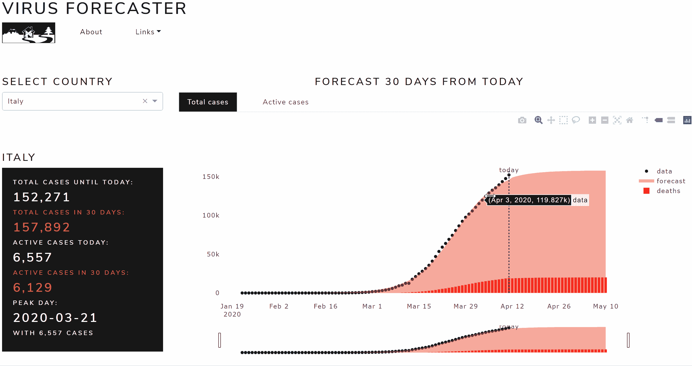
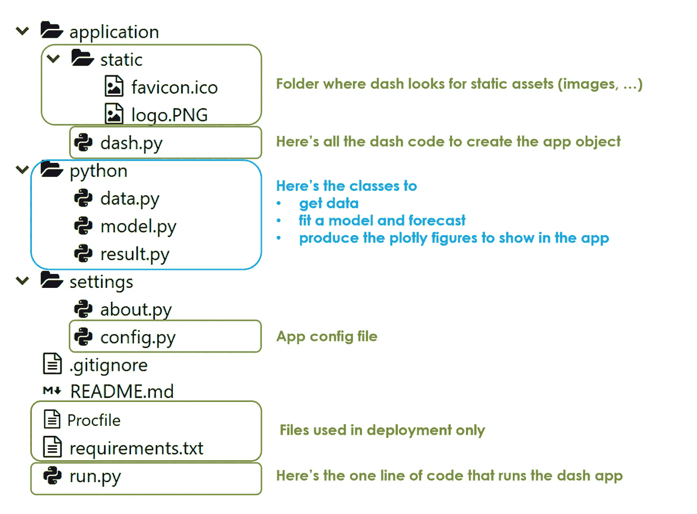
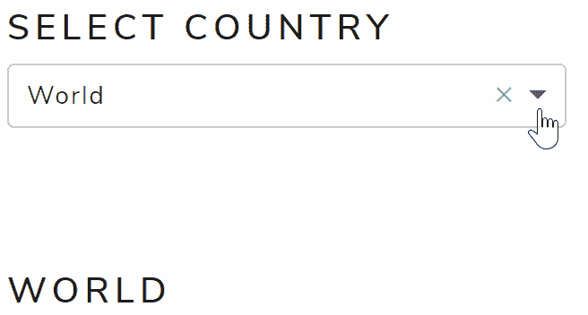
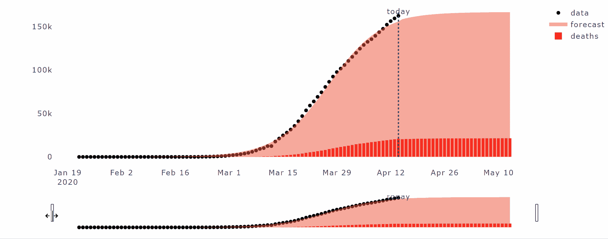
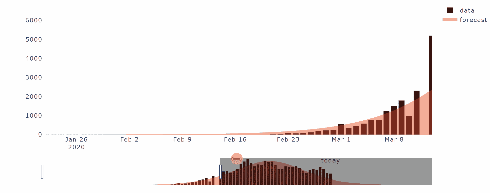
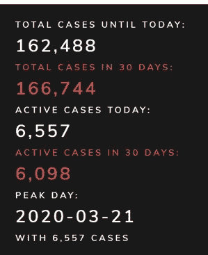
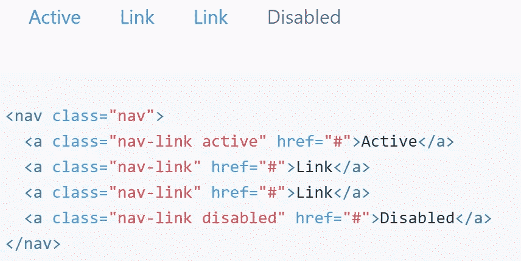
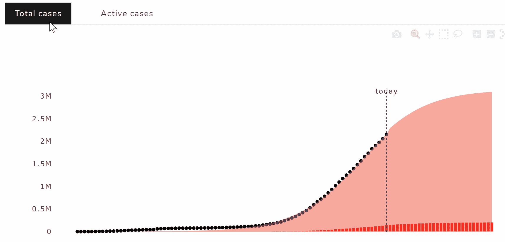
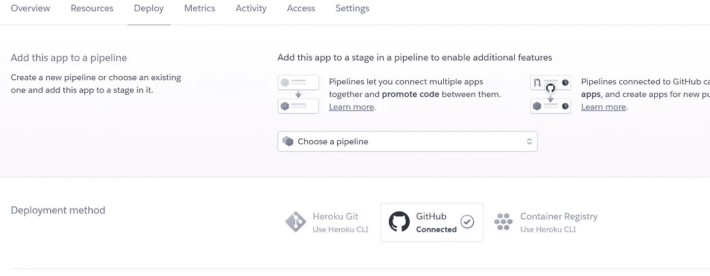
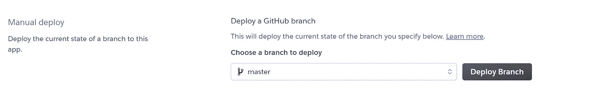

# 如何在你的 Python Dash 应用中嵌入引导 CSS & JS

> 原文：<https://towardsdatascience.com/how-to-embed-bootstrap-css-js-in-your-python-dash-app-8d95fc9e599e?source=collection_archive---------2----------------------->


## 使用 Dash Bootstrap 组件构建新冠肺炎感染预测应用程序

# 摘要

在本文中，我将展示如何使用 **Python** 、 **Dash** 和 **Bootstrap** 构建一个预测新冠肺炎病毒在任何受感染国家传播的 web 应用程序，如下所示:



让我从这个开始:编写 Dash 应用程序很麻烦…我没有任何恶意，我喜欢 Dash，我认为它是 Python web 开发的未来。 [**Dash**](https://dash.plotly.com/introduction) 是一个用于构建 web 应用的 Python(和 R)框架。它建立在 Flask、Plotly.js 和 React js 之上。它是开源的，它的应用程序运行在网络浏览器上。如果你更擅长 Python 而不是 Javascript，Dash 会非常方便，因为它允许你使用纯 Python 来构建仪表盘。

不知道大家有没有见过 dash 的应用代码。这是一个烂摊子:代码出来真的很长，因为你需要编写每个 html Div 的内容和属性，就像一个 html 页面之前，引导发明。[**Bootstrap**](https://getbootstrap.com/)**是一个开源的工具包，用于开发 HTML、CSS 和 JS。它是 web 开发中使用最多的库，这要归功于它广泛的预构建组件和基于 jQuery 构建的强大插件。**

**我喜欢 Boostrap，不仅因为它的输出总是非常好看，而且特别是因为它为您节省了一行又一行的 HTML、CSS 和 JS 代码。如果我告诉你它也可以用于 Dash 应用呢？你喜欢这种声音，不是吗？**

**通过本教程，我将一步一步地解释如何将 Bootstrap 轻松集成到 Dash 中，以及如何使用我的新冠肺炎感染预测应用程序为例构建和部署 web 应用程序、(链接如下，加载可能需要 30 秒)。**

 **[## 病毒预报员

### 编辑描述

app-virus-forecaster.herokuapp.com](https://app-virus-forecaster.herokuapp.com/)** 

**我将展示一些有用的 Python 代码，这些代码可以很容易地用于其他类似的情况(只需复制、粘贴、运行)，并通过注释遍历每一行代码，这样您就可以很容易地复制这个示例(下面是完整代码的链接)。**

**[](https://github.com/mdipietro09/App_VirusForecaster) [## GitHub-mdipietro 09/App _ 病毒预报员:新冠肺炎预报员网络应用

### 新冠肺炎预报员网络应用。通过在…上创建帐户，为 mdipietro 09/App _ virus forecaster 开发做出贡献

github.com](https://github.com/mdipietro09/App_VirusForecaster) 

我将使用这几天隔离中最流行的数据集: **CSSE 新冠肺炎数据集**。它显示了自疫情开始以来，每个国家每天报告的确诊传染病病例数的时间序列。这个数据集可以在约翰霍普金斯大学的 GitHub 上免费获得(链接如下)。

[](https://github.com/CSSEGISandData/COVID-19) [## CSSEGISandData/新冠肺炎

### 这是由约翰·霍普金斯大学运营的 2019 年新型冠状病毒视觉仪表板的数据存储库…

github.com](https://github.com/CSSEGISandData/COVID-19) 

特别是，我将经历:

*   环境的设置
*   后端:编写模型来获取、处理和绘制数据
*   前端:用 Dash 和 Bootstrap 构建应用程序
*   部署应用程序

## 设置

首先，我将通过终端安装以下库:

```
pip install **dash**pip install **dash-bootstrap-components**pip install **pandas**
```

安装 dash 的命令还会下载有用的包，比如 **dash-core-components** 、 **dash-html-components** 和 **plotly** 。类似地，pandas 安装包括 **numpy** 和 **scipy** ，我稍后也会用到它们。我假设你已经知道了这些，因此我将花点时间来介绍一下 [**Dash Bootstrap 组件**](https://dash-bootstrap-components.opensource.faculty.ai/) :基本上，这就是将 Bootstrap 集成到 Dash 中的诀窍，它使构建具有复杂和响应性布局的风格一致的应用程序变得更加容易。我是这个库的粉丝，因为它保存了大量的 dash 代码行，稍后您会看到。

安装完所有需要的东西后，我建议在终端上运行以下命令，将需求保存在适当的文本文件中:

```
pip freeze > **requirements.txt**
```

关于**文件夹结构**，我将 4 个基本元素放在了根级别:

*   应用程序文件夹:dash.py 文件中所有 dash 代码所在的位置
*   python 文件夹:我放置模型逻辑的地方
*   设置文件夹:其中有所有的配置
*   run.py 文件:如果在终端上用下面的命令执行，它将运行全部内容

```
python **run.py**
```

到目前为止，这些都是我让应用程序工作所需的，然而，还有一些其他**有用但不必要的**东西，我添加了静态图像(在应用程序文件夹中)、注释(在设置文件夹中)、Procfile 和部署中使用的 requirements.txt(在根级别)。

总而言之，应用程序应具有以下结构:



现在一切都设置好了，我将浏览每个 python 文件并展示其中的代码。我们开始吧，好吗？

## 后端:获取数据、流程、绘图

首先，我将编写获取新冠肺炎感染数据的类，然后我将建立从过去的观察中学习的模型，并预测时间序列的未来趋势。

在 **data.py** (在 python 文件夹内)中，我将使用一个在应用程序启动时执行的方法来定义“data”类，这意味着每次加载应用程序运行的浏览器页面时，后端都会直接从数据源获取新数据(下面代码中的 *get_data* 函数)。保存国家列表很重要，因为它将在仪表板上显示给用户，供他们选择特定的国家。数据类的任务还包括接收来自前端的输入、用户选择的国家、过滤和处理数据(下面代码中的 *process_data* 函数)。在过滤特定国家之前，我会创建一个名为“世界”的聚合时间序列，这将是应用程序启动时默认选择的国家。



用 python 的术语来说，data.py 文件如下所示:

```
import **pandas** as pd class **Data()**:

    def **get_data**(self):
        self.dtf_cases = pd.read_csv("[**https://raw.githubusercontent.com/CSSEGISandData/COVID-19/master/csse_covid_19_data/csse_covid_19_time_series/time_series_covid19_confirmed_global.csv**](https://raw.githubusercontent.com/CSSEGISandData/COVID-19/master/csse_covid_19_data/csse_covid_19_time_series/time_series_covid19_confirmed_global.csv)", sep=",")
        self.countrylist = ["World"] + self.dtf_cases["Country/Region"].unique().tolist()
 @staticmethoddef **group_by_country**(dtf, country):
        dtf = dtf.drop(['Province/State','Lat','Long'], axis=1).groupby("Country/Region").sum().T
        dtf["World"] = dtf.sum(axis=1)
        dtf = dtf[country]
        dtf.index = pd.to_datetime(dtf.index, infer_datetime_format=True)
        ts = pd.DataFrame(index=dtf.index, data=dtf.values, columns=["data"])
        return ts

    def **process_data**(self, **country**):
        self.dtf = self.**group_by_country**(self.dtf_cases, **country**)
```

现在，我将构建模型来拟合数据和预测。本文的目的不是挖掘什么是最适合该数据集的模型，因此我将保持简单:我将使用参数曲线拟合方法，为每个国家的时间序列优化逻辑函数的参数。如果你对这个基本的建模方法感兴趣，你可以在这里 找到它的解释 [**。**](https://medium.com/analytics-vidhya/how-to-predict-when-the-covid-19-pandemic-will-stop-in-your-country-with-python-d6fbb2425a9f)

在**Model . py**(python 文件夹内)中，我将使用一个方法(下面代码中的 *forecast* 函数)定义“模型”类，该方法将在应用程序启动时以及每次从前端选择特定国家时在世界时间序列上执行。这个班的任务是在选定的国家数据上拟合最佳的逻辑函数(用 scipy ),并产生一个 pandas 数据框架:

*   实际数据和拟合的逻辑模型，将用于绘制总病例
*   实际数据和拟合逻辑模型(delta t = y t — y t-1)的每日变化，用于绘制活动案例。

举例来说，model.py 文件包含以下代码:

```
import **pandas** as pd
import **numpy** as np
from **scipy** import optimize class **Model()**:

    def **__init__**(self, dtf):
        self.dtf = dtf

    @staticmethod
    def **f**(X, c, k, m):
        y = c / (1 + np.exp(-k*(X-m)))
        return y

    @staticmethod
    def **fit_parametric**(X, y, f, p0):
        model, cov = optimize.curve_fit(f, X, y, maxfev=10000, p0=p0)
        return model

    @staticmethod
    def **forecast_parametric**(model, f, X):
        preds = f(X, model[0], model[1], model[2])
        return preds

    @staticmethod
    def **generate_indexdate**(start):
        index = pd.date_range(start=start, periods=30, freq="D")
        index = index[1:]
        return index

    @staticmethod
    def **add_diff**(dtf):
        **## create delta columns**
        dtf["delta_data"] = dtf["data"] - dtf["data"].shift(1)
        dtf["delta_forecast"] = dtf["forecast"] - dtf["forecast"].shift(1)     
        **## fill Nas**
        dtf["delta_data"] = dtf["delta_data"].fillna(method='bfill')
        dtf["delta_forecast"] = dtf["delta_forecast"].fillna(method='bfill')   
        **## interpolate outlier**
        idx = dtf[pd.isnull(dtf["data"])]["delta_forecast"].index[0]
        posx = dtf.index.tolist().index(idx)
        posx_a = posx - 1
        posx_b = posx + 1
        dtf["delta_forecast"].iloc[posx] = (dtf["delta_forecast"].iloc[posx_a] + dtf["delta_forecast"].iloc[posx_b])/2
        return dtf def **forecast**(self):
        **## fit**
        y = self.dtf["data"].values
        t = np.arange(len(y))
        model = self.fit_parametric(t, y, self.f, p0=[np.max(y),1,1])
        fitted = self.f(t, model[0], model[1], model[2])
        self.dtf["forecast"] = fitted
        **## forecast**
        t_ahead = np.arange(len(y)+1, len(y)+30)
        forecast = self.forecast_parametric(model, self.f, t_ahead)
        **## create dtf**
        self.today = self.dtf.index[-1]
        idxdates = self.generate_indexdate(start=self.today)
        preds = pd.DataFrame(data=forecast, index=idxdates, columns=["forecast"])
        self.dtf = self.dtf.append(preds) 
        **## add diff**
        self.dtf = self.add_diff(self.dtf)
```

是时候制作一些很酷的情节了，这项工作的最佳工具是 Plotly，因为 Dash 是在它的基础上构建的。我将在**result . py**(python 文件夹内)中放入一个类，这个类将负责处理这个问题

*   绘制总例数时间序列及其预测的方法(下面代码中的 *plot_total* 函数):



*   绘制活动案例时间序列及其预测的方法(下面代码中的 *plot_active* 函数):



*   该方法检索一些统计数据显示在前端上(下面代码中的 *get_panel* 函数):



以下是 result.py 中的完整代码:

```
import **pandas** as pd
import **plotly**.graph_objects as goclass **Result()**:

    def **__init__**(self, dtf):
        self.dtf = dtf

    @staticmethod
    def **calculate_peak**(dtf):
        data_max = dtf["delta_data"].max()
        forecast_max = dtf["delta_forecast"].max()
        if data_max >= forecast_max:
            peak_day = dtf[dtf["delta_data"]==data_max].index[0]
            return peak_day, data_max
        else:
            peak_day = dtf[dtf["delta_forecast"]==forecast_max].index[0]
            return peak_day, forecast_max

    @staticmethod
    def **calculate_max**(dtf):
        total_cases_until_today = dtf["data"].max()
        total_cases_in_30days = dtf["forecast"].max()
        active_cases_today = dtf["delta_data"].max()
        active_cases_in_30days = dtf["delta_forecast"].max()
        return total_cases_until_today, total_cases_in_30days, active_cases_today, active_cases_in_30days
 def **plot_total**(self, today):
        **## main plots**
        fig = go.Figure()
        fig.add_trace(go.Scatter(x=self.dtf.index, y=self.dtf["data"], mode='markers', name='data', line={"color":"black"}))
        fig.add_trace(go.Scatter(x=self.dtf.index, y=self.dtf["forecast"], mode='none', name='forecast', fill='tozeroy'))
        **## add slider**
        fig.update_xaxes(rangeslider_visible=True)    
        **## set background color**
        fig.update_layout(plot_bgcolor='white', autosize=False, width=1000, height=550)        
        **## add vline**
        fig.add_shape({"x0":today, "x1":today, "y0":0, "y1":self.dtf["forecast"].max(), 
                       "type":"line", "line":{"width":2,"dash":"dot"} })
        fig.add_trace(go.Scatter(x=[today], y=[self.dtf["forecast"].max()], text=["today"], mode="text", line={"color":"green"}, showlegend=False))
        return fig

    def **plot_active**(self, today):
        **## main plots**
        fig = go.Figure()
        fig.add_trace(go.Bar(x=self.dtf.index, y=self.dtf["delta_data"], name='data', marker_color='black'))
        fig.add_trace(go.Scatter(x=self.dtf.index, y=self.dtf["delta_forecast"], mode='none', name='forecast', fill='tozeroy'))
        **## add slider**
        fig.update_xaxes(rangeslider_visible=True)
        **## set background color**
        fig.update_layout(plot_bgcolor='white', autosize=False, width=1000, height=550)
       ** ## add vline**
        fig.add_shape({"x0":today, "x1":today, "y0":0, "y1":self.dtf["delta_forecast"].max(), 
                       "type":"line", "line":{"width":2,"dash":"dot"} })
        fig.add_trace(go.Scatter(x=[today], y=[self.dtf["delta_forecast"].max()], text=["today"], mode="text", line={"color":"green"}, showlegend=False))
        return fig

    def **get_panel**(self):
        peak_day, num_max = self.calculate_peak(self.dtf)
        total_cases_until_today, total_cases_in_30days, active_cases_today, active_cases_in_30days = self.calculate_max(self.dtf)
        return peak_day, num_max, total_cases_until_today, total_cases_in_30days, active_cases_today, active_cases_in_30days
```

## 前端:用 Dash 和 Bootstrap 构建应用程序

最后，在这里，我们将使用 **Dash** 和 **Dash Bootstrap 组件**(以下简称“dbc”)来编写应用程序，我将一步一步地解释它，并提供 *dash.py* 的完整代码(在应用程序文件夹内)。

为此，我们需要以下进口:

```
import **dash**
from dash.dependencies import Input, Output, State
import **dash_core_components** as dcc
import **dash_html_components** as html
import **dash_bootstrap_components** as dbc
```

首先，我需要定义应用程序实例，在这个过程中，dbc 已经提供了一个选择[引导 CSS **主题**](https://www.bootstrapcdn.com/bootswatch/) 的强大功能:

```
app = dash.**Dash**(external_stylesheets=[**dbc.themes.LUX**])
```

按照视觉顺序，我现在将接近顶部**导航条**。我想要一个很酷的反应式点击，有弹出菜单和下拉菜单，但我不想浪费太多时间写 CSS 和 JS 代码。换句话说，我想这样使用 Bootstrap:



[https://getbootstrap.com/docs/4.0/components/navs/](https://getbootstrap.com/docs/4.0/components/navs/)

与这个 html 类似，我们可以使用 dbc 创建导航栏及其项目:

```
dbc.**Nav**([
    dbc.**NavItem**(),
    dbc.**NavItem**(),
    dbc.**DropdownMenu**()
])
```

你得到了秘密装置，对不对？Dash 和 Dbc 复制了 html 语法的相同结构和逻辑。考虑到这一点，我们可以在每个项目中添加我们想要的任何内容:


继续使用**输入表单**，我想得到一个简单的下拉菜单，将所有可能的国家作为选项，将“世界”作为默认选项。为了做到这一点，有必要在编码下拉菜单对象之前读取数据。还记得之前在 data.py (python 文件夹)里面写的数据类吗？好吧，现在是时候使用它了:

```
from python.data import Datadata = Data()
data.get_data()
```

既然我们在数据对象中有了国家列表，我们就可以编写下拉菜单，并用一个简单的 for 循环设置其中的选项:

```
dcc.**Dropdown**(id="country", options=[{"label":x,"value":x} for x in        
             **data.countrylist**], value="World")])
```


在 Dash 中，如果没有特别编程，输出将按行排列，一行在另一行下面。但是，我希望所有的内容都包含在屏幕尺寸中，这样用户就不需要向下滚动了。这就是为什么我要使用**选项卡**，每个选项卡将显示我之前用 plotly 在 result.py(在 python 文件夹中)中编码的 2 个**图**中的一个。使用 dbc，这非常简单:

```
dbc.**Tabs**([
         dbc.**Tab**(**dcc.Graph(id="plot-total")**, label="Total cases"),
         dbc.**Tab**(**dcc.Graph(id="plot-active")**, label="Active cases")
        ])
```

我敢打赌，你一定想知道“应用程序如何知道它必须在第一个选项卡中放置第一个情节，在第二个选项卡中放置另一个情节？”。嗯，你没有错，应用程序需要在 html 和 Python 代码输出之间建立一个链接。在 Dash 中，这是通过回调来完成的。一个**回调**只不过是一个装饰器，一个接受另一个函数并扩展后一个函数的行为而不显式修改它的函数。

让我们以总案例的绘图为例:我需要一个函数，它将从前端选择的国家作为输入，并使用我之前编码的模型和结果类(在 python 文件夹中)将绘图作为输出返回。大概是这样的:

```
def **plot_total_cases**(country):
    data.process_data(country) 
    model = Model(data.dtf)
    model.forecast()
    model.add_deaths(data.mortality)
    result = Result(model.dtf)
    return result.plot_total(model.today)
```

正如你肯定注意到的，在我定义选项卡的前一段代码中，我在第一个选项卡中放了一个*id*(*id = " plot-total "*)。因此，我需要在这个函数的顶部添加一个回调装饰器，告诉应用程序后端将绘制的数字是指那个 *id* ，输入是国家值。

```
**@app.callback**(output=Output("plot-total","figure"), 
              inputs=[Input("country","value")]) 
```



最终，右边的**面板**和一些统计数据有一点不同，因为 python 函数没有像以前那样返回一个图，而是返回一个完整的 html div。事实上，这次的破折号代码将在计算这些数字的回调函数中。我说的是这个:


这几乎涵盖了前端布局的所有元素，它是一个非常基本的应用程序，只有一个输入和几个输出(图形和数字)。

dash.py 的完整代码:

```
**# Setup**
import **dash**
from dash.dependencies import Input, Output, State
import **dash_core_components** as dcc
import **dash_html_components** as html
import **dash_bootstrap_components** as dbcfrom settings import config, about
from python.data import Data
from python.model import Model
from python.result import Result**# Read data**
data = Data()
data.get_data()**# App Instance**
app = dash.Dash(name=config.name, assets_folder=config.root+"/application/static", external_stylesheets=[dbc.themes.LUX, config.fontawesome])
app.title = config.name**# Navbar**
navbar = dbc.Nav(className="nav nav-pills", children=[
    **## logo/home**
    dbc.NavItem(html.Img(src=app.get_asset_url("logo.PNG"), height="40px")),
    **## about**
    dbc.NavItem(html.Div([
        dbc.NavLink("About", href="/", id="about-popover", active=False),
        dbc.Popover(id="about", is_open=False, target="about-popover", children=[
            dbc.PopoverHeader("How it works"), dbc.PopoverBody(about.txt)
        ])
    ])),
    **## links**
    dbc.DropdownMenu(label="Links", nav=True, children=[
        dbc.DropdownMenuItem([html.I(className="fa fa-linkedin"), "  Contacts"], href=config.contacts, target="_blank"), 
        dbc.DropdownMenuItem([html.I(className="fa fa-github"), "  Code"], href=config.code, target="_blank")
    ])
])**# Input**
inputs = dbc.FormGroup([
    html.H4("Select Country"),
    dcc.Dropdown(id="country", options=[{"label":x,"value":x} for x in data.countrylist], value="World")
])**# App Layout**
app.layout = dbc.Container(fluid=True, children=[
    **## Top**
    html.H1(config.name, id="nav-pills"),
    navbar,
    html.Br(),html.Br(),html.Br(), **## Body**
    dbc.Row([
        **### input + panel**
        dbc.Col(md=3, children=[
            inputs, 
            html.Br(),html.Br(),html.Br(),
            html.Div(id="output-panel")
        ]),
        **### plots**
        dbc.Col(md=9, children=[
            dbc.Col(html.H4("Forecast 30 days from today"), width={"size":6,"offset":3}), 
            dbc.Tabs(className="nav nav-pills", children=[
                dbc.Tab(dcc.Graph(id="plot-total"), label="Total cases"),
                dbc.Tab(dcc.Graph(id="plot-active"), label="Active cases")
            ])
        ])
    ])
])**# Python functions for about navitem-popover**
@app.callback(output=Output("about","is_open"), inputs=[Input("about-popover","n_clicks")], state=[State("about","is_open")])
def **about_popover**(n, is_open):
    if n:
        return not is_open
    return is_open@app.callback(output=Output("about-popover","active"), inputs=[Input("about-popover","n_clicks")], state=[State("about-popover","active")])
def **about_active**(n, active):
    if n:
        return not active
    return active**# Python function to plot total cases**
@app.callback(output=Output("plot-total","figure"), inputs=[Input("country","value")]) 
def **plot_total_cases**(country):
    data.process_data(country) 
    model = Model(data.dtf)
    model.forecast()
    model.add_deaths(data.mortality)
    result = Result(model.dtf)
    return result.plot_total(model.today)**# Python function to plot active cases**
@app.callback(output=Output("plot-active","figure"), inputs=[Input("country","value")])
def **plot_active_cases**(country):
    data.process_data(country) 
    model = Model(data.dtf)
    model.forecast()
    model.add_deaths(data.mortality)
    result = Result(model.dtf)
    return result.plot_active(model.today)**# Python function to render output panel**
@app.callback(output=Output("output-panel","children"), inputs=[Input("country","value")])
def **render_output_panel**(country):
    data.process_data(country) 
    model = Model(data.dtf)
    model.forecast()
    model.add_deaths(data.mortality)
    result = Result(model.dtf)
    peak_day, num_max, total_cases_until_today, total_cases_in_30days, active_cases_today, active_cases_in_30days = result.get_panel()
    peak_color = "white" if model.today > peak_day else "red"
    panel = html.Div([
        html.H4(country),
        dbc.Card(body=True, className="text-white bg-primary", children=[
            html.H6("Total cases until today:", style={"color":"white"}),
            html.H3("{:,.0f}".format(total_cases_until_today), style={"color":"white"}),

            html.H6("Total cases in 30 days:", className="text-danger"),
            html.H3("{:,.0f}".format(total_cases_in_30days), className="text-danger"),

            html.H6("Active cases today:", style={"color":"white"}),
            html.H3("{:,.0f}".format(active_cases_today), style={"color":"white"}),

            html.H6("Active cases in 30 days:", className="text-danger"),
            html.H3("{:,.0f}".format(active_cases_in_30days), className="text-danger"),

            html.H6("Peak day:", style={"color":peak_color}),
            html.H3(peak_day.strftime("%Y-%m-%d"), style={"color":peak_color}),
            html.H6("with {:,.0f} cases".format(num_max), style={"color":peak_color})

        ])
    ])
    return panel
```

我们如何发现我们是否在代码中犯了错误？我们**运行应用程序**。运行整个程序只需要一行代码，我将把它放在 run.py 文件中(在根级别):

```
from application.dash import **app**
from settings import config**app**.**run_server**(debug=config.debug, host=config.host, port=config.port)
```

在终端中运行以下命令:

```
python run.py
```

你应该看看这个:


干得好，应用程序已经启动并运行了！

## 部署

您想让任何人都可以使用您的应用程序吗？那么你必须把它部署在某个地方。我通常使用 [**Heroku**](https://www.heroku.com/) **，**云平台即服务，只需一个免费帐户即可部署 PoC 应用。

您可以链接一个 Github repo 并部署其中一个分支。



为了让这个工作，应用程序需要一个 requirements.txt 和一个 Procfile。在 Setup 部分，我已经输入了创建包含所需包的文本文件的命令。关于 Procfile，它只是运行我在上一节中放入的应用程序的命令行。Heroku 将运行它，你去那里:


## 结论

这篇文章是一个教程，展示了用 **Dash** 和 **Dash Bootstrap 组件**嵌入 Bootstrap 的所有 CSS 和 JS 来构建一个好看的 web 应用程序是多么容易。我以我的新冠肺炎感染预测应用程序为例，经历了从后端到前端甚至部署的每一步。现在你知道它是如何工作的，你可以开发自己的预测器，例如改变数据源(即雅虎财经)和机器学习模型(即 lstm 神经网络)你可以建立一个股票价格预测器。

我希望你喜欢它！如有问题和反馈，或者只是分享您感兴趣的项目，请随时联系我。

> 👉[我们来连线](https://linktr.ee/maurodp)👈

> 本文是使用 Python 进行 Web 开发系列文章**的一部分，参见:**

[](/web-development-with-python-dash-complete-tutorial-6716186e09b3) [## 用 Python 进行 Web 开发:Dash(完整教程)

### 用 Plotly 绘图，嵌入引导 CSS，上传和下载文件，选择后改变输入，导航条，微调器，和…

towardsdatascience.com](/web-development-with-python-dash-complete-tutorial-6716186e09b3) [](/surpass-excel-vlookup-with-python-and-nlp-ab20d56c4a1a) [## 字符串匹配:用 Python 和 NLP 超越 Excel VLOOKUP

### 为所有 Excel 爱好者(和讨厌者)构建一个字符串匹配应用程序

towardsdatascience.com](/surpass-excel-vlookup-with-python-and-nlp-ab20d56c4a1a) [](https://medium.com/towards-artificial-intelligence/build-deploy-a-python-bot-with-short-term-and-long-term-memory-a3f1cd6254b8) [## 构建和部署一个具有短期和长期记忆的电报机器人

### 从头开始创建一个聊天机器人，用 Python 记住并提醒事件

medium.com](https://medium.com/towards-artificial-intelligence/build-deploy-a-python-bot-with-short-term-and-long-term-memory-a3f1cd6254b8)**