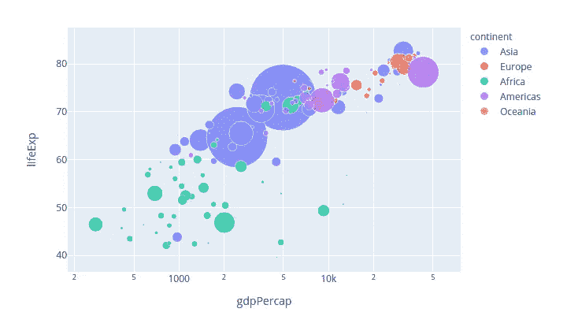
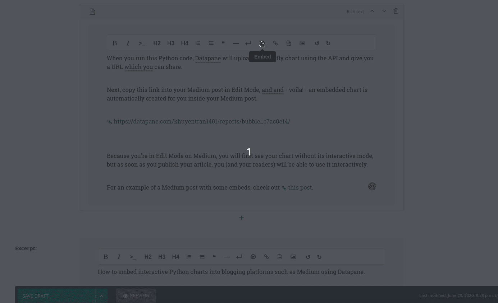

# 如何在你的媒体文章和个人网站上嵌入互动图表

> 原文：<https://towardsdatascience.com/how-to-embed-interactive-charts-on-your-medium-articles-and-website-6987f7b28472?source=collection_archive---------38----------------------->

## 两行代码是您嵌入交互式图表进行引人入胜的演示所需的全部内容



# 动机

您是否曾经想要在 Medium、Reddit 或您自己的博客等社交媒体平台上共享您的交互式 Python 图表，但最终不得不拍摄图表的照片或录制视频或 gif？或者，许多人最终使用非代码解决方案，如 Mapbox 或 Flourish，即使他们更愿意使用 Pandas、Altair、Bokeh、Folium 和 Plotly 等库在 Python 中构建他们的可视化。

我喜欢在 Medium 的文章中使用图表来展示我的结果，但在我发现 Datapane 之前，嵌入我的交互式图表很有挑战性。有了 Datapane，我可以在两行代码中嵌入我的图表。

# 什么是 Datapane？

[Datapane](https://datapane.com/) 是一个 API **，面向用 Python 分析数据并且需要一种方式来分享他们的结果的人**。Datapane 使数据分析师或数据科学家可以轻松地从 plot、markdown、dataframe 等组件生成报告，并在 web 上发布以发送给他人。如果你不了解 Datapane，我写了一篇介绍 Datapane 的短文

[](/introduction-to-datapane-a-python-library-to-build-interactive-reports-4593fd3cb9c8) [## Datapane 简介:构建交互式报表的 Python 库

### 创建精美报告并与您的团队分享分析结果的简单框架

towardsdatascience.com](/introduction-to-datapane-a-python-library-to-build-interactive-reports-4593fd3cb9c8) 

除了易于创建报告和部署脚本之外，Datapane 还易于嵌入图表或表格。

# 嵌入媒体

假设您用以下代码创建了一个交互式 Plotly 气泡图:

使用 Datapane 的 API，您可以将这个 Plotly 图表发布到 web 上，并将其嵌入到 Medium 中。

首先，使用 pip 安装 Datapane:

```
pip3 install datapane
```

然后只需[注册 Datapane](https://datapane.com/accounts/signup/) 来获得您的 API 令牌。复制并使用它通过 Datapane CLI 登录:

```
datapane login --token=[your_secret_token]
```

登录后，您可以使用 Datapane API 来发布您的图。

将 Datapane 导入到您的脚本中，并发布一个带有**的新`Report`，其中包含一个单独的** `Plot`组件。

在这个例子中，我们还告诉 Datapane 将我们报告的可见性设置为 public，这样任何人都可以通过这个 URL 访问它。

当您运行这个 Python 代码时，Datapane 将使用 API 上传您的 Plotly 图表，并给您一个您可以共享的 URL！

[https://data pane . com/khuyentran 1401/reports/bubble _ c7ac 0e 14/](https://datapane.com/khuyentran1401/reports/bubble_c7ac0e14/)

接下来，在编辑模式下将这个链接复制到你的文章中，瞧！—在您的 Medium post 中会自动为您创建一个嵌入式图表。

因为您在 Medium 上处于编辑模式，所以您将首先看到没有交互模式的图表，但是一旦您发布了您的文章，您(和您的读者)将能够交互地使用它。

对于一个有一些嵌入的中等职位的例子，检查这个职位

[](/how-to-create-interactive-and-elegant-plot-with-altair-8dd87a890f2a) [## 如何用 Altair 创建交互式剧情

### 在 5 行简单的 Pythn 代码中利用您的数据分析

towardsdatascience.co](/how-to-create-interactive-and-elegant-plot-with-altair-8dd87a890f2a) 

除了图表之外，你还可以像这样嵌入一个数据框

# 嵌入你的个人网站

有了你的个人网站，你可以应用同样的技术或者根据你使用的平台稍微改变一下技术。对于 Wagtail，我所做的只是简单地点击嵌入按钮，然后将 URL 粘贴到嵌入框中。



# 结论

恭喜你！你已经学会了如何用 Datapane 在媒体或个人网站上嵌入你的图表。有什么比让你的观众或读者与图表互动来观察你的结果更好的呢？

在 [this Github repo](https://github.com/khuyentran1401/Data-science/blob/master/data_science_tools/embed_charts.ipynb) 中，您可以随意使用本文的代码。

我喜欢写一些基本的数据科学概念，并尝试不同的算法和数据科学工具。你可以通过 [LinkedIn](https://www.linkedin.com/in/khuyen-tran-1401/) 和 [Twitter](https://twitter.com/KhuyenTran16) 与我联系。

如果你想查看我写的所有文章的代码，请点击这里。在 Medium 上关注我，了解我的最新数据科学文章，例如:

[](/how-to-leverage-visual-studio-code-for-your-data-science-projects-7078b70a72f0) [## 如何在数据科学项目中利用 Visual Studio 代码

### 直到发现一种新的有效方法，我们才意识到我们是多么低效

towardsdatascience.com](/how-to-leverage-visual-studio-code-for-your-data-science-projects-7078b70a72f0) [](/how-to-accelerate-your-data-science-career-by-putting-yourself-in-the-right-environment-8316f42a476c) [## 如何通过将自己置于合适的环境中来加速您的数据科学职业生涯

### 我感到增长数据科学技能停滞不前，直到我有了一个飞跃

towardsdatascience.com](/how-to-accelerate-your-data-science-career-by-putting-yourself-in-the-right-environment-8316f42a476c) [](/how-to-create-reusable-command-line-f9a2bb356bc9) [## 如何创建可重用的命令行

### 你能把你的多个有用的命令行打包成一个文件以便快速执行吗？

towardsdatascience.com](/how-to-create-reusable-command-line-f9a2bb356bc9) [](/how-to-create-a-drop-down-menu-and-a-slide-bar-for-your-favorite-visualization-tool-3a50b7c9ea01) [## 如何为你最喜欢的可视化工具创建下拉菜单和滑动条

### 使用 Python Widget，您可以用 3 行代码升级可视化

towardsdatascience.com](/how-to-create-a-drop-down-menu-and-a-slide-bar-for-your-favorite-visualization-tool-3a50b7c9ea01) [](/how-to-share-your-jupyter-notebook-in-3-lines-of-code-with-ngrok-bfe1495a9c0c) [## 如何用 Ngrok 用 3 行代码分享你的 Jupyter 笔记本

### 想象一下，让你的朋友在远程机器上使用你的本地 Jupyter 笔记本

towardsdatascience.com](/how-to-share-your-jupyter-notebook-in-3-lines-of-code-with-ngrok-bfe1495a9c0c)