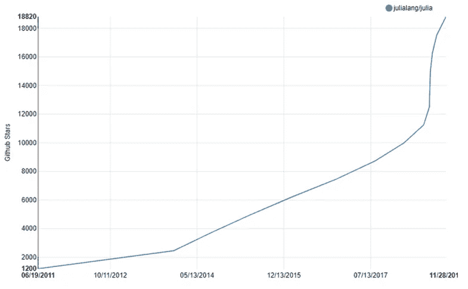
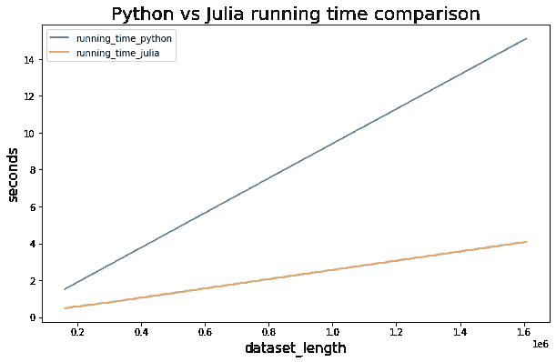

# 如何将 Julia 代码嵌入 Python 以提高性能

> 原文：<https://towardsdatascience.com/how-to-embed-your-julia-code-into-python-to-speed-up-performance-e3ff0a94b6e?source=collection_archive---------7----------------------->

## 使用 Julia 作为 Python 包来轻松提升性能。


unsplash 的图像

# 介绍

这篇博客文章是关于 Python 和 Julia 的合作，主要面向那些想要快速提高运行时性能的 Python 数据科学家，并通过另一种在[大学](https://julia.mit.edu/)、[公司](https://juliacomputing.com/media/2017/09/19/julia-the-ai-language-for-next-150-years.html)和用户中广受欢迎的编程语言来实现。



图片:Julia Computing(GitHub stars for Julia)

在这篇文章结束时，你将获得:

*   一个 docker image 环境，也包含 Julia 和 Python
*   Julia 和 Python 在速度上的直接比较。
*   将 Julia 代码嵌入 Python 的三种不同方法。

我希望你会发现它内容丰富！

# 装置

为了设置环境，我使用了这个包含 Julia、Python 和 Jupyter 的 docker 映像:

> 【https://hub.docker.com/r/jupyter/datascience-notebook 

在参考资料部分可以找到码头工人的逐步指南。

# Julia 与 Python 在 for 循环上的速度测试

在我演示如何将 Julia 代码嵌入 Python 以提高性能之前，我想让您相信使用 Julia 是有价值的，并且在使用 for 循环时，它可以比 Python 快得多。
那么，让我们在 Julia 和 Python 中运行一个简单的 for 循环，并比较它们的运行时间:

在 Python 中:

```
def for_loop(iterations = 100):

   a = 0
   for i in range(iterations):

       a = a+1

   return a
```

大概用了 1 秒。

```
%%time
res = for_loop(iterations = 10_000_000)
>>> CPU times: user 953 ms, sys: 0 ns, total: 953 ms
>>> Wall time: 951 ms
```

在朱丽亚身上:

```
function for_loop(iterations = 100)

    a = 0    
    for i in 1:iterations       
        a = a+1
    end        
    return a
end
```

用了 0.000001 秒:

```
@time res = for_loop(10_000_000)
>>> 0.000001 seconds (1 allocation: 16 bytes)
```

差别很大！

但这只是一个极端的例子；通常，差异不会**那么**显著。

# 将 Julia 代码嵌入 Python

因此，在我们确信这里有一些潜力之后，让我们看看机器学习中 NLP 领域的一个真实例子。我们将挑选一个涉及到 for loop 的任务来使用 Julia 的力量。
我们将使用**词干**任务(不熟悉这个任务的读者可以在这里了解:[https://en . Wikipedia . org/wiki/Stemming)。](https://en.wikipedia.org/wiki/Stemming%29.)

## 数据

我们将在 NLTK 包中使用来自莎士比亚-哈姆雷特数据集的数据。可以这样访问它:

```
from nltk.corpus import gutenberg
data = gutenberg.raw('shakespeare-hamlet.txt')
data = data.replace("\n", " ")
data = data.replace("  ", " ")
```

数据看起来是这样的:

> ”《哈姆雷特的悲剧》由威廉·莎士比亚于 1599 年创作。斯科纳·普里马。进入巴纳德和弗朗西斯科两个世纪。巴纳德。谁在那里？弗兰。不要回答我:站起来，收起你自己的棍子。朗·刘鹗国王弗兰。巴纳德？巴录书他叫弗兰。你小心翼翼地来到你的酒吧。现在是午夜，去睡觉吧，弗兰斯科·弗兰。对于这封信，我非常感谢:天气很冷，我在谷仓里感到很不舒服。豪埃尔你有安静的警卫？弗兰。没有一只老鼠蠢蠢欲动……”

## 使用 Python 进行词干分析

我们还将使用 NLTK 来完成词干部分:

```
import nltk
from nltk.stem import PorterStemmerporter = PorterStemmer()%%time
stem_words = []
nltk_tokens = nltk.word_tokenize(data)
for token in nltk_tokens:    
    new_token = porter.stem(token)
    stem_words.append(new_token)>>> CPU times: user 1.52 s, sys: 0 ns, total: 1.52 s
>>> Wall time: 1.57 s
```

我们花了 1.57 秒。

## 使用 Julia 进行词干分析

现在是有趣的部分。

将 Julia 代码嵌入 Python 的方法很少，我们将介绍其中的三种:

*   运行朱莉娅的整个表达式
*   用“魔法”命令运行 Julia
*   用脚本运行 Julia

首先，我们将导入相关模块:

```
from julia.api import Julia
jl = Julia(compiled_modules=False)from julia import Mainjl.using("TextAnalysis")
```

(我们从 Python 和 Julia 导入了相关的包)。

## 运行整个表达式

让我们运行代码，然后理解这里发生了什么:

```
%%timeMain.data = data
Main.token_data = jl.eval("tokens_data = TokenDocument(data) ; return(tokens_data)")
stem_list = jl.eval("stem!(tokens_data);stem_tokens_data =  tokens(tokens_data) ; return(stem_tokens_data)")>>> CPU times: user 747 ms, sys: 112 µs, total: 747 ms
>>> Wall time: 741 ms
```

因此，在第一行中，我们将*数据*变量存储在*主数据*变量中，这样 Julia 就可以读取这个变量。

**Main** 是我们从 Julia 导入的一个模块。我们在这里使用它来存储 Julia 格式的数据变量，以便稍后使用(当我们调用 TokenDocument(data)时)。
请注意，如果我们没有写那一行(Main.data = data)，Julia 无法识别任何名为‘data’的变量。
接下来，我们对 Julia 中的数据进行标记化，并将其存储在 *Main.token_data 变量中。* ( *注*:我们要用 return 命令来存储变量)。
然后，我们对标记化的数据进行词干提取，并将其存储在一个常规的 python 列表中。

所以，在 Python 中运行 Julia 的表达式，我们需要做的就是使用 *jl.eval* 函数，用“*连接 Julia 的表达式；*"之间，并以*返回*命令结束。

我们花了大约 740 毫秒——大约是 Python 的一半时间。

## 用“魔法”命令运行

```
%load_ext julia.magic
```

要使用 magic 命令，我们首先需要加载它。
请注意，此方法仅适用于 Jupyter 笔记本。% %时间

```
tokens = %julia TokenDocument($data)
%julia stem!($tokens)
stem_list = %julia tokens($tokens)>>> CPU times: user 849 ms, sys: 3.39 ms, total: 852 ms
>>> Wall time: 845 ms
```

所以，在我们加载了 *julia.magic，*之后，我们运行这三行代码。

我们应该注意两件事:

*   在使用 Julia 的语法之前加上符号 *%* 。
*   在引用 python 变量之前使用 *$* 符号。

像以前一样，我们首先将数据标记化，然后对其进行词干处理，并将其精细地存储为 Python 列表。

## 使用 Julia 脚本运行

在这个方法中，我们可以编写一个完整的独立的 Julia 脚本，并从 python 中调用它。

因此，如果我们编写一个名为 *julia_stemming.jl* 的脚本，并在其中存储这个 julia 函数:

```
function stemming_document(document_string)

    tokens_data = TokenDocument(document_string)
    stem!(tokens_data)
    stem_tokens_data =  tokens(tokens_data)

    return stem_tokens_data
end
```

我们可以从我们的 Python 脚本/笔记本中调用这个函数:

```
%%timejl.eval('include("julia_stemming.jl")')
Main.data = data
stem_list = jl.eval("stemming_document(data)")>>> CPU times: user 602 ms, sys: 3.24 ms, total: 606 ms
>>> Wall time: 602 ms
```

首先，我们*包含*这个脚本以使它可用，然后我们调用其中的函数。

# 最终速度测试

我们展示了对于这个特定的数据集( *shakespeare-hamlet.txt* )，Julia 比 Python 快两倍多。但是当我们使用更大的数据集时会发生什么呢？

我们使用不同的数据集长度(复制我们的原始数据集)多次执行词干函数，并绘制结果:



作者图片

如您所见，数据集越大，运行时间之间的差异就越显著——这使得 Julia 在处理大型数据集和 for 循环时非常有用。

我们用这个代码来计算差异:

```
time_list_python = []
time_list_julia = []
dataset_length = []duplicates_list = [1,2,5,10]
for t in duplicates_list:
    data_repeat = ' '.join([data] * t)
    dataset_length.append(len(data_repeat))

    time_start_python = time.perf_counter()

    stemming_python(data_repeat)

    time_end_python = time.perf_counter()query_time_python = time_end_python - time_start_python
    time_list_python.append(query_time_python)

    time_start_julia = time.perf_counter()

    Main.data_repeat = data_repeat
    jl.eval("stemming_document(data_repeat)")

    time_end_julia = time.perf_counter()query_time_julia = time_end_julia - time_start_julia
    time_list_julia.append(query_time_julia)
```

这段代码用来绘制:

```
import pandas as pd
import matplotlib.pyplot as pltdf = pd.DataFrame({"running_time_python" : time_list_python,
                   "running_time_julia" :  time_list_julia,
                   "dataset_length" : dataset_length})
df.set_index("dataset_length", inplace=True)df.plot(figsize = (10,6), title = "Python vs Julia running time comparison")
plt.ylabel('seconds', fontsize = 20)
plt.xlabel('dataset_length', fontsize = 20)
plt.show()
```

# 摘要

我希望我让你相信了将 Julia 和 Python 联系起来的好处。

据我所见，纯 Python 在多个领域仍然更好——比如处理矢量化计算(比如 NumPy ),所以我们需要确保切换到 Julia 是值得的。

感谢您的阅读，当然，我会很高兴听到您的回应。

# 参考

> https://julia.mit.edu/(使用茱莉亚的大学)
> 
> [https://julia computing . com/media/2017/09/19/Julia-the-ai-language-for-next-150 years . html](https://juliacomputing.com/media/2017/09/19/julia-the-ai-language-for-next-150-years.html)(使用 Julia 的公司)
> 
> [https://Julia computing . com/blog/2018/12/04/12 月-newsletter . html](https://juliacomputing.com/blog/2018/12/04/december-newsletter.html)(GitHub stars)
> 
> [https://hub.docker.com/r/jupyter/datascience-notebook](https://hub.docker.com/r/jupyter/datascience-notebook)(我们使用的图片)
> 
> [https://dagshub . com/blog/setting-up-data-science-workspace-with-docker/](https://dagshub.com/blog/setting-up-data-science-workspace-with-docker/)(docker 分步指南)
> 
> [https://pyjulia.readthedocs.io/_/downloads/en/latest/pdf/](https://pyjulia.readthedocs.io/_/downloads/en/latest/pdf/)(py Julia 包文档)
> 
> [https://py Julia . readthedocs . io/en/latest/usage . html #高层接口](https://pyjulia.readthedocs.io/en/latest/usage.html#high-level-interface) (PyJulia 包文档)
> 
> [https://Julia Text . github . io/Text analysis . JL/latest/documents/](https://juliatext.github.io/TextAnalysis.jl/latest/documents/)(文本分析包)