# 如何对分类数据进行编码

> 原文：<https://towardsdatascience.com/how-to-encode-categorical-data-d44dde313131?source=collection_archive---------9----------------------->

## 从基础到高级的 12 种不同的编码技术

在这本笔记本中，我将介绍编码分类数据的不同方法。我想用简单的语言写出来，并加入一点数学知识。它们是你应该放入工具箱的基本编码方案。为了方便起见，我还会提供`scikit-learn`版本和每个方法对应的库。

在这篇文章结束时，我希望你会对如何处理分类数据有一个更好的想法。你可以在这里找到我的代码。

# 目录

对字符串数据类型进行编码有三种主要方法:

**经典编码器:**广为人知，应用广泛

1.  [序数](#6c53)
2.  [OneHot](#7033)
3.  [二进制](#4aaf)
4.  [频率](#aecd)
5.  [散列法](#a79a)

**对比编码器:****通过查看不同层次的特征对数据进行编码的创新方法**

**6.[赫尔默特](#22a7)**

**7.[向后差异](#0a4a)**

****贝叶斯编码器:**一种更高级的方法，使用目标作为编码的基础**

**8.[目标](#ffb7)**

**9.[漏掉一个](#769d)**

**10.[证据的权重](#2c52)**

**11.詹姆斯-斯坦**

**12.[M-估计器](#0797)**

**而且还有很多！然而，一旦你知道这些最常见的编码方案是如何工作的，你会发现谷歌搜索另一种编码方案是相当容易的。**

**让我们创建一个随机的口袋妖怪数据集！**

# **资料组**

**我是一个超级粉丝，也是一个努力的口袋妖怪研磨者。我经常去口袋妖怪数据库看看我的队伍里应该有哪个口袋妖怪。有 4 个特征会影响我的选择:类型、大小、属性和传奇。我创建了这个只有 10 个观察值的样本数据，以更好地说明不同的编码技术，并给自己带来一些快乐！**

**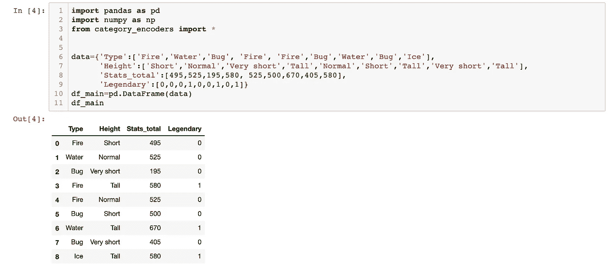**

**来源: [Huy Bui](https://github.com/williamhuybui/Blog-Encoding-Scheme)**

# **I .经典编码器**

**我们从最基本的技术开始，经典的编码器。顾名思义，这些编码器是众所周知的和广泛使用的。他们的概念也非常直接。**

## **1)顺序编码**

**序数特征是具有顺序的特征。这种类型的数据也称为**序数数据**。让我们看看数据框中的`Height`列。这些类别是:`*very short,*`*`*short*`*`*normal*`*`*tall*`*`*very tal*l`，按升序/降序排列是有意义的。通过手动编码列，我们可以显著提高模型性能。******

****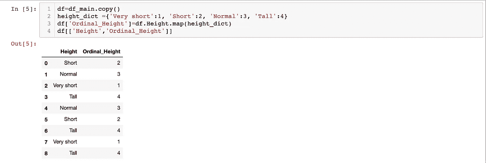****

****来源: [Huy Bui](https://github.com/williamhuybui/Blog-Encoding-Scheme)****

## ****2)一键编码****

****再来看专栏`Type`。这是与`Height`栏中的**序号数据**相反的**名义**数据。将该列转换为数字的最简单方法是通过以下两个步骤使用**一键编码******

*   ****将一列中的所有类别拆分到不同的列中****
*   ****将勾号 *1* 放在适当的位置****

****熊猫的`get_dummies`功能可以达到这个目的****

****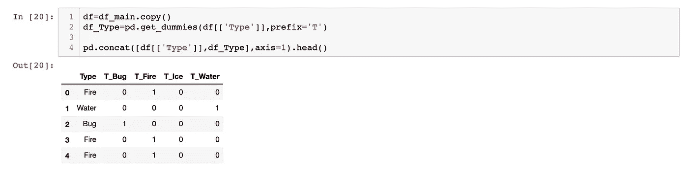****

****来源: [Huy Bui](https://github.com/williamhuybui/Blog-Encoding-Scheme)****

## ****3)二进制编码****

****想象你有`200`个不同的类别。一键编码将创建 200 个不同的列。大量的列会占用大量的内存。与此同时，**二进制编码**只需要 8 列。它利用了二进制系统，所以一行中可能有多个 1。二进制编码背后的逻辑解释是:****

*   ****沿着列往下，每次看到一个新的类别，它都会给出一个数字，从 1 开始(下一个是 2)****
*   ****将这些数字转换成二进制****
*   ****将该二进制中的每个数字放在单独的列中。****

****在下面的代码中，我将添加`encounter step`列，这样您可以看到它是如何工作的。****

****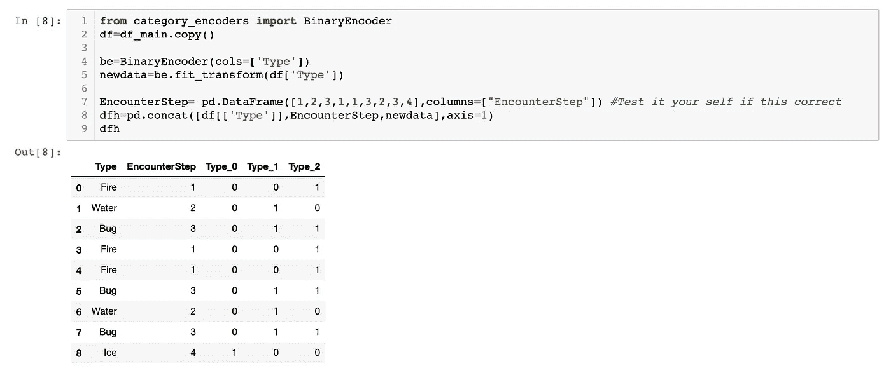****

****来源: [Huy Bui](https://github.com/williamhuybui/Blog-Encoding-Scheme)****

## ****4)频率编码****

****给每个类别一个**概率**(发生/总事件)。这意味着，如果一列中有两个具有相同概率的类别(3 `fire`和 3 `bugs`)，在进行频率编码后，您无法真正区分它们。代价是不会引入新的列。****

****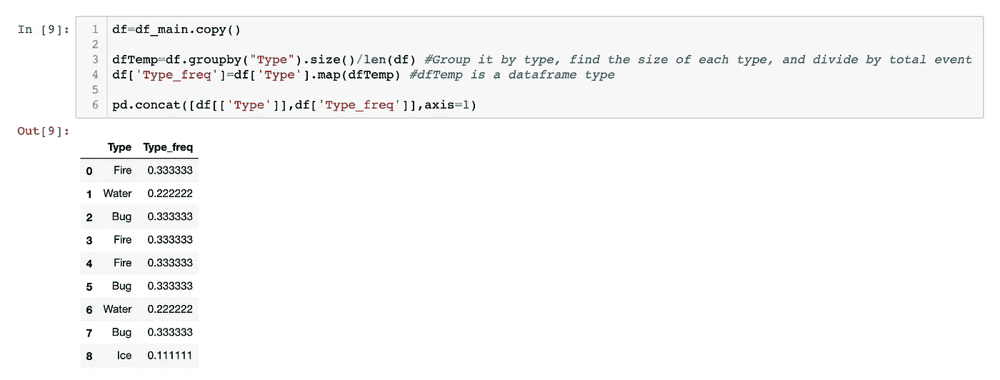****

****资料来源: [Huy Bui](https://github.com/williamhuybui/Blog-Encoding-Scheme)****

## ****5)散列编码****

****哈希将分类变量转换为更高维的整数空间。由于 scikit-learn 已经很好地解释了这个方法，所以我不会在这里过多地评论它。****

****`n_feature`是要添加的列数。这些新列区分相应的类别。但是，您可以调整到任何数字。这就像类固醇上的二进制编码！****

******优势******

*   ****处理大规模分类特征****
*   ****高速和减少的内存使用****

******缺点******

*   ****无逆变换方法****

****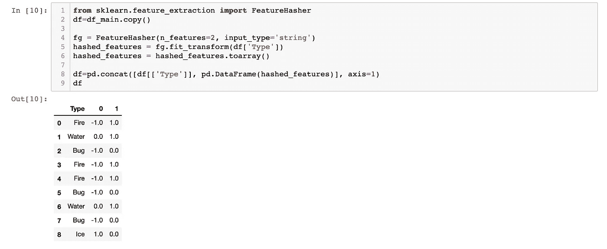****

****来源: [Huy Bui](https://github.com/williamhuybui/Blog-Encoding-Scheme)****

******注:**什么是好的回特征数？如果`m`是明显的特征，而`n_feature=k`，那么`m<2^k`****

# ****二。对比度编码器****

****对比编码允许类别变量重新居中，使得模型的截距不是类别的一个级别的平均值，而是数据集中所有数据点的平均值。****

****许多人认为这些编码不是很有效。但是，我将它们留在这里作为参考。****

## ****6)赫尔默特(反向)编码****

******赫尔默特编码**将分类变量的每个级别与后续级别的平均值进行比较。[多读书。](https://stats.idre.ucla.edu/r/library/r-library-contrast-coding-systems-for-categorical-variables/#HELMERT)****

****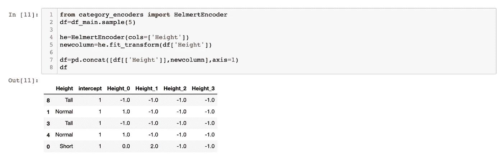****

****资料来源: [Huy Bui](https://github.com/williamhuybui/Blog-Encoding-Scheme)****

## ****7)后向差分编码****

****在**后向差分编码**中，一个级别因变量的平均值与前一个级别因变量的平均值进行比较。[阅读更多](http://www.statsmodels.org/dev/contrasts.html)****

****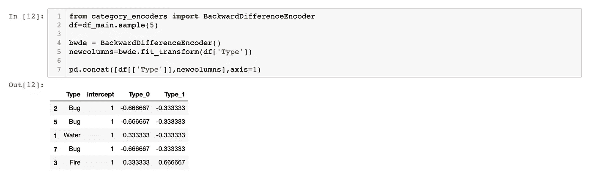****

****来源: [Huy Bui](https://github.com/williamhuybui/Blog-Encoding-Scheme)****

# ****三。贝叶斯目标编码器****

****这种方法的总体思想是考虑目标。****

******优势:******

*   ****只需很少的工作，只需为该特性中任意数量的类别创建一个列****
*   ****Kaggle 竞赛中最受欢迎的编码方案****

******缺点:******

*   ****只为监督学习工作(因此，本质上是有漏洞的)。这意味着在处理无监督数据时，情况会变得更糟！****
*   ****由于前面的原因，需要正规化****

## ****8)目标编码****

******基于目标的编码**基本上是指使用目标对分类特征进行编码。它的公式是:****

****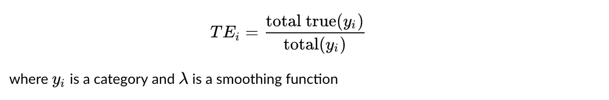****

****在下表中，`Legendary`是我们的目标。由于`3` `Fire`口袋妖怪中只有`1`是传说中的，所以它的价值就是`1/3`。把目标编码想象成目标上的频率编码！****

****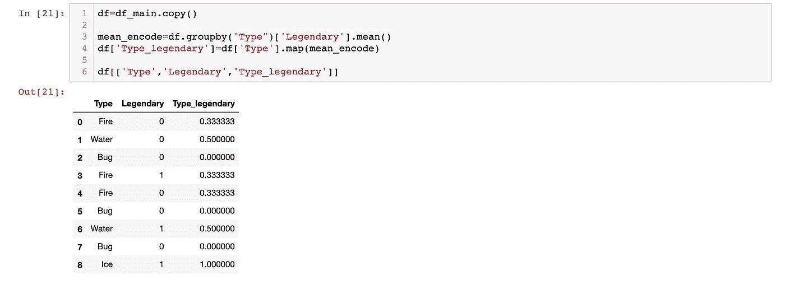****

****资料来源: [Huy Bui](https://github.com/williamhuybui/Blog-Encoding-Scheme)****

******注意:**有一些不同的版本将输出乘以一个`(Laplace)smoothing value.`这是为了避免数据泄漏。****

## ****9)省去一个编码****

******留一个编码(LOOE)** 与目标编码非常相似，但在计算某个级别的平均目标以减少异常值的影响时，会排除当前行的目标。****

****此外，您可以通过在 0 和 1 之间更改 sigma 值，向数据中添加一些(高斯)噪声，以防止过度拟合。****

****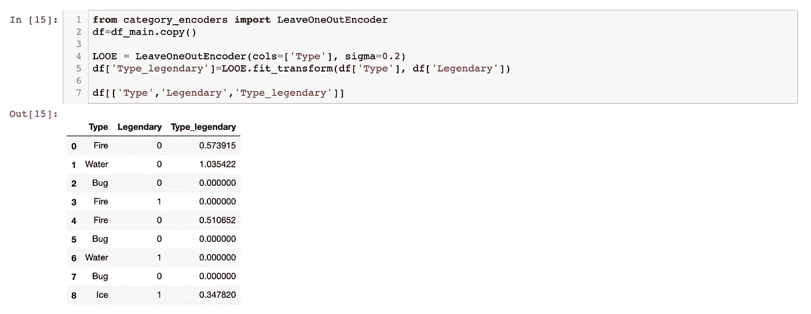****

****来源: [Huy Bui](https://github.com/williamhuybui/Blog-Encoding-Scheme)****

## ****10)证据权重编码****

****证据权重编码(WoE)是对证据支持或破坏假设程度的衡量。****

********

****其中`adj`是相邻因子，是一个避免除以 0 的函数。****

******优势:******

*   ****与逻辑回归配合良好，因为 WoE 转换具有相同的逻辑标度。****
*   ****可以使用 WoE 来比较不同特性，因为它们的值是标准化的。****

******缺点:******

*   ****可能会丢失信息，因为某些类别可能具有相同的 WoE****
*   ****不考虑特征相关性****
*   ****过度拟合****

****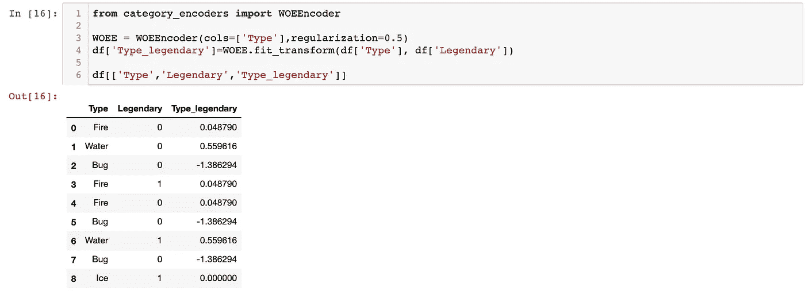****

****来源: [Huy Bui](https://github.com/williamhuybui/Blog-Encoding-Scheme)****

******注:**我们可以通过改变正则化来调整`adj`因子。(默认情况下为 1)。当将其设置为 0 时。你回到原来的悲哀，可能会遇到除以 0****

## ****11)詹姆士-斯坦编码(JSE)****

****这是目标编码，但更健壮。 **James-Stein (JS)** 对于具有正态分布的特征，它是最有效的。JS 由以下公式定义:****

****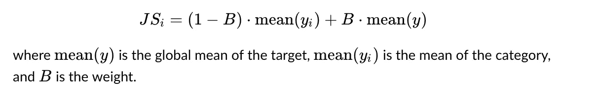****

****权重`B`取决于方差`*σ(y)*`和`*σ(yi)*`。更多关于这个方法的[在这里](https://kiwidamien.github.io/james-stein-encoder.html)。****

****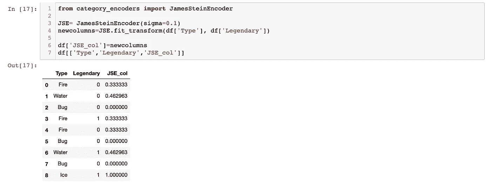****

****资料来源: [Huy Bui](https://github.com/williamhuybui/Blog-Encoding-Scheme)****

## ****12) M 估计编码****

******M 估计编码器**是目标编码器的简化版本。代表最大似然型。它只有一个超参数`m`，代表正规化的力量。m 值越高，收缩越强。推荐值`m`在`1`到`100`的范围内。更多关于它的[这里](https://en.wikipedia.org/wiki/M-estimator)。****

****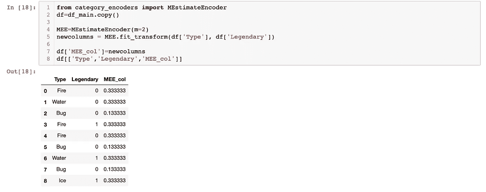****

****来源: [Huy Bui](https://github.com/williamhuybui/Blog-Encoding-Scheme)****

# ****动词 （verb 的缩写）结论****

****对特征进行编码没有单一的公式。然而，如果你理解我上面介绍的`12`编码技术，你将能够快速移动。此外，尝试所有适用于该特性的技术并决定哪一种效果最好总是值得的。尝试输入不同的正则化系数值，看看它们是否增加你的分数。下面的备忘单将帮助你做一些初步的决定。****

****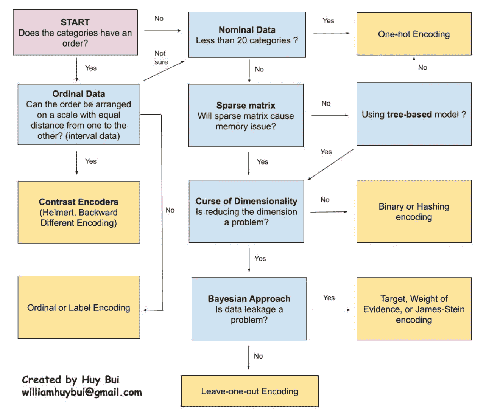****

****分类编码备忘单****

****玩编码器玩得开心！****