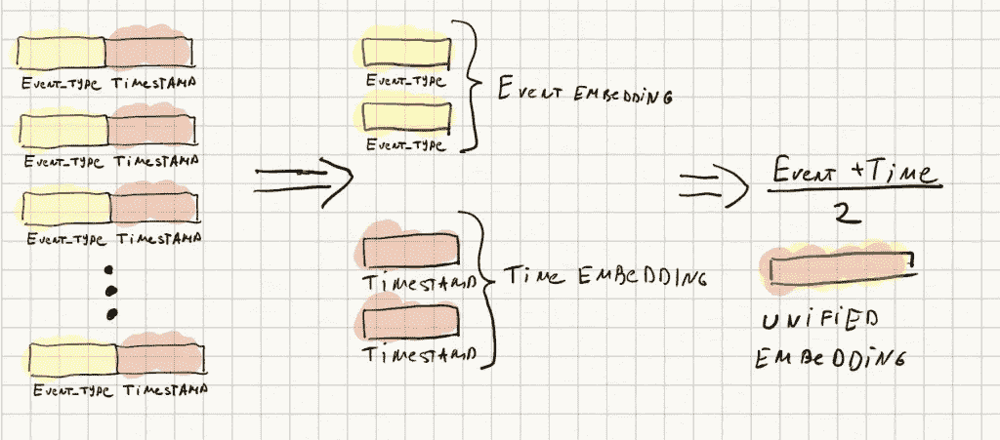
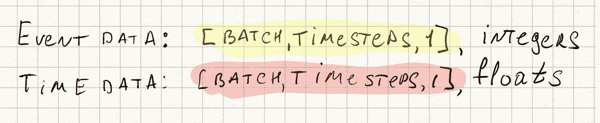
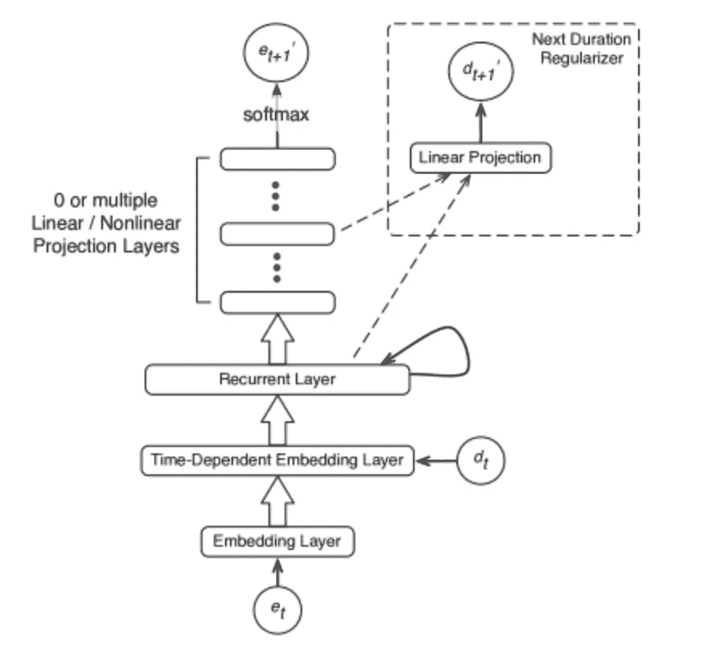
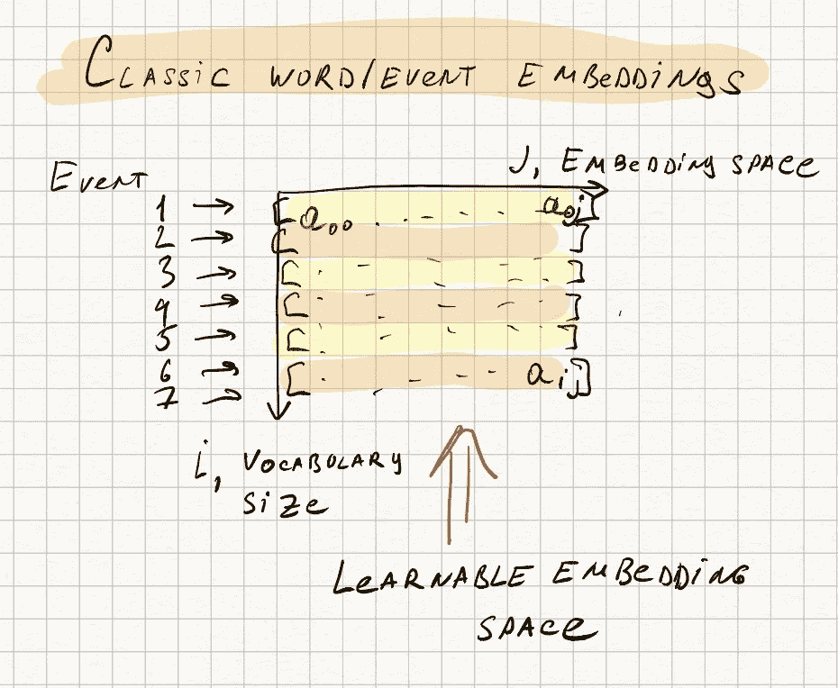
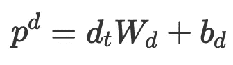
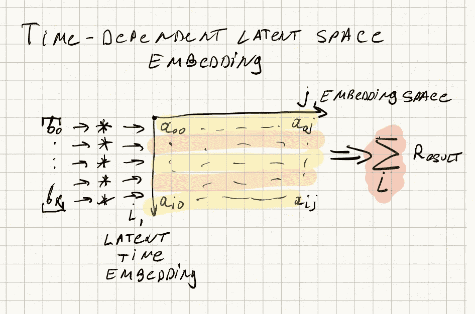
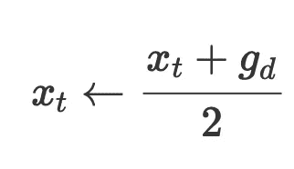
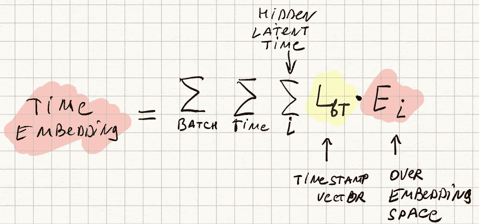

# 如何在递归神经网络中对时间属性进行编码？—星期五实验

> 原文：<https://towardsdatascience.com/how-to-encode-time-property-in-recurrent-neutral-networks-friday-experiment-c14c39ba9755?source=collection_archive---------18----------------------->

## Keras 中 RNNs 的时间相关和非等间隔时间编码。

# TL；速度三角形定位法(dead reckoning)

你有一个用于神经网络训练的事件流。这些事件具有持续时间和/或不相等的间隔或其他与时间相关的属性。您知道丢弃这些信息会适得其反，但是您无法找到一种简单、合理且可行的方法来将这些数据整合到现有的 RNN 架构中。不再害怕。你需要知道的是:

1.  这篇论文有所有的数学知识，它很简单——https://www . ground ai . com/project/time-dependent-re presentation-for-neural-event-sequence-prediction/2
2.  我已经在[我的 GitHub](https://github.com/crazyleg/time-dependant-rnn-embeddings-keras) 中将其实现为 Keras 层

IMHO，这应该是事件驱动的 AI 和营销平台特别感兴趣的。

# 为什么需要这样做？

我一直在玩一个 Datascience Bowl 2019 Kaggle 比赛。背后的数据集基本上是混合粒度的各种应用程序发起的事件流。目前(2019 年 12 月)，似乎主导方法是经典的“特征工程-梯度增强-集成”组合。我很好奇，我们是否可以用 RNNs 或 Transformers 获得类似或更好的结果，因为更多的“事件本地”(至少看起来是这样)的方法。

对事件本身进行编码并不是一件容易的事情，考虑到所涉及的超参数和选择的数量，我还偶然发现了一个明显的问题——如何对事件的时间信息进行编码？这看起来很直观，时间有很多信息，尤其是当与事件的性质相联系时。



我决定写这篇文章，有几个原因:

*   花了 10 多分钟才找到相关途径。这对于 2019 年来说很奇怪。
*   上述方法的实现没有 Github。
*   阅读和实现起来既容易又有趣，对于初学 ML 的工程师来说是一个很好的开始。

# 如何编码时间

[1]提出了两种编码时间的方法。

1.  用时间掩码嵌入事件
2.  事件-时间联合嵌入

作者比较了这两种方法，并表明第二种方法在性能上有更好的改进，所以我在这里主要关注它。

任何表征事件持续时间或间隔的时间属性都应该表示为每个事件的单个标量。根据数据的性质，应用对数变换是个不错的主意。如果你不确定——把它当作一个超参数。以下是您应该如何准备原始数据:



其中，事件数据是唯一的事件类型，用分类编码器编码，时间数据是浮点数，表示事件的时域(从上一个事件或时间到下一个或关键事件的距离)

# 事件-时间联合嵌入。想法和数学。



我们希望将单个浮点标量嵌入到嵌入空间中，使用与单词嵌入相同的原理。单词嵌入的工作非常简单，这基本上是一个可学习的哈希表，它将词汇中的单词索引映射到一个嵌入向量，无需任何额外的转换。



这适用于整数单词索引，但是我们如何将这种技术应用于具有连续和非线性性质的浮点值呢？

第一步是转换向量中的单个标量。为此，我们将一个标量乘以一个随机初始化的可训练向量 W，并添加一个偏差向量 b。



时间潜向量空间的第一标量时间投影

式中，W 为*【1，隐藏向量维度】*形状的权重矩阵，B 为*【隐藏向量维度】*形状的偏置向量。

由于这是一个线性变换，它没有任何巨大的编码和表示能力，你可以把它看作是一个可学习的线性标量到矢量变换的一个步骤。

然后，我们将 softmax 函数应用于所获得的向量。

如您所知，softmax 倾向于增加向量中的一个值，而减少其他值。把这个想成“这是最重要的矢量”。然后，我们使用与单词嵌入中相同的方法，但是不是采用对应于单词索引的一个向量，而是采用所有嵌入矩阵，其中我们根据向量值中的值对嵌入空间中的所有行进行加权，将它们作为权重进行阈值化。瞧，我们有了一个时间嵌入向量！



现在，我们可以自由选择如何将这个向量与另一个数据流相结合——使用传统的事件类型嵌入矩阵获得的事件嵌入。我第一个自然的想法是将它们连接起来，但是作者在[1]中建议采取时间嵌入和事件嵌入的方法。



组合时间和事件嵌入数据

# 事件-时间联合嵌入。实施。

在这里，我提出这个时间嵌入层的一个 Keras+Tensorflow 2.0 实现。你可以在我的 GitHub 上随意下载。

让我们看看，这是怎么回事。

我们使用两个超参数初始化该层:隐藏嵌入潜在空间的大小和时间嵌入向量的输出大小。

在“构建”方法中，我们随机初始化权重、偏差和嵌入矩阵。

在“调用”方法中，我们进行实际计算。使用 keras 后端函数完成标量的投影和 softmax 函数的应用:

```
x = tf.keras.activations.softmax(x * self.emb_weights + self.emb_biases)
```

然后我们做最有趣的部分——潜在向量在嵌入矩阵上的投影。虽然这可以用点积符号来实现，但在数学上是不正确的。更好的方法是使用爱因斯坦符号。

我们的输入将是*【批处理，时间步长，隐藏向量维度】*的形式，输出预计是*【批处理，时间步长，嵌入矩阵维度】*的形式，其中数学上看起来是这样的:



得到最终时间嵌入的 Einsum 符号

只要你能用这种数学求和的形式来表达，你就可以直接使用 einsum 符号，只要把求和的指数复制到 einsum 符号中。

```
x = tf.einsum('bsv,vi->bsi',x,self.emb_final)
```

这是最终代码。

```
class TimeEmbedding(Layer):def __init__(self, hidden_embedding_size, output_dim, **kwargs):
 super(TimeEmbedding, self).__init__(**kwargs)
 self.output_dim = output_dim
 self.hidden_embedding_size = hidden_embedding_sizedef build(self, input_shape):
 self.emb_weights = self.add_weight(name ='weights',shape=(self.hidden_embedding_size,), initializer='uniform', trainable=True)
 self.emb_biases = self.add_weight(name ='biases',shape=(self.hidden_embedding_size,), initializer='uniform', trainable=True)
 self.emb_final = self.add_weight(name ='embedding_matrix', shape=(self.hidden_embedding_size,self.output_dim), initializer='uniform', trainable=True)

 def call(self, x):
 x = tf.keras.backend.expand_dims(x)
 x = tf.keras.activations.softmax(x * self.emb_weights + self.emb_biases)
 x = tf.einsum('bsv,vi->bsi',x,self.emb_final)
 return x

 def get_config(self):
 config = super(TimeEmbedding, self).get_config()
 config.update({'time_dims': self.output_dim, 'hidden_embedding_size':self.hidden_embedding_size})
 return config
```

## 参考

1.  【https://arxiv.org/abs/1708.00065 

*原载于 2020 年 1 月 4 日 https://fridayexperiment.com**[*。*](https://fridayexperiment.com/how-to-encode-time-property-in-recurrent-neutral-networks/)*