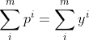
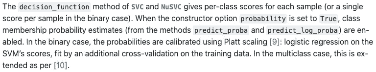
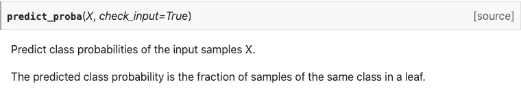
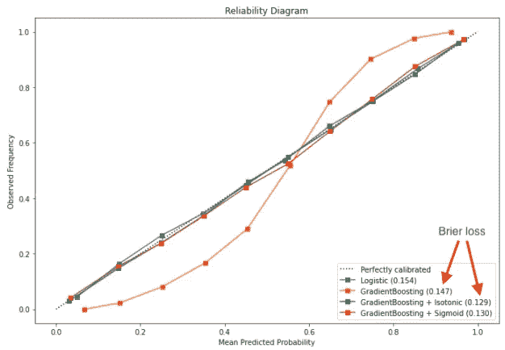
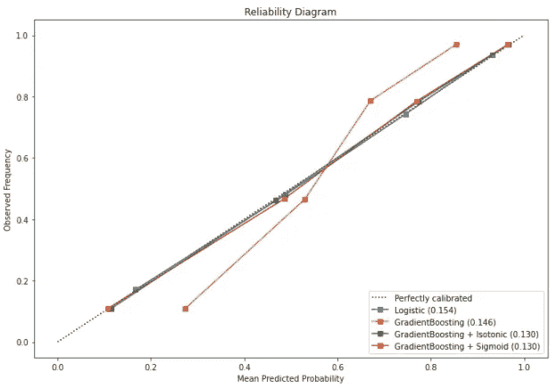
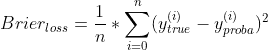
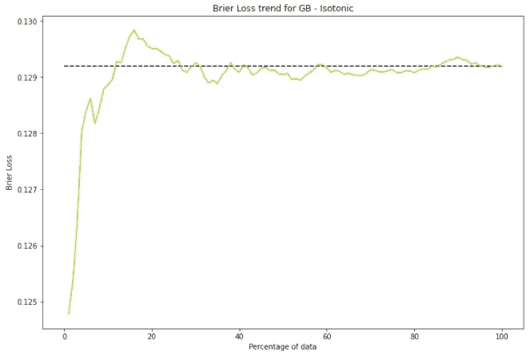
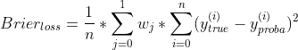
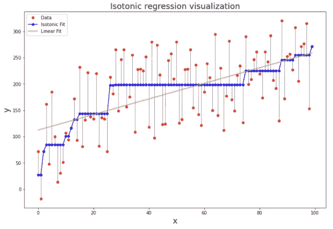
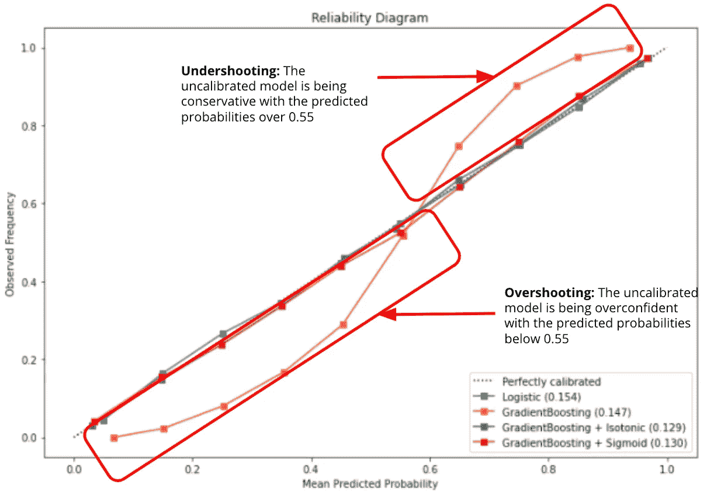

# 如何执行 ML 分类器的结果

> 原文：<https://towardsdatascience.com/how-to-enforce-the-outcome-of-your-ml-classifiers-b5f6163d68c2?source=collection_archive---------22----------------------->

## 如何校准机器学习分类器的分步指南

根据分类器的输出做出决定可能会很棘手。幸运的是，通过校准工具的使用，预测概率的解释最近变得更容易了。我接触过这个问题，因为我工作的很大一部分要求我不仅要解释模型的输出，还要根据这些结果推荐产品策略。事实上，许多企业依靠预测的概率来做决定(例如，打赌的几率，广告定位…)。如果这也是你的情况，这篇文章描述了一个系统的方法来确保你的分类器与理论，代码和可视化的健康组合校准！


[国立癌症研究所](https://unsplash.com/@nci?utm_source=unsplash&utm_medium=referral&utm_content=creditCopyText)在 [Unsplash](https://unsplash.com/s/photos/lab?utm_source=unsplash&utm_medium=referral&utm_content=creditCopyText) 上拍摄的照片

对于具有工程背景的人来说，术语“校准”可能会让您的系统 1 ( [Daniel Kahnema](https://www.scientificamerican.com/article/kahneman-excerpt-thinking-fast-and-slow/) n)兴奋不已，并引发了一个装满测量仪器的实验室的可视化，如图所示。嗯，校准你的 ML 分类器是非常相似的。
**感兴趣？**

在整篇文章中，最基本的是要记住校准的目标是获得“**接近经验概率[即观察到的类频率]的预测概率，正如[de groot&fien Berg(1983)](https://apps.dtic.mil/dtic/tr/fulltext/u2/a135966.pdf)【1】所定义的那样。**

在本文结束时，目标是让您知道如何做 3 件事:

1.  **评估**校准不良概率的风险
2.  **使用合适的工具调整**
3.  更加自信地解读它们

# **一、为什么校准很重要**


米娅似乎知道答案！(照片由 [Camylla Battani](https://unsplash.com/@camylla93?utm_source=unsplash&utm_medium=referral&utm_content=creditCopyText) 在 [Unsplash](https://unsplash.com/s/photos/question?utm_source=unsplash&utm_medium=referral&utm_content=creditCopyText) 上拍摄)

分类可以简单地理解为用一条“线”(2D 的平面或> 3D+的超平面)分隔数据点，正如吴恩达在 Coursera 上的第一个[机器学习课程中所解释的那样。算法负责寻找最佳“路线”。然而，这些算法采用不同的方法，同时依赖不同的假设。在推理过程中，分类器可以直接预测标签，也可以预测属于每个类别标签的概率。](https://www.coursera.org/learn/machine-learning)

校准之所以重要，是因为在理想情况下，我们希望能够将这些概率解释为[事前概率](https://en.wikipedia.org/wiki/Ex-ante)。

但是，当概率的分布与数据中观察到的分布不匹配时，如何做到这一点呢？
答:校准。

但具体来说，这对你和你的分类器意味着什么？

再来看**逻辑回归**。回想一下，分类器试图最小化损失函数(在这种情况下是交叉熵),以便找到将数据分成两部分(二元分类)的最佳“线”。当损失函数的导数等于 0 时，可以找到损失函数的最小值。我将省去 3-4 行数学公式，方便地得出以下等式:



作者图片

其中 p 是类概率，y 表示观察到的类值。

假设数据集是线性可分的，这个等式似乎告诉我们，类概率将与期望值完全对应。因此，**逻辑回归很可能提供校准概率**。这使得它在应用用例中非常有吸引力。

不幸的是，其他(更复杂的)分类器没有这个特征。支持向量机就是一个很好的例子。事实上，支持向量机通过最大化决策边界周围的边界(即“线”)来找到最优的“线”。它没有输出任何可能性，而是使用了边际的概念(这是斯坦福大学一门课程的一些材料)。

在这一点上，你们中的一些人可能会感到困惑，并在 scikit-learn (如果你是 python 用户)上打开一个新的标签页，查看是否可以从 SVM 输出概率。让我为你节省一些时间:



Scikit-Learn ( [开源库](https://scikit-learn.org/stable/modules/svm.html#scores-probabilities))的文档快照

在线性 SVM 估计量上 sklearn predict_proba 方法的输出概率似乎实际上来自对 SVM 分数的逻辑回归**(对描述这种方法的[论文](https://www.cs.colorado.edu/~mozer/Teaching/syllabi/6622/papers/Platt1999.pdf)的作者来说，这种方法通常被称为普拉特标度)。**

**有趣吧。看起来 scikit-learn 已经帮你做了。但是对所有的量词都成立吗？决策树怎么样？
让我再为您节省一些时间:**

****

**Scikit 的文档快照——了解 DecisionTreeClassifier ( [开源库](https://scikit-learn.org/stable/modules/generated/sklearn.tree.DecisionTreeClassifier.html#sklearn.tree.DecisionTreeClassifier.predict_proba))**

**对于单个决策树，输出的概率代表一个**频率**(由你的训练集决定，这就是为什么单个决策树很可能过度拟合你的训练数据，也就是高方差)，而不是一个可能性。
让我为您节省更多时间，RandomForestClassifiers 也是如此。
事实上，返回的概率是所有树中预测感兴趣类别的树的分数。gradientboosting 分类器的类似推理(在 scikit-learn github repo 中的 [_stagged_raw_predict 函数中描述)](https://github.com/scikit-learn/scikit-learn/blob/0fb307bf3/sklearn/ensemble/_gb.py#L1200)**

**注意:
-没有提到 scikit-learn 上基于树的分类器的校准**

# **二。评估校准的需要**

*   ****一个** [**可靠性图**](http://www.bom.gov.au/wmo/lrfvs/reliability.shtml#:~:text=Reliability%20diagrams%20(Hartmann%20et%20al,a%20forecast%20probability%20actually%20occurred.) 作为一个强大的工具，帮助我们对错误校准的存在及其性质(信心不足或信心过度)进行定性评估。**

**实际上，可靠性图是感兴趣类别的观察频率作为预测概率的函数的图。**

****

**作者图片**

**该图似乎显示了标准 GB 校准不佳的明显情况。曲线似乎遵循 S 形趋势。对于此图，我选择显示 10 个箱，因为我有一个相对较大的数据集(400k+数据点)用于校准。**

**然而，我们是否可以用更少数量的箱得到相同的结论🤔？**

****

**作者图片**

**这是完全相同的图，但是使用 4 个箱而不是 10 个箱。我们仍然可以注意到标准 GB 的校准不佳。然而，曲线的形状不是很明显。在这种情况下，这不是有害的，因为数据集足够大，我们可以使用保序回归来校准模型。更多关于它的信息。**

**在您训练了您的模型并根据您的测试数据进行了预测之后，现在是时候构建您的可靠性图表了。您可以手动操作:**

***步骤 1* :选择面元数
*步骤 2* :将数据点和预测概率桶入相应的面元。可以通过确保它们都包含相同数量的数据点(统一策略)或者使用分位数遵循更复杂的分割来确定容器的大小。
*步骤 3* :计算相应仓中的平均概率和平均频率
*步骤 4* :绘制作为平均预测概率的函数的平均观察频率**

**或者您可以选择使用 scikit-learn 上的现成方法:**

```
#Path of least resistance: Use Sklearn [2]from sklearn.calibration import calibration_curve
import matplotlib.pyplot as pltobserved_pos_frequency, mean_pred_proba  = calibration_curve(y_true, y_proba, n_bins=10, strategy='uniform')
plt.plot(mean_pred_proba, observed_pos_frequency)
```

*****提示****:*
——⚠️警告:一个常见的错误是使用平均精度绘制可靠性图表👎而不是平均预测概率👍正如向江也指出的那样[3]
——箱子的宽度不必一致。您可以选择使用遵循分位数分布的分割
-我建议使用相对较高数量的箱(取决于您的数据集大小)，以便更好地可视化较差校准的存在。**

*   **[**欧石南损失**](https://en.wikipedia.org/wiki/Brier_score) 是校准拟合的定量度量。它被定义为标签和感兴趣的数据集中的数据点的预测概率之间的均方差。差异越小越好。**

****

**n 是数据点的数量(图片由作者提供)**

****

**作者图片**

**请注意，早期的大幅波动是由于样本量小(方差大)。事实上，越多的数据被用来计算短暂的损失，它就变得越稳定。**

```
#Path of least resistance: Use Sklearn [4]from sklearn.metrics import brier_score_lossbrier_loss  = brier_score_loss(y_true, y_proba)
```

*****注:*** 前面的公式不包括样品重量。
如果您使用类别权重(阳性和阴性类别的数据点比例)，则以下公式更适合计算 Brier 损失。**

****

**作者图片**

# ****三世。如何校准您的模型****

**到目前为止，大家都知道，校准您的模型可以被描述为拟合回归变量的行为。回归器被期望找到将分类器的输出概率映射到观察到的类频率的函数。**

**实际上，可能会出现两种情况:**

*   **您已经安装了分类器(方法 1 和 2 适用)**
*   **您尚未安装分类器(所有方法都适用)**

1.  ****Platt Scaling** :通过最大似然法(此处有[的论文](https://www.cs.colorado.edu/~mozer/Teaching/syllabi/6622/papers/Platt1999.pdf))拟合回归变量，找到将模型输出映射成概率的 sigmoid 函数的参数。**

```
# Path of least resistance: Use Sklearn [5]
# Case with a classifier already fittedfrom sklearn.calibration import CalibratedClassifierCV
from sklearn.ensemble import RandomForestClassifierrf_est = RandomForestClassifier()
rf_est.fit(X_train, y_train)platt_rf = CalibratedClassifierCV(rf_est, cv="prefit", method=’sigmoid’)
platt_rf = platt_rf.fit(X_test, y_test)
calibrated_yhat = platt_rf.predict_proba(X_test)brier_loss = brier_loss_score(y_test, calibrated_yhat[:,1])
```

****注意:** - ⚠️当校准来自已经拟合的分类器的概率时，拟合步骤仅应用于用于校准的回归器，而不是底层分类器(如 Sklearn 校准文件[6]的源代码的第 237 行所述)
- ⚠️当校准来自已经拟合的分类器的概率时，必须用与用于拟合分类器的数据集不相交的**数据集来拟合**回归器**(如指南[7]所述)****

******2。保序回归**有助于对数据进行单调拟合。请记住，完美校准概率的定义是可靠性图中的对角线。因此，我们知道最好的情况是曲线趋势是单调的。因此，通过设计，保序回归可以在模型输出单调的任何情况下充当强大的平滑器。这里有一个有用的可视化来理解它的机制:****

********

****比较等渗拟合与线性拟合的图表(图片由作者和来源提供[代码](https://scikit-learn.org/stable/auto_examples/miscellaneous/plot_isotonic_regression.html)由 n .*Varoquaux&a . gram fort 根据* [*BSD 许可*](https://en.wikipedia.org/wiki/BSD_licenses#:~:text=The%20BSD%20license%20is%20a,code%20be%20distributed%20at%20all.)****

****关于保序回归有趣的事实是没有参数可寻。这是一种利用“智能”平滑方法的非参数方法，如合并相邻违规者算法(PAVA)。事实上，scikit-learn [8]中的保序回归方法使用了 PAVA。****

```
**# Path of least resistance: Use sklearn [5]
# Case with a classifier not yet fittedfrom sklearn.calibration import CalibratedClassifierCV
from sklearn.ensemble import RandomForestClassifierrf_est = RandomForestClassifier()
isotonic_rf = CalibratedClassifierCV(rf_est, cv=5, method=’isotonic’)
isotonic_rf.fit(X_train, y_train)
calibrated_yhat = isotonic_rf.predict_proba(X_test)brier_loss = brier_loss_score(y_test, calibrated_yhat[:,1])**
```

****注意:
—💢如果某件事好得不像真的，它可能就是真的。事实上，通过设计，保序回归有过度拟合的趋势。为了减少过度拟合，您应该考虑仅对大型数据集使用保序回归。****

******3。拉普拉斯估计& m 估计** :
你也可以选择改变你的基础模型的估计量，比如拉普拉斯估计量或者 m 估计量。 [N. Chawla 在【9】](https://www.researchgate.net/publication/228965727_Evaluating_probability_estimates_from_decision_trees)中描述了 RandomForestClassifier 的这种变化的一个例子:****

> ****“[预测概率]可以是基于叶频率的估计，或者[可以]通过拉普拉斯或 m 估计来平滑。”****

****不幸的是，他的工作还没有被实现成一个软件包(据我所知)。****

# ******四。框架******

****最后但同样重要的是，这是您可以用于案例的框架:****

*****第 0 步:您应该担心校准吗？*
您是否在使用逻辑回归之外的分类器？
如果是，继续步骤 1。****

*****步骤 1:风险评估*
1.1 绘制您的可靠性图
1.2 计算 Brier 损失****

*****第二步:采取行动*
2.1 如果可靠性图上的失真看起来像 S 形，那么拟合一个利用 sigmoid 函数的回归变量可能是一个好主意。
你猜对了→使用**普拉特缩放**
2.2 否则，在使用**保序回归**之前，你应该验证你正在使用一个大数据集进行校准。****

*****第三步:* *解读*****

********

****作者图片****

# ****动词 （verb 的缩写）摘要****

****在本文中，我们看到:****

*   ****通过设计，非线性和非参数模型很可能呈现出校准不良的概率。****
*   ****有可用的工具来评估校准不良概率的情况，例如:
    1。可靠性图
    2。Brier 损失****
*   ****可以使用
    1 进行校准。普拉特缩放(现成的 API 可用)
    2。等渗回归(现成的 API 可用)
    3。自定义评估员****

****就这样结束了！****

****我希望这个指南对你有用。随着更多的 ML 模型被部署，我们(创建者)有责任确保它们的结果被正确地解释。鼓励责任感，永远！****

****我很想听听大家对这个话题的看法。不要像陌生人一样，用你的经验/方法发表评论。****

# ******六。参考文献******

****阅读材料:****

*   ****[尼古列斯库-米齐尔&用监督学习预测好的概率卡鲁阿纳(2005)](https://www.cs.cornell.edu/~alexn/papers/calibration.icml05.crc.rev3.pdf) **(必读)******
*   ****[比较概率预测:基本二元概念和多元扩展&芬伯格(1982)](https://apps.dtic.mil/dtic/tr/fulltext/u2/a135966.pdf)****
*   ****[n . Chawla(2006 年)评估决策树的概率估计值](https://www.researchgate.net/publication/228965727_Evaluating_probability_estimates_from_decision_trees)****

****提及的参考文献:****

****[1] [比较概率预测者:基本二元概念和多元扩展由德根&芬伯格(1982)](https://apps.dtic.mil/dtic/tr/fulltext/u2/a135966.pdf)
【2】[sk Learn 校准曲线法](https://scikit-learn.org/stable/modules/generated/sklearn.calibration.calibration_curve.html)
【3】[简介不确定度校准和可靠性图表](/introduction-to-reliability-diagrams-for-probability-calibration-ed785b3f5d44)由向江
【4】[sk Learn Brier 评分法](https://scikit-learn.org/stable/modules/generated/sklearn.metrics.brier_score_loss.html)
【5】[sk Learn 校准法](https://scikit-learn.org/stable/modules/generated/sklearn.calibration.CalibratedClassifierCV.html#sklearn.calibration.CalibratedClassifierCV)
【6】****