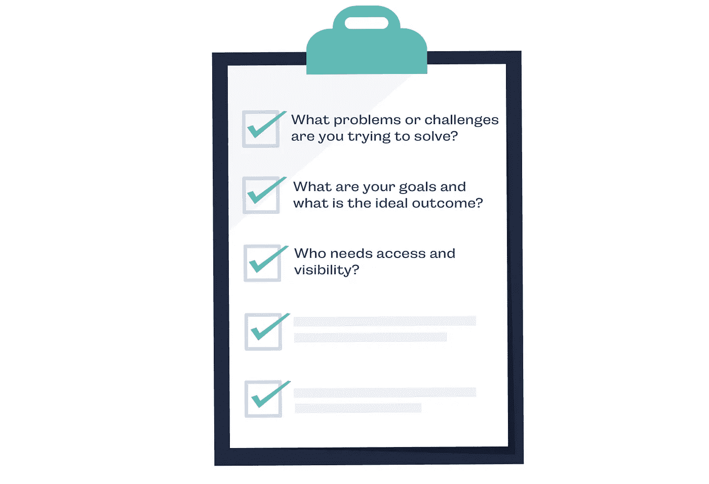
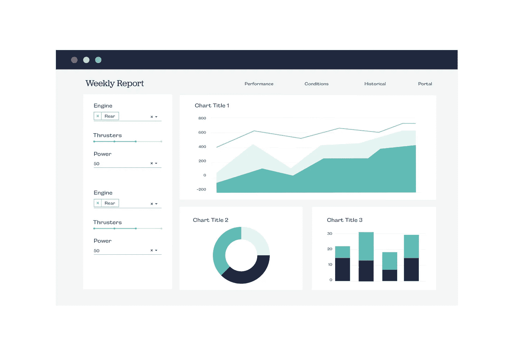
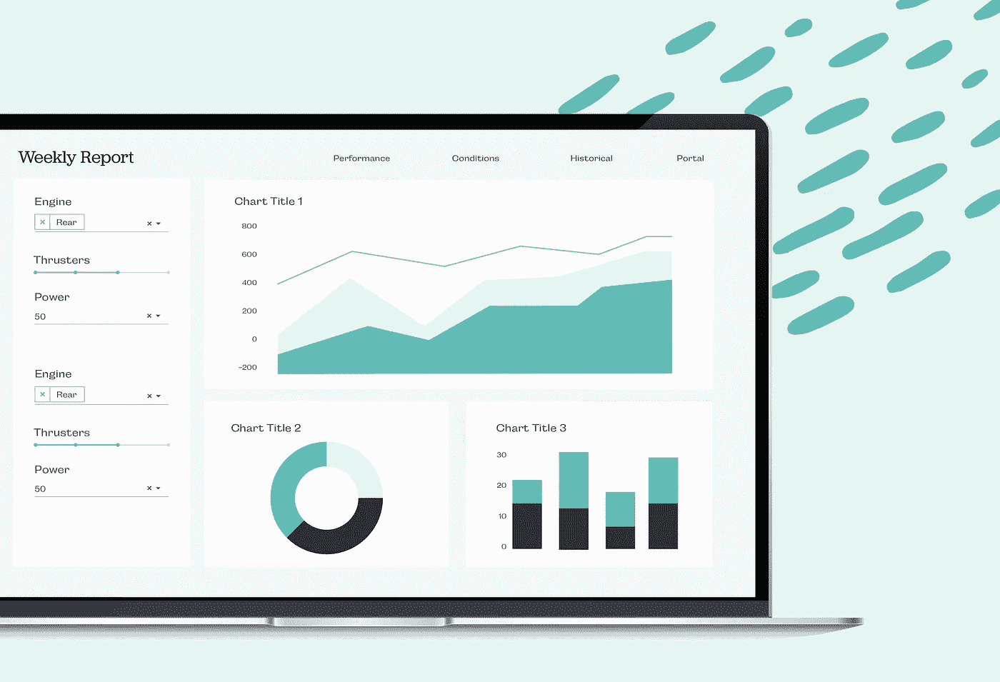

# 如何确保您的数据科学项目每次都成功

> 原文：<https://towardsdatascience.com/how-to-ensure-your-data-science-projects-are-successful-every-time-8348ce5e37a0?source=collection_archive---------30----------------------->

在 2017 年的一项调查中，Gartner 分析师发现[超过一半的数据科学项目从未部署](https://www.gartner.com/en/documents/3880054/how-to-operationalize-machine-learning-and-data-science-)。这可能会导致一些人认为数据、分析工具或潜在的 ML 模型中存在缺陷，但事实并非如此。在 Plotly，我们从经验中了解到，产品发布失败通常是因为无法将模型输出与实际业务或组织的后续步骤联系起来。

正如统计数据所显示的，这是整个行业的一个主要症结。为了帮助克服这一障碍，我们总结了多年来与客户合作的经验以及从 Plotly 社区听到的信息。它始终回到三个要点——如果你把这些做对了，你就能确保你的项目在每次开发时都有真正的商业影响。

首先，**问正确的问题**。这是一个典型的故事——另一个部门的一位同事带着一个数据集过来，他们问类似这样的问题:“我应该使用哪种图表类型？”那不是正确的方法。不要粗制滥造一些潜在无益的模型或图表，而是问问你的同事他们正在试图解决什么问题，理想的结果和目标是什么。理解你想问数据什么问题是关键。而且，成功项目的唯一途径是清楚地识别团队试图获得的知识，并从那里逆向工程出解决方案。

大多数团队已经转向 Python 或 R 作为他们在人工智能和数据科学计划中选择的语言，使用数据管理和机器学习(ML)模型构建的工具。这可能是最熟悉的领域，大多数团队都有自己选择的工具来完成这一步。这也是从模型到分析型 web 应用的第一步。

嗯，什么是分析型网络应用？将分析 web 应用程序视为模型和数据的前端。它明显不同于 BI 工具或仪表板，因为它使最终用户能够直接与模型和数据交互，而不需要理解代码。想象一下，给你的同事一个模型，他们可以通过交互式图形和 UI 控件进行研究，以执行自己的下游分析。

以分析应用为最终目标，**第二步是构建合适的 UI** 。一旦您充分理解了为什么一组特定的数据很重要，以及业务和组织合作伙伴希望对结果做些什么，您就可以专注于开发一个模型 UI，为您的分析提供最准确和最具探索性的视图。它更多的是关于开发和定制一种理解人工智能模型或数据集的方式，而不是呈现结果。随着您的受众需求的变化，让他们有机会接触数据。[有许多工具可以帮助可视化数据](/python-for-data-science-a-guide-to-data-visualization-with-plotly-969a59997d0c)，这些工具既美观又易于*任何人*理解和交互。找到一个对你和你的组织有用的，但是记住，你要的是交互式的，所以不要局限于静态的图表，这样其他人可以探索和试验。

第三步**，定义应用程序的操作结构**。通常情况下，模型、数据，甚至是交互式应用程序都可能会卡在某人机器上的笔记本中。这是大规模共享的主要障碍。解决方案(和挑战)是部署一个任何人都可以访问的独立应用程序——换句话说，释放数据。有效的解决方案考虑了供应、安全性、视觉设计/品牌和维护，允许用户通过将数据科学与实际业务结果相结合来真正实施关键项目。[实现这个](https://dash.plot.ly/dash-enterprise)有很多方法，从耗时且昂贵的全栈开发团队，到帮助您自己完成这个任务的工具。同样，您需要找到适合您的部署流程。一旦你这样做了，你就成功地开发了一个端到端的过程。

现在是成为数据科学家的绝佳时机。社会几乎淹没在数据中，需要收集、整理、分析和操作的海量数据每天都呈指数级增长。最后一块——操作化数据和模型——是最重要的。在我们的工作中，我们必须确保我们不仅要展现洞察力，而且要以与业务和组织成功相关、易于理解、易于互动的方式来实现。

