# 如何参加你的第一次 Kaggle 比赛

> 原文：<https://towardsdatascience.com/how-to-enter-your-first-kaggle-competition-4717e7b232db?source=collection_archive---------11----------------------->


Arny Mogensen 在 [Unsplash](https://unsplash.com/s/photos/fire?utm_source=unsplash&utm_medium=referral&utm_content=creditCopyText) 上拍摄的照片

## 用 python 中的自然语言处理预测灾难微博

Kaggle 可能是最知名的机器学习竞赛网站。Kaggle 竞赛由网站上提供的数据集组成，其中包含一个要用机器、深度学习或其他数据科学技术解决的问题。一旦你开发出一个解决方案，你将把你的预测上传到网站上，根据你解决方案的成功，你将在竞赛排行榜上赢得一个位置，甚至可能获得现金奖励。

Kaggle 可以是一个磨练你的机器学习和数据科学技能的好地方，让你与他人进行比较，并学习新技术。在下面的文章中，我将提供一个如何第一次参加 Kaggle 比赛的演示。在本文中，我们将:

*   开发一个模型来预测一条推文是否是关于一场真正的灾难。
*   使用该模型对 Kaggle 提供的测试数据集进行预测。
*   第一次提交，就能登上 Kaggle 排行榜。

## 检测灾难微博

该网站上的最新比赛之一提供了一个数据集，其中包含推文以及一个标签，可以告诉我们它们是否真的是关于一场灾难。这项比赛有一个排行榜，有近 3000 个参赛项目，最高现金奖为 10，000 美元。数据和比赛大纲可以在这里查看[。](https://www.kaggle.com/c/nlp-getting-started)

如果您还没有 Kaggle 帐户，您可以在这里免费创建一个帐户。

如果您从竞赛页面选择“下载全部”,您将获得一个包含三个 CSV 文件的 zip 文件。

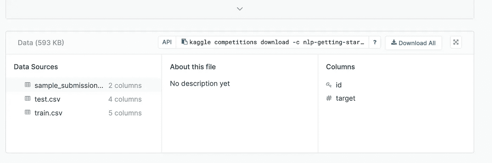

第一个包含一组用于训练目的的特征及其相应的目标标签。该数据集由以下属性组成:

*   tweet 的数字标识符。当我们将预测上传到排行榜时，这将非常重要。
*   关键词:来自 tweet 的关键词，在某些情况下可能会丢失。
*   位置:发送推文的位置。这也可能不存在。
*   文本:推文的完整文本。
*   目标:这是我们试图预测的标签。如果推文确实是关于一场灾难，这将是 1，如果不是，这将是 0。

让我们阅读这些文件，并对它们有更多的了解。你会注意到在下面的代码中，我包含了一个`set_option`命令。熊猫 [set_options](https://pandas.pydata.org/pandas-docs/stable/reference/api/pandas.set_option.html) 允许你控制数据帧结果的显示格式。我在这里包含了这个命令，以确保显示文本列的全部内容，这使得我的结果和分析更容易查看。

```
import pandas as pd
pd.set_option('display.max_colwidth', -1)train_data = pd.read_csv('train.csv')
train_data.head()
```

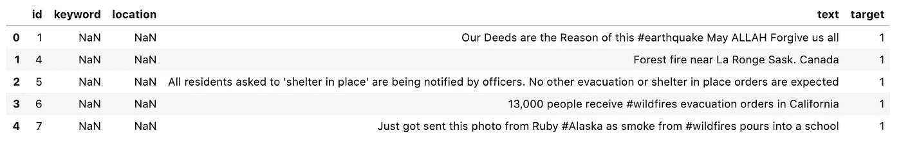

第二个数据集仅包含特性，对于该数据集，我们将预测目标标签，并使用结果在排行榜上获得一席之地。

```
test_data = pd.read_csv('test.csv')
test_data.head()
```

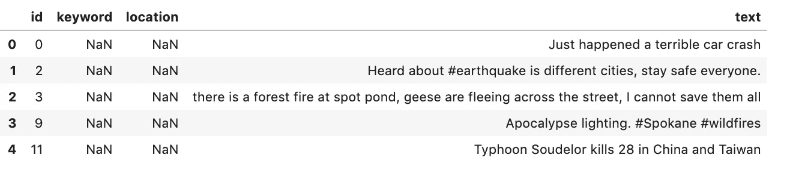

第三个例子展示了我们的提交文件应该是什么样子。这个文件将包含来自`test.csv`文件的 id 列和我们用模型预测的目标。一旦我们创建了此文件，我们将把它提交到网站，并在排行榜上获得一个位置。

```
sample_submission = pd.read_csv('sample_submission.csv')
sample_submission.head()
```

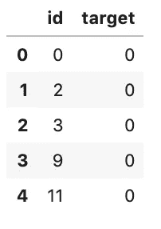

## 为机器学习准备数据

对于任何机器学习任务，在我们可以训练模型之前，我们必须执行一些数据清理和预处理。这在处理文本数据时尤其重要。

为了使我们的第一个模型简单，并且因为这些列中有很多缺失的数据，我们将放弃位置和关键字特征，只使用 tweet 中的实际文本进行训练。我们还将删除`id`列，因为这对训练模型没有用。

```
train_data = train_data.drop(['keyword', 'location', 'id'], axis=1)
train_data.head()
```

我们的数据集现在看起来像这样。

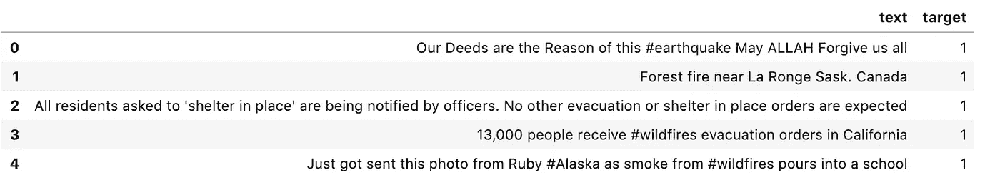

文本，尤其是推文，通常会包含许多对机器学习算法来说不一定有意义的特殊字符。因此，我采取的第一个步骤是删除这些。我也把所有的单词都变成小写。

```
import redef  clean_text(df, text_field):
    df[text_field] = df[text_field].str.lower()
    df[text_field] = df[text_field].apply(lambda elem: re.sub(r"(@[A-Za-z0-9]+)|([^0-9A-Za-z \t])|(\w+:\/\/\S+)|^rt|http.+?", "", elem))  
    return dfdata_clean = clean_text(train_data, "text")data_clean.head()
```

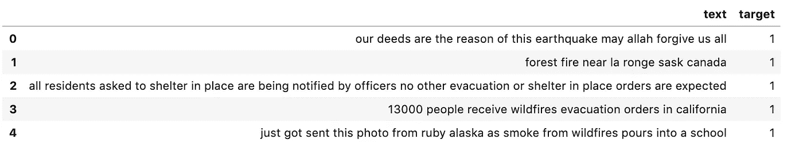

另一个有用的文本清理过程是删除停用词。停用词是非常常用的词，通常没有什么意义。在英语中，这些词包括“the”、“it”和“as”等。如果我们将这些单词留在文本中，它们将产生大量噪声，这将使算法更难学习。

NLTK 是用于处理文本数据的 python 库和工具的集合，完整的文档可以在这里[访问](https://www.nltk.org/)。除了处理工具之外，NLTK 还有大量的文本语料库和词汇资源，包括一个包含各种语言的所有停用词的语料库。我们将使用这个库从数据集中删除停用词。

NLTK 库可以通过 pip 安装。安装后，您需要导入库语料库，然后下载停用词文件。

```
import nltk.corpus
nltk.download('stopwords')
```

一旦这一步完成，你就可以读入停用词，并使用它从推文中删除它们。

```
from nltk.corpus import stopwords
stop = stopwords.words('english')data_clean['text'] = data_clean['text'].apply(lambda x: ' '.join([word for word in x.split() if word not in (stop)]))data_clean.head()
```

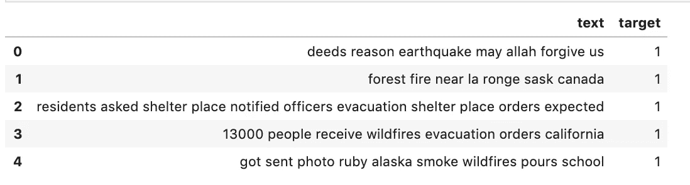

## 数据预处理

清理后，数据需要进一步预处理，以准备在机器学习算法中使用。

所有机器学习算法都使用数学计算来映射特征中的模式，在我们的情况下是文本或单词，以及目标变量。因此，在可以训练机器学习模型之前，必须将文本转换成数字表示，以便可以执行这些计算。

这种类型的预处理有很多方法，但是在这个例子中，我将使用 scikit-learn 库中的两种方法。

这个过程的第一步是将数据分割成记号或单个单词，统计每个单词在文本中出现的频率，然后将这些计数表示为稀疏矩阵。[计数矢量器](https://scikit-learn.org/stable/modules/generated/sklearn.feature_extraction.text.CountVectorizer.html)函数实现了这一点。

下一步是对 CountVectoriser 产生的字数进行加权。应用这种加权的目的是按比例缩小文本中非常频繁出现的单词的影响，以便在模型训练期间，不太频繁出现并且可能更有信息的单词被认为是重要的。 [TfidTransformer](https://scikit-learn.org/stable/modules/generated/sklearn.feature_extraction.text.TfidfTransformer.html) 可以执行此功能。

## 机器学习管道

让我们将所有这些预处理和模型拟合放在一个 scikit-learn 管道中，看看模型是如何执行的。对于第一次尝试，我使用线性支持向量机分类器(SGDClassifier ),因为这通常被认为是最好的文本分类算法之一。

```
from sklearn.model_selection import train_test_splitX_train, X_test, y_train, y_test = train_test_split(data_clean['text'],data_clean['target'],random_state = 0)from sklearn.feature_extraction.text import TfidfVectorizer
from sklearn.pipeline import Pipeline
from sklearn.feature_extraction.text import CountVectorizer
from sklearn.feature_extraction.text import TfidfTransformer
from sklearn.linear_model import SGDClassifierpipeline_sgd = Pipeline([
    ('vect', CountVectorizer()),
    ('tfidf',  TfidfTransformer()),
    ('nb', SGDClassifier()),
])model = pipeline_sgd.fit(X_train, y_train)
```

让我们使用训练好的模型来预测我们保留的测试数据，看看模型的表现如何。

```
from sklearn.metrics import classification_reporty_predict = model.predict(X_test)
print(classification_report(y_test, y_predict))
```

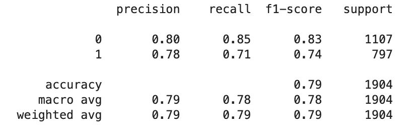

对于第一次尝试，该模型表现相当好。

## 首次提交

现在让我们看看模型在竞争测试数据集上的表现以及我们在排行榜上的排名。

首先，我们需要清理测试文件中的文本，并使用模型进行预测。下面的代码获取测试数据的副本，并执行我们应用于训练数据的相同清理。输出显示在代码下方。

```
submission_test_clean = test_data.copy()
submission_test_clean = clean_text(submission_test_clean, "text")
submission_test_clean['text'] = submission_test_clean['text'].apply(lambda x: ' '.join([word for word in x.split() if word not in (stop)]))
submission_test_clean = submission_test_clean['text']
submission_test_clean.head()
```

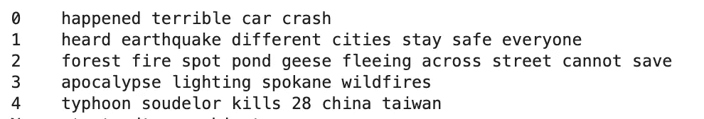

接下来，我们使用模型来创建预测。

```
submission_test_pred = model.predict(submission_test_clean)
```

为了创建一个提交，我们需要构建一个数据帧，只包含来自测试集的 id 和我们的预测。

```
id_col = test_data['id']
submission_df_1 = pd.DataFrame({
                  "id": id_col, 
                  "target": submission_test_pred})
submission_df_1.head()
```

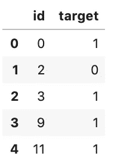

最后，我们将其保存为 CSV 文件。包含`index=False`很重要，否则，索引将被保存在文件中的一列，您的提交将被拒绝。

```
submission_df_1.to_csv('submission_1.csv', index=False)
```

一旦我们有了 CSV 文件，我们可以返回到竞争页面，并选择提交预测按钮。这将打开一个表单，您可以在其中上传 CSV 文件。添加一些关于该方法的注释是一个好主意，这样您就有了以前提交的尝试的记录。

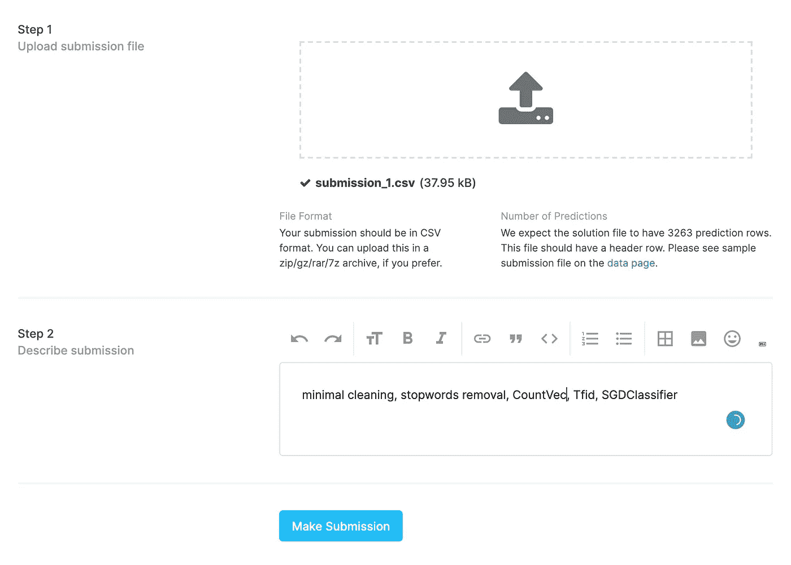

提交文件后，您将看到此屏幕。

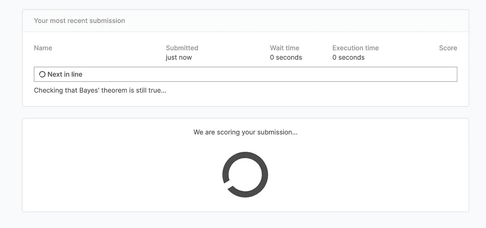

现在我们已经成功提交了！

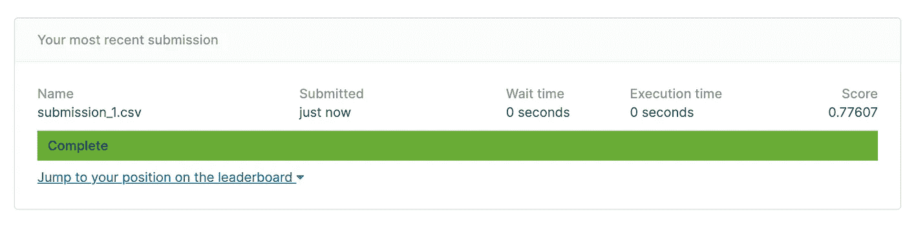

这个模型在排行榜上给我打了 0.78 分，排名 2371。显然有一些改进的空间，但现在我有一个未来提交的基准。

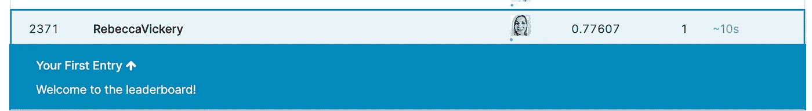

在这篇文章中，我概述了如何在 Kaggle 比赛中首次提交作品。在这一点上，你可以采取很多进一步的措施来改进。这包括更好地清理文本，不同的预处理方法，尝试其他机器学习算法，模型的超参数调整等等。

感谢阅读！