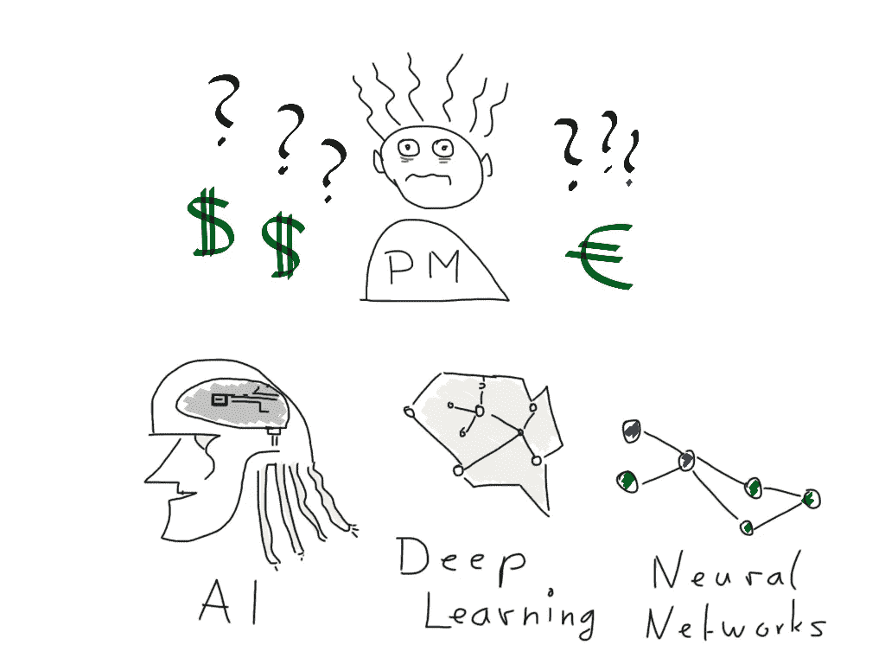
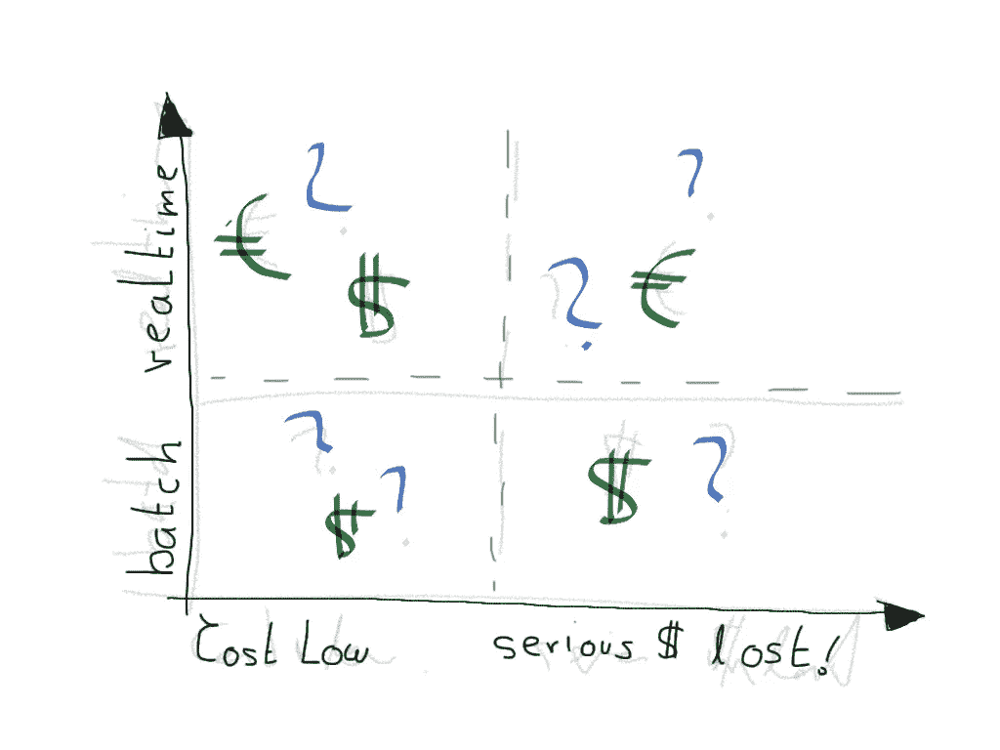
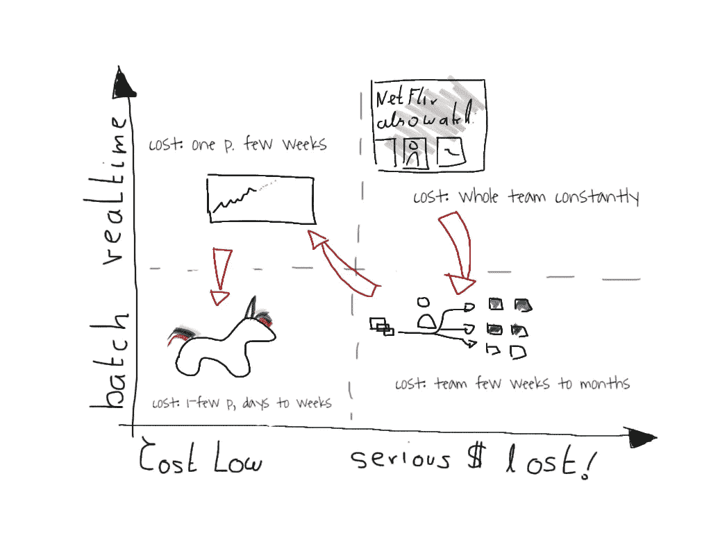

# 如何估算和降低机器学习产品的成本

> 原文：<https://towardsdatascience.com/how-to-estimate-and-lower-the-costs-of-machine-learning-products-c3cc32f13a05?source=collection_archive---------16----------------------->

## *一个简单的矩阵，用于确定您路线图上的下一个机器学习产品的成本。*

深深困惑的产品经理。作者的插图。

## 动机

人工智能和机器学习产品出现在当今几乎任何公司的路线图上，并且趋势正在上升。但是很少有公司真正实现过十几个成功的产品。根据最近的一项研究， **65%投资于[人工智能的公司](https://www.forbes.com/sites/gilpress/2019/10/17/ai-stats-news-65-of-companies-have-not-seen-business-gains-from-their-ai-investments/#7a57728819f4)**还没有看到任何商业回报。在同一项研究中，高成本被认为是一个主要障碍。因此，让我们看看如何通过一个简单的矩阵来降低人工智能产品的成本并加快开发速度。

让我们看看你的公司。想过为你的企业建立一个推荐引擎会有多贵吗？或者预测你的流量负荷？还是对你的客服话单进行分类系统？

今天那些种类的产品都涉及**机器学习**。它们都是由机器学习工程师或数据科学家构建的。它们都有很大的用处。然而，估计成本，尤其是如果您的公司只实施了不到一打这样的产品，可能会相当令人难以承受。

**ML 产品矩阵**

在 Ville Tuulos 的一次演讲中，我偶然发现了四个类别，这些类别描述了当今机器学习解决方案的四个主要成本类别。在我看来，要了解像推荐引擎这样的产品的成本，你只需回答两个问题:

*   **问题 1(批处理或实时):**该产品是否需要处理接近实时的新数据，或者是否可以在批处理/少量时间流程中处理？
*   **问题 2(延期成本):**如果这个产品坏了，不能用了怎么办？延迟可以吗？还是严重的钱丢了？

机器学习产品成本类别矩阵。

对于每个象限，您可能能够想到一个适合该象限的典型产品。如果没有，不要担心，让我们详细探索所有这些象限，以及每个象限的相关成本。这似乎是显而易见的，所以让我们探讨一下主要的成本驱动因素、商业价值、一些例子，然后看看如何降低要求更高的产品的成本。

## **象限一，“实时”&“严重金钱损失”**

网飞推荐引擎，基于你刚才看到的。

这些产品无时无刻不在接受数据，无时无刻不在进行推断。如果它们发生故障，将会造成严重的经济损失，工作流程受阻，无法做出决策。**典型的例子**是**网飞个性化引擎**。正是它为你提供了上述观点，当然还有其他许多方面，使网飞如此令人愉快。

它每运行一秒钟，就将网飞最重要的指标*每秒开始的新视频数量*增加几个百分点。事实上，在网飞上观看的所有视频中，大约有 70%是由于某种形式的推荐。但结果是，这个系统每一秒钟都不是实时运行的，它实际上花费了大量的金钱。每一秒它都要摄取你刚刚看的东西，更新它的推理过程。

**另一个例子**是汽车购买者的价格预测&经销商，如德国的" **wirkaufendeinauto.de** "。

具有约束估计的价格估计使得实时推断和更新变得至关重要。

汽车市场的价格非常不稳定，每天都在变化。因此，如果他们的定价系统没有正确预测，他们确实会赔钱。

## 象限一，业务价值和成本

通常，这种机器学习产品的商业价值是通过通常的产品经理魔术来计算的:

> “CTR x 转换 x 转换值”。

**代价**:实时推理&更新很难。这类产品通常有两个主要的成本驱动因素:

1.  使得服务(一些 dockerized API)高度可用。这主要是软件工程方面的内容。
2.  使推理过程以及基于数据的更新成为实时的。这是机器学习的一面。

**成本猜测:**这些解决方案需要小型到大型团队不断努力。

## **象限二，“批量”&“严重资金损失”**

让我们考虑这样一种情况，当然，这种情况成本较低，也就是说，如果我们没有实时约束，但可以采用批处理模式。

**典型例子**:客户邮件分类&分拣系统。这种系统从发送到“info@wordpress.com”的 1000 封电子邮件中提取信息，并将其分类成“队列”,然后由更专业的客户人员根据主题进行处理。如果某样东西没有被正确分类，那么人类必须对它进行分类。此外，通常会产生上下文切换成本。

该象限中的其他产品是用于营销的**客户分类**，以及**客户流失预测**等。对于所有这些产品来说，以一个小时这样的固定时间间隔进行批处理、排序、分类和预测，每周或每月使用新数据进行一次更新通常都没问题。

## 象限二，业务价值和成本

同样，对于商业价值，你可以用一个公式来计算，比如“获得一个活跃客户的可能性 x 终身价值”或者“分类节省的时间 x 价值”等等。

**费用**:

*   推理的 SLA。
*   开发成本，通常被分摊到相对较少的迭代中。

**成本猜想:**一个团队的工作，几个星期到几个月。不需要持续的工作，调优过程将需要几次迭代，但不会更多。

## **象限三，“实时”，“成本低”**

典型例子:这些产品通常是给决策者看的。它们不在关键流程中，但如果利用这些信息做出决策，它们会产生非常大的影响。因此，现金流预测、总体层面的“客户观点的主要驱动因素”分析或“客户流失预测”都是很好的例子。

## 象限三，业务价值和成本

商业价值通常体现在可以做出的决策中。这些决策通常很难定价，因此这里的目标是与高管密切沟通，让他经常可靠地使用这些决策。

**成本动因:**

*   开发时间，你将需要几次迭代来使它工作，这样它确实被经常使用。与其他象限相比，这实际上是流程的很大一部分，实际上是让一个原型出门。
*   SLA 几乎没有成本，因为决策者是今天还是明天查看这些数字并不重要。

**费用猜想:**一人几周。

## **象限四，“批量”&“成本低”**

**典型例子**:数据科学独角兽。这是一个 jupyter 笔记本的原型，一个经过训练和评估的分析。甚至可能是一个 excel 结果列表。这是数据科学家在处理大型产品之前通常会产生的东西。但是，即使是那些一次性的静态结果也可以部署到完整的产品中。

## 象限四，业务价值和成本

**商业价值**:要么是纯粹的原型制作，“这能行吗？”；或者是对我们认为未来不会改变的事情的一次性分析，比如“让我们猜测一下 2020 年客户流失的主要因素”。

**费用猜想:** 1-几周，一对多数据科学家。

所以我们的完整矩阵是这样的:

四象限，独角兽是最便宜的产品。

。成本链是这样的:

> 独角兽< real time & cost high < batch & serious money < real-time heavy load thing.

## **但这如何帮助我让我的机器学习产品更便宜？**

神奇的是*几乎任何你目前想到的产品，你都可以选择一个更便宜的*，在第一次迭代中有大致相同的商业价值。当然不是在以后的迭代中，但这是要点。您总是可以使用第一次迭代来获得反馈和对业务价值的更好的估计。

**实时、高成本的产品:**比如前面提到的“ *wirkaufendeinauto.de* 的销售算法。这个想法是，当你把车开到一家“wirkaufendeinauto.de”店时，他们需要一个这辆车明天会卖多少钱的准确估计。那么，除了根据价格数据每分钟更新一次，他们还能做什么呢？

**让我们把它变成批量产品:**当然，他们可以每晚开始批量生产。这意味着不使用日内价格变化。但是，估计还是很不错的。为了减轻这些影响，并使解决方案更加稳健，他们可以简单地对所有价格应用 1–2%的折扣来说明这一事实。

**让我们进一步把它变成一批没有严重损失的产品:**所以这个解决方案仍然很贵，我们可以通过不同的方式把它变成一个更便宜的解决方案。这怎么可能呢？你可以雇佣真正的人来做价格估算(例如，通过浏览一些网站)，让他们使用你的解决方案提供的“预计价格”，这个价格每天都会更新。这样，如果机器学习解决方案失败，人们仍然可以对汽车进行大致正确的定价，并且不会严重损失金钱。

**最后，让我们看看作为一只独角兽我们可以从什么开始:**当然，我们会先做一个非常粗略的猜测，然后交给做价格估算的人。他们可以使用“2020.01.01 的预计价格”,如果他们觉得有用，你将继续开发批处理过程。

使用同样的过程，你可以把几乎任何成熟的想法变成独角兽。

现在轮到你来打造你的机器学习产品了！

## 更多资源:

*   Metaflow 上的 Ville Tuulos 演示位于[此处](https://www.youtube.com/watch?v=DJVJx2fSf90)。
*   介绍中提到的讨论数据项目研究的福布斯文章位于[此处](https://www.forbes.com/sites/gilpress/2019/10/17/ai-stats-news-65-of-companies-have-not-seen-business-gains-from-their-ai-investments/#7a57728819f4)。