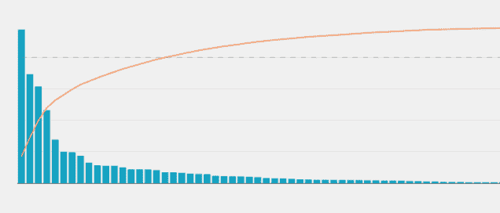

# 如何估算数据科学项目的数据收集成本

> 原文：<https://towardsdatascience.com/how-to-estimate-data-collection-costs-for-your-data-science-project-8938ca9acc5f?source=collection_archive---------27----------------------->

## 在在线市场的高进入壁垒和过时的 API 之间导航的技巧:在线租赁市场的案例研究

照片由[阿里·耶尔马兹](https://unsplash.com/@zamansizturk?utm_source=medium&utm_medium=referral)在 [Unsplash](https://unsplash.com?utm_source=medium&utm_medium=referral) 上拍摄

*(注:所有观点均为本人)*

# 介绍

数据收集是任何数据科学或分析项目的初始和基本步骤，从数据分析到模型部署，所有后续活动都依赖于数据收集。

随着 API 和云计算的普遍存在，我对最大化工作和个人项目数据收集活动的效率和自动化水平越来越感兴趣。

在后一个类别中，我一直对从英国市场的在线房屋租赁平台( [**Zoopla**](https://www.zoopla.co.uk/) ， [**RightMove**](https://www.rightmove.co.uk/) ， [**OnTheMarket**](https://www.onthemarket.com/) 等)收集数据感兴趣，目的是提取图像和文本数据进行处理，以用于机器学习模型(例如预测房产价格、从图像数据中提取关键特征以推断房源的真实价值等用例)..)

在接下来的几行中，我将讨论如何着手:

1.  **最关键数据源的识别**
2.  **如果您想将您的解决方案投入商业使用，数据收集成本的估算**

我对这篇文章进行了更广泛的分析，它涉及到在围绕潜在商业目的的数据收集进行推理时要考虑的市场和监管问题，以及使用 API 的更多技术问题，因为我意识到在这个非常有趣的主题中有多个层面要讨论。

我希望以下要点将有助于您建立当前和未来数据科学项目的数据收集模块，无论您的行业重点是什么。

# 做你的市场调查，确定你的关键数据来源

在双边市场，如在线房屋租赁平台，由供需代理主导**(在供应方，房主希望直接或通过房地产代理出租；在需求方面，个人寻求租赁)**，你将在那些平台上找到数量和质量最多的数据，这些平台在给定的市场中驱动了大部分流量，来自供应和需求两方面。

> **从这个意义上来说，你需要确定哪些平台拥有最大的市场力量，因为它们吸引了最多的眼球。如果您希望在一段时间内获取大量数据，并且不希望集成来自较小市场参与者的多个数据流，那么了解市场整体流量/数据量的分布非常有用。**

在英国的在线房屋租赁市场，大部分流量和房源分布在前 1-5 家公司之间，因此这些公司(下图中曲线的左侧)是您希望重点收集数据的公司。

帕累托原则。来源:Mode.com

这当然是一把双刃剑，因为在签订数据共享协议时，你将从中采购的大玩家拥有**高杠杆，这允许他们:**

**1)充当特定市场的*实际上的*看门人，并制定自己的数据使用政策，尤其是在监管较少的市场情况下**

**2)签订数据共享协议时，每单位数据量多收费**

**3)有效监控初创公司对其核心业务的潜在竞争威胁，这些公司需要访问他们的数据，因此更加依赖他们的服务**

与此同时，鉴于市场份额的不均衡分布以及缺乏反竞争监管，这是数据的真正价值所在，因此希望染指这些数据的有抱负的数据科学团队需要付出一定的代价来占领大部分市场并访问大量高质量的数据点。

*注意:对于非商业或研究目的，您可能可以从这些网站上抓取数据(尽管这种活动在高频率和高容量的情况下并不总是受欢迎，这纯粹是出于实际考虑，我不鼓励在有政策禁止的网站上抓取网页，您最好遵守数据提供商的条款和条件)。*

# 总是先寻找 API

一旦您确定了主要的数据源，您的第一个赌注就是浏览他们的开发人员资源并找出:

1.  **他们是否有一个活动的 API，您可以从中获取所需的数据**
2.  **他们的总体数据共享条款和条件(T & Cs)是什么**

照片由[马库斯·斯皮斯克](https://unsplash.com/@markusspiske?utm_source=medium&utm_medium=referral)在 [Unsplash](https://unsplash.com?utm_source=medium&utm_medium=referral) 拍摄

例如，Zoopla 有一个 API 页面，可以用来返回一些特性和列表数据。Zoopla 的特定 API 已经有一段时间没有更新了，并且显然已经招致了之前在[介质](https://medium.com/@mariomenti/how-not-to-run-an-api-looking-at-you-zoopla-bda247e27d15)上记录的批评，但是这种类型的信息是你在比较不同数据源时想要寻找的。

当进入 RightMove 时，你会被引导到他们的官方网站上的[数据服务](https://www.rightmove.co.uk/data/)页面。在撰写本文时，他们似乎没有或没有授权任何官方 API。OnTheMarket.com 似乎也没有任何空气污染指数。

检查主要参与者对于确定数据收集策略的下一步非常有用。如果您找到一个活动的 API 并决定:

1.  **数据量和质量是否足以满足您的应用**
2.  **你是否违反了他们的 T & Cs**
3.  **您是否想联系数据提供商(参见后续步骤)提交一份格式数据请求，以获得更多更丰富的数据集**
4.  **是否转向市场中其他较小的参与者，这些参与者可能(通过他们自己的 API)给你足够的数据(其他聚合器，如** [**内斯特利亚**](https://www.nestoria.co.uk/) **，它们确实提供了一个)**

无论如何，不要跳过这一步，因为它提供了非常有价值的信息，即使你没有立即得到你所需要的信息。

# 不要害怕与数据提供商联系，讨论潜在的数据共享协议

就我而言，我决定更深入一点，因此通过电子邮件和 LinkedIn，通过搜索分析职位和接触可行的潜在客户，初步接触了 RightMove & Zoopla。

我建议这样做，因为你总能在另一边找到对支持开发者感兴趣的人，并听到有趣的用例。你也可能发现以前在阅读各种文档时没有注意到的信息。

就我而言，我发现 RightMove 对他们的数据使用限制非常严格，因此我从他们那里真正得到的唯一东西就是冷淡。Zoopla 也是一样，它只是让我回到他们现有的 API，在用 Python 脚本简单测试后，我怀疑它的数据丰富性。

在这一点上，我决定在网上搜索，以确定已经利用了来自两个主要提供商之一的数据的应用程序和平台，并看看我是否可以提取更多信息，了解他们是如何做到这一点的，以及潜在的成本。

**我*本来也可以加倍下注 Zoopla & RightMove，决定提出一份数据共享协议，但作为一个个体，我在这样的对话中实际上能拥有多少筹码？***

在您试图决定从哪里以及如何收集数据的类似情况下，我建议您:

1.  **花时间研究市场和各种数据提供商，给自己尽可能多的潜在数据源，这也将允许你比较他们的成本和你愿意分配给你的项目的预算**
2.  **花时间与选择的几个供应商建立关系(如果他们不一定有明确的 API，比如在这种情况下),并从他们那里获取尽可能多的价格/其他信息，同时在计划使用他们的数据时也要非常透明(研究、商业、个人等)。)**

# 利用在你之前收集数据的人的专业知识

在确定了您的主要数据源并检查了 API 及其使用潜力之后，您还需要接触其他正在利用这些数据源的市场参与者，看看您是否能发现更多的见解。

我发现这是一个不可思议的小步骤，可以获得一些关于数据收集成本的高质量上下文信息。

例如，我发现了一个很棒的网站， [Property Data](https://propertydata.co.uk/) ，它引用了我正在寻找的相同的[数据源](https://propertydata.co.uk/data-sources)，因此我立即使用他们的联系方式发送了一封电子邮件。

令我惊讶的是，这位创始人自己回复了，提到了一家提供商向 PropertyData 收取的费用，以获得他们需要的数据，并确认他们无法说服另一家提供商发送他们的数据，无论提出的价格是多少，从而证实了我之前通过电子邮件/LinkedIn 联系他们大多数人时的负面体验。

*-(以下是我从 PropertyData 获得的电子邮件回复的摘录，出于保密原因，在可能的情况下进行了删节)-*

> “我们每月支付源 1 XX。那使我们得到了我们所需要的东西！
> 
> 来源 2，再多的钱也不能让他们感兴趣！
> 
> 属性数据"

这是很好的信息，因为:

1.  **在没有任何 API 或价格点的情况下，它为您提供了一个实际的估计金额，从中可以推断出类似提供商的数据收集成本。**
2.  **利用他人的经验作为指南针，进一步指出哪些数据源更适合使用，哪些应该完全避免使用。**

我总是建议花些时间去接触那些曾经做过的人，然后问一下，你可能会得到积极的、令人惊讶的、有益的回应！

# 运行您的估计并检查财务和技术可行性

至此，您应该已经收集了计算每月数据收集运行成本所需的所有信息，可以通过以下方式进行估算:

***(数据源数量*平均值。***API/数据协议的月订阅费用

为此，您可能希望**考虑任何** **云计算资源**，这将取决于您的数据收集脚本和处理资源量(时间、数据大小驱动),您将利用这些资源将您的数据放入您的数据湖/数据仓库，以供以后处理和分析。

除了单纯的数字之外，此时你还应该对给定项目设置的方法的整体技术可行性有所了解，以及继续进行或完全改变你的数据收集策略是否有意义。

# 概括起来

拥有一套完善的数据收集方法和途径确实可以让您的数据科学项目以最佳方式启动和运行，同时根据您的市场领域知识和可用的数据提供商，以尽可能好的价格获得尽可能好的数据。

如果可以:

1.  **进行扎实的市场调查，确定最优质的来源**
2.  **彻底检查现有的 API 及其(通常)丰富的文档**
3.  **此外，联系数据提供商，解决潜在的数据请求，以及他们是否愿意为您提供帮助**
4.  **通过询问在你之前有权访问数据的人和公司，进一步扩大你的知识库**
5.  **对你实际将要花费多少时间和金钱来获取你需要的所有数据进行一个合理的估计**

您可以大大增加开发可靠的数据收集方法的机会，并以有效的方式最大化获得大量数据的机会。感谢阅读！

**访问我的免费数据科学资源清单** [**这里**](https://landing.mailerlite.com/webforms/landing/k1n3r2)

 [## 通过我的推荐链接加入 Medium-Edoardo Romani

### 作为一个媒体会员，你的会员费的一部分会给你阅读的作家，你可以完全接触到每一个故事…

edo-romani1.medium.com](https://edo-romani1.medium.com/membership)