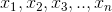
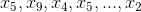
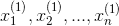
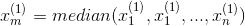
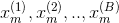
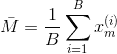
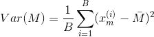
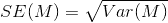

# 使用 Bootstrap 策略估计中位数的标准误差

> 原文：<https://towardsdatascience.com/how-to-estimate-the-standard-error-of-the-median-the-bootstrap-strategy-ed09cccb838a?source=collection_archive---------26----------------------->

弗兰基·查马基在 [Unsplash](https://unsplash.com/s/photos/data?utm_source=unsplash&utm_medium=referral&utm_content=creditCopyText) 上拍摄的照片

## 通过替换抽样得到经验分布

在这篇文章中，我将讨论我们可以用来估计中位数的标准误差的方法。我将首先说明一些定义，并讨论我们如何估计均值的标准误差。然后我会讨论如何用 bootstrap 策略估计介质的标准差。

**标准误差是多少？**

根据维基百科，统计数据的标准误差是其抽样分布的标准偏差或该标准偏差的估计值。在继续之前，这句话中有几个概念需要澄清:

首先，统计是参数的抽样估计。例如，样本均值 x_bar 是一个统计量，而总体均值是一个参数。因为通常是未知的，我们需要一个统计来估计它。x_bar 被认为是的无偏估计。

第二，标准差是离差的度量，是方差的平方根。它通常代表你估计的置信度，用于置信区间、假设检验等。

最后，抽样分布是来自随机样本的统计的概率分布。我们举个例子。假设我们正在估算美国大学毕业生的平均收入。人口是所有大学毕业生的收入。收集所有毕业生的数据并估计他们的收入几乎是不可能的。这就是为什么我们从总体中抽取有代表性的样本，并计算样本均值来估计总体均值。

**平均值的标准误差(SEM)是多少？**

由于有了 [**中心极限理论**](https://en.wikipedia.org/wiki/Central_limit_theorem) ，估算平均值的标准误差变得简单明了。该理论指出，无论总体的分布是什么，随着样本量的增加，样本均值的抽样分布接近正态分布。此外，正态分布的均值等于总体均值，标准差等于总体标准差除以样本大小 n 的平方根。因此，如果总体标准差未知，则均值的标准差等于样本标准差除以样本大小 n 的平方根。给定任何随机分布，我们将很容易估计 SEM。

**如何估计中位数的标准差？**

不幸的是，中心极限理论不适用于中位数，因此我们需要其他方法来估计中位数的标准误差，只给定一个样本。这就是自举策略派上用场的时候。

引导程序正在使用替换进行采样。如果有样本:

我们可以从这个样本中取 n 个项目 ***替换*** 。在这里，我们将生成一个新的样本，它可以是:

样本大小等于 n。使用 bootstrap 策略估计标准误差的步骤如下:

1、从给定样本中取 n 项作为新样本:

从这个样本中，我们可以很容易地计算出样本的中位数:

2，对 B 轮重复前面的过程，我们将获得 B 个新样本，具有 B 个样本中值:

3，现在我们已经得到了中位数的经验分布，因此我们可以从中估计中位数的标准误差:

(1)计算前一个中位数样本的平均值:

(2)计算变化量:

(2)计算标准差，即经验样本的标准差:

**为什么 bootstrap 在工作？**

bootstrap 有效的原因是 bootstrap 使用经验分布函数(EDF)来估计人口的 CDF。样本的统计量是从总体中随机抽取的样本的函数。因此，它的分布将取决于人口的 CDF 和样本大小。虽然总体的 CDF 通常是未知的，但是我们可以使用 EDF 来估计它，从而得到样本的统计分布。我们可以在这里找到详细的数学解释，以及其他一些限制。

希望这有所帮助！感谢您的阅读！这是我所有博客帖子的列表。如果你感兴趣的话，可以去看看！

 [## 我的博客文章库

### 我快乐的地方

zzhu17.medium.com](https://zzhu17.medium.com/my-blog-posts-gallery-ac6e01fe5cc3)  [## 阅读朱(以及媒体上成千上万的其他作家)的每一个故事

### 作为一个媒体会员，你的会员费的一部分会给你阅读的作家，你可以完全接触到每一个故事…

zzhu17.medium.com](https://zzhu17.medium.com/membership)