# 如何评价一个分类机器学习模型

> 原文：<https://towardsdatascience.com/how-to-evaluate-a-classification-machine-learning-model-d81901d491b1?source=collection_archive---------18----------------------->

[Bru-nO](https://pixabay.com/users/Bru-nO-1161770/) 在 [Pixabay](https://pixabay.com/photos/measure-unit-of-measure-meterstab-2737004/) 上拍摄的照片

## 准确度、精密度、ROC/AUC 和逻辑损失介绍

众所周知，机器学习模型的评估至关重要。它是衡量模型在准确度、精确度、召回率、性能等方面的有效性的过程。

在我以前的一篇文章中:

> 学术研究中的机器学习 v . s . Practical
> https://towardsdatascience . com/machine-Learning-in-Academic-Research-v-s-Practical-5e7b 3642 fc 06

我提出以下阶段是典型的工业机器学习项目:

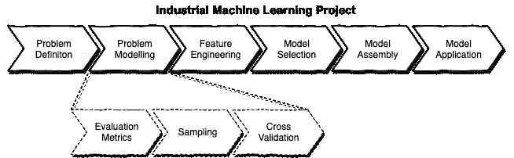

如上图所示，选择合适的**评估指标**是**问题建模**阶段的第一步，也是关键的一步。

由于我们需要选择合适的指标来评估机器学习模型，因此在为模型选择评估指标时，输出值类型是您需要考虑的最重要的因素。即，输出值是否

*   离散分类
*   连续值，或
*   等级

在本文中，我将介绍离散分类机器学习模型的三种最常用的评估指标。

# 精确度和召回率

由 [geralt](https://pixabay.com/users/geralt-9301/) 在 [Pixabay](https://pixabay.com/illustrations/directory-wood-yes-no-opportunity-973992/) 上拍摄的照片

布尔输出中通常使用精度和召回率。在我们能够很好地定义这两个概念之前，我们先来看看著名的“混淆矩阵”:

图片提供:[https://towards data science . com/understanding-confusion-matrix-a9ad 42 dcfd 62](/understanding-confusion-matrix-a9ad42dcfd62)

在上面的混淆矩阵中，

*   TP(真阳性)表示实际结果和预测结果都是真的
*   FP(假阳性)表示实际结果应该是假的，但是预测结果是真的，所以这是一个错误
*   TN(真阴性)表示实际和预测结果都是假的
*   FN(假阴性)表示实际结果应该为真，但预测结果为假

因此，很容易推导出:

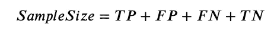

## 精确度和召回率的定义

然后，我们可以将我们的精度(P)和召回率(R)定义如下:

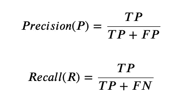

理想情况下，这两个指标应尽可能高，以获得更好的性能。然而，大多数时候，这两者是相反的。也就是说，当你试图提高精度时，会导致更差的召回率，反之亦然。

这里举个极端的例子。假设你正在使用一个搜索引擎通过一些关键字搜索网页。如果搜索引擎只返回一个最相关的网页，我们认为准确率为 100%。然而，召回率将会非常低，因为将会有相当数量的网页是相关的(肯定的)但是被忽略了(假否定，FN)。让我们回到回忆的定义，TP 只有 1，但是 FN 非常大，所以分母非常大而提名者非常小。

另一方面，如果搜索引擎返回所有的网页(假设我们这里不做“检索”，简单地返回互联网上的所有网页)，召回率将是 100%，但精度将接近 0%。这是因为假阳性(FP)非常大。

因此，大多数时候，我们需要平衡这两个指标。在不同的场景中，我们可能会尝试改进其中任何一个，并在另一个上进行一些权衡。

## 平均精确度分数

有时我们可能会使用“平均精度分数”(AP)来衡量一个模型。

图片提供:[https://stats . stack exchange . com/questions/345204/iso-f1-curve-for-precision-recall-curve](https://stats.stackexchange.com/questions/345204/iso-f1-curve-for-precision-recall-curve?rq=1)

如图所示，我们使用 x 轴表示召回率，y 轴表示精确度。曲线产生了一个以蓝色显示的区域。通常，我们可以为所有模型生成这样的 AP 得分曲线，模型产生的大小越大，表明模型的性能越好。

然而，AP 也有一些缺点。例如，这种方法使用起来不太方便，因为我们需要计算曲线下的面积。因此，我们通常使用下面将要介绍的其他指标。

## 从精确度和召回率得出的其他指标

其中最常用的可能是 F 值。F1 的定义如下，它认为精度和召回率对模型同样重要。

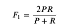

在实践中，我们可能希望为精确度和召回率增加不同的权重。例如，如果我们认为回忆比精确重要𝛼倍，我们可以使用下面的等式来计算 F-measure。

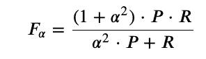

此外，我们还可以测量准确率和错误率:

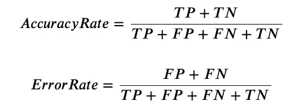

在科学和工程方面，准确度和精确度通常是指不同的概念。在本文中，我不会在这里详细讨论这一点，因为这不是重点。基本上，最显著的区别是精度是指布尔输出(真或假)，而精度可以应用于多个分类，例如:

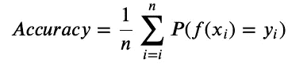

在上面的公式中，

*   `n`是样本空间中的分类数
*   `P`是计算具体分类精度的函数，可以独立定义

# ROC 和 AUC

由[埃里克·麦克莱恩](https://unsplash.com/@introspectivedsgn?utm_source=medium&utm_medium=referral)在 [Unsplash](https://unsplash.com?utm_source=medium&utm_medium=referral) 上拍摄的照片

在实践中，有时我们可能不输出布尔值，而是输出一个概率。例如，患者有 99.3%的概率患有特定疾病。在这种情况下，如果我们坚持使用精度和召回，我们将不得不定义一个阈值。如果我们将 0.8 定义为阈值，那么每个大于 0.8 的预测都将被认为是正确的。那么，如果实际结果也是真的，这个预测就是真的正。

这有点不方便也不合适，因为门槛会

*   显著影响模型的评估
*   涉及另一个人为参数
*   降低模型在更一般问题中的性能

## 接收机工作特性

在这种情况下，ROC(接收器工作特性)曲线将更有效，因为它不需要这样的阈值。

在 ROC 曲线中，x 轴是假阳性率(FPR)，y 轴是真阳性率(TPR)，计算如下:

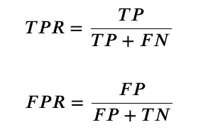

ROC 曲线如下所示:

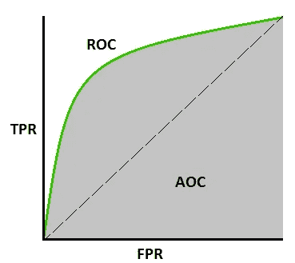

图片提供:[https://towardsdatascience . com/understanding-AUC-roc-curve-68b 2303 cc9 C5](/understanding-auc-roc-curve-68b2303cc9c5)

如图所示，ROC 曲线越靠近左上角，该模型的性能越好。当左上角点的坐标为(0，1)，即 TPR=1，FPR=0 时，我们可以根据它们的公式推导出 FN 和 FP 都等于 0。因此，理想的情况是所有的测试样本都被正确分类。

## ROC 曲线下面积

上图中还显示了 AUC(ROC 曲线下面积),其仅用作在不同模型之间进行比较以评估其性能的单一值。

ROC 曲线下面积的计算方法如其定义:

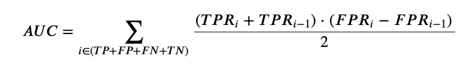

因此，AUC 是一个用于衡量多个模型表现的数字。

# 物流损失

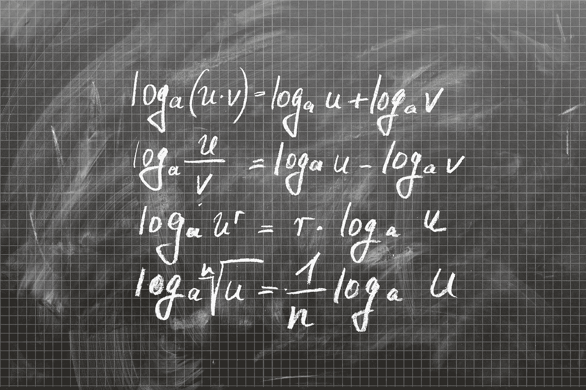

照片由 [geralt](https://pixabay.com/users/geralt-9301/) 在 [Pixabay](https://pixabay.com/illustrations/directory-wood-yes-no-opportunity-973992/) 拍摄

逻辑损失(logloss)是分类问题中常用的另一种评估方法。基本思想是试图测量预测值(概率)和实际值之间的相似性的可能性。logloss 的原始形式是:

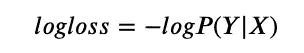

在我们的例子中，我们希望使用 logloss 函数来“最大化”预测值的分布与测试数据集中的原始分布相同的概率。假设我们的模型预测一个布尔输出，logloss 将如下:

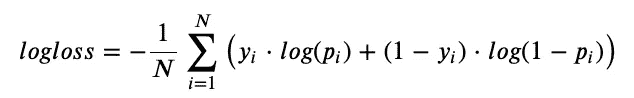

在哪里

*   `N`是样本的数量
*   `y` ∈ `{0,1}`，原始数据集中第 I 个值的真或假
*   `p`是预测输出等于 1 的第 I 个样本的概率

Logloss 也可用于多类别分类问题，如下所示:

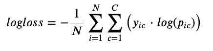

在这个等式中，`C`是类别的数量。

# 总结和提示

照片由 [Aaron Burden](https://unsplash.com/@aaronburden?utm_source=medium&utm_medium=referral) 在 [Unsplash](https://unsplash.com?utm_source=medium&utm_medium=referral) 上拍摄

到目前为止，我们已经介绍了三种不同类型的评估指标，它们特别适用于分类机器学习模型:

*   精确度和召回率(平均精确度分数)
*   ROC 和 AUC
*   逻辑损失函数

本文旨在介绍这些评估指标，而不是对它们进行比较，因为这可能会以期刊论文告终。但是，如果您希望知道如何在这三个指标中为您的分类模型选择一个合适的指标，我可以提供如下粗略的指导。

*   如果您正在处理类别极度不平衡的多分类问题，即某些类别的样本数量明显多于其他类别，您可以使用平均精度分数。
*   如果你认为你的预测等级或误差范围比预测产生多少误差更重要，你可能需要使用 ROC 和 AUC。
*   如果您确实关心预测的误差大小，而不是其分布，则应该使用逻辑损失来提高模型的误差敏感度。

 [## 通过我的推荐链接加入 Medium 克里斯托弗·陶

### 作为一个媒体会员，你的会员费的一部分会给你阅读的作家，你可以完全接触到每一个故事…

medium.com](https://medium.com/@qiuyujx/membership) 

如果你觉得我的文章有帮助，请考虑加入 Medium 会员来支持我和成千上万的其他作者！(点击上面的链接)