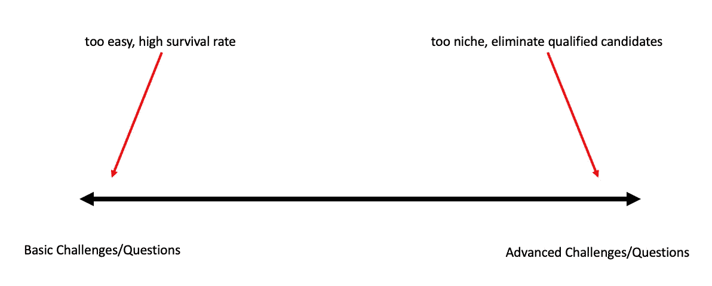
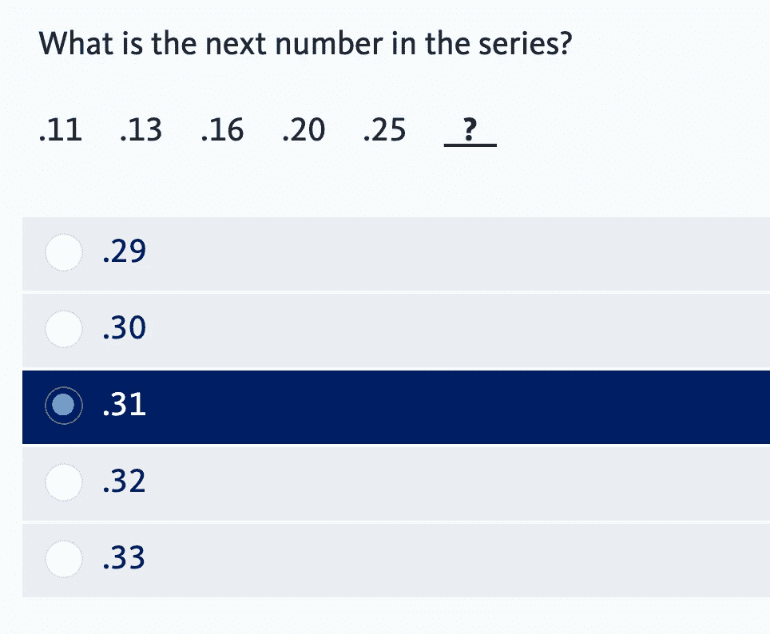

# 如何评估数据科学候选人

> 原文：<https://towardsdatascience.com/how-to-evaluate-a-data-science-candidate-f1d3a690282d?source=collection_archive---------59----------------------->

## 意见

我与许多环境中的大量数据科学家合作过。一些人参加黑客马拉松、数据马拉松、Kaggle 竞赛、“为了好玩”的项目，以及作为多家公司的数据科学顾问。我也不得不申请我应得的工作。我认为评估数据科学家的最佳方法是应对基本的 python 挑战，我将在下面讨论这个案例。

# 一系列问题/挑战

考虑你的问题中的能力水平，你希望为你的候选人提出问题/挑战，淘汰最差的候选人，而不要有一个占用你或候选人大量时间来管理或评估的问题。



这里有一个选择难度的问题。如果你挑的东西太容易，所有人都会通过。还有拒绝合格申请人的额外风险。考虑下面我收到的问题:



在公司愿意让我进入下一轮之前，我必须回答这个问题和其他 99 个类似难度的问题。作为一名申请人，这告诉我 1)我们认为你没有能力掌握小学水平的数学 2)我们不太珍惜你的时间 3)我们不研究有趣或有挑战性的问题。最终，这个过滤器的问题是，你可能没有去掉很多不合格的人，你可能已经失去了对你最好的人才的兴趣。

现在，如果你选的东西太难，要么没人通过，要么你就要冒风险去问一个只有少数人有经验的特定问题。作为一名数据科学家，有太多的东西需要学习，如果你问一个关于数据科学中某个较窄领域的问题，不要认为这意味着他们精通所有领域，而其他候选人不擅长。如果你希望这个职位必须经常处理特定的技能/工具，那么有合适的问题/挑战是可以的，但是我建议确保工作描述(甚至可能是头衔)反映了对该技能/工具的需求。最后，如果你正在挑选一个非常难的问题，你可能没有能力给予部分信任。对你的问题给予部分肯定是有好处的，因为如果你真正想要的人接受了另一份工作，你就能知道谁是你的下一个最佳候选人。有了一个更简单的挑战，你就不必担心找到一个独特的问题，提供部分信用，并可用于许多申请人。

# 那么，为什么选择 Python 呢？

数据科学家的工作非常广泛。在一家公司，这可能意味着你正在制作可视化/仪表板，在另一家公司，你可能是制作模型的机器学习专家，而在另一家公司，你可能是恰好擅长将 ML 投入生产的软件工程师。但是，我相信不管是什么工作，python 都将是你的面包和黄油。我在上面说过，数据科学有许多子领域需要学习，不要用任何一个领域来代表其他领域的技能。我建议你使用 python 作为衡量标准，这似乎违反了这个规则，但我觉得不管申请人过去的经验如何，python 都是一个必不可少的工具，因此是最好的晴雨表。

当我在大学三年级申请第二次实习时，我面临一个现场编码挑战，基本上是说“给定一个数字数组，返回数组中每个数字的频率。”下面的例子。

```
input_array = [3, 6, 8, 2, 4, 8, 3, 1, 8, 9, 7, 0, 5, 5, 1]expected_output = {"0": 1, "1": 2, "2": 1, "3": 2, "4": 1, "5": 2, "6": 1, "7": 1, "8": 3, "9": 1}
```

我在不到 2 分钟的时间内成功完成了挑战，离开时感到有些失望，因为这不是一点点困难，所以我没有机会区分自己和我的能力。我确实得到并接受了那份实习工作，所以几个月后我问面试官:“为什么我被选中了？我觉得每个人都一定答对了这个问题。”令我惊讶的是，我被告知，在大约 50 名接受挑战的人中，只有 5 人答对了，而且只有我反应很快。令我惊讶的是，其他一些实习生候选人是博士生或计算机科学专业的学生。但我认为这个例子的目的是消除那些不能完成基本数据科学任务的人，而不会给申请人或面试官带来麻烦。

现在，我可能有偏见，因为我通过了那次面试，但其他人失败了，但我发现在数据科学项目中成功的限制因素通常是基本的编程能力。如果有人说他们在深度学习方面有经验，但他们不能从 JSON 对象中正确解析他们需要的数据，我并不特别在意。在任何项目的生产化过程中，良好的编程技能都非常适合您。

# Python 提问

更具体地说，我认为你应该问的问题类型是 leetcode 类型的问题。如果你正在雇佣一个数据科学家，我不认为你应该期望他们也是一个精英软件工程师，记住我们实际上是试图快速检查最低能力。所以我不建议去解决最难的问题，我认为过滤掉简单的问题可能是最好的。从那时起，我可能甚至不关心解决方案的效率或时间复杂性，也许让这成为候选人之间的平局决胜。