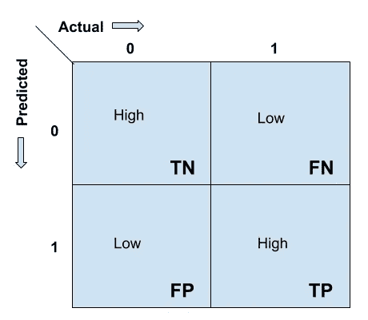
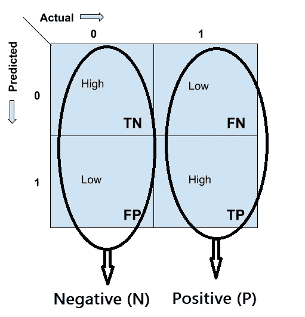
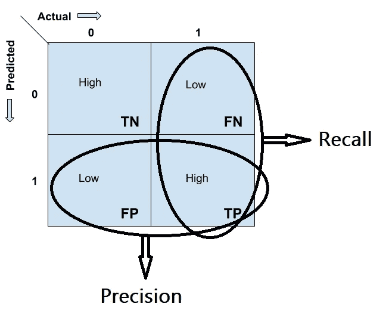
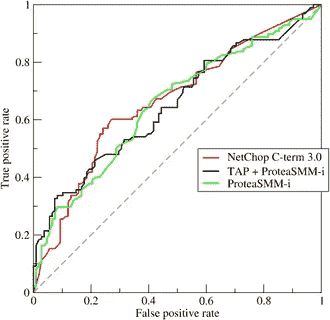
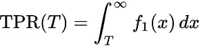
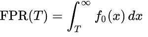
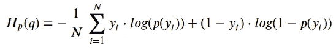
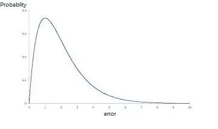

# 如何评价机器学习模型在 Python 中的性能

> 原文：<https://towardsdatascience.com/how-to-evaluate-machine-learning-model-performance-in-python-135b4ae27f7e?source=collection_archive---------22----------------------->

## 机器学习，数据科学

## 一种实用的方法来计算模型的性能，并在 Python 中实现，涵盖了所有的数学推理

雪莉·胡利在 [Unsplash](https://unsplash.com?utm_source=medium&utm_medium=referral) 上的照片

欢迎光临！您是否准备好了在数百万个数据点上训练的酷机器学习模型，现在您想测试它的性能，但不知道从哪里开始，也不知道有什么更好的方法可以做到这一点？

在本文中，我们将讨论测试模型性能所需的一切，无论是**分类**模型还是**回归**模型，在本文中，我们将深入了解机器学习模型的评估过程，这对于机器学习工程师或数据科学家来说确实是非常关键的一步。

所以让我们开始吧！

# 分类算法评估

让我们从理解如何评估一个分类算法开始。分类模型将输出预测为类别标签。假设有一个随机变量' **xᵢ** '，那么 **xᵢ** 的预测值为' **yᵢ** '，标注为:

> **yᵢ∈{一班，二班，三班，…}**

下面是一些非常有用的方法来衡量分类模型的性能。在我们下面的研究中，为了便于理解这个概念，我们将主要处理二元分类，这可以很容易地扩展到多类分类。

## 准确(性)

准确度告诉我们正确分类的数据点相对于总数据点的数量。顾名思义，准确性是指预测值与目标值的接近程度。

> 准确度=正确分类点数/总点数

但是由于假设的简单性，准确性并不总是模型评估的好方法。让我们看看这两个例子，在这两个例子中，精确度不是一个好的衡量标准。

1.  **不平衡数据**:在现实世界的大多数问题中，类数据并不是均匀分布的，我们有一些高频率的类和一些低频率的类。例如，以癌症患者为例，假设 90%的数据是没有患癌症的人，而 10%的人被诊断患有癌症。因此，在这种情况下，即使是未经训练的基于规则的模型也可以预测所有的点为负面，并且可以达到 90%的准确性，这在许多情况下是非常危险的。这个问题可以通过使用本文后面部分讨论的 **ROC-AUC** 来解决。
2.  **概率估计**:与其他测量不同，准确性不理解来自模型的概率值，而是只考虑二进制值。因此，对概率值分别为 97%和 3%的正值和负值进行分类的模型与另一个概率值为 62%和 38%的模型具有相同的精度，但我们知道第一个模型比第二个模型好得多，这里精度无法评估这一点。使用本文后面部分讨论的**日志损失**可以很容易地识别出这一点。

## 混淆矩阵

混淆矩阵是机器学习中许多评价方法的核心基础方法之一。混淆矩阵是分类模型的一个“ **n 维**矩阵，它在 x 轴上标注实际值，在 y 轴上标注预测值。

通常对于二元分类器，混淆矩阵是一个 **2x2 维**矩阵，其中 **0** 为**负**类， **1** 为**正**类。

> 对于一个好的模型，混淆矩阵的主对角线元素应该是高值，非对角线元素应该是低值。

混淆矩阵中的每个单元对于理解模型的性能都起着非常重要的作用。 **TN** 、 **FN** 、 **FP** 、 **TP** 是根据每个单元格在该单元格中的实际值和预测值给每个单元格起的名字。让我们一个一个地理解它们，然后我们会从它们身上发现一些惊人的联系。

图 1:二元分类器的混淆矩阵。

**TN =真阴性**(实际为阴性且被模型正确分类为阴性类别的数据)。

**FN =假阴性**(实际为阳性但被模型错误分类为阴性的数据)。

**FP =假阳性**(实际为阴性但被模型错误分类为阳性的数据)。

**TP =真阳性**(实际为阳性且被模型正确分类为阳性类别的数据)。

## **如何记住它们？**

有一个简单的方法来记住它们，**的第一个字母**回答了问题“**我们是正确的吗？**和**第二个字母**讲述的是**预测值**。

这些符号之间有一些惊人的关系，对我们的评估非常有用。在此之前，让我们看看什么是**实际正**和**实际负**值。

图 2:混淆矩阵中的负值和正值

**阳性(P)** :假阴性值和真阳性值之和就是数据中实际的一组正值。**P = FN+TP**

**Negative (N)** :真负值和假正值之和就是数据中实际的一组正值。 ***N = TN+FP***

现在我们知道了单元符号和正负符号，有 4 个重要的测量值是使用这些符号计算的，它们对于模型性能估计非常有用。它们如下:

1.  **真阳性率(TPR)** :真阳性/总阳性= TP/P
2.  **真阴性率(TNR)** :真阴性/总阴性= TN/N
3.  **假阳性率(FPR)** :假阳性/总阴性= FP/N
4.  **假阴性率**:假阴性/总阳性= FN/P

它们听起来有点令人困惑，但当我们查看困惑矩阵，并形象地找到这些关系时，它们就开始给出某种意义了。

> 对于一个执行良好的车型***【TPR 和 TNR 应该是高值】******【FPR 和 FNR 应该是低值】*** 。

> TPR⬆、TNR⬆、FPR⬇、FNR⬇

## 精确度和召回率

精确度和召回率主要用于**信息检索**的情况。对于二进制分类问题，这两个度量主要集中在**正类**上。对，正课。现在，让我们来看看关于图 3 中的混淆矩阵的精确度和召回率的公式。我们可以清楚地看到，精确度和召回率的全部焦点都在混淆矩阵的**真阳性**单元上，它们与真阴性无关。

图 3:使用混淆矩阵的精确和回忆理解

> **精度**:在所有模型预测为正的点中，有多少是真的正。

> **精度= TP / (TP+FP)**

> **回忆**:在所有实际上积极的点中，有多少是模型预测为积极的。

> 回忆= TPR = TP / P = TP / (TP+FN)

Precision 和 Recall 两个值都在[0，1]的范围内，我们总是希望这两个值尽可能的高**。有时，将两个不同的值结合起来比单独分析它们更好，因此为了将它们结合起来，我们有一个名为 [**F1-score**](https://en.wikipedia.org/wiki/F1_score) 的指标，即 ***“精确度和召回率的调和平均值”。*****

> **f1-得分= 2 *精度*召回/(精度+召回)**

**在 Kaggle.com[的一些比赛中，F1 分数有时被用作模型评估的指标，但用简单的英语理解有点困难，而精确度和召回率则更容易解释。](https://www.kaggle.com/)**

**让我们在 Python 3.x 中实现它。下面是使用混淆矩阵的模型评估的手动实现。**

**下面是上述代码实现的示例输出。**

****

**使用混淆矩阵的评估输出示例**

## **ROC 曲线和 AUC**

**[**接收机工作特性曲线**](https://en.wikipedia.org/wiki/Receiver_operating_characteristic) 或 **ROC** 是 **TPR 对 FPR** 的曲线图，形成一条曲线，代表不同阈值的 TPR 和 FPR 值“ **𝜏** ”。AUC 是曲线下的**面积。它们有时合在一起称为 AUROC(受试者工作特性下的面积)曲线。****

****

**图 4:来源:接收机工作特性曲线[维基百科](https://en.wikipedia.org/wiki/Receiver_operating_characteristic)**

**给定一个阈值参数 **𝜏** ，如果 **X > 𝜏** 该实例被归类为 ***正类*** ，如果 **X < =𝜏** 则归类为 ***负类*** 。如果实例实际上属于*，则 x 遵循概率密度 **f1(x)** ，如果实例属于*负类，则遵循概率密度 **f0(x)** 。因此，真实阳性率由下式给出:****

********

****使用 ROC 的 TPR****

****假阳性率由下式给出:****

********

****FPR 使用 ROC****

****ROC 曲线参数化地绘制了 **TPR(𝜏)对**fpr(𝜏，阈值 **𝜏** 作为曲线上的变化参数，给出了类似于图 4 接收器工作特性曲线所示的形状。****

****AUC 是曲线下的面积。 ***AUC 位于*【0，1】***范围内。***0.5**的值表示模型的性能是**随机的**。在[0.5，1]范围内的 AUC 值表明模型表现良好，而在[0，0.5]范围内的 AUC 值表明模型表现不佳。****

> ****"**AUC 值越高，模型表现越好**。"****

## ****AUC 值低于 0.5 怎么处理？****

****当 AUC 在[0，0.5]范围内时，有一个非常简单的技巧来处理模型性能。**绝招**::*简单切换模型预测的类别标签。*“是的，假设我们得到的 AUC 为 0.32，那么在将类别标签从 0 切换到 1 和从 1 切换到 0 之后，我们得到的 AUC 值为 1–0.32 =**0.68**，这使它成为一个好模型。就这么简单！****

## ****使用对数损失计算概率分数！****

****Log-Loss 用于发现**二元分类**算法的模型性能，该算法可以容易地扩展到多类分类。它考虑由机器学习模型预测的所有概率分数，并使用下面图 5 中的公式计算相对于' **yᵢ** '的真实值和预测值' **p(yᵢ)** '的损失。****

********

****图 5:测井损失计算公式****

****理解这个公式很简单，对于每个 **yᵢ=1** ，值**log(p(yᵢ)】**被加到损失上，而对于每个 **yᵢ=0** 值**log(1-p(yᵢ)】**被加到损失上，然后通过将计算的总和除以 **N** (数据点的数量)来计算平均值。****

> ****简单地说，对数损失是平均负对数(正确分类标签的概率)****

****简而言之，我们可以说，当'**【p(yᵢ】)**'较低时，这意味着模型预测'**'的值更不确定，那么对它的惩罚就更多，对数损失也更多，反之亦然。******

> ******预测概率⬇对数损失⬆******
> 
> ******预测概率⬆对数损失⬇******

******查看下图 6，了解预测概率和测井曲线损失之间的反比关系。******

************

******图 6:与预测概率相关的测井曲线的来源[图像](https://ml-cheatsheet.readthedocs.io/en/latest/loss_functions.html)******

1.  ******因此，我们需要 **Log-Loss 尽可能小**才能说我们的模型表现良好。******
2.  ******对数损耗可以在**【0，INF】**的范围内，如图 6 所示。******

******也就是说，现在让我们看看如何实现日志丢失。下面是 Python3 中的代码实现。******

******但是 **Scikit-learn** 提供了一行输入来计算日志损失，******

******使用 Log-Loss 的一个缺点是有点难以解释，因为我们不能仅仅通过看到 Log-Loss 的一些值来说什么。这是因为对数损耗并不限定输出值的范围，而是从 0 到无穷大。例如，如果我们得到一个 Log-Loss = 12 的值，那么仅仅通过看到这个值，我们不能说什么。******

# ******回归算法评估******

******分类和回归算法的区别在于分类的输出属于一个类，而回归算法的输出属于实数，如 **yᵢ ∈ ℝ** 。******

******设 **yᵢ** 是输入 **xᵢ** 的实值输出，而 **ŷᵢ** (y-hat)是回归算法的预测实值输出。因此，误差 **eᵢ** 计算如下:******

> ********eᵢ=yᵢ**—**ŷᵢ********

******因此，让我们看看用于回归模型性能测量的各种类型的模型评估技术。******

## ******r 或决定系数******

******先来了解一下**平方和** ( **SS** )是一个随机变量' **xᵢ** '的' **yᵢ** '的方差值之和。这里' **ȳ** '(y-bar)是所有' **yᵢ** '的值的**的意思**。******

> ********平方和**ₜₒₜₐₗ**=σ(yᵢ+ȳ)********

> ******简单来说，平方和( **SS- total** )是其真实值相对于其平均值的误差平方和。******

******而且，******

> ******平方和ᵣₑₛ=σ(yᵢ+**ŷ**ᵢ)******

> ******平方和( **SS- residue** )是其真实值相对于其**预测值**的误差平方和。******

******所以，R 被定义为，******

> ******R = 1 - (SSᵣₑₛ / SSₜₒₜₐₗ)******

******让我们考虑几个案例，基于这些案例，当我们看到 R 值时，我们可以获得关于模型性能的一些直觉。******

1.  ******如果误差 e =σ(yᵢ+ŷᵢ)为 **0** 那么，r 为 **1 (** 为最佳值)。******
2.  ******如果 SSᵣₑₛ < SSₜₒₜₐₗ then R² lied between **0** 和 **1** (一般接受)。******
3.  ******如果 SSᵣₑₛ = SSₜₒₜₐₗ，那么 r 就变成了 **0** (性能不好)。******
4.  ******如果 SSᵣₑₛ > SSₜₒₜₐₗ，那么 r 变成负的值(最差性能)。******

******让我们看看 Python3 中 R 的实现******

******[https://gist . github . com/paras 009/b 46 ded 4 f1 ea 24 ab 48508623 f 6024294 b](https://gist.github.com/paras009/b46ded4f1ea24ab48508623f6024294b)******

******Scikit-Learn 为 compute R 提供了一个单行导入。******

******[https://gist . github . com/paras 009/229 ad 9 ba 3a 7595 b 26 ba 8 bfb 7 e 179 c 379](https://gist.github.com/paras009/229ad9ba3a7595b26ba8bfb7e179c379)******

******需要注意的重要一点是，R 在某些情况下表现不佳:******

********有异常值的数据** : 如果数据中有一些异常值，那么 R 不是计算回归模型性能的一个很好的方法，误差值会立即增加，并反过来严重影响 R 值。因此，在这种情况下，我们将使用下一节讨论的**中值绝对偏差**的概念。******

## ******中位数绝对偏差******

******由于异常值对误差“ **eᵢ** ”有很大影响，因此 MAD 通过计算所有误差值的中值并计算它们与每个误差值的绝对偏差来解决这个问题，这有助于计算 MAD 值，从而消除异常值对误差值的影响。******

> ******MAD =中位数(|**eᵢ**—中位数( **eᵢ** )|)******

********中位数和 MAD 对异常值稳健**。中值和 MAD 的较小值表明该模型表现非常好。请记住，我们可以使用均值或标准差，但它们不能处理异常值，而 MAD 对异常值没有显著影响。******

********注**:绘制误差分布图有助于理解异常值以及误差值是如何传播的。分布“**右偏**越多，模型表现越好。这意味着大多数点的**误差较低**，只有极少数点的误差值较高，这些误差值并不显著，可以使用 MAD 进行归一化。******

************

******概率与误差图******

******所以，就这样，我们到了这篇文章的结尾。现在，你可以放心大胆地评估你的模型了！******

************

******来源:[https://media.giphy.com/media/5nkIn9AEfUQ6JtXL43/source.gif](https://media.giphy.com/media/5nkIn9AEfUQ6JtXL43/source.gif)******

## ******参考******

1.  ******[https://en . Wikipedia . org/wiki/Evaluation _ of _ binary _ classifiers](https://en.wikipedia.org/wiki/Evaluation_of_binary_classifiers)******
2.  ******[https://en.wikipedia.org/wiki/Confusion_matrix](https://en.wikipedia.org/wiki/Confusion_matrix)******
3.  ******[https://en . Wikipedia . org/wiki/Receiver _ operating _ character istic](https://en.wikipedia.org/wiki/Receiver_operating_characteristic)******
4.  ******[https://en . Wikipedia . org/wiki/Loss _ functions _ for _ class ification](https://en.wikipedia.org/wiki/Loss_functions_for_classification)******
5.  ******[https://en.wikipedia.org/wiki/Coefficient_of_determination](https://en.wikipedia.org/wiki/Coefficient_of_determination)******
6.  ******[https://en.wikipedia.org/wiki/Median_absolute_deviation](https://en.wikipedia.org/wiki/Median_absolute_deviation)******

## ******更多关于机器学习的文章:******

****** [## k-最近邻解释-第 1 部分

### KNN 算法背后的科学解释！

towardsdatascience.com](/k-nearest-neighbour-explained-part-1-5e5e9192050)  [## Q-Q 图解释

### 探索 Q-Q 图的力量。

medium.com](https://medium.com/@pv009/q-q-plots-explained-5aa8495426c0)  [## “正态分布”的功效

### 理解钟形曲线背后的科学！

medium.com](https://medium.com/@pv009/the-powers-of-normal-distribution-4cbb06e4a955) 

还有更多在 [Paras Varshney](https://medium.com/u/22b31444736c?source=post_page-----135b4ae27f7e--------------------------------) 的。

如果你从这篇文章中学到了新的东西或者喜欢阅读它，那么就分享出来，让其他人也能感受到。欢迎给我留言。

**谢谢！********