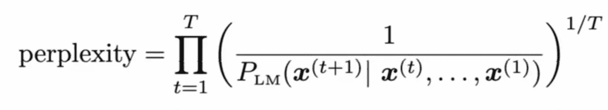
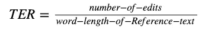

# 如何评价文本生成模型？自然语言处理模型自动评估的度量

> 原文：<https://towardsdatascience.com/how-to-evaluate-text-generation-models-metrics-for-automatic-evaluation-of-nlp-models-e1c251b04ec1?source=collection_archive---------8----------------------->

## [实践教程](https://towardsdatascience.com/tagged/hands-on-tutorials)

由[麦斯威尔·尼尔森](https://unsplash.com/@maxcodes?utm_source=medium&utm_medium=referral)在 [Unsplash](https://unsplash.com?utm_source=medium&utm_medium=referral) 上拍摄的照片

文本生成是一个棘手的领域。学术界和工业界仍在为评估生成模型质量的相关指标而努力。每一个生成任务都是不同的，都有自己的微妙之处和独特之处——对话系统有不同于总结的目标指标，机器翻译也是如此。

我将讨论 NLP 中用于比较生成性或提取性任务的度量，其中要比较两个文本。我将在此讨论的指标可应用于以下任务:

*   短格式或长格式文本生成
*   机器翻译
*   总结
*   聊天机器人和对话系统
*   问题回答
*   释义系统
*   多媒体系统，如语音 2 文本、图像字幕、自动视频配音

首先，让我们来谈谈这篇文章中的一些常用术语。在 NLG，为了检查评估，机器生成的文本通常根据目标文本(真值)进行评估。这个 ***目标文本*** 是期望模型理想生成的文本。 ***生成文本*** 指机器产生的文本(模型的输出)，而 ***目标或参考文本*** 指原始真值文本。其他一些基本术语是 n-gram 和单词建模包，它们是基本的 NLP 概念/术语。如果你还不知道他们，你可以在网上了解更多。我还展示了用 python 计算这些指标的代码片段。

# BLEU:双语评估替角分数

BLEU 和 Rouge 是最流行的评估指标，用于比较 NLG 领域的模型。每一份 NLG 的报纸肯定都会报道标准数据集上的这些指标，永远如此。BLEU 是一个专注于精度的指标，它计算参考文本和生成文本的 n 元语法重叠。这种 n 元语法重叠意味着除了 n 元语法的术语关联之外，评估方案是独立于单词位置的。在 BLEU 中需要注意的一点是——有一个简短的惩罚，即当生成的文本与目标文本相比太小时应用的惩罚。

下面是使用 python 的 ntlk 库计算 BLEU 的代码片段。

# 胭脂:回忆导向的吉斯丁评价替角

如前所述，Rouge 是另一个被广泛报道的指标。报告标准任务的 Rouge 和 BLEU 分数是一种非常常见的做法。它非常类似于 BLEU 的定义，不同之处在于 ***胭脂是回忆聚焦的，而 BLEU 是精确聚焦的*** 。有 3 种类型的胭脂:n-胭脂，最常见的胭脂类型，这意味着 n-gram 重叠。例如(2-胭脂，1-胭脂分别代表 2 克和 1 克)。第二个是 l-rouge，它检查最长的公共子序列，而不是 n-gram 重叠。第三个是以跳克为主的 s-rouge。这些的标准实现可以在大多数 ML 库中找到，n-rouge 是最常用的。下面是 n-rouge 的原始源代码。

# 困惑

困惑是一种常用于评估生成模型有效性的度量，它被用作由数据集上训练的模型产生句子的概率的度量。在信息论中，困惑是指概率分布对样本进行预测或分配概率的能力。困惑值越低，模型越好。困惑是根据句子的长度来标准化的。

这里 T 是句子中的总字数。

对于语言模型，我们最终想要检查测试集上的困惑值，并选择这个度量具有最低值的模型。这意味着—选择分配高概率的概率模型来建模/生成测试集语句。

如果模型是完全哑的(最坏的可能)，困惑= |v|即词汇量的大小。

困惑是一个依赖于模型的分数。大多数创成式模型实现/库都会提供现成的。否则，你基本上需要根据特定的语言模型来计算句子中每个单词的概率，就像上面的公式所示。

# LSA:潜在语义分析

LSA 用于根据两个文本中包含的单词计算两个文本的语义相似度。它使用预先计算的大型语料库中的单词共现计数。它使用单词包(BOW)方法来完成，这与单词位置无关。与其他指标不同，它不会过多地惩罚单词选择的变化，即该指标对“好”和“不错”比较宽容，而 rouge 和 bleu 则不会。

本质上，LSA 是一种使用单词包方法将句子/文档编码成向量的方法。使用这些向量，我们可以计算相似性度量(余弦)来检查生成的文本和目标文本的相似性。关于 LSA 度规的详细解释在[这里](https://moj-analytical-services.github.io/NLP-guidance/LSA.html)给出。

# METEOR:使用显式排序评估翻译的度量

METEOR 是一个不常见的度量标准，用于单词对齐。它计算生成文本和参考文本中单词的一对一映射。传统上，它使用 [WordNet](https://wordnet.princeton.edu/) 或 porter stemmer。最后，它根据这些映射计算 F 分数。Meteor 在 NLG 是一个相对较少使用的指标，尤其是在深度学习模型起飞之后。

这里给出了计算 meteor 的代码，由 metric 的作者用 java 实现。

# TER:翻译编辑率

TER 的工作原理是将生成的文本转换成目标文本。它通过计算将一个字符串转换为另一个字符串所需的操作次数来衡量字符串之间的绝对差异。它紧密基于[编辑距离](https://en.wikipedia.org/wiki/Edit_distance)算法

这就是 NLG 常用指标的列表。为了计算所有提到的分数，下面是代码。

我希望这有助于呈现可能对您有用的可能指标的概述。如果你需要更全面的解释，你可以在网上了解更多。