# 如何评价无监督学习模型

> 原文：<https://towardsdatascience.com/how-to-evaluate-unsupervised-learning-models-3aa85bd98aa2?source=collection_archive---------7----------------------->

## [数字音乐](https://towardsdatascience.com/tagged/music-by-numbers)

## 韩国流行音乐和古典音乐到底有多大的不同？


一个音乐集群。视频:[像素](https://www.pexels.com/video/musical-instruments-856945/)

所以到目前为止，在[这个博客系列](https://towardsdatascience.com/tagged/music-by-numbers)中，我们已经研究了如何通过聚集一组曲目来创建自动的歌曲播放列表，完全基于它们的[音频特征](https://developer.spotify.com/documentation/web-api/reference/tracks/get-audio-features/)。之前，我们制作了一个包含 32 首歌曲的[玩具示例](/generating-spotify-playlists-with-unsupervised-learning-abac60182022)，并展示了[分层凝聚聚类](https://en.wikipedia.org/wiki/Hierarchical_clustering#Agglomerative_clustering_example) (HAC)如何自动创建相似歌曲的子组。我们能够通过我们现有的歌曲知识来验证这一聚类练习的结果(我们的算法确认[motrhead](https://www.youtube.com/watch?v=pWB5JZRGl0U)和[黑色安息日](https://www.youtube.com/watch?v=0qanF-91aJo)在音乐上是相似的——请看图)。

但是如果我们没有这些先验知识呢？如果数据甚至没有被标记(许多现实生活中的聚类情况就是如此)，那会怎么样呢？即使是，如果这些标签最初对我们来说毫无意义呢？有很多我从未听说过的艺术家，如果我们试图将数千首曲目分组，那么手动验证每一组显然是不切实际的。在这些情况下，我们需要某种数学方法来衡量我们的聚类有多“成功”。

为了探索我们可能如何去做这件事，我们再次求助于 Spotify 的 API。假设我们从四个非常不同的播放列表中选取歌曲:

*   [**说唱英国**](https://open.spotify.com/playlist/37i9dQZF1DX6PKX5dyBKeq?si=troGGkf6SLSP5JhYBP3dZQ)
*   [**流畅爵士**](https://open.spotify.com/playlist/37i9dQZF1DXdwTUxmGKrdN?si=hR5UZpPmSdy2l4-JKgNDcw)
*   [**古典要领**](https://open.spotify.com/playlist/37i9dQZF1DWWEJlAGA9gs0?si=LCS9EwdhTCi_Lx4Cyu_QfQ)
*   [**精华 K-Pop**](https://open.spotify.com/playlist/37i9dQZF1DX14fiWYoe7Oh?si=lczQeag8T2SP0NOVpVUImw)

如果我们将这些合并成一个数据集，一个无监督的机器学习算法应该能够将他们的歌曲分成四个集群，这四个集群有点类似于最初的四个播放列表。

在我们开始之前，我们可能确实想要检查我们的假设，即来自这些不同播放列表的歌曲确实是“不同的”。当然，在一张图表上同时显示两个以上的特征是具有挑战性的。然而，如果我们绘制一个所有特征的散点图，按播放列表进行颜色编码，我们可以看到有大量的度量组合来展示每个流派的独特特征。

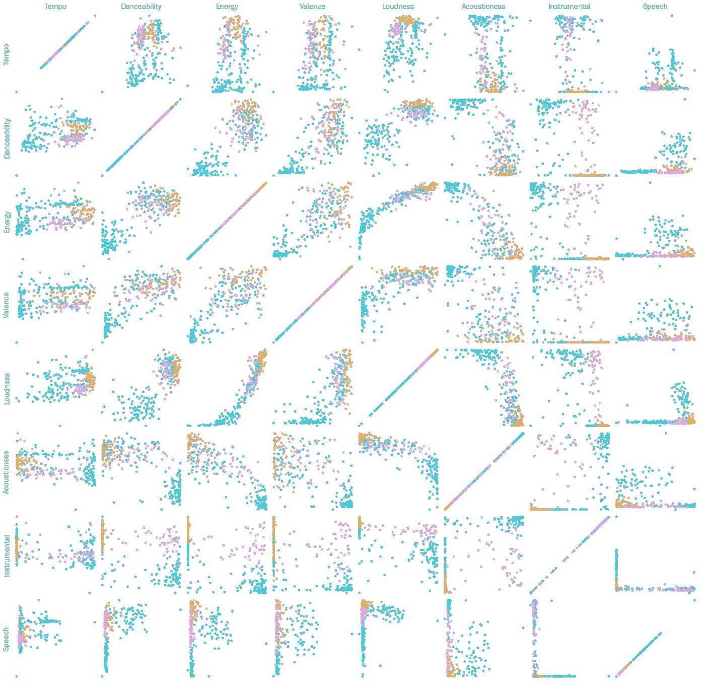

我们在[之前的博客](/generating-spotify-playlists-with-unsupervised-learning-abac60182022)中看到，在 Scikit-Learn 中运行聚类算法非常简单:

```
**#We scale the data to ensure that
#feature units don't impact distances
from** sklearn.preprocessing **import** StandardScaler
sclaer = StandardScaler()
X_scaled = scaler.fit_transform(X)***#This scaled data can then be fed into the HAC algorithm* from** sklearn.cluster **import** AgglomerativeClustering
***#We can tell it how many clusters we're aiming for***
agg_clust = AgglomerativeClustering(n_clusters=4)
assigned_clusters = agg_clust.fit_predict(X_scaled)
```

我们还看到 HAC 有三种不同的“链接标准”——算法通过这种方法将集群连接在一起:

*   **ward** (默认):选择两个聚类进行合并，使所有聚类内的方差增加最小。一般来说，这导致集群的大小相当一致。
*   **完全**(或最大链接):合并两个点之间具有最小 ***最大*** 距离的簇。
*   **平均**:合并所有点之间 ***平均*** 距离最小的两个聚类。

让我们看看这三个链接标准是如何处理流派播放列表数据集的。我们用一个矩阵表示我们的结果，显示每个播放列表中的歌曲在每个集群中的百分比(集群被随意命名为“A”、“B”、“C”和“D”)。

当然，如果聚类是完美的，我们希望矩阵的每一行和每一列都包含一个 100%的条目(当然，它不必在对角线上，因为聚类名称的分配是任意的)。

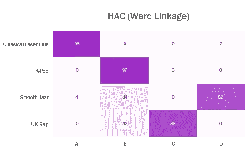

默认的“ward”链接试图最小化集群内的差异，在所有四种类型中都做得很好，尽管有一些泄漏到集群 b 中。

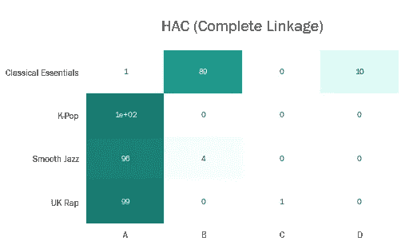

“完全”联动显然效果不佳。它已将大量数据集放入聚类 a。聚类 C 由一首说唱歌曲组成。

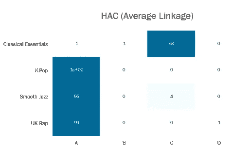

“平均”关联与“完全”关联有相似的问题。许多数据点被放入一个集群中，两个集群由一首歌曲组成。

值得一提的是，还有另一种常见的聚类类型，K-Means，它的工作方式略有不同。HAC 通过将聚类合并在一起来迭代地减少聚类的数量，而 K-Means 聚类保持固定数量的聚类(名义上的 *k* )，但是迭代地改变每个聚类的成员。


每个聚类的“中心”由带有黑色“+”号的“大”标记表示。所有的点都被分配到离其中心最近的聚类中。在这个分配步骤之后，重新计算聚类中心以包括新成员，并且发生另一个重新分配步骤。如果在重新分配步骤中没有点改变聚类，则算法结束(动画:[维基百科](https://en.wikipedia.org/wiki/K-means_clustering))。

K-Means 在 Python 中实现起来很简单:

```
**#We scale the data to ensure that
#feature units don't impact distances
from** sklearn.preprocessing **import** StandardScaler
sclaer = StandardScaler()
X_scaled = scaler.fit_transform(X)***#This scaled data can then be fed into the K-Means alorithm* from** sklearn.cluster **import** KMeans
***#We can tell it how many clusters we're aiming for***
km_clust = KMeans(n_clusters=4)
assigned_clusters = km_clust.fit_predict(X_scaled)
```

如果我们对播放列表数据集应用 K-Means 聚类，我们会得到以下结果:

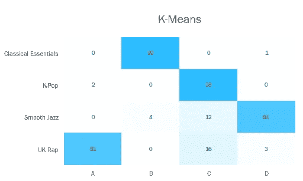

与使用“ward”链接的 HAC 算法一样，K-Means 聚类在大多数算法中都做得很好，一些爵士乐和说唱歌曲被“误认为”K-Pop。

虽然这些矩阵有利于“目测”我们的结果，但它们远非数学上的严格。让我们考虑一些指标，以实际帮助我们为集群质量分配一个数字。

# 调整后的兰德指数

[调整后的 Rand 指数](https://en.wikipedia.org/wiki/Rand_index#Adjusted_Rand_index)是经典 Rand 指数的变体，并试图表达多少比例的聚类分配是“正确的”。它通过考虑所有样本对，计算两个不同聚类之间的相似性度量，并针对真实聚类对分配到相同或不同预测聚类中的样本对进行计数，针对随机机会进行调整。

这一点(以及我们将考虑的其他指标)可以使用 Scikit-Learn 进行评估。

```
**from** sklearn **import** metricsmetrics.adjusted_rand_score(predicted_labels, actual)
```

调整后的 Rand 指数介于-1 和 1 之间。越接近 1 越好，越接近-1 越不好。

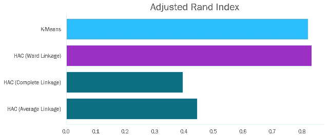

我们看到 K-Means 和 Ward Linkage 得分很高。根据我们之前观察到的矩阵，我们预料到了这一点。

# 福克斯·马洛得分

Fowlkes Mallow 评分也是类似的，因为它告诉你聚类分配的“正确”程度。特别地，它计算精确度和召回率之间的几何平均值。它介于 0 和 1 之间，值越高越好。

```
metrics.fowlkes_mallows_score(predicted_labels, actual)
```

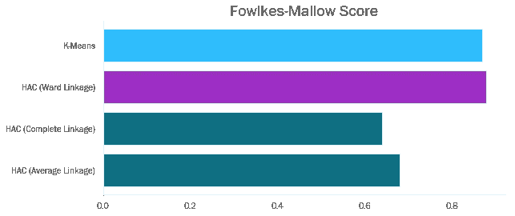

我们的排名类似于调整后的兰德指数——这是我们所期望的，因为它们是试图回答同一个问题的两种方法。

值得注意的是，为了计算这些指标，我们需要知道原始标签。考虑到处理未标记数据是无监督学习的主要用例之一，我们需要一些其他度量来评估聚类结果，而不需要参考“真实”标签。

假设我们从三个独立的聚类分析中得到以下结果。

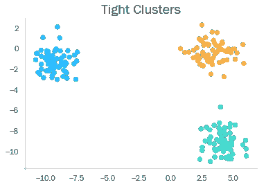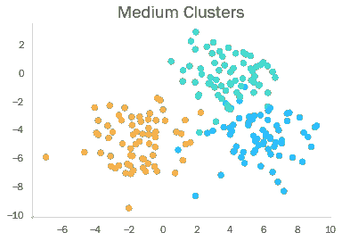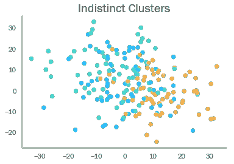

显然，我们能使集群越“紧密”越好。有什么方法可以把这个“紧密”的概念归结为一个数字吗？

# 剪影分数

[剪影分数](https://en.wikipedia.org/wiki/Silhouette_(clustering))试图描述一个数据点与其聚类中的其他数据点的相似程度，相对于其聚类中的数据点*而非*(这是对所有数据点的汇总，以获得整体聚类的分数)。换句话说，它考虑的是星团在空间中的“独特性”——事实上，人们可以使用任何“距离”来计算分数。

它介于-1 和 1 之间。更接近-1 表示聚类不正确，而更接近+1 表示每个聚类都非常密集。

```
metrics.silhouette_score(scaled_feature_data, cluster_labels)
```

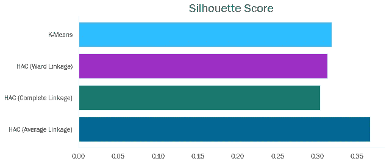

我们看到没有一个集群有超高的轮廓分数。有趣的是，我们看到平均连锁群得分最高。但是，请记住，这种算法产生了两个集群，每个集群只包含一个数据点，这在现实世界中不太可能是一个理想的结果(这是一个教训，您通常不能依赖单个指标来决定算法的质量！)

# 卡林斯基哈拉巴兹指数

卡林斯基哈拉巴兹指数是一个数据点相对于其他聚类中的点的方差与相对于其聚类内的点*的方差的比率。因为我们希望第一部分高，第二部分低，所以高 CH 指数是理想的。与我们看到的其他指标不同，这个分数是没有界限的。*

```
metrics.calinski_harabasz_score(scaled_feature_data, cluster_labels)
```

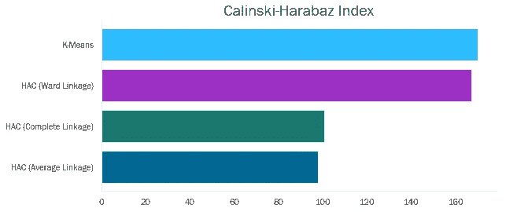

这里我们看到我们的 K-Means 和 Ward 连锁算法得分很高。完整和平均连锁算法因具有一个或两个较大的聚类而受到惩罚，这将具有较高水平的内部方差。

> 这是我的“[数字音乐](https://towardsdatascience.com/tagged/music-by-numbers)”专栏中的最新博客，它使用数据讲述关于音乐的故事。我很乐意听到对上述分析的任何评论——欢迎在下面留言，或通过 [LinkedIn](https://www.linkedin.com/in/callum-ballard/) 联系我！