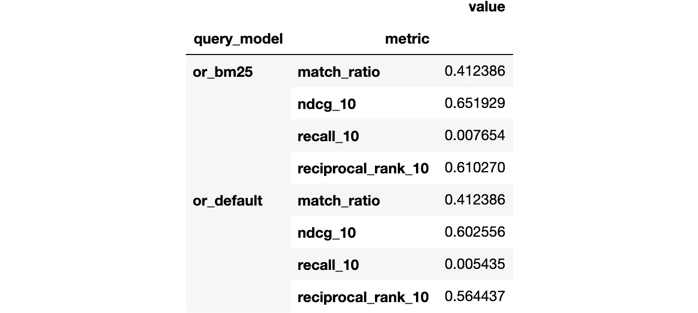
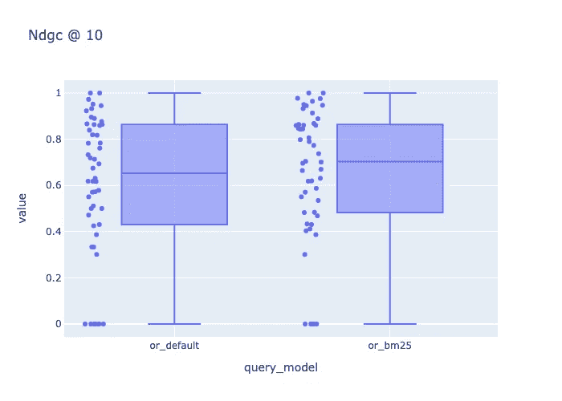

# 如何评价来自 python 的 Vespa 排名函数

> 原文：<https://towardsdatascience.com/how-to-evaluate-vespa-ranking-functions-from-python-7749650f6e1a?source=collection_archive---------37----------------------->

## 使用 [pyvespa](https://pyvespa.readthedocs.io/en/latest/index.html) 评估 [cord19 搜索应用](https://cord19.vespa.ai/)当前生产中的排名功能。

*这是一系列博客文章中的第二篇，将向您展示如何改进文本搜索应用程序，从下载数据到微调 BERT 模型。*

前一篇文章展示了如何下载和解析 TREC-科维德数据。这一次将重点评估在 [cord19 搜索应用](https://cord19.vespa.ai/)中可用的两个查询模型。这些模型将作为未来改进的基准。

您也可以从 [Google Colab](https://colab.research.google.com/github/vespa-engine/pyvespa/blob/master/docs/sphinx/source/use_cases/cord19/cord19_connect_evaluate.ipynb) 运行这里包含的步骤。


照片由[新闻社跟随](https://unsplash.com/@olloweb?utm_source=unsplash&utm_medium=referral&utm_content=creditCopyText)在 [Unsplash](https://unsplash.com/s/photos/magnifying-glass?utm_source=unsplash&utm_medium=referral&utm_content=creditCopyText) 拍摄

## 下载处理过的数据

我们可以从下载我们在之前[已经处理过的数据开始。](https://pyvespa.readthedocs.io/en/latest/use_cases/cord19/cord19_download_parse_trec_covid.html)

```
import requests, json
from pandas import read_csv

topics = json.loads(requests.get(
  "https://thigm85.github.io/data/cord19/topics.json").text
)
relevance_data = read_csv(
  "https://thigm85.github.io/data/cord19/relevance_data.csv"
)
```

`topics`包含 50 个可用主题的数据，包括`query`、`question`和`narrative`。

```
topics["1"]{'query': 'coronavirus origin',
 'question': 'what is the origin of COVID-19',
 'narrative': "seeking range of information about the SARS-CoV-2 virus's origin, including its evolution, animal source, and first transmission into humans"}
```

`relevance_data`包含 50 个主题中每个主题的相关性判断。

```
relevance_data.head(5)
```


## 安装 pyvespa

我们将使用 [pyvespa](https://pyvespa.readthedocs.io/en/latest/index.html) 来评估 python 中的排名函数。

```
!pip install pyvespa
```

`pyvespa`给 Vespa 提供一个 python API。它允许我们创建、修改、部署正在运行的 Vespa 实例，并与之进行交互。该库的主要目标是允许更快的原型开发，并促进 Vespa 应用程序的机器学习实验。

## 将带标签的数据格式化为预期的 pyvespa 格式

`pyvespa`期望带标签的数据遵循如下所示的格式。这是一个字典列表，其中每个字典代表一个包含`query_id`、`query`和一个`relevant_docs`列表的查询。每个相关文件包含一个必需的`id`键和一个可选的`score`键。

```
labeled_data = [
    {
        'query_id': 1,
        'query': 'coronavirus origin',
        'relevant_docs': [{'id': '005b2j4b', 'score': 2}, {'id': '00fmeepz', 'score': 1}]
    },
    {
        'query_id': 2,
        'query': 'coronavirus response to weather changes',
        'relevant_docs': [{'id': '01goni72', 'score': 2}, {'id': '03h85lvy', 'score': 2}]
    }
]
```

我们可以从之前下载的`topics`和`relevance_data`中创建`labeled_data`。我们将只在最终列表中包含相关性分数为> 0 的文档。

```
labeled_data = [
    {
        "query_id": int(topic_id), 
        "query": topics[topic_id]["query"], 
        "relevant_docs": [
            {
                "id": row["cord_uid"], 
                "score": row["relevancy"]
            } for idx, row in relevance_data[relevance_data.topic_id == int(topic_id)].iterrows() if row["relevancy"] > 0
        ]
    } for topic_id in topics.keys()]
```

## 定义要评估的查询模型

我们将在这里定义两个要评估的查询模型。两者都将匹配与查询至少共享一个术语的所有文档。这通过设置`match_phase = OR()`来定义。

查询模型之间的差异发生在排序阶段。`or_default`模型将根据[native ank](https://docs.vespa.ai/documentation/nativerank.html)对文档进行排序，而`or_bm25`模型将根据 [BM25](https://docs.vespa.ai/documentation/reference/bm25.html) 对文档进行排序。关于这两种排名的讨论超出了本教程的范围。知道他们按照两种不同的公式对文档进行排序就够了。

这些排名资料是由 cord19 应用程序背后的团队定义的，可以在这里找到。

```
from vespa.query import Query, RankProfile, OR

query_models = {
    "or_default": Query(
        match_phase = OR(),
        rank_profile = RankProfile(name="default")
    ),
    "or_bm25": Query(
        match_phase = OR(),
        rank_profile = RankProfile(name="bm25t5")
    )
}
```

## 定义评估中使用的指标

我们希望计算以下指标:

*   查询匹配的文档的百分比
*   回忆@ 10
*   倒数排名@ 10
*   NDCG @ 10

```
from vespa.evaluation import MatchRatio, Recall, ReciprocalRank, NormalizedDiscountedCumulativeGain

eval_metrics = [
    MatchRatio(), 
    Recall(at=10), 
    ReciprocalRank(at=10), 
    NormalizedDiscountedCumulativeGain(at=10)
]
```

## 评价

连接到正在运行的 Vespa 实例:

```
from vespa.application import Vespa

app = Vespa(url = "https://api.cord19.vespa.ai")
```

为每个查询模型计算上面定义的指标，并将结果存储在一个字典中。

```
evaluations = {}
for query_model in query_models:
    evaluations[query_model] = app.evaluate(
        labeled_data = labeled_data,
        eval_metrics = eval_metrics,
        query_model = query_models[query_model],
        id_field = "cord_uid",
        hits = 10
    )
```

## 分析结果

让我们首先将数据组合成一个 DataFrame，其格式便于在查询模型之间进行比较。

```
import pandas as pd

metric_values = []
for query_model in query_models:
    for metric in eval_metrics:
        metric_values.append(
            pd.DataFrame(
                data={
                    "query_model": query_model, 
                    "metric": metric.name, 
                    "value": evaluations[query_model][metric.name + "_value"].to_list()
                }
            )
        )
metric_values = pd.concat(metric_values, ignore_index=True)
metric_values.head()
```


我们可以在下面看到，基于 BM25 的查询模型在这里考虑的所有指标中都是优越的。

```
metric_values.groupby(['query_model', 'metric']).mean()
```



我们还可以可视化指标在查询中的分布，以便更好地了解结果。

```
import plotly.express as px

fig = px.box(
    metric_values[metric_values.metric == "ndcg_10"], 
    x="query_model", 
    y="value", 
    title="Ndgc @ 10",
    points="all"
)
fig.show()
```

