# 如何用 Python 代码评价你的机器学习模型！

> 原文：<https://towardsdatascience.com/how-to-evaluate-your-machine-learning-models-with-python-code-5f8d2d8d945b?source=collection_archive---------3----------------------->

## 使用这些方法来确保您已经创建了一个好的模型


你终于建立了你的机器学习模型来预测比特币的未来价格，这样你就可以最终成为一名亿万富翁。但是你怎么知道你创建的模型是好的呢？

在这篇文章中，我将谈论几种方法来评估你的机器学习模型**，并提供代码！**本文分为两部分:

a)评估回归模型

b)评估分类模型

*如果你不知道回归和分类模型的区别，在这里查看*[](/all-machine-learning-models-explained-in-6-minutes-9fe30ff6776a)**。**

*更具体地说，我将涵盖以下指标:*

1.  *r 平方*
2.  *调整后的 R 平方*
3.  *绝对平均误差*
4.  *均方误差*
5.  *混淆矩阵和相关指标*
6.  *F1 分数*
7.  *AUC-ROC 曲线*

# *a)评估回归模型*

## *1.r 平方*

*r 平方是一种度量，它告诉你因变量的方差在多大程度上是由自变量的方差来解释的。更简单地说，当系数估计趋势时，R 平方表示最佳拟合线周围的散布。*

*例如，如果 R 是 0.80，那么 80%的变化可以用模型的输入来解释。*

*如果 R 为 1.0 或 100%，这意味着因变量的所有变动都可以完全由自变量的变动来解释。*

*举个直观的例子，尽管有相同的最佳拟合线，右边的 R 比左边的高很多。*

*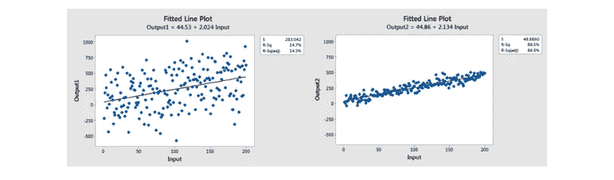*

*低 R 模型与高 R 模型的比较*

*R 的公式如下:*

*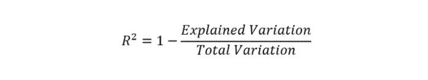*

*解释的变差等于残差平方和，而总变差等于残差平方和。*

*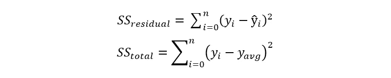*

*现在您已经理解了 R 是什么，代码非常简单！*

```
*from sklearn.metrics import r2_score
sklearn.metrics.**r2_score**(*y_true*, *y_pred)**
```

## *2.调整后的 R 平方*

*添加到模型**中的每一个额外的独立变量总是**增加 R 值——因此，一个有几个独立变量的模型可能看起来更适合，即使它不是。这就是调整后的 R 的用武之地。调整后的 R 补偿每个额外的独立变量，并且仅在每个给定变量将模型改进到超出概率可能的程度时才增加。*

*使用 Python 有几种方法可以找到调整后的 R:*

***选项 1:手动计算***

```
*# n = number of sample size
# p = number of independent variablesAdj_r2 = 1-(1-R2)*(n-1)/(n-p-1)*
```

***选项 2: statsmodel.api***

```
*import statsmodels.api as sm
from statsmodels.sandbox.regression.predstd import wls_prediction_stdmodel1=sm.OLS(y_train,x_train)
result=model1.fit()
print(result.summary())*
```

## *3.平均绝对误差*

*绝对误差是预测值和实际值之间的差值。因此，平均绝对误差是绝对误差的平均值。*

*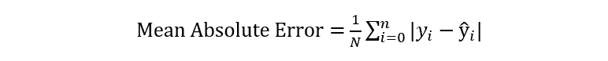*

*通过从 sklearn.metrics 导入 mean_absolute_error，您可以轻松地计算模型的 MAE。*

```
*from sklearn.metrics import mean_absolute_error
mean_absolute_error(y_true, y_pred)*
```

## *4.均方误差*

*均方差或 MSE 类似于 MAE，只是您取预测值和实际值之间的**平方差**的平均值。*

*因为差值是平方的，所以较大的误差被赋予更高的权重，所以当您想要最小化较大的误差时，这应该在 MAE 上使用。下面是 MSE 的等式和代码。*

*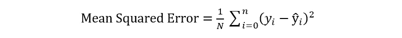*

```
*from sklearn.metrics import mean_squared_error
mean_squared_error(y_true, y_pred)*
```

# *b)评估分类模型*

## *5.混淆矩阵和相关指标*

*混淆矩阵，也称为误差矩阵，是用于评估分类模型的性能度量。下面是一个两类混淆矩阵的例子。*

*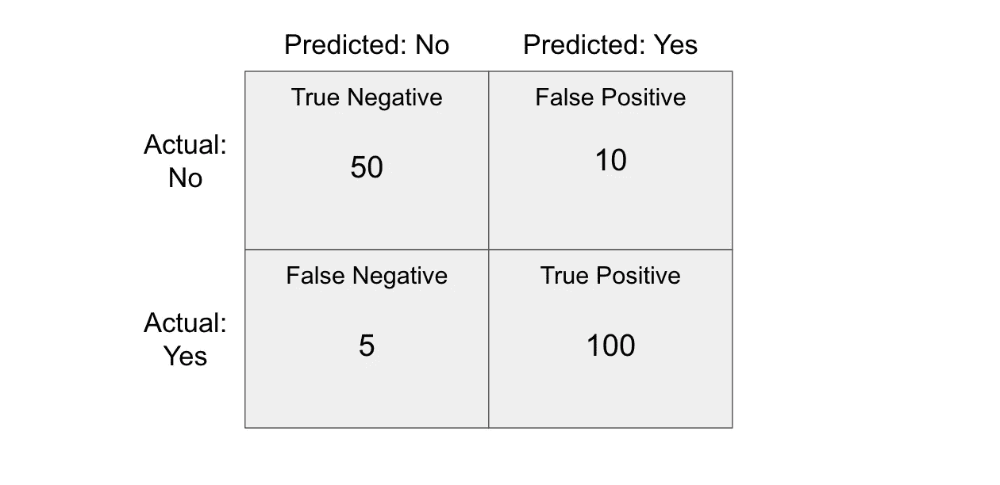*

*在混淆矩阵中，您需要了解一些术语，这些术语可用于计算各种指标:*

*   ***真阳性**:模型正确预测阳性类别的结果。*
*   ***真阴性**:模型正确预测阴性类别的结果。*
*   ***假阳性(1 型错误)**:模型错误预测阳性类别的结果。*
*   ***假阴性(2 型错误)**:模型错误预测阴性类别的结果。*

*现在您已经了解了这些术语，下面是一些您可以计算的指标:*

*   ***准确性:**等于模型预测正确的比例。*

*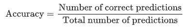*

*   ***回忆:**尝试回答“正确识别实际阳性的比例是多少？”*

*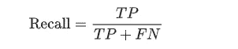*

*   ***Precision:** 试图回答“多大比例的肯定识别实际上是正确的？”*

*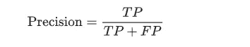*

*为了真正击中要害，下面的图表是记住精确和回忆之间的区别的一个很好的方法(它确实帮助了我)！*

*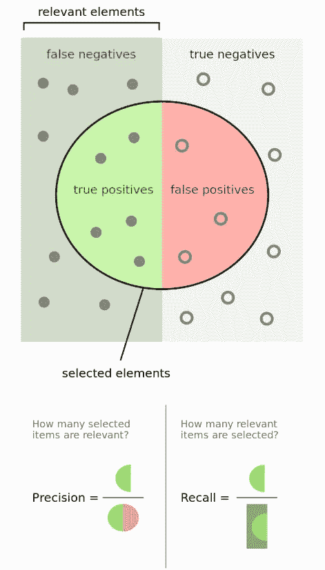*

*摘自维基百科*

*混淆矩阵和相关指标的代码如下:*

```
*# Confusion Matrix
from sklearn.metrics import **confusion_matrix**
confusion_matrix(y_true, y_pred)# Accuracy
from sklearn.metrics import **accuracy_score**
accuracy_score(y_true, y_pred)# Recall
from sklearn.metrics import **recall_score**
recall_score(y_true, y_pred, average=None)# Precision
from sklearn.metrics import **precision_score**
precision_score(y_true, y_pred, average=None)*
```

## *6.F1 分数*

*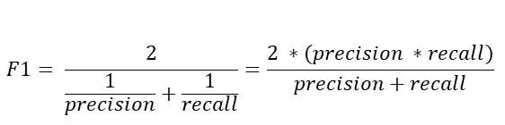*

*F1 分数公式*

*F1 分数是对测试准确性的一种衡量——它是精确度和召回率的调和平均值。它的最高分是 1(完美的精确度和召回率)，最低分是 0。总的来说，这是对你的模型的精确性和健壮性的一个度量。*

*在 Python 中有三种方法可以计算 F1 分数:*

```
***# Method 1: sklearn**
from sklearn.metrics import f1_score
f1_score(y_true, y_pred, average=None)**# Method 2: Manual Calculation**
F1 = 2 * (precision * recall) / (precision + recall)**# Method 3: BONUS - classification report**
from sklearn.metrics import classification_report
print(classification_report(y_true, y_pred, target_names=target_names))*
```

## *7.AUC-ROC 曲线*

*AUC-ROC 曲线是对分类问题的一种性能度量，它告诉我们一个模型在多大程度上能够区分不同的类别。更高的 AUC 意味着模型更准确。*

*如果你想了解更多，萨朗在这里做了很好的解释[](/understanding-auc-roc-curve-68b2303cc9c5)**。***

**要计算 AUC-ROC 得分，您可以复制以下代码:**

```
**import numpy as np
**from sklearn.metrics import roc_auc_score**y_true = np.array([0, 0, 1, 1])
y_scores = np.array([0.1, 0.4, 0.35, 0.8])
**roc_auc_score(y_true, y_scores)**
0.75**
```

**就是这样！现在你知道如何评估你的机器学习模型，以确定它们是否真的有用。接下来，我们将讨论改进机器学习模型的各种方法。**

> **更多类似的文章，请查看[https://blog.datatron.com/](https://blog.datatron.com/)**

# **感谢阅读！**

**如果你喜欢我的工作，想支持我…**

1.  **支持我的最好方式就是在**媒体** [这里](https://medium.com/@terenceshin)关注我。**
2.  **在 **Twitter** [这里](https://twitter.com/terence_shin)成为首批关注我的人之一。我会在这里发布很多更新和有趣的东西！**
3.  **此外，成为第一批订阅我的新 **YouTube 频道** [这里](https://www.youtube.com/channel/UCmy1ox7bo7zsLlDo8pOEEhA?view_as=subscriber)！**
4.  **在 **LinkedIn** [这里](https://www.linkedin.com/in/terenceshin/)关注我。**
5.  **在我的**邮箱列表**上报名[这里](https://forms.gle/UGdTom9G6aFGHzPD9)。**
6.  **查看我的网站，[**terenceshin.com**](https://terenceshin.com/)。**