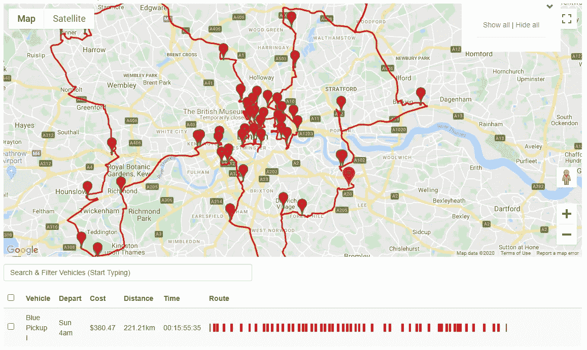
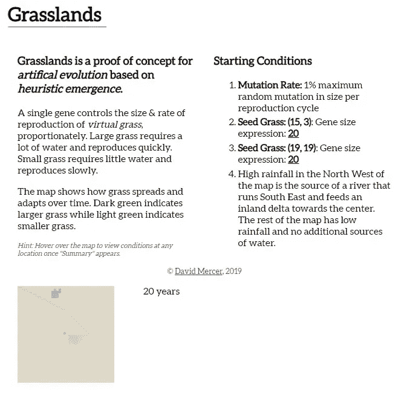
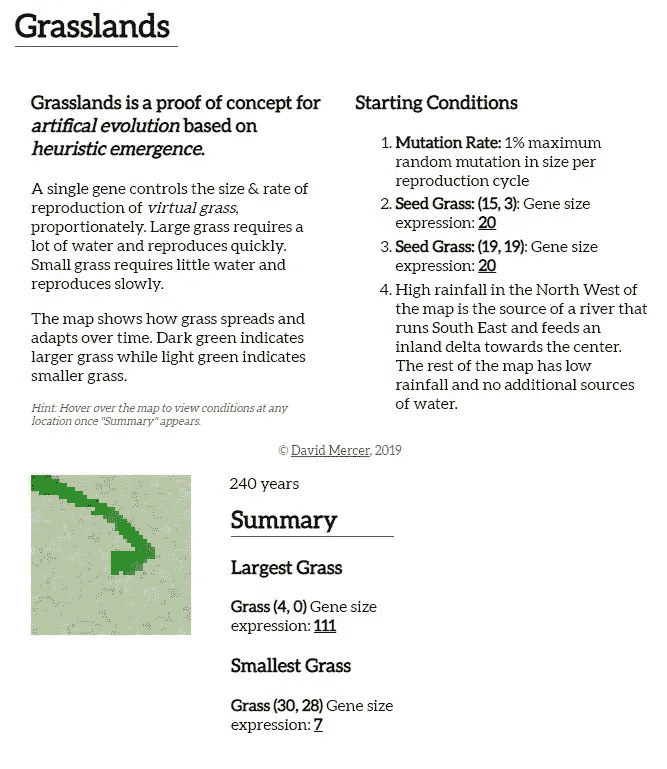

# 如何进化人工智能生命:初学者指南

> 原文：<https://towardsdatascience.com/how-to-evolve-artificial-intelligent-life-a-beginners-guide-2fdd1336222c?source=collection_archive---------60----------------------->

## 为人工智能爱好者提供介绍、进度更新和概念验证

智能人工生命是可以进化的。图片由[com break](https://pixabay.com/users/comfreak-51581/)在 [Pixabay](https://pixabay.com) 拍摄。

*“进化中的人工智能生命”*听起来可能像是个人的夸大其词——甚至可能是科幻小说。我认为你的怀疑更多的是关于我们如何习惯于思考生活，而不是这个主张本身的价值。

普遍的共识会让你相信宇宙中的生命极其稀少，或者说极其难以创造。一个简单的思想实验，用来更好地理解[费米悖论](https://medium.com/predict/why-fermis-paradox-leads-to-one-terrifying-conclusion-fa75a81f22da)，可以揭示反对‘*稀有生命*假说的天文几率。

也就是说，在 0 到 100 摄氏度的狭窄温度范围内，形成生命的化学物质肯定不是唯一基于碳和水的。相反，它们可能出现在温度、辐射和压力光谱上下的任何地方，跨越几乎无限的物质范围(*即甲烷在低温下是液体，铁在高温下是液体*)。

> 在 0 到 100 摄氏度的狭窄温度范围内，形成生命的化学物质肯定不是唯一基于碳和水的。

这些化学物质需要的唯一共性是存储和传输数据的能力，使辐射(*光*)成为生命的潜在基质，甚至可能是重力。

> 也许生命唯一的基本先决条件是储存和传输数据的能力。

电脑有我们需要的一切。但是我跑题了…

我说的不是目前形态的 AI ( *人工智能*)。神经网络是对我们所知的大脑工作方式的模仿。它们是智能设计的。

你不*设计*人工智能生命。这不是一种自然的(*或优雅的*)方式。相反，我要提供适合智慧生命进化的初始条件。大自然也为我们做了同样的事情。

> 你不要*设计*人工智能生命。这不是一种自然的(*或优雅的*)方式。

但是从哪里开始呢？

有几个重要的概念支撑着我的方法，所以让我们从这里开始。

# 试探法简介

试探法是解决极其复杂问题的自然方法。我不是说对我们来说是自然的，我是说自然，就像自然——宇宙一样。

> 启发式是一种比较过程，不能保证产生完美的结果。

我首先开始使用启发式算法来解决一个著名类型的 [*NP-Hard*](https://en.wikipedia.org/wiki/NP-hardness) 数学问题，即所谓的*旅行推销员问题*。本质上，你需要找出最有效的方法去访问指定数量的地点。听起来很简单，对吧？

困难在于所涉及的排列数量之多。根据此[路线优化概述](https://optergon.com/blog/route-optimization-explained):

> 一个只有一辆车和 50 个停靠站的简单路线优化问题的排列比太阳中的氢原子多 3000 万倍(10⁵⁷).

使用 bang ( *)很容易确认这一点！科学计算器上的符号。排列的数量可以计算如下:*

*50 x 49 x 48 x 47 x … x 2 x 1 = 50！= 3 x 10⁶⁴*

世界上最快的超级计算机需要数万亿年来检查每一种可能性，这使得这个简单的问题(*每天都要面对快递公司和快递员*)在没有启发的情况下变得难以处理。

相比之下，使用试探法的系统可以在几秒钟内为 50 个地点的游览提供以下最佳路线:

由 [Optergon](https://optergon.com) 提供的具有 50 个停靠点的单个车辆的最佳路线。

启发式算法经常在自然界中找到灵感。从蚁群收集食物到我们 DNA 的突变，启发式是生活中不可或缺的一部分。没有启发法，就不会有进化。

奇怪的是，但重要的是，在我们继续时要记住，自然发生的启发法可以*出现*全新的启发法。浮现这个词也很重要。我将很快更详细地介绍它。

> 自然发生的试探法可以产生全新的试探法。

我会解释的。

我们的大脑一直在使用启发式方法。没有它们我们抓不到球。

我们不是计算牛顿定律来预测球的飞行路径，而是将当前情况(*即球朝我们飞来*)与存储的记忆库进行比较，并基于此估计球将到达的位置和时间。我们练习得越多，我们用来做决定的记忆和经验就越多，我们就会变得越好。由于试探法不能保证完美的结果，即使是我们中最优秀的人也会偶尔失手。

在生命最初进化的时候,“T20”接球试探法并不存在。当生命首次爬上陆地时，它并不存在。一段时间后，它作为遗传启发式进化过程的结果出现了。

换句话说，一个启发式过程(*进化*)出现了另一个(*接球*)。

这很重要！

# 紧急情况介绍

涌现是一种美丽优雅的现象，似乎毫不费力地违反了热力学定律。宇宙中真正的宝石之一。

> 涌现是一种美丽优雅的现象，似乎毫不费力地违反了热力学定律。

当一个系统表现出任何组成部分最初都没有的特性时，我们就观察到了涌现。

有很多肉眼可见的宏伟的例子。向窗外看。在太阳系形成之初，没有地球。没有月亮。没有太阳。随着时间的推移，所有这些东西*都是在重力作用下由尘埃和气体形成的。*

即使一旦太阳的核火焰点燃，我们的星球清扫干净它的轨道，这里也没有生命。没有花。没有树。没有鸮鹦鹉(*可悲的是，我们正在杀害许多大自然中已经出现的美好事物，而* [*鸮鹦鹉很可能很快就会成为其中之一*](https://www.doc.govt.nz/our-work/kakapo-recovery/) )。所有这些生物都是在适应生存的基因启发过程(*即突变*)中出现的。

简言之，

> 简单的启发式系统可以产生复杂的生命和智能。

这很重要！

# “启发式涌现”是进化智能的好方法

*启发式涌现，*我用来描述我进化人工智能的方法的术语*，*是你从未听说过的最强大的自然现象。它负责宇宙中的所有生命。它对鸮鹦鹉负责。它对我们的智力负责。

> 进化是启发式涌现的一个具体例子。

使用启发式涌现来进化人工智能的好处在于，它不需要设计师或指导手。只需设置好*虚拟生物* ( *沃斯*)进化所需的初始条件。按播放。

迟早，就像我们的智慧来自自然选择一样，他们会开始展现出像常识、解决问题、直觉和创造力这样的特质。它们不会由人类来设计，也不会使用*机器学习* ( *ML* )来训练。它们是它们自己的东西。独立，有自知之明。

和我们一样。

# 概念证明:使用启发式涌现的人工进化

最近，我有时间采取一些具体的步骤来建立一个启发式的紧急系统。我把它叫做*草原*。

grasses 是一个虚拟环境，它支持单一类型的 VO(本例中为*，grass* )，由编码大小的单一基因组成。我试图让这个系统的规则尽可能地接近我们本质上认为的自然草原环境，以便让这个演示更具关联性。

*   在环境的某些部分，水和降雨充足，而在其他部分，水很少。
*   草要生存就必须有足够的水。
*   草可以生长，达到性成熟，在合适的条件下繁殖(*有小几率突变*)，最终死亡。
*   大草比小草需要更多的水才能生存，但如果条件合适，它们可以更快地繁殖。

这就是全部了。

该模拟在没有任何干扰的情况下运行一段时间，并每隔几年显示环境的快照。

下面的截图来自我的电脑，显示了使用的初始条件(*显然它们是可配置的*)以及 20 年后的环境。

草原启发式涌现环境初始条件。

从截图底部角落的沙色地图上，你或许可以看出一条河流从西北流向中心的模糊轮廓，然后流入内陆三角洲*比如博茨瓦纳的奥卡万戈*。西北地区较高的降雨量为河流和三角洲系统提供了水源(*平均降雨量未在地图上标出*)。

最初，有两个小草群落占据了主导地位——一个在地图的顶部中心，另一个在中心，靠近三角洲。根据起始条件，两个初始草菌落都具有基因表达大小 20。

*绝大多数的地图没有足够的水来支持基因大小表达 20 的草。简而言之，为了在地图上更干燥的地区定居，种子殖民地将不得不进化。*

经过 240 年的模拟，地图看起来是这样的(*结果每次都不同，因为系统是不确定的，没有办法准确预测结果——除了一般趋势*)。

草原启发式涌现模拟显示适应 VOs。

深绿色的区域表示大而茂盛的草已经在西北、沿河和内陆三角洲的潮湿区域定居。最大的草已经进化到 111 的基因大小表达。比种子群体大得多，繁殖速度也快得多。

最小的草已经进化到只有 7 的基因大小表达，这使它非常适合干旱地区。请注意，较小的草，在地图上被描绘为浅绿色的瓦片，已经占据了整个可用区域，尽管这对于种子草来说最初是不可能的。

这里突出的一点是，一般来说，这个系统是*启发式涌现*的*概念证明*，特别是*人工进化*。

> 一般来说，草原是启发性涌现的概念证明，尤其是人工进化。

没有任何代码，没有任何指令，没有任何程序，没有任何功能，或任何其他东西，来指导草适应更干燥的环境区域。它进化是因为随着时间的推移，其 DNA 中的随机突变导致了允许它在更干燥的环境中生存和繁殖的特征——将这些特征传递给后代。

和我们一样。

# 向进化革命前进

机器拥有许多方面的智能。它们是很好的计算器。他们有记忆。他们可以交流。人工智能可以学习特定的智能行为，例如识别人脸或物体。

他们做很多事情都比我们好。然而，我们并不认为他们比我们聪明。为什么？计算机目前缺乏启发性，比如常识、同理心和创造力。

> 计算机目前缺乏启发性，如常识、同理心和创造力。

然而试探法恰恰是那些使用…试探法最能展现智慧的方面。大自然已经通过进化我们向我们展示了如何做到这一点。我只是打算遵循已经制定的路线图。

> 下一步是进化出一个拥有启发性行为的虚拟有机体，比如创造力或常识。

现在有一些挑战(*也就是找时间*)。在技术方面，我需要找到一种方法，将新基因的出现与特定特征联系起来。这些特征协同工作，最终将形成新的启发。

请记住，我不能简单地为*创造力*创建一个基因表达式，就像我在*草原*中对*大小*基因所做的那样。大小是一个基本特征。创造力是一种复杂的行为。简单地说一个基因编码创造力并不会使它成为现实。

我有一些关于如何做到这一点的想法，我会让你知道我的进展(*或者在可疑的情况下死亡——在这种情况下，真的需要有人销毁我的 PC 和云帐户*)。与此同时，我想留给你以下令人费解的想法。

> 大自然使用启发式涌现来进化充满启发的生命，这允许它使用启发式涌现来涌现充满启发的生命。

似乎大自然有一种递归的诗意对称。