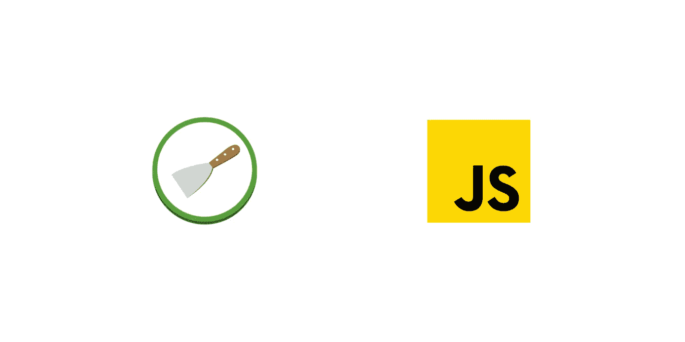

# 如何用 Scrapy 执行 JavaScript？

> 原文：<https://towardsdatascience.com/how-to-execute-javascript-with-scrapy-1c5ef8f17981?source=collection_archive---------30----------------------->

## 了解如何使用 Scrapy 和 Selenium、Splash 和 ScrapingBee 中间件为无头浏览器抓取动态网站

图片由 Pierre de Wulf [ [来源](https://www.scrapingbee.com/blog/scrapy-javascript/)

大多数现代网站使用客户端 JavaScript 框架，如 React、Vue 或 Angular。在没有服务器端呈现的情况下，从动态网站抓取数据通常需要执行 JavaScript 代码。

我刮过几百个站点，一直用 Scrapy。Scrapy 是一个流行的 Python web 抓取框架。与其他 Python 抓取库(如 Beautiful Soup)相比，Scrapy 迫使你根据一些最佳实践来构建代码。作为交换，Scrapy 负责并发性、收集统计数据、缓存、处理重试逻辑以及许多其他工作。

如果你是 Scrapy 新手，你可能应该开始阅读这个伟大的教程，它将教你所有[Scrapy](https://www.scrapingbee.com/blog/web-scraping-with-scrapy/)的基础知识。

在这篇文章中，我比较了使用 Scrapy 执行 JavaScript 的最流行的解决方案，如何扩展无头浏览器，并介绍了使用 ScrapingBee API 实现 JavaScript 支持和代理轮换的开源集成。

# 用 Scrapy 抓取动态网站

用 Scrapy 抓取客户端渲染的网站曾经很痛苦。我经常发现自己在浏览器网络工具上检查 API 请求，并从 JavaScript 变量中提取数据。

虽然这些技巧可能在一些网站上有效，但我发现代码比传统的 XPATHs 更难理解和维护。但是要直接从 HTML 中抓取客户端数据，首先需要执行 JavaScript 代码。

# 无头浏览器的零碎中间件

无头浏览器是没有图形用户界面的 web 浏览器。我用三个库来用 Scrapy 执行 JavaScript:**Scrapy-selenium**、 **scrapy-splash** 和 **scrapy-scrapingbee** 。

所有三个库被集成为一个 Scrapy [下载器中间件](https://docs.scrapy.org/en/latest/topics/downloader-middleware.html)。一旦在你的项目设置中进行了配置，你就可以产生一个 *SeleniumRequest* 、 *SplashRequest* 或*scraping beer Request*，而不是从你的蜘蛛那里产生一个普通的 Scrapy 请求。

## 用 Selenium 在 Scrapy 中执行 JavaScript

在本地，你可以通过 [scrapy-selenium](https://github.com/clemfromspace/scrapy-selenium) 中间件与 Scrapy 的无头浏览器进行交互。Selenium 是一个与浏览器交互的框架，通常用于测试应用程序、网页抓取和截屏。

Selenium 需要一个 [web 驱动](https://selenium-python.readthedocs.io/installation.html#drivers)来与浏览器交互。比如 Firefox 要求你安装 geckodriver。然后，您可以在 Scrapy 项目设置中配置 Selenium。

在你的蜘蛛中，你可以产生一个*硒元素请求*。

Selenium 允许您用 Python 和 JavaScript 与浏览器进行交互。[驱动程序对象](https://selenium-python.readthedocs.io/api.html#module-selenium.webdriver.remote.webdriver)可以从 Scrapy 响应中访问。有时在你点击一个按钮后检查 HTML 代码是很有用的。在本地，您可以用一个 *ipdb* 调试器设置一个断点来检查 HTML 响应。

否则，可以从响应对象访问杂乱的 XPATH 和 CSS 选择器，以便从 HTML 中选择数据。

SeleniumRequest 带有一些[附加参数](https://github.com/clemfromspace/scrapy-selenium#additional-arguments)，例如在返回响应之前的 *wait_time* 到 *wait* ，等待 HTML 元素的 *wait_until* ，截屏的*screen*和执行定制 JavaScript 脚本的 *script* 。

在生产中，scrapy-selenium 的主要问题是没有简单的方法来建立一个 [Selenium grid](https://github.com/SeleniumHQ/selenium/wiki/Grid2) 来在远程机器上运行多个浏览器实例。接下来，我将比较用 Scrapy 大规模执行 JavaScript 的两种解决方案。

## 用 Splash 在 Scrapy 中执行 JavaScript

[Splash](https://github.com/scrapinghub/splash) 是一个带有 API 的网络浏览器即服务。它由 Scrapinghub 维护，Scrapy 的主要贡献者，并通过 [scrapy-splash](https://github.com/clemfromspace/scrapy-selenium) 中间件与 Scrapy 集成。也可以由 Scrapinghub 托管。

Splash 创建于 2013 年，在 2017 年无头 Chrome 和其他主要无头浏览器发布之前。从那时起，其他流行的项目如 PhantomJS 已经停止，转而支持 Firefox、Chrome 和 Safari 无头浏览器。

您可以使用 Docker 在本地运行 Splash 的实例。

配置 Splash 中间件需要添加多个中间件，并在您的项目设置中更改*HttpCompressionMiddleware*的默认优先级。

然后，您可以生成一个带有可选参数 *wait* 和 *lua_source* 的 *SplashRequest* 。

Splash 是一种流行的解决方案，因为它已经问世很长时间了，但它有两个主要问题:它使用自定义的无头浏览器，并需要用 Lua 编码来与网站交互。因为这两个问题，对于我的最后一个抓取项目，我决定为 ScrapingBee API 创建一个中间件。

## 使用 ScrapingBee 在 Scrapy 中执行 JavaScript

ScrapingBee 是一个 web 抓取 API，它为您处理无头浏览器和代理。ScrapingBee 使用最新的 headless Chrome 版本，支持 JavaScript 脚本。

像其他两个中间件一样，你可以简单地安装带有 *pip* 的 [scrapy-scrapingbee](https://github.com/scrapingbee/scrapy-scrapingbee) 中间件。

首先，您需要创建一个 ScrapingBee 帐户来获取 API 密钥。然后，您可以添加下载器中间件，并在项目设置中根据您的 ScrapingBee 计划设置并发性。

然后你可以从 *ScrapingBeeSpider* 继承你的 Spider 并产生一个 *ScrapingBeeRequest* 。

*ScrapingBeeRequest* 采用一个可选的 params 参数来执行一个 *js_snippet* ，在返回响应之前设置一个自定义的 *wait* 或者用 *wait_for* 在 HTML 代码中等待一个 CSS 或者 XPATH 选择器。

在一些网站中，当你滚动页面时，HTML 是异步加载的。您可以使用下面的 JavaScript 代码片段滚动到页面的末尾。

ScrapingBee 在 [ScrapingBee 文档](https://www.scrapingbee.com/documentation/#javascript-execution)上收集了其他常见的 JavaScript 片段来与网站进行交互。

在幕后，scrapy-scrapingbee 中间件将原始请求转换为转发给 ScrapingBee API 的请求，并对 URL 查询字符串中的每个参数进行编码。API 端点记录在你的垃圾日志中，api_key 被*垃圾蜘蛛*隐藏。

在您的蜘蛛解析方法中， *response.url* 被中间件解析为传递给 *ScrapingBeeRequest* 的原始 url。

使用 ScrapingBee 的另一个优点是，您可以访问不同国家的住宅代理，并通过以下参数进行代理轮换。

# 使用 Scrapy 缓存和并发来提高速度

Scrapy 使用了 Twisted under the hood，这是一个异步网络框架。Twisted 使 Scrapy 快速，能够同时刮多个页面。然而，要执行 JavaScript 代码，您需要使用真正的浏览器或无头浏览器来解析请求。无头浏览器有两个挑战:速度较慢，难以扩展。

在无头浏览器中执行 JavaScript 并等待所有网络调用，每页可能需要几秒钟。当刮多个页面时，它会使刮刀明显变慢。希望 Scrapy 提供缓存来加速开发和生产运行的并发请求。

在本地，当开发一个刮刀时，你可以使用 Scrapy 的内置缓存系统。这将使后续运行更快，因为响应存储在您计算机上的一个隐藏文件夹*中。scrapy/httpcache* 。您可以在您的项目设置中激活 *HttpCacheMiddleware* :

无头浏览器的另一个问题是它们为每个请求消耗内存。在生产中，您需要一个可以处理多种浏览器的环境。要同时发出多个请求，您可以修改项目设置:

使用 ScrapingBee 时，记得根据您的 ScrapingBee 计划设置并发性。

# 结论

我比较了三个 Scrapy 中间件，用 Scrapy 渲染和执行 JavaScript。Selenium 允许您在所有主流的无头浏览器中使用 Python 与 web 浏览器进行交互，但是很难扩展。Splash 可以使用 Docker 在本地运行，也可以部署到 Scrapinghub，但是它依赖于定制的浏览器实现，而且你必须用 Lua 编写脚本。ScrapingBee 使用最新的 Chrome headless 浏览器，允许您在 JavaScript 中执行自定义脚本，并为最难抓取的网站提供代理旋转。

# 资源

*   [scrapy-selenium 中间件](https://github.com/clemfromspace/scrapy-selenium)
*   [飞溅中间件](https://github.com/scrapy-plugins/scrapy-splash)
*   [scrapy-scrapy bee 中间件](https://github.com/scrapingbee/scrapy-scrapingbee)

*原载于*[*https://www.scrapingbee.com*](https://www.scrapingbee.com/blog/scrapy-javascript/)*。*