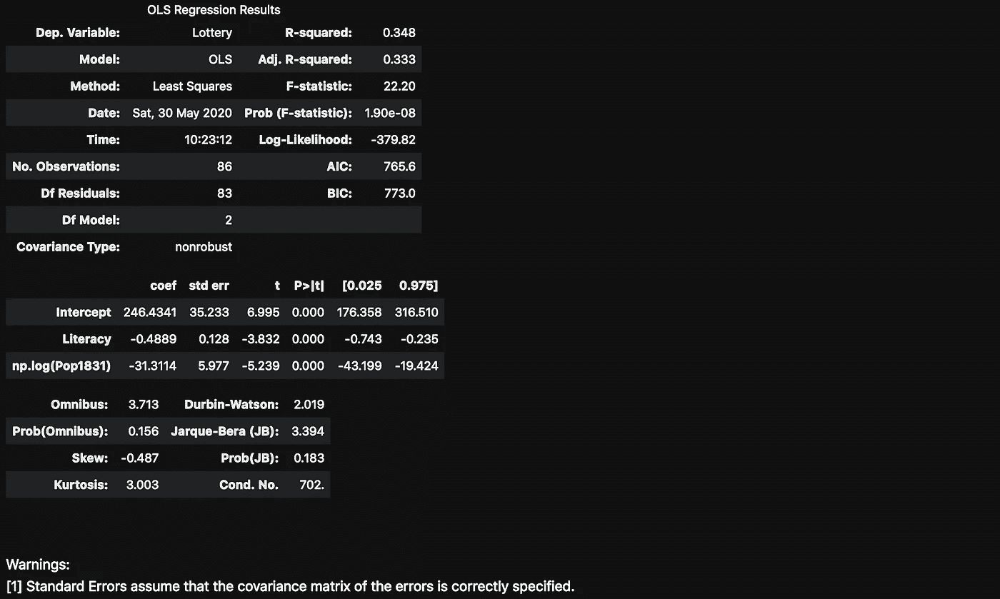
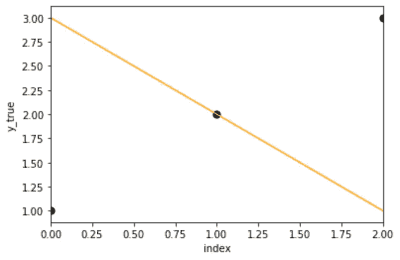
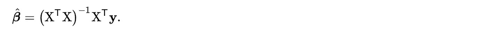
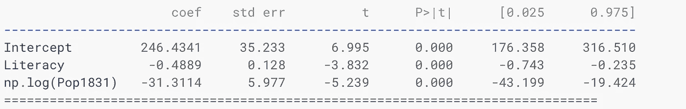
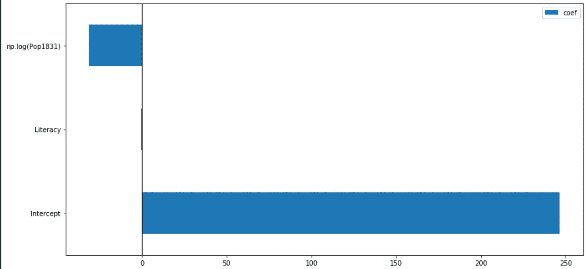

# 如何解释回归模型

> 原文：<https://towardsdatascience.com/how-to-explain-a-regression-model-244882e6cc0c?source=collection_archive---------28----------------------->

## 高 R 平方值本身就好吗？为什么 R 平方越高，特征越多？回归系数的含义是什么？


艾萨克·史密斯在 [Unsplash](https://unsplash.com?utm_source=medium&utm_medium=referral) 上拍摄的照片

**作者注:这篇文章是线性模型系列的一部分，它没有解释线性模型的所有属性，因为这会使文章太长。请务必继续阅读，以免错过本系列的下一篇文章。**

我主要使用 [statsmodels](http://statsmodels) 包进行回归分析，因为它提供了开箱即用的回归模型的详细摘要。在本文中，我将解释摘要中基本术语的含义。

**这里有几个你可能会感兴趣的链接:**

```
- [Labeling and Data Engineering for Conversational AI and Analytics](https://www.humanfirst.ai/)- [Data Science for Business Leaders](https://imp.i115008.net/c/2402645/880006/11298) [Course]- [Intro to Machine Learning with PyTorch](https://imp.i115008.net/c/2402645/788201/11298) [Course]- [Become a Growth Product Manager](https://imp.i115008.net/c/2402645/803127/11298) [Course]- [Deep Learning (Adaptive Computation and ML series)](https://amzn.to/3ncTG7D) [Ebook]- [Free skill tests for Data Scientists & Machine Learning Engineers](https://aigents.co/skills)
```

*上面的一些链接是附属链接，如果你通过它们购买，我会赚取佣金。请记住，我链接课程是因为它们的质量，而不是因为我从你的购买中获得的佣金。*

# 什么总结？

当我们用 statsmodels 包训练一个模型时，我们可以调用 summary 函数来产生如下图所示的输出。输出类似于 R 在训练回归模型时产生的输出。


使用 statsmodels 训练的回归模型的摘要。

# 没听说过 statsmodels？


[statsmodels](https://www.statsmodels.org/stable/index.html) 标志

[statsmodels](http://statsmodels.org/) 是一个 Python 包，用于许多不同统计模型的估计，以及进行统计测试和统计数据探索。

如果您错过了我之前关于 statsmodels 的文章，我将它与 sklearn 进行了比较:

[](/are-you-still-using-sklearn-for-regression-analysis-fb06bb06ce96) [## 你还在用 sklearn 做回归分析吗？

### 谈到 Python 中的经典机器学习算法，sklearn 是第一个首选包——还有其他包…

towardsdatascience.com](/are-you-still-using-sklearn-for-regression-analysis-fb06bb06ce96) 

# 摘要的解释

[statsmodels](http://statsmodels) 索引页面显示了如何训练普通最小二乘回归模型的简单示例:

```
import numpy as npimport statsmodels.api as smimport statsmodels.formula.api as smf# Load data
dat = sm.datasets.get_rdataset("Guerry", "HistData").data# Fit regression model (using the natural log of one of the regressors)
results = smf.ols('Lottery ~ Literacy + np.log(Pop1831)', data=dat).fit()# Inspect the results
results.summary()
```



回归模型的详细总结。

**以上术语是什么意思？**

让我们从简单的术语开始:

*   离开变量是模型正在学习的目标变量(上面公式中的彩票)，
*   模型是普通的最小二乘法，因为我们使用 smf.ols 函数，
*   观察值是训练集中的样本数，
*   Df 模型显示了模型中特征的数量。上面模型中的识字率和 Pop1831。这不包括常数，该常数在将 statsmodels 与公式一起使用时自动添加。

## r 平方

默认情况下，回归模型会报告 R 平方和可调 R 平方指标。

r 平方是衡量数据与拟合回归线接近程度的指标。r 平方可以是正数，也可以是负数。当拟合完美时，R 的平方为 1。**注意，向模型添加特征不会减少 R 平方。这是因为当添加更多特征时，模型可以找到与之前相同的拟合。更多情况下，添加要素时，R 平方会偶然增加。**

skearn 有一个计算 R 平方的函数。在以下情况下，R 平方为负:

```
from sklearn.metrics import r2_scorey_true = [1, 2, 3]
y_pred = [3, 2, 1]
r2_score(y_true, y_pred)-3.0 # r-squared
```



产生上述负 R 平方的数据点图。

## 调整后的 R 平方

调整后的 R 平方通过针对模型中的要素数量进行调整来解决 R 平方的问题。向模型中添加更多要素将增加 R 平方，但可能会减少调整后的 R 平方。经调整的 R 平方的这一属性可用于找到给出最佳准确度的特征。Adj. R-squared 介于 0 到 1 之间，其中 1 表示模型解释了响应数据在其平均值附近的所有可变性。

sklearn 没有计算调整后的 R 平方的函数，因为它也需要样本和特征的数量。我们可以用下面的函数来计算:

```
def adj_r2(r2, n_samples, n_features):
    return 1-(1-r2) * (n_samples-1) / (n_samples-n_features-1)
```

**注意，高调整的 R 平方并不意味着你的模型是好的。**拟合回归模型时，我们需要检查残差图。线性回归的假设之一是**同方差**，这意味着残差的方差对于 x 的任何值都是相同的，我打算在下一篇关于回归模型的文章中写残差图。

## 系数是如何计算的？

普通最小二乘回归(OLS)通过计算获得解析解:



计算普通最小二乘回归系数的方程。

我们自己试着拟合一下模型吧。首先，我们需要转换功能:

```
dat.loc[:, 'intercept'] = 1
dat['Pop1831'] = dat['Pop1831'].apply(np.log)
```

然后我们分离特征和目标变量:

```
x = dat["intercept Literacy Pop1831".split()].values.T
y = dat['Lottery'].values.T
```

计算等式的第一部分:

```
a = np.inner(x, x)array([[8.60000000e+01, 3.37600000e+03, 5.04663925e+02],
       [3.37600000e+03, 1.58156000e+05, 1.98401100e+04],
       [5.04663925e+02, 1.98401100e+04, 2.97314045e+03]])
```

计算等式的第二部分:

```
b = np.inner(x, y)array([  3741\.       , 133414\.       ,  21572.9563115])
```

通过寻找线性矩阵方程的最小二乘解来计算系数:

```
coef = np.linalg.lstsq(a, b)[0]array([246.43413487,  -0.48892344, -31.31139219])
```

我们可以确认这些系数与 OLS 模型中的相同。



## 系数是什么意思？

系数的符号告诉我们一个特征和一个目标变量之间是正相关还是负相关。

正系数表示当特征增加时，目标的平均值也增加。负系数表示随着特征值的减小，目标趋于减小。

让我们把系数形象化。

```
# Extract the coefficients from the model
df_coef = results.params.to_frame().rename(columns={0: 'coef'})# Visualize the coefficients
ax = df_coef.plot.barh(figsize=(14, 7))
ax.axvline(0, color='black', lw=1)
```



回归模型的系数。

# 在你走之前

在 [Twitter](https://twitter.com/romanorac) 上关注我，在那里我定期[发布关于数据科学和机器学习的](https://twitter.com/romanorac/status/1328952374447267843)。


由[考特尼·海杰](https://unsplash.com/@cmhedger?utm_source=medium&utm_medium=referral)在 [Unsplash](https://unsplash.com/?utm_source=medium&utm_medium=referral) 拍摄的照片