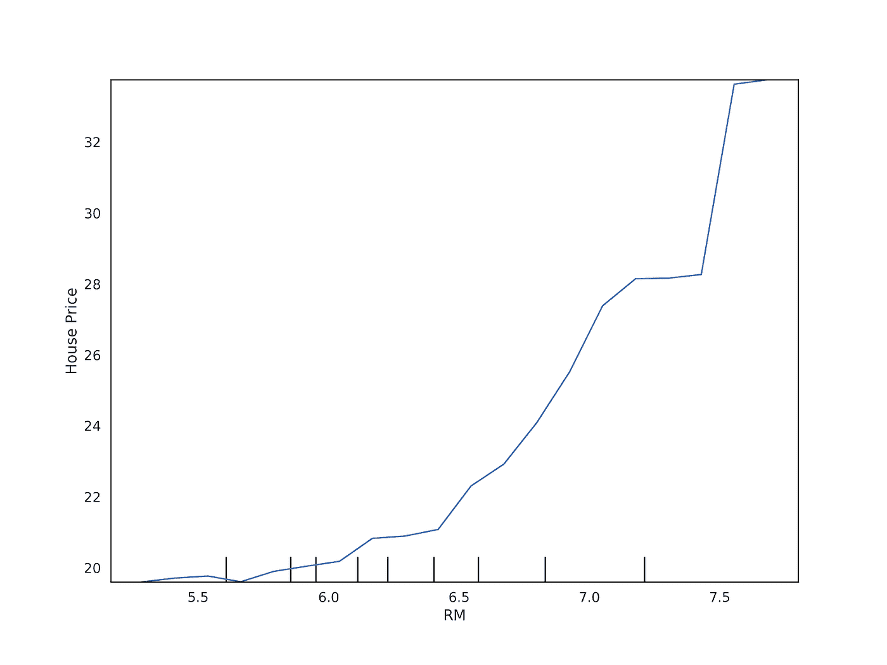
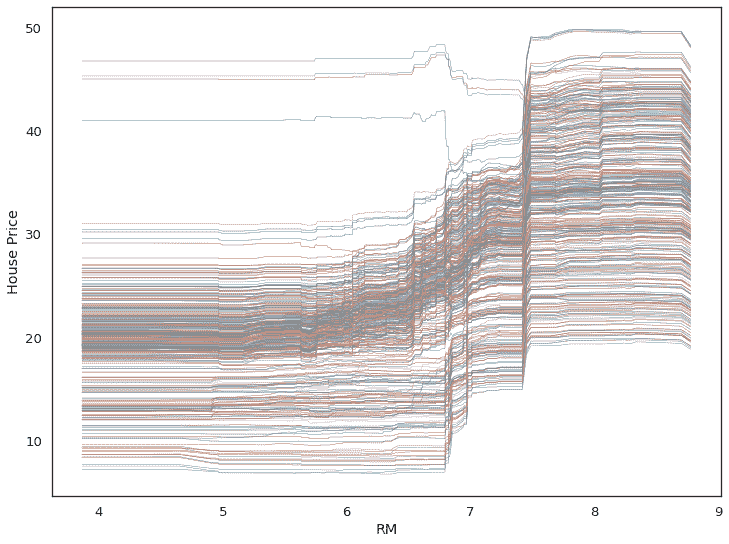
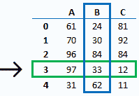
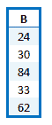
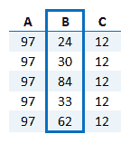
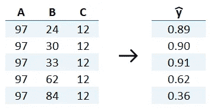
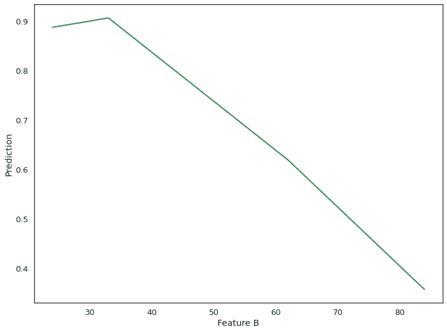
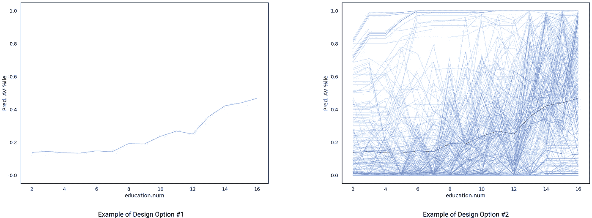
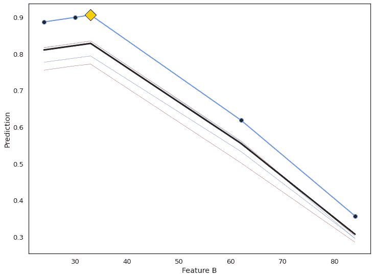

# 使用个体条件期望(ICE)图的模型不可知的局部解释

> 原文：<https://towardsdatascience.com/how-to-explain-and-affect-individual-decisions-with-ice-curves-1-2-f39fd751546f?source=collection_archive---------19----------------------->

## 如何用 ICE 曲线解释和影响个人决策

# 理解机器学习决策

如果你的贷款申请被拒绝，你可能想知道两件事:

1.  为什么我被拒绝了？
2.  以后怎么做才能获得批准？

来自 [Pexels](https://www.pexels.com/photo/tibetan-sculpture-on-heap-of-american-dollars-on-white-background-4386177/?utm_content=attributionCopyText&utm_medium=referral&utm_source=pexels) 的 [Karolina Grabowska](https://www.pexels.com/@karolina-grabowska?utm_content=attributionCopyText&utm_medium=referral&utm_source=pexels) 摄影

换句话说，你想要的解释是针对你自己的。特别是，你会想知道你的情况是如何影响结果的，如果可能的话，做点什么。例如，如果你在现在的地址住了一年多，你获得贷款的机会大大增加，那么你可以放心地在将来再次申请！

无论决策是由人类做出还是由机器学习算法做出，这种对对个人有意义的解释，或众所周知的“局部解释”的需求都适用。在可解释的机器学习领域，有许多众所周知的解释个体决策的技术(例如， [SHAP](https://github.com/slundberg/shap) 和[莱姆](https://github.com/marcotcr/lime))。这些技术不仅为梳理出“黑盒”机器学习模型的个体预测背后的原因提供了创新的想法，它们还通过以有趣的方式可视化它们来帮助我们理解结果(例如，参见我关于 [SHAP 摘要情节](/visualizing-ai-8fad4ea70b87)的文章)。

一种流行的可视化技术是个体条件期望(ICE)图，这种技术通常与局部解释无关，但我认为在这种情况下可以有所贡献。传统上，冰图主要被视为支持全球解释的可视化；也就是说，解释模型在群体层面的作用。然而，通过对它们的可视化方式进行一些简单的修改，我认为它们在局部解释层面上也是有价值的。使用 ICE 图的好处是它是一种简单易懂的技术。它还提供了丰富的信息，观众可以利用这些信息了解当地的情况，并模拟如果情况发生变化会发生什么。

这篇文章的目的是检验 ICE 图如何帮助解释个人决策，并帮助说明影响决策的因素。我将首先详细描述 ICE 图(第 1 部分)，然后使用它的修改版本，通过几个例子来探索它的实用性([第 2 部分](https://medium.com/@waion/how-to-explain-and-affect-individual-decisions-with-ice-curves-2-2-f36036fac1ca))。

本文面向对统计学和机器学习(ML)有基本了解，并对可视化如何帮助解释和影响个人 ML 决策感兴趣的任何人。

# 什么是冰情节？

ICE 图是部分相关图(PDP)的扩展。PDP 可视化了特征值的变化如何影响 ML 模型的预测。这是通过绘制您感兴趣的某个特性的不同值的平均预测结果，同时保持其他特性值的值不变来实现的。这很有用，因为我们可以看到预测和我们感兴趣的特征之间的关系(通常一次一个或两个)。

例如，我们可以回答以下问题:

*   如果温度上升，冰淇淋需要多少库存？
*   与卧室数量相关的平均房价是多少？

此处显示的图是一个 PDP 示例，显示了来自流行的[波士顿房价数据集](https://scikit-learn.org/stable/modules/generated/sklearn.datasets.load_boston.html)的“RM”(每个住宅的平均房间数)特征。x 轴是卧室的平均数，y 轴是千片订量的中值。使用 [scikit-learn PDP 功能](https://scikit-learn.org/stable/auto_examples/inspection/plot_partial_dependence.html)创建图形。

## 冰图可视化个体差异

PDP 简单易懂。然而，它们的简单性隐藏了单个实例之间潜在的有趣关系。例如，如果一个实例子集的特征值趋势为正，而另一个子集趋势为负，则平均过程可以抵消它们。

冰图解决了这个问题。冰图显示了 PDP 中聚合过程的结果曲线。每条 ICE 曲线都显示了一个实例的不同特征值的预测，而不是平均预测。当它们一起出现在一个图中时，我们可以看到实例子集之间的关系以及单个实例行为的差异。

如下图所示，虽然大多数实例遵循之前显示的 PDP 中的曲线形状，但是在图的顶部有一小部分表现与 PDP 曲线相反；在 x 轴上，它们不是在 6–7 之间增加，而是实际上减少了。

波士顿房价数据集中“RM”要素的 ICE 图

创建一个冰情节很简单。有许多可用的包(例如在 [Python](https://github.com/AustinRochford/PyCEbox) 和 [R](https://github.com/kapelner/ICEbox) 中)。当然，你自己创造也是可以的。

# 使用冰图进行局部解释

ICE 图传统上用于理解数据子集中的相互作用和差异，作为部分相关(PD)分析的一部分。然而，如前所述，由于 ICE 图描述的是单个观察结果，因此有可能使用它来关注您感兴趣的特定实例。

## 计算冰曲线的值

为了可视化实例，我们需要弄清楚如何计算曲线的值(或者能够在创建 ICE 图的工具中定位实例。例如，参见本教程关于[在 PyCEbox 中访问 ICE 数据帧](https://github.com/AustinRochford/PyCEbox/blob/master/notebooks/PyCEBox%20Tutorial.ipynb)。这里有一个简单的例子来说明计算 ICE 曲线值的步骤:

1.找到您感兴趣的实例和特性。

2.查找特征的唯一值。

3.对于这些值中的每一个，用其他特征值创建一个实例。换句话说，固定其他特征值并置换感兴趣的特征值。

4.对每种组合进行预测。

5.获取每个实例的预测值，并绘制预测曲线。

实例#3 特征 B 的冰图

## 注意相关性

使用 ICE 图(和 PDP)时需要处理的一个潜在问题是特征之间的高度相关性。这在很多方面都有问题:

1.  我们可能最终得到不太可能或不可能的特征值组合，然后输入到模型中。例如，在一个包含“怀孕状态”和“性别”特征的数据集中，我们可能最终得到一个怀孕的男性作为输入组合！
2.  很难将影响归因于单个特征(即“共线性”或“多重共线性”的结果 **)** 。换句话说，很难知道有多少预测影响是由于一个特征或另一个特征。

许多研究人员详细指出了这些问题，并提出了各种补救方法。在实践中，有一些简单的方法来处理高度相关的变量(如聚合、逐步消除)。关于[如何处理相关性](https://www.kaggle.com/reisel/how-to-handle-correlated-features)的详细示例，请参见下面的文章。

## 可视化冰的曲线

出于解释和影响预测的目的，有许多不同的方法来可视化单个实例。两种主要方法是:

1.  独自一人。将单个实例单独可视化，不需要任何关于其余群体的附加信息(如上例所示)。这种方法的优点是生成的图易于理解。观众可以只关注他们试图解释和影响的例子。
2.  在上下文中。在数据集中其他实例的上下文中可视化单个实例。这种方法的优点是，查看者可以检查单个实例，同时参考其他实例；以查看该实例是否是异常值，它如何符合或偏离其他实例等。缺点是情节可能会混乱不堪。

[社会科学](https://arxiv.org/abs/1706.07269)的研究表明，人们经常寻找对比和上下文相关的解释。因此，在上下文中突出感兴趣的实例的方法似乎具有潜在的好处，值得进一步探索。

然而，大多数可用的 ICE 绘图工具不加区别地显示所有实例。如果我们想关注某个特定的实例，我们需要做一些改变。在这方面，有两个变化特别重要:

1.  将感兴趣的实例与数据集中的其他实例进行对比。可视化需要在其他实例的上下文中显示感兴趣的实例，但要以一种区别于其他实例的方式。
2.  指出不同的特征值以帮助结果的假设模拟。它应该突出显示当前特征值和曲线中的变化值。这将有助于观众在上下文中看到感兴趣的实例，并在心理上模拟可能的理想变化方向。

以下修改后的 ICE 图显示了上例中常规 ICE/PD 图的相关实例。

感兴趣的实例的突出显示

关于这块冰地，有几点需要注意:

*   中间较粗的黑线是 PD 曲线。也就是说，它是所有实例的平均值。
*   所有其他的线都是冰曲线。也就是说，它们是它们的值因感兴趣的特征(即特征 B)而变化的实例。
*   带有标记的蓝线是感兴趣的实例。每个圆形标记代表一个变化的特征值(如 x 轴所示)和一个预测(如 y 轴所示)。
*   蓝线上的黄色菱形标记显示了我们感兴趣的实例的当前特征值和预测。
*   突出显示的实例遵循 PD 曲线的一般形状，但是预测概率水平更高。

通过在 ICE 图的上下文中高亮显示感兴趣的实例，我们可以看到在数据集中其他实例的上下文中改变感兴趣的实例上的特定要素的值的影响。然而，重要的是要注意，这是一个简单的例子，用于说明一个概念。这里所做的设计决策是否会在解释特征对个体决策的影响时导致不可管理的复杂性，还有待观察。

在[第 2 部分](/how-to-explain-and-affect-individual-decisions-with-ice-curves-2-2-f36036fac1ca)中，我们将使用几个更现实的例子来说明之前的讨论，并进一步探索 ICE 曲线在为黑盒 ML 模型提供局部解释方面的效用。

# 参考

[1] Goldstein，a .，Kapelner，a .，Bleich，j .，和 Pitkin，E. (2014 年)。"窥视黑盒内部:用个体条件期望图可视化统计学习." [arXiv:1309.6392](https://arxiv.org/abs/1309.6392)

[2]j . h .弗里德曼(2001 年)。"贪婪函数逼近:梯度推进机."[统计年鉴](https://www.jstor.org/stable/2699986?seq=1)，29 卷，第 1189-1232 页。