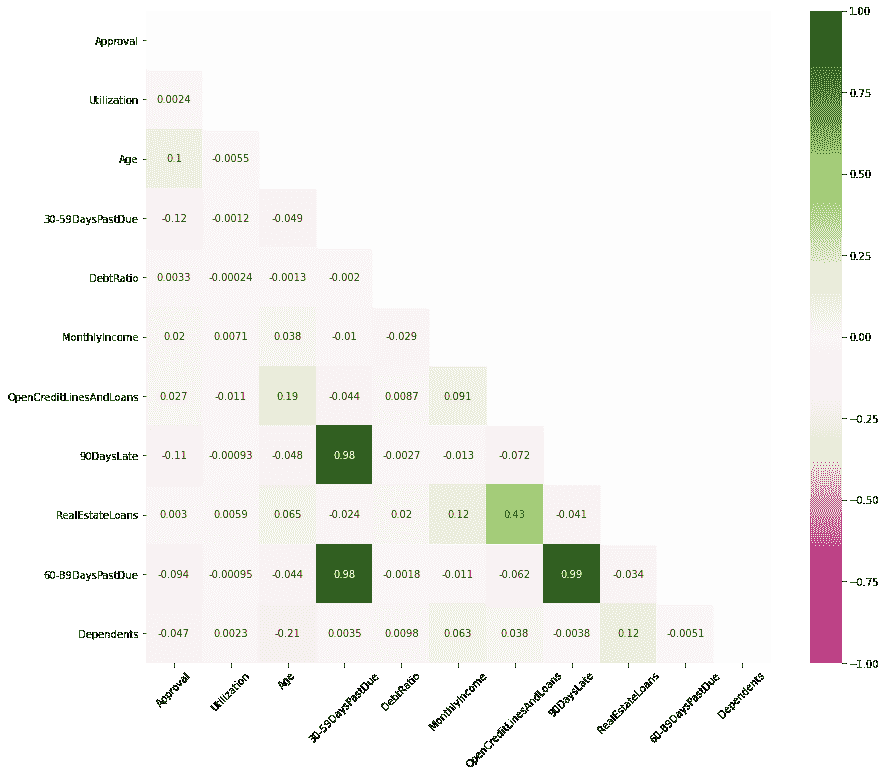
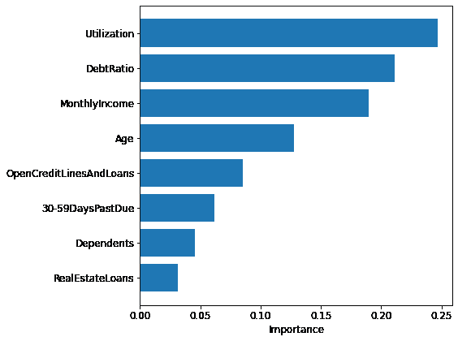
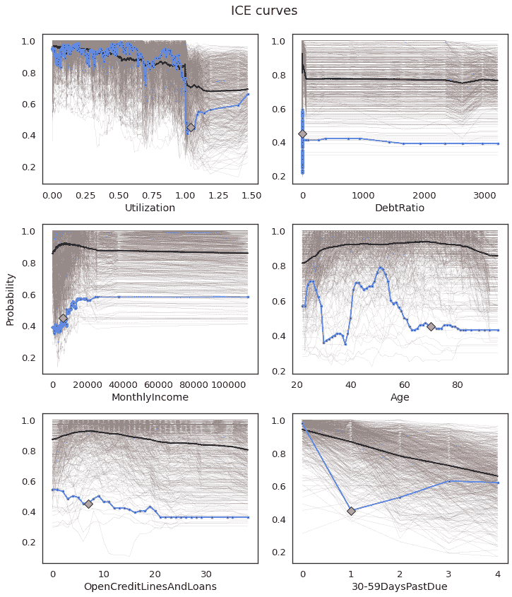
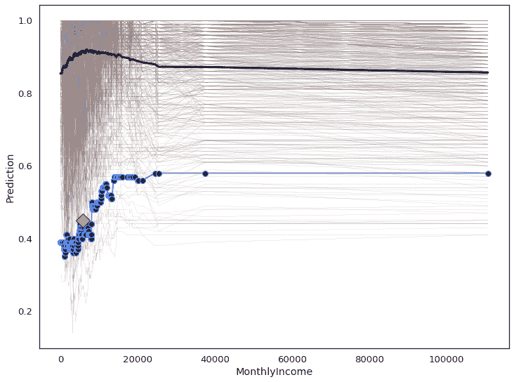
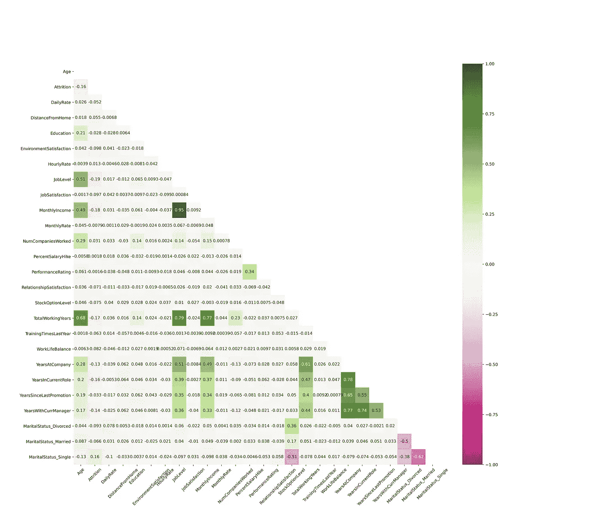
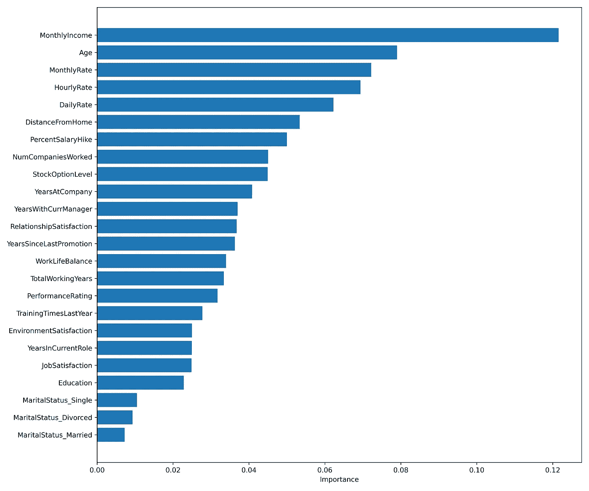
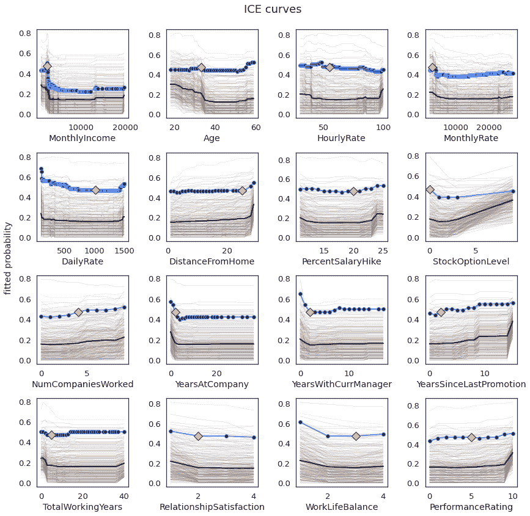
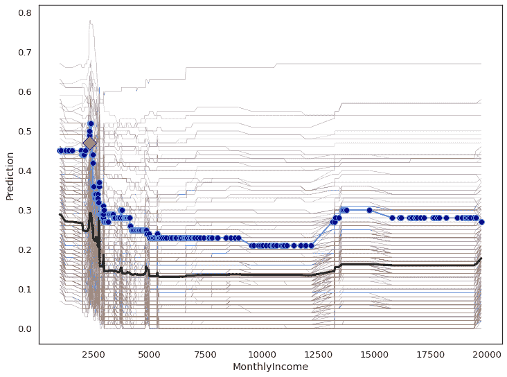
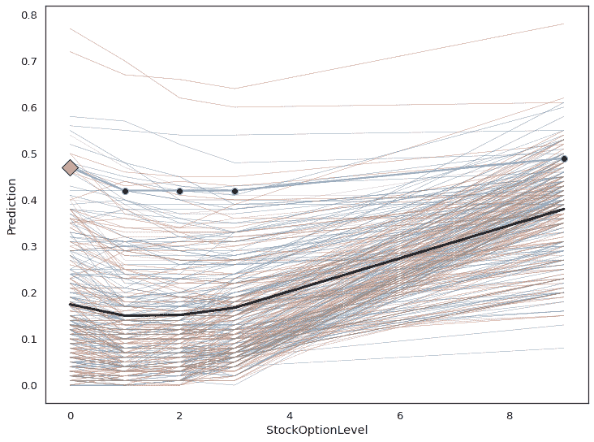
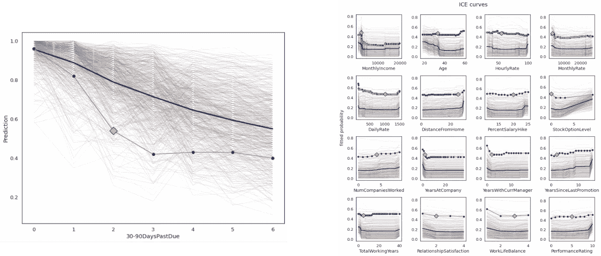

# 如何用 ICE 曲线解释和影响个人决策

> 原文：<https://towardsdatascience.com/how-to-explain-and-affect-individual-decisions-with-ice-curves-2-2-f36036fac1ca?source=collection_archive---------44----------------------->

## 在信贷申请和员工保留中使用个人条件期望图的示例

现在我们有办法在 ICE 图中突出显示感兴趣的单个实例(参见[第一部分](https://medium.com/@waion/how-to-explain-and-affect-individual-decisions-with-ice-curves-1-2-f39fd751546f))，让我们用两个更现实的例子来说明它们的用法:信用申请和员工保留。这些例子显示了可能需要局部解释的不同背景，并允许我们测试早期做出的设计决策是否能够使 ICE 图有助于解释和影响个人决策。这篇文章的[代码可以在 GitHub 上找到。](https://github.com/taspett/ice_examples)

# 示例 1:信用申请

# 方案

Andrea Piacquadio 拍摄于 [Pexel](https://www.pexels.com/@olly)

罗恩是靠固定收入生活的退休人员。他最近申请了汽车贷款，但被拒绝了。他很恼火，要求对他的拒绝做出解释。

您是贷款专家，负责与 Ron 一起审查自动决策。你渴望帮助他，因为得到他想要的也有利于你的生意。你与 Ron 会面，详细回顾他的拒绝，看看你能提供什么建议。

# 数据:贷款违约

本例的数据集是可从 Kaggle 获得的[贷款违约数据](https://www.kaggle.com/c/GiveMeSomeCredit/data)。数据由 10 个特征和“过去 90 天的严重拖欠”的目标输出组成。我们将使用该目标作为贷款批准的建议。也就是说，如果“严重拖欠”的预测是真的，那么贷款被拒绝，否则它被批准。

贷款默认数据集的片段

# 数据探索

根据我们在第 1 部分中的讨论，我们应该首先看看是否有高度相关的特性。

所有变量的相关矩阵

数据显示了高度相关的三个实例:

*   30–59 天和 90 天:0.98
*   30 到 59 天以及 60 到 89 天的延迟时间:0.98
*   90 天和 60–89 天

换句话说，数据显示，所有时间段(即 30-59 天、60-89 天或 90 天)的逾期债务支付都高度相关。

为了处理这些相关性，尝试了分组和排除策略(即，将所有 3 个变量聚合为一个，并丢弃一个或多个高度相关的变量)。然而，在它们如何影响预测方面没有发现显著差异。为了简化对下游解释的理解，我删除了与目标变量相关性较低的特性，从而保留了特性“30–59 天”。

scikit-learn 的随机森林算法用于拟合具有这些特征的模型，以预测贷款批准(准确度= 0.93)。这些功能的相对重要性如下。

贷款审批的功能重要性

特征重要性分析表明，我们的模型最重要的特征是“利用率”。这一特征被定义为“信用卡和个人信用额度的总余额(除了房地产，没有分期付款债务，如汽车贷款)除以信用限额的总和”。换句话说，信贷余额与信贷限额的比率。这一特征的重要性紧随其后的是负债率和月收入。让我们使用修改后的 ICE 图来绘制这些特性，以更详细地了解我们的单个实例的情况。

# 冰原

使用我们修改的 ICE 图可视化的前 6 个特征如下。我使用 Python 中的 [pyCEbox 包来计算 ICE 值，并对第 1 部分中描述的可视化函数进行了修改。这个](https://github.com/AustinRochford/PyCEbox)的[代码可以在 GitHub 上找到。](https://github.com/taspett/ice_examples)

回想一下第 1 部分:

*   较粗的黑线是 PD 曲线(回想一下，这是所有实例的平均值)。
*   所有其他线都是单个实例的 ICE 曲线。这里的每个子图显示了来自数据集的 602 个单独的实例。
*   带有标记的蓝线是感兴趣的实例。
*   蓝色线上的黄色菱形标记显示了我们感兴趣的实例的当前特征值和预测值。

让我们依次检查这些子情节。提醒一下，预测值为 1 是好的(贷款批准)，预测值为 0 是坏的(贷款拒绝)。

**利用:**ICE 图显示 x 轴值达到 1.0 时有相当大的湍流；此后，在稳定之前，在 1.0-1.1 之间的较低概率水平上有更多的波动。PD 曲线反映了这一点，但清楚地显示在值 1.0 附近有下降。

Ron 的 ICE 曲线(带圆形标记的蓝色)或多或少遵循 PD 曲线模式，直到 x 轴上的值为 1.0，之后有一个比 PD 曲线低得多的陡峭下降。此外，如黄色菱形标记所示，对 Ron 的预测接近该特征的 ICE 曲线的底部。因为这是最重要的特征，所以这是为什么 Ron 的贷款申请被拒绝的重要的部分解释。

修改了利用率特性的 ICE 图

根据罗恩的 ICE 曲线，为了增加获得贷款的机会，他可以提高或降低利用率。可视化显示降低这个比率看起来更有效(通过减少他的信用余额或增加他的信用限额大小)。换句话说，如果“利用率”降低，曲线的急剧下降将立即逆转，而增加“利用率”将导致更加平缓的上升。

除了短暂的初始颤振，PD 曲线和单个结冰曲线显示预测相对稳定。

**月收入:**罗恩的冰上曲线显示他接近曲线底部。如果他的月收入增加，那么他获得贷款的机会也会增加。

罗恩目前退休后每月有 5804 英镑的固定收入。ICE 曲线显示 Ron 的最佳水平需要高于 18，000。这比他目前的水平有了很大的提高。然而，ICE 曲线表明，即使 Ron 可以少量增加他的月收入(从而移动到曲线中黄色菱形标记的右侧)，他获得贷款的机会也会增加。与 Ron 讨论后，得出的结论是这不是他可以立即做的事情。然而，这次谈话确实让他更多地考虑去做兼职。

**年龄:**虽然曲线有一些有趣的波动，但不幸的是，这是我们无法控制的变量之一。然而，好消息是罗恩的 ICE 曲线表明，随着年龄的增长，他获得贷款的可能性保持不变。

**OpenCreditLinesAndLoans:**PD 曲线和 ICE 曲线都比较平坦。对于 Ron，值在 20 以下时会有一些小的变化，之后会稳定下来。

**30–59 天逾期时间**:该特征被定义为“借款人逾期 30–59 天的次数，但在过去 2 年中没有恶化”。

ICE 曲线显示，如果罗恩能够减少他的逾期付款，那么他获得批准的机会将大大增加。PD 曲线还显示，随着逾期付款的增加，贷款批准概率呈下降趋势。

尽管罗恩在过去的两年中只迟到过一次，但这仍然对他获得贷款批准的机会产生了巨大的影响。虽然这不是罗恩能马上解决的事情，但这是未来的一个重要收获。

将相关变量聚合为一个变量:过期 30–90 天

回想一下，我还尝试了一种将高度相关的变量组合起来的策略(即，“30–59 天时间”、“60–89 天时间”和“90 天时间”)。结果表明，ICE 曲线的总体形状与上述曲线相似(在浅恢复之前有一个陡峭的下降),并证实了付款的任何延迟都可能增加贷款下降的可能性的结论。

# 摘要

分析表明，“利用率”是解释 Ron 贷款申请被拒的最重要特征。为了最大化他将来获得贷款的机会，罗恩应该考虑三件事:

1.  降低他的“利用率”。
2.  如果可能的话，以后增加他的月收入。
3.  确保他以后不拖欠债务。

在回顾了这些设想并与您讨论后，Ron 觉得有一些具体的行动值得考虑，并对自己的贷款被拒感觉好多了。

# 示例 2:员工保留

# 方案

照片由 [loly galina](https://unsplash.com/@lolygalina?utm_source=unsplash&utm_medium=referral&utm_content=creditCopyText) 在 Unsplash 上拍摄

Sourabh 是你们研发团队的明星员工。他 30 多岁，已经在公司工作 5 年了。

作为他的经理，除了奖励他的表现，你还想更好地了解你能做些什么来确保他有动力留在公司。您会见了您的人力资源专家，他们使用 ML 模型来帮助预测员工流失，来讨论这个问题。

会议开始时并不顺利。你的人力资源专员告诉你，根据 ML 模型，Sourabh 很可能会离开。当务之急是，你和你的人力资源专员仔细检查结果，以进一步了解它，看看你需要采取什么步骤来留住 Sourabh。

# 数据:员工流失

本例的数据集是 IBM 关于[员工流失](https://www.kaggle.com/pavansubhasht/ibm-hr-analytics-attrition-dataset)的流行数据集。在删除了一些多余的特征并将数据减少到仅研发团队之后，我们最终得到 1470 条记录、24 个特征和一个目标变量“流失”。请注意，与前面的例子相比，在我们的分析和可视化中，我们需要处理更多的特性。

IBM 员工流失数据集的片段

# 数据探索

该数据集中有如此多的要素，以至于很难在此处查看和详细检查相关矩阵。然而，可以看出有许多变量是高度相关的。

25 个变量的相关矩阵

特别是，有两组高度相关的功能:

*   月收入和工作水平:0.99
*   工作年限和工作级别合计:0.79

毫不奇怪，个人的工作级别和薪酬(“工作级别”和“月收入”)之间存在关联，因为在许多公司，更高的工作级别通常意味着更高的货币薪酬。同样，晋升到更高的职位级别通常需要时间，因此职位级别高的个人也可能意味着他们在特定公司工作了多年(“TotalWorkingYears”和“job level”)。

出于稍后将讨论的原因，为了处理这些相关性，我选择移除其中一个特性(“JobLevel”)，而不是组合它们。与前面的示例一样，随机森林算法用于创建预测模型。这些功能的相对重要性如下:

剩余变量的相关矩阵

如上所示，“MonthlyIncome”是最终模型中最重要的特性。“MonthlyIncome”和下一个最重要的特性之间的差异比较大。之后，重要性会稳步下降。

# 冰原

由于有如此多的功能，我尝试了各种方法来显示尽可能多的 ICE 图，以提供这些功能的高级视图。我选定了一个 4x 4 的格子。结果是一个冰图的图标化呈现，从顶部最重要的特征开始，从左到右按重要性降序排列。

前 16 个特征的合成冰图

这个合成 ICE 图有效地概述了我们感兴趣的实例相对于前 16 个特征中的每一个的位置。尽管这些特征中的一些对预测的影响相对较低，但是看到它们的趋势仍然是有帮助的。回想一下，概率接近 1.0 意味着 Sourabh 更有可能离开，所以我们希望看到 Sourabh 的 ICE 曲线在 y 轴上更低。

让我们一次一行地检查这些特性，并详细关注更有趣的特性。

# 月收入

在最上面一行，除了“MonthlyIncome”之外，大多数特征都相对平坦。

“月收入”(较粗的黑线)的 PD 曲线显示，在稳定下来之前，月收入为 2，500 英镑(x 轴)时，流失概率下降到 0.15 左右(y 轴)。有趣的是，一旦大多数人的月收入达到 12500 英镑左右，自然减员的可能性就会增加，这表明月收入的增加只在一定程度上有效。之后，其他因素可能变得更加重要。

Sourabh 的 ICE 曲线反映了这种模式，只是它处于整体损耗概率的较高水平。他目前的月收入为 2313 英镑，接近 2500 英镑-3000 英镑可能会降低他离开的可能性。此后，在很长一段时间内，薪酬增加的回报可以忽略不计。

回想一下，为了处理“MonthlyIncome”和“JobLevel”之间的高度相关性，我们之前已经决定移除其中一个变量，而不是将它们合并。这被证明是正确的决定。否则，很难准确知道每月收入需要增加多少。

# 离家的距离

在复合冰图的第二行，有两个特征非常突出。首先是“离家的距离”功能:

PD 曲线表明“离家的距离”在 25 英里的范围内保持相对稳定，超过这个范围，损耗的可能性开始增加。ICE 曲线显示 Sourabh 处于离家距离的容许范围的边缘。如果这一距离增加，那么前往苏拉布的可能性也会增加。

如果通勤状况恶化，员工会考虑离开，这一事实并不令人惊讶。但是，ICE 图和突出显示单个实例的好处是，它允许我们以更高的精确度预测变化对单个员工的影响。

# 股票期权水平

这一行中另一个有趣的特性是“StockOptionLevel”。

Sourabh 目前没有获得任何股票期权。Sourabh 的 ICE 曲线表明，如果“股票期权水平”增加，那么自然损耗的可能性就会降低。ICE 曲线表明“StockOptionLevel”增加到 1.0 是最佳的，因为这是 Sourabh 的 ICE 曲线中的最低拐点。

在第三行，似乎没有任何值得调整的地方。自从 Sourabh 加入公司以来，他就一直和你——他的经理——在一起，这个模型表明，从减员的角度来看，这是一件好事。看起来，获得晋升(也许只是在工作层面)似乎不会影响自然减员的可能性。

最后，当我们移动到第四行中的较低重要性特征时，这些图上的曲线相对平坦。像其他图一样，Sourabh 的 ICE 曲线高于 PD 曲线，相对于其他人来说接近堆栈的顶部，支持他可能会离开的假设。

# 摘要

你从与人力资源专家的会面中得出的结论是，你需要尽快采取补救措施。分析表明，应考虑以下因素:

1.  “月收入”增加到 2，500-3，000 英镑。
2.  提供“股票期权级别”为 1.0 的股票期权。

未来要考虑的另一个因素是，如果工作地点相对于员工的家有所增加，那么像 Sourabh 这样的员工流失的可能性将会受到影响。

在你的要求下，你的人力资源专员用新的数据再次进行预测。您发现调整“MonthlyIncome”(到 3，000)会使自然减员的概率达到 0.27。此外，增加“StockOptionLevel”(到 1.0)的额外调整会使损耗的概率更低，达到 0.22。

分析为您提供了一些要使用的参数的具体概念。会议结束后，你比开始时更加乐观。在您的预算允许的范围内，您渴望与 Sourabh 进行对话，并尽早采取适当的补救措施。

# 讨论和结论

这篇文章的目标是探索使用 ICE 图来帮助解释和影响个人决策的潜力。就我们为此做出的设计决策而言，我发现:

*   突出显示感兴趣的实例(通过带有圆形标记的蓝色冰曲线)和突出显示其当前特征值(通过黄色菱形标记)的组合使我们能够清楚地看到当前预测以及它如何随着不同的特征值而变化。

*   冰图的复合图标可视化提供了最重要特征的不同值如何影响预测结果的有用的高级视图。这种可视化有助于我们确定我们应该关注哪些特征来有效地影响变化；通常，当前特征值接近曲线上明显的方向变化。相反，如果 ICE 曲线相对平坦，则表明通过改变该特征的值，预测不太可能有任何显著变化。
*   在其他实例和 PD 曲线的上下文中突出显示单个实例不会导致难以管理的复杂性。回想一下第 1 部分，视觉复杂性是一个不确定的领域，我们想用更真实的例子来测试它。这里的分析表明，先前做出的设计决策是恰当的。ICE 图中剩余的实例提供了一个对比，从中我们可以看到我们的实例在总体中的位置。PD 曲线还用作参考，以查看当前实例是否偏离或符合数据集的平均值。
    然而，需要指出的是，这种视觉清晰度可能是由于我们示例中的 PD 曲线和 ICE 曲线没有重叠(信贷申请示例中的“利用率”特征除外)。否则，两条曲线之间的细节差异可能会更加难以辨别。除了探索曲线的重叠和透明度级别的排序，未来可能的增强可能是提供一种交互地打开和关闭这些曲线的方法。这将允许更好地辨别图中有显著重叠的曲线。

关于分析过程，如以上示例所示，ICE 图的解释需要仔细导航。特别是，我们需要注意:

*   潜在动作的解释和推断需要关于特征特性的一般知识。在信贷申请示例中，知道我们能够控制一些功能(例如，“利用率”)，但不能控制其他功能(例如，“年龄”)，这使我们能够专注于我们能够做些什么的功能。一般来说，在决定采取什么样的潜在行动时，仔细考虑特性的特征是至关重要的，否则我们可能会做出错误的推断。
*   解释突出显示的 ICE 曲线可能需要专业领域知识。大多数人能够毫不费力地掌握信贷申请和人员保留等领域。但是，如果所涉及的特性属于需要大量学习和培训的领域，那么可能需要领域专家来解释结果，并推断可以采取什么潜在的行动。此外，向受影响的个人解释预测结果的任务，如我们的场景中所描述的，可能也更加困难。

汉斯·雷尼尔斯在 Unsplash 上的照片

*   使用 PDP 和 ICE 图时，要素工程和找出处理高度相关要素的最佳方法至关重要。在员工保留的例子中，归因的潜在困难意味着我们必须明智地决定放弃和保留哪些特征。在许多情况下，可能有必要采用试错法来测试处理高度相关特性的不同方法。
    同样值得指出的是，在本文中，我们只使用了简单的方法来检测和处理线性关系。可以说，对于更复杂的关系(例如，非线性相关性)，[可能需要更广泛的技术](https://sociologicalscience.com/articles-v6-4-81/)来处理它们。如果梳理出特征之间的相关性变得难以管理，我们可能不得不考虑使用替代的局部解释可视化技术。例如，累积局部效应(ALE)图避免了相关性问题，并且[对其创建的支持](https://github.com/blent-ai/ALEPython)变得越来越普遍。在任何情况下，这里显示的可视化方法，即突出感兴趣的个体实例，应该有利于在这类解释工具中解释和影响个体决策。

总之，这项研究表明，当小心使用时，ICE 图的修改版本在试图解释个人决策时非常有用，并有助于我们理解影响决策的因素。

可视化是为最大似然预测提供解释并使黑箱模型更加透明的重要工具。因此，这是一个值得更多关注的领域。考虑到这次探索的发现，带有适当可视化的 ICE 图可以成为 ML 个人决策分析工具包的一个有价值的补充。

# 参考

[1] Apley，D.W .和 Zhu，j .在黑盒监督学习模型中可视化预测变量的效果。arXiv:1612.08468