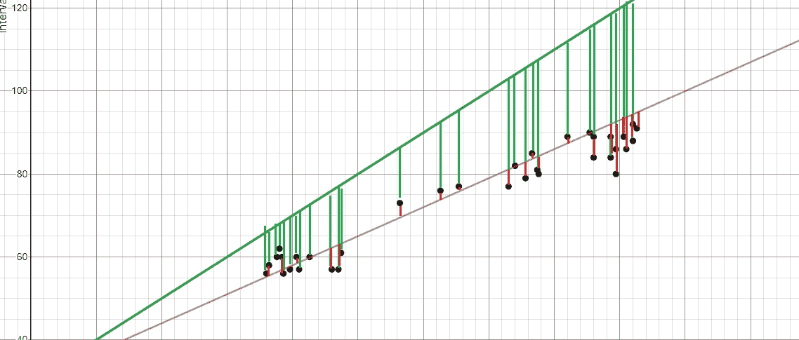
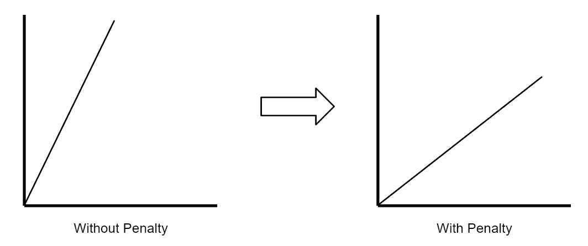
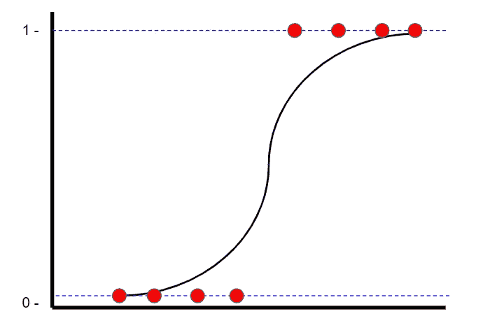
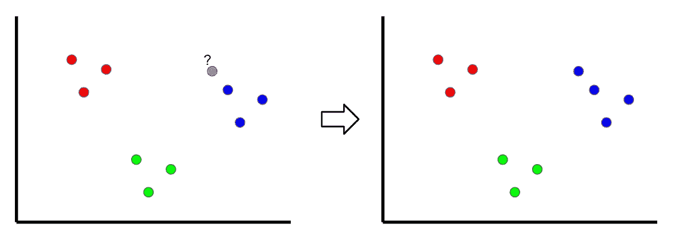
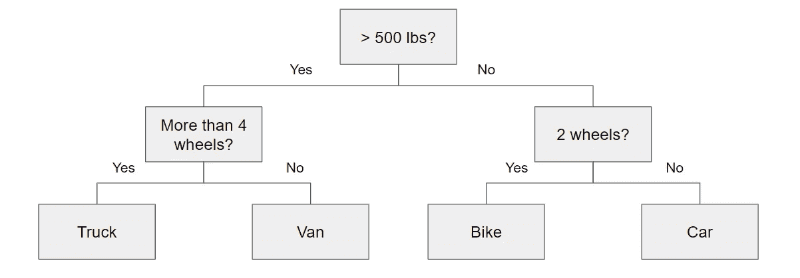

# 如何在面试时解释每个机器学习模型

> 原文：<https://towardsdatascience.com/how-to-explain-each-machine-learning-model-at-an-interview-499d82f91470?source=collection_archive---------7----------------------->

## 从回归到支持向量机再到 XGBoost 的模型综述

由卡特曼戈斯塔创作—[www.freepik.com](http://www.freepik.com)

*   *如果你喜欢这个，* [*跟我上 Medium*](https://medium.com/@terenceshin) *了解更多*
*   *关注我*[*Kaggle*](https://www.kaggle.com/terenceshin)*了解更多内容！*
*   *我们连线上*[*LinkedIn*](https://www.linkedin.com/in/terenceshin/)
*   *有兴趣合作？查看我的* [*网站*](http://Want to collaborate?) *。*
*   *查看* [*我的免费数据科学资源*](https://docs.google.com/document/d/1UV6pvCi9du37cYAcKNtuj-2rkCfbt7kBJieYhSRuwHw/edit#heading=h.m63uwvt9w358) *每周都有新素材！*

在准备任何采访时，我想分享一个资源，提供每个机器学习模型的简明解释。它们并不意味着广泛，而是相反。希望通过阅读这篇文章，您会对如何以简单的方式交流复杂的模型有所了解。

# 涵盖的型号

1.  线性回归
2.  里脊回归
3.  套索回归
4.  逻辑回归
5.  k 最近邻
6.  朴素贝叶斯
7.  支持向量机
8.  决策树
9.  随机森林
10.  adaboost 算法
11.  梯度增强
12.  XGBoost

# 线性回归

线性回归包括使用最小二乘法找到代表数据集的“最佳拟合线”。最小二乘法包括寻找最小化残差平方和的线性方程。残差等于实际值减去预测值。

举个例子，红线比绿线更适合，因为它离点更近，因此残差更小。

作者创建的图像

# 里脊回归

岭回归，也称为 L2 正则化，是一种引入少量偏差以减少过拟合的回归技术。这是通过最小化残差的平方和**加上**惩罚来实现的，其中惩罚等于λ乘以斜率的平方。λ指的是惩罚的严厉程度。

作者创建的图像

没有惩罚，最佳拟合的线具有更陡的斜率，这意味着它对 x 的小变化更敏感。通过引入惩罚，最佳拟合的线对 x 的小变化变得不那么敏感。这是岭回归背后的思想。

# 套索回归

套索回归，也称为 L1 正则化，类似于岭回归。唯一的区别是，惩罚是用斜率的绝对值来计算的。

# 逻辑回归

逻辑回归是一种分类技术，也能找到“最佳拟合线”。但是，与使用最小二乘法找到最佳拟合线的线性回归不同，逻辑回归使用最大似然法找到最佳拟合线(逻辑曲线)。这样做是因为 y 值只能是 1 或 0。 [*查看 StatQuest 的视频，看看最大似然是如何计算的*](https://www.youtube.com/watch?v=BfKanl1aSG0) 。

作者创建的图像

# k-最近邻

作者创建的图像

K-最近邻是一种分类技术，其中通过查看最近的分类点对新样本进行分类，因此称为“K-最近”。在上面的例子中，如果 k=1，那么未分类的点将被分类为蓝点。

如果 k 值太低，它可能会受到异常值的影响。但是，如果它太高，可能会忽略只有几个样本的类。

# 朴素贝叶斯

朴素贝叶斯分类器是一种受贝叶斯定理启发的分类技术，贝叶斯定理陈述了以下等式:

因为假设变量是独立的，我们可以将 P(X|y)改写如下:

此外，由于我们求解 y，P(X)是一个常数，这意味着我们可以将其从等式中删除，并引入一个比例。

因此，y 的每个值的概率被计算为给定 y 的 xn 的条件概率的乘积。

# 支持向量机

支持向量机是一种分类技术，它找到一个最佳边界，称为超平面，用于区分不同的类别。通过最大化类之间的间隔来找到超平面。

作者创建的图像

# 决策树

决策树本质上是一系列条件语句，它们决定了样本在到达底部之前的路径。它们直观且易于构建，但往往不准确。

# 随机森林

随机森林是一种集成技术，这意味着它将几个模型结合成一个模型，以提高其预测能力。具体来说，它使用自举数据集和随机变量子集(也称为 bagging)构建了 1000 个较小的决策树。对于数千个较小的决策树，随机森林使用“多数获胜”模型来确定目标变量的值。

例如，如果我们创建一个决策树，第三个，它会预测 0。但是如果我们依赖所有 4 个决策树的模式，预测值将是 1。这就是随机森林的力量。

# adaboost 算法

AdaBoost 是一种增强算法，类似于随机森林，但有两个显著的区别:

1.  AdaBoost 通常制作树桩森林(树桩是只有一个节点和两片叶子的树)，而不是树木森林。
2.  每个树桩的决策在最终决策中的权重并不相等。总误差少(精度高)的树桩会有更高的话语权。
3.  树桩创建的顺序很重要，因为每个后续树桩都强调在前一个树桩中被错误分类的样本的重要性。

# 梯度增强

梯度增强在某种意义上类似于 AdaBoost，它构建多棵树，其中每棵树都是基于前一棵树构建的。与 AdaBoost 构建树桩不同，Gradient Boost 构建的树通常有 8 到 32 片叶子。

更重要的是，Gradient 与 AdaBoost 在决策树的构建方式上有所不同。梯度增强从初始预测开始，通常是平均值。然后，基于样本的残差构建决策树。通过采用初始预测+学习率乘以残差树的结果来进行新的预测，并且重复该过程。

# XGBoost

XGBoost 本质上与渐变增强是一样的，但是主要的区别是如何构建残差树。使用 XGBoost，通过计算叶子和前面的节点之间的相似性分数来构建残差树，以确定哪些变量被用作根和节点。

# 感谢阅读！

希望在读完这篇文章时，你会有一个想法，如何通过突出要点来总结各种机器学习模型。同样，这并不意味着是一篇深入的文章，解释每篇文章的复杂性。根据上面的总结，随意研究任何不完全有意义的模型！

## 特伦斯·申

*   *如果你喜欢这个，* [*在 Medium 上关注我*](https://medium.com/@terenceshin) *获取更多*
*   *关注我的*[*Kaggle*](https://www.kaggle.com/terenceshin)*了解更多内容！*
*   *我们连线上*[*LinkedIn*](https://www.linkedin.com/in/terenceshin/)
*   *有兴趣合作？查看我的* [*网站*](http://Want to collaborate?) *。*
*   *查看* [*我的免费数据科学资源*](https://docs.google.com/document/d/1UV6pvCi9du37cYAcKNtuj-2rkCfbt7kBJieYhSRuwHw/edit#heading=h.m63uwvt9w358) *每周都有新素材！*