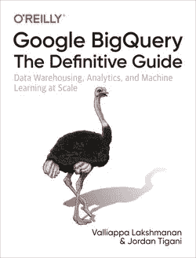
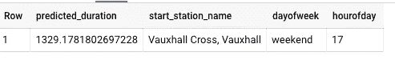

# 如何导出 BigQuery ML 模型并将其部署用于在线预测

> 原文：<https://towardsdatascience.com/how-to-export-a-bigquery-ml-model-and-deploy-it-for-online-prediction-a7e4d44c4c93?source=collection_archive---------40----------------------->

## 以 TensorFlow SavedModel 格式导出 BigQuery ML 模型并部署到云 AI 平台预测

在本文中，我将向您展示如何将 BigQuery ML 模型导出为 TensorFlow 的 SavedModel 格式。这将允许您将模型部署到任何支持 TensorFlow 服务的环境中。我将使用云人工智能平台预测来演示这一点，并向您展示如何调用在线预测。

## 1.训练 BigQuery ML 模型

当然，首先我们需要一个 BigQuery ML 模型。为了简单起见，我将在我们的书“ [BigQuery:权威指南](https://www.amazon.com/Google-BigQuery-Definitive-Warehousing-Analytics/dp/1492044466)”中使用的同一个伦敦自行车数据集上使用一个简单的线性模型。



首先，在 EU 位置创建一个数据集来保存训练好的模型(可以在 CloudShell 中运行这个命令，也可以从 BigQuery 控制台执行这个操作；请确保选择 EU 作为地点):

```
bq show ch09eu || bq mk --location=EU ch09eu
```

接下来，在 BigQuery 控制台中运行这个查询:

```
CREATE OR REPLACE MODEL ch09eu.bicycle_model_linear
OPTIONS(input_label_cols=['duration'], model_type='linear_reg')
ASSELECT 
  duration
  , start_station_name
  , IF(EXTRACT(dayofweek FROM start_date) BETWEEN 2 and 6, 'weekday', 'weekend') as dayofweek
  , FORMAT('%02d', EXTRACT(HOUR FROM start_date)) AS hourofday
FROM `bigquery-public-data`.london_bicycles.cycle_hire
```

这将创建一个名为 bicycle_model_linear 的模型，该模型采用 3 个输入(start_station_name、dayofweek、hourofday)来预测以秒为单位的持续时间。

## 2.在 SQL 中尝试批量预测

让我们试着调用 BigQuery 本身的模型。为此，运行以下查询:

```
SELECT * FROM ML.PREDICT(MODEL ch09eu.bicycle_model_linear,(
  SELECT
  'Vauxhall Cross, Vauxhall' AS start_station_name
  , 'weekend' as dayofweek
  , '17' AS hourofday)
)
```

这将返回:



如你所见，周末下午 5 点在沃克斯豪尔开始的一次骑行的预计持续时间是 1329 秒。

## 3.将模型导出到 Google 云存储

让我们从 BigQuery 下载这个模型作为 TensorFlow SavedModel。为此，从 CloudShell 运行以下命令:

```
PROJECT=$(gcloud config get-value project)
BUCKET=${PROJECT}-eu
gsutil mb -l eu gs://${BUCKET}
bq extract -m ch09eu.bicycle_model_linear \
           gs://${BUCKET}/bqml_model_export/bicycle_model_linear
```

该命令的作用是创建一个名为 xyz-eu 的 bucket，其中 xyz 是您的项目名称。然后，我们调用 bq extract 将模型导出到 GCS。

命令完成后，检查导出了哪些文件:

```
gsutil ls gs://${BUCKET}/bqml_model_export/bicycle_model_linear/
```

当我这么做的时候，我得到了:

```
gs://ai-analytics-solutions-eu/bqml_model_export/bicycle_model_linear/
gs://ai-analytics-solutions-eu/bqml_model_export/bicycle_model_linear/saved_model.pb
gs://ai-analytics-solutions-eu/bqml_model_export/bicycle_model_linear/assets/
gs://ai-analytics-solutions-eu/bqml_model_export/bicycle_model_linear/variables/
```

这是 TensorFlow SavedModel 格式。您可以将它部署到任何 TF 服务环境中进行在线预测。在 GCP，TensorFlow/xgboost/PyTorch/etc 的全托管服务环境。models 是云 AI 平台(CAIP)的预测。

## 4.将模型部署到云人工智能平台预测

为了部署模型，[从 GitHub](https://github.com/GoogleCloudPlatform/bigquery-oreilly-book/blob/master/blogs/bqml_model_export/deploy.sh) 存储库中下载 deploy.sh 并运行它:

```
./deploy.sh gs://${BUCKET}/bqml_model_export/bicycle_model_linear \
      europe-west1 london_bicycles bqml
```

deploy.sh 的作用是在 CAIP 预测中创建一个模型和模型版本，然后部署到其中。

部署模型可能需要 4-5 分钟，因此在进入下一步之前，请监控[https://console . cloud . Google . com/ai-platform/models/London _ bicycles/versions](https://console.cloud.google.com/ai-platform/models/$MODEL_NAME/versions)以确保模型已部署。

## 5.尝试在线预测

用我们想要发送给模型的输入创建一个名为 input.json 的文件。您可以通过在 CloudShell 中键入以下内容来实现这一点:

```
cat > input.json
```

然后，在提示符下，键入:

```
{"start_station_name": "Vauxhall Cross, Vauxhall", "dayofweek": "weekend", "hourofday": "17"}
```

最后，按 Ctrl-D 返回到提示符。

使用以下方式将 input.json 发送到 CAIP 预测:

```
gcloud ai-platform predict --model london_bicycles \
       --version bqml --json-instances input.json
```

当我这样做的时候，我回来了:

```
PREDICTED_LABEL
[1329.178180269723]
```

这与我们在 BigQuery ML 中进行批量预测时获得的持续时间相同。

CAIP 预测公开了一个采用 JSON 的 REST API，因此可以从任何能够进行 web 服务调用的语言中调用它。

尽情享受吧！

## 后续步骤:

1.  在 GitHub 上查看[查询和代码](https://github.com/GoogleCloudPlatform/bigquery-oreilly-book/tree/master/blogs/bqml_model_export)。
2.  阅读我们关于 BigQuery 的[书](https://www.amazon.com/Google-BigQuery-Definitive-Warehousing-Analytics/dp/1492044466)
3.  查看关于模型导出的[文档](https://cloud.google.com/bigquery-ml/docs/exporting-models)和[教程](https://cloud.google.com/bigquery-ml/docs/export-model-tutorial)