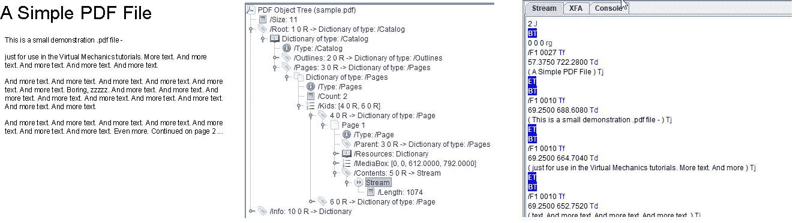
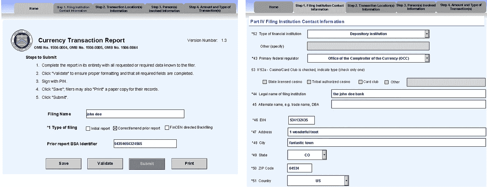
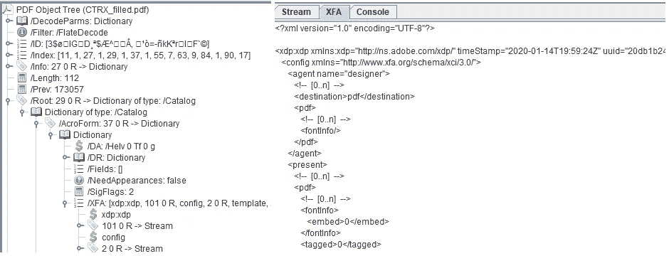
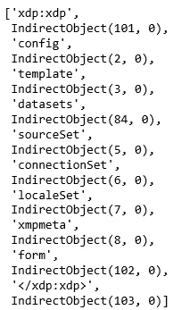
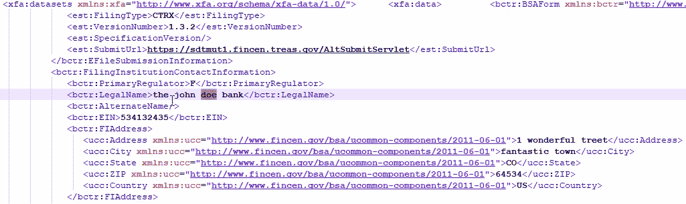
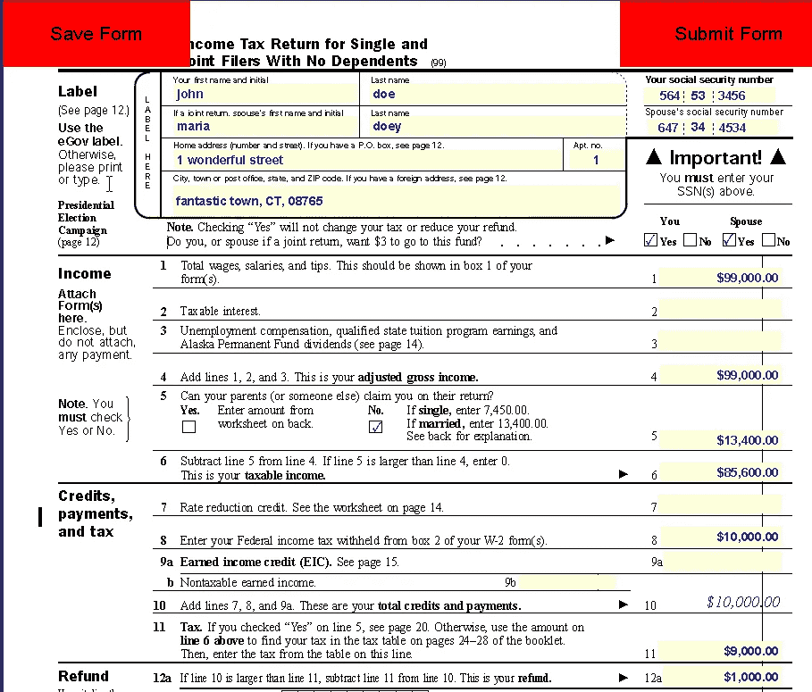
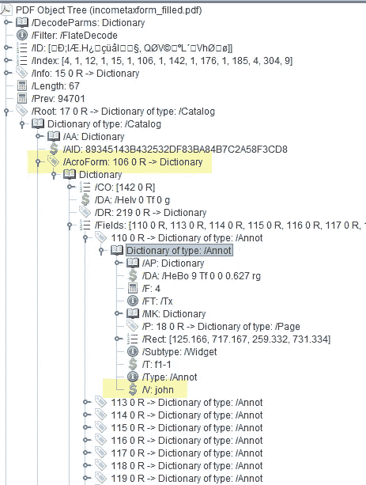
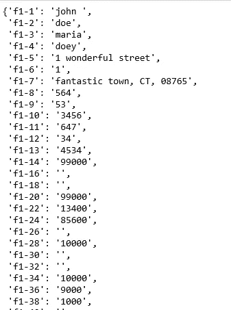

# 如何使用 Python 从 PDF 表单中提取数据

> 原文：<https://towardsdatascience.com/how-to-extract-data-from-pdf-forms-using-python-10b5e5f26f70?source=collection_archive---------0----------------------->

## 理解用于数据挖掘的 PDF 文档的对象模型


莱昂·德维耶在 [Unsplash](https://unsplash.com?utm_source=medium&utm_medium=referral) 上拍摄的照片

# 介绍

PDF 或可移植文档文件格式是当今最常用的文件格式之一。它广泛应用于企业、政府机构、医疗保健和其他行业。因此，存在大量 PDF 格式的非结构化数据，提取和分析这些数据以生成有意义的见解是数据科学家的共同任务。

我在一家金融机构工作，最近遇到一种情况，我们必须从大量 PDF 表单中提取数据。虽然有大量的工作可以用来描述从 PDF 文档中提取简单的文本，但是我很难找到一个全面的指南来从 PDF 表单中提取数据。我写这篇文章的目的就是开发这样一个指南。

有几个专门处理 PDF 文档的 Python 库，其中一些比另一些更受欢迎。出于本文的目的，我将使用 [PyPDF2](https://pypi.org/project/PyPDF2/) 。PyPDF2 是一个纯 Python 库，作为 PDF 工具包构建。作为纯 Python，它可以运行在任何 Python 平台上，没有任何依赖或外部库。您可以通过执行下面的代码来使用 pip 安装这个库。

```
pip install PyPDF2
```

一旦您安装了 PyPDF2，您应该已经准备好了。我们将快速浏览一下 PDF 文件的结构，因为这将帮助我们更好地理解从 PDF 表单中提取数据的编程基础。我将简要讨论广泛使用的两种 PDF 表单。然后，我们将直接进入示例，从两种类型的 PDF 表单中提取数据。

# PDF 文件的结构

不要把 PDF 文档看作一个整体，而应该把它看作一个对象的集合。所有这些物体都以一种固定的模式排列。如果您在文本编辑器(如记事本)中打开 PDF 文件，内容可能没有多大意义，看起来像垃圾。但是，如果您使用一个工具来提供对 PDF 对象的低级访问，您可以看到并欣赏底层结构。例如，请看下面的图 1。我用 iText RUPS 打开了一个简单的 PDF 文档。左边的图片是我在阅读器应用程序(Acrobat Reader)中打开的一个简单的 PDF 文档。中间的图像显示了由 RUPS iText 渲染的该文档的低级对象模型。右边的图像显示了捕获 PDF 第一页内容的数据流。正如您所看到的，对象模型(中间的图像)有一个固定的模式，并且封装了独立于软件、硬件、操作系统等呈现文档所需的所有元数据。这种结构是 PDF 如此通用和受欢迎的原因。



图 1—PDF 文件的结构

# PDF 表单

有两种主要类型的 PDF 表单。

1.  基于 XFA (XML 表单架构)的表单
2.  Acroforms

Adobe(开发 PDF 格式的公司)有一个名为 AEM(Adobe Experience Manager)Forms Designer 的应用程序，旨在使客户能够创建和发布 PDF 表单。Adobe 使用术语 PDF 表单来指代使用 AEM Forms Designer 创建的交互式和动态表单。这些 PDF 表单基于 Adobe 的 XML Forms Architecture (XFA ),后者基于 XML。这些表单本质上可以是动态的，可以根据用户输入重排 PDF 内容。

还有另一种类型的 PDF 表单，称为 Acroform。Acroform 是 Adobe 在 1996 年作为 PDF 1.2 规范的一部分引入的较早的原始交互表单技术。Acroforms 是定义静态布局的传统 PDF 与固定在顶部的交互式表单域的组合。首先，使用 Microsoft Word、Adobe InDesign 或 Adobe Illustrator 等设计表单布局。然后添加表单元素——字段、下拉控件、复选框、脚本逻辑等。

# 从基于 XFA 的 PDF 表单中提取数据

下面的图 2 显示了一个基于 XFA 的 PDF 表单的截图，我们将用它作为这个练习的例子。这是银行和其他机构用来向监管机构报告某些金融交易的货币交易报告表。这是一个动态表单，您可以根据需要报告的信息量来添加和删除部分。我已经用一些虚拟数据部分地填写了这个表格。



图 2 — XFA 表单示例

图 3 显示了这个表单的对象模型。图像右侧显示的 XML 文档构成了 XFA，它作为 XFA 键的值存储在 AcroForm 字典中(请看图像左侧的对象模型)。Acroform 字典是目录字典的子元素，目录字典位于 PDF 文件的根目录中。我们需要做的就是使用 PyPDF2 从这个文件的对象结构中访问 XML 文档。一旦我们访问了 XML，就很容易解析出 XML 文档来访问各种表单元素的值，然后可以将这些值存储到 Python 列表、Numpy 数组、Pandas dataframe 等中。为了分析的目的。



图 3 —示例 XFA 的对象模型

下面是提取组成这个表单的 XML 的代码。

```
import PyPDF2 as pypdfdef findInDict(needle, haystack):
    for key in haystack.keys():
        try:
            value=haystack[key]
        except:
            continue
        if key==needle:
            return value
        if isinstance(value,dict):            
            x=findInDict(needle,value)            
            if x is not None:
                return xpdfobject=open('CTRX_filled.pdf','rb')pdf=pypdf.PdfFileReader(pdfobject)xfa=findInDict('/XFA',pdf.resolvedObjects)
xml=xfa[7].getObject().getData()
```

在第一行中，我只是导入 PyPDF2 库，并为它提供一个别名——pypdf。第二行是函数定义的开始，通过提供字典键来查找字典的元素。您可能还记得我们上面的讨论，我们的 XML 嵌入在一个由键“/XFA”引用的字典中。这个函数帮助我导航 PDF 文件的复杂对象模型，它基本上是嵌入在多组字典中的一组字典。在函数定义之后的一行中，我正在读取 PDF 表单并创建一个 PdfFileReader 对象。该类的 resolvedObjects 方法将 PDF 对象模型分解为一组 Python 字典。然后，我调用 find submit 函数提取“/XFA”字典的元素，这是一个数组，如下面的图 4 所示。



图 4 — XFA 阵列

这个数组的第七个元素是组成表单的实际 XML 内容。它是一个间接对象。IndirectObject 是指向实际对象的别名。当同一对象出现在多个位置时，此引用有助于减小文件的大小。代码最后一行中使用的 getObject()方法检索实际的对象。如果对象是一个文本对象，使用 str()函数应该会给出实际的文本。否则，需要使用 getData()方法来呈现对象中的数据。下面是在上面代码的最后一行中检索到的一部分 XML 的快照。您可以看到我在示例表单中输入的一些虚拟地址数据。您可以很容易地从 XML 中解析出这些数据，并将其用于进一步的分析。



图 5 —从 XFA PDF 表单中检索到的 XML 的快照

# 从 Acroforms 中提取数据

这一个相对容易，因为我们已经在上面的章节中讨论了与 PDF 对象模型相关的大部分概念。下面是一份所得税表格的样本，我将用它作为例子。我在里面放了一些假数据。



图 6 — Acroform 示例

下面的图 7 显示了这个表单的对象模型。



图 7 — Acroform 示例对象模型

各个表单字段的值由嵌入在“/Fields”中的键“/V”引用，而键“/V”又嵌入在“/AcroForm”中。“/AcroFrom”是此 PDF 文件的根目录字典的子目录。我们可以使用我们在 XFA 表单中使用的方法，使用‘find submit’函数来检索'/Fields '字典，然后检索各个字段的值。幸运的是，PyPDF2 提供了一种更直接的方法来实现这一点。PdfFileReader 类提供了一个 getFormTextFields()方法，该方法返回所有表单值的字典。下面是简短的代码。图 8 显示了输出。dictionary 对象可以很容易地转换成一个列表或一个熊猫数据帧，以便进一步处理。

```
import PyPDF2 as pypdfpdfobject=open('incometaxform_filled.pdf','rb')pdf=pypdf.PdfFileReader(pdfobject)pdf.getFormTextFields()
```



图 8 — AcroForm 示例输出

# 结论

一旦您理解了底层对象模型，从 PDF 表单中提取数据就很容易了，PyPDF2 是一个强大的库，使您能够访问它。享受数据带来的乐趣！