# 如何从任何 Youtube 视频中提取面部表情、头部姿势和凝视

> 原文：<https://towardsdatascience.com/how-to-extract-facial-expressions-head-pose-and-gaze-from-any-youtube-video-2aa6590c2bb6?source=collection_archive---------10----------------------->

## 数据科学教程

## 使用 Google Colab & OpenFace 从 Youtube 视频中提取面部特征的教程，无需在笔记本电脑上安装任何程序。

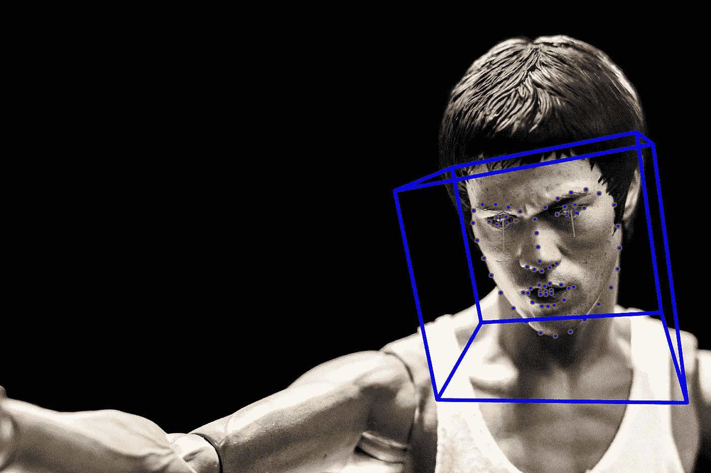

在 [Unsplash](https://unsplash.com?utm_source=medium&utm_medium=referral) 上[狂热的 Jan](https://unsplash.com/@ferventjan?utm_source=medium&utm_medium=referral) 拍照

通过研究人们的面部表情、头部姿势和凝视信息，可以研究和分析人们的感受、想法和兴趣。有许多公司和计算机视觉算法可以帮助从面部视频中提取这些面部特征，包括 [Emotient](https://www.crunchbase.com/organization/emotient) 和 Affectiva(它们的算法对比[这里](https://medium.com/@jinhyuncheong/face-analysis-software-comparison-affectiva-affdex-vs-openface-vs-emotient-facet-5f91a4f12cbb?source=friends_link&sk=fa98a9ac38c56b3f15b837718b2aea05)、[这里](https://link.springer.com/article/10.3758/s13428-017-0996-1))，但很少有公司免费提供这些服务，大多数公司要求用户购买订阅或按视频分钟付费。

在这篇文章中，我分享了一个免费的、易于使用的、健壮的面部特征提取付费服务的替代方案，它使用了 [OpenFace](https://github.com/TadasBaltrusaitis/OpenFace) ，这是一个最先进的面部动作单元识别、凝视估计、面部标志检测和头部姿势估计工具。在这里，我分享如何使用 [Google Colab Jupyter 笔记本](https://colab.research.google.com/gist/jcheong0428/c16146b386ea60fab888b56e8e5ee747/openface_shared.ipynb)的说明，它允许你设置 OpenFace 并从任何 [Youtube](http://www.youtube.com) 视频中提取面部特征，而不必在你的笔记本电脑上安装一个软件包。

[这里是笔记本的链接](https://gist.github.com/jcheong0428/c16146b386ea60fab888b56e8e5ee747)！

# 1.设置

您不需要在您的笔记本电脑上安装任何东西，但是您仍然需要在您的 Colab 实例上安装 OpenFace 包。不幸的是，这一部分可能需要一段时间(大约 40 分钟)，这段时间非常适合你看一些 Youtube 视频，以确定你想从哪个视频中提取面部特征。哦，你可能需要一个谷歌账户。

# 2.找个 Youtube 视频分析一下。

找一个你想分析的 Youtube 视频。它可以是一个人的面部视频，也可以是多个人的面部视频。只是要小心避免视频中的人脸太小，这使得大多数算法很难找到人脸。在本教程中，我们将从我和我的同事为 [Pioneer.app](https://pioneer.app/) 推出的一个应用创意 [TasteSpace](https://medium.com/tastespace) 中提取面部特征。下面的代码将向您展示感兴趣的视频。

这是我们将要使用的视频..我们正在描述一个名为 [TasteSpace](https://medium.com/tastespace) 的项目。

接下来的几行代码下载视频并剪辑视频的前几秒(10 秒)。这只是为了节省处理时间，所以如果你想处理整个视频，可以随意移除第五行的`-t 10`标志。

如果你想从整个视频中提取特征，你可以去掉“-t 10”标志(这会花更长时间)。

# 3.使用 OpenFace 处理视频

现在我们将使用可以同时从多张人脸中提取面部特征的`FaceLandmarkVidMulti`。

如果你在视频中一次只有一张脸，那么你可以使用`FeatureExtraction`来代替，或者如果你想从图像中提取特征，可以使用`FaceLandmarkImg`。[单击此处查看命令行函数及其参数的完整列表](https://github.com/TadasBaltrusaitis/OpenFace/wiki/Command-line-arguments)。

# 4.可视化结果！

您可以使用下面的代码来可视化结果，如果输出有意义，您可以直接从笔记本上检查。

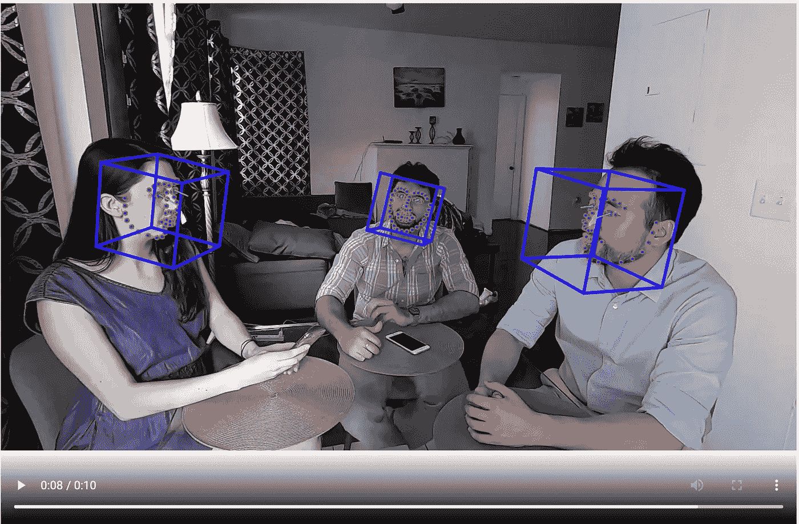

# 5.下载输出。

你现在可以通过打开你的 Colab 笔记本左边菜单上的文件标签来下载提取的面部特征，并将文件下载到`processed/videos.csv`文件夹中。

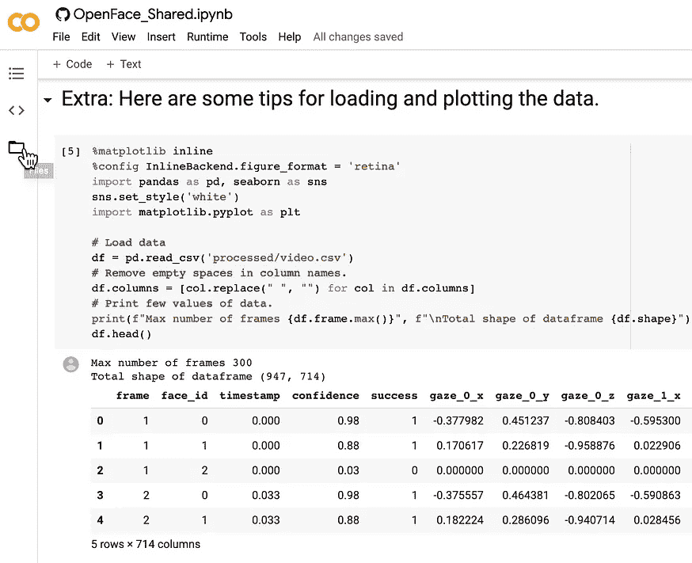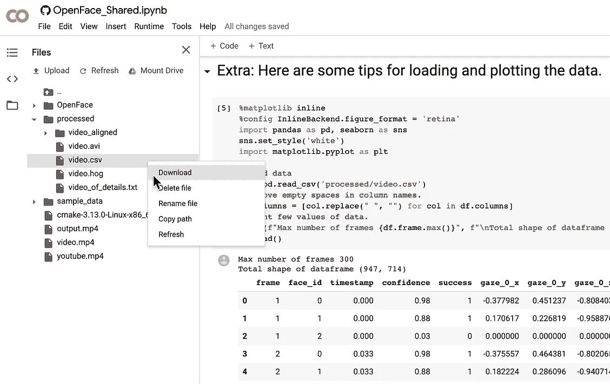

展开文件选项卡并下载结果。

# 结论

希望这是一个有趣的练习，教你如何使用 Google Colab 和 OpenFace 在几分钟内(安装后)从任何 Youtube 视频中提取面部特征。如果你有兴趣了解更多关于如何在这种面部表情数据中分析个体之间的同步性，请随时查看我以前关于如何做到这一点的帖子。

 [## 量化时间序列数据之间同步性的四种方法

### 用于计算同步指标的样本代码和数据，包括皮尔逊相关、时滞交叉相关…

towardsdatascience.com](/four-ways-to-quantify-synchrony-between-time-series-data-b99136c4a9c9) 

# 额外学分

如果你还在读这篇文章，你可能会对如何处理 OpenFace 的输出感兴趣，这里有一些额外的代码可以帮助你入门。

## 加载数据

首先，我们将数据加载到 Pandas 数据帧中，重命名列以消除空白，评估数据帧的形状、数据的最高帧数，并绘制数据的头部。

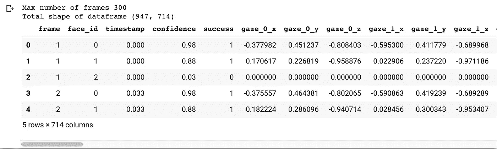

## 从视频中计数唯一个体的数量

您可能会注意到第`face_id`列，它试图区分视频中的个人。

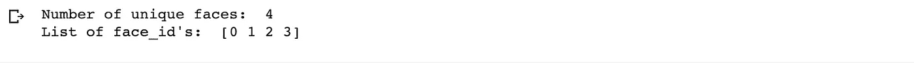

看起来我们有 4 张不同的脸，而不是 3 张！

## 从视频中检测人脸的平均模型置信度

我们可以使用以下函数进一步评估该算法检测每个人脸的置信度。

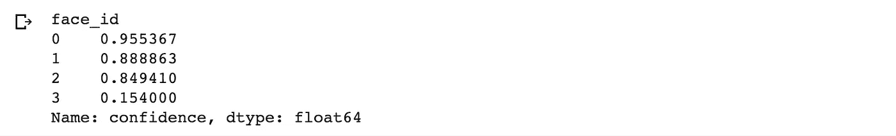

## 可视化视频中人脸的位置

我们看到`face_id==3`具有最低的置信度，这可能是被检测到的伪造人脸。让我们通过在整个剪辑中绘制人脸的位置来进一步检查这一点。

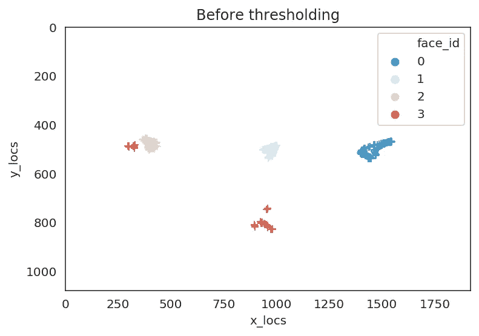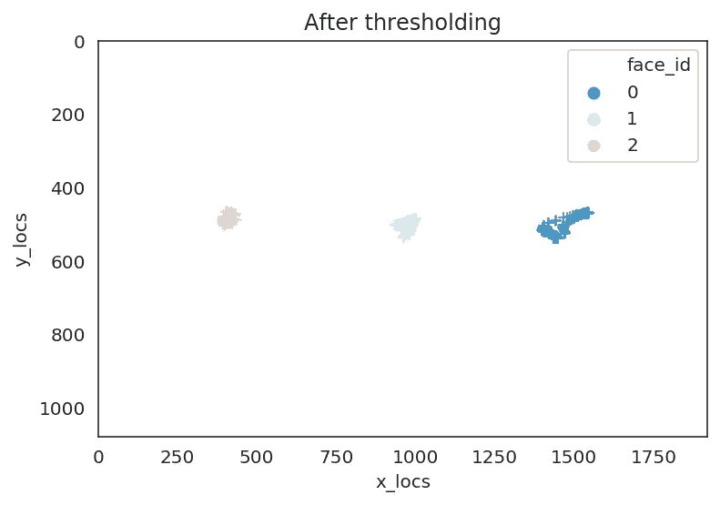

我们可以看到，在左边的图中，face_id==3 的脸确实在某个不存在脸的地方。我们可以根据任意置信水平(这里我们使用 80%)设定输出阈值，在左侧的图中我们可以看到，我们已经消除了伪脸。

## 分析面部肌肉随时间的运动

现在让我们画出每张脸的每个动作单元预测的轨迹随时间的变化情况。然后，我们将打印出视频中人们在一段时间内是如何相似地微笑的(动作单元 12)。

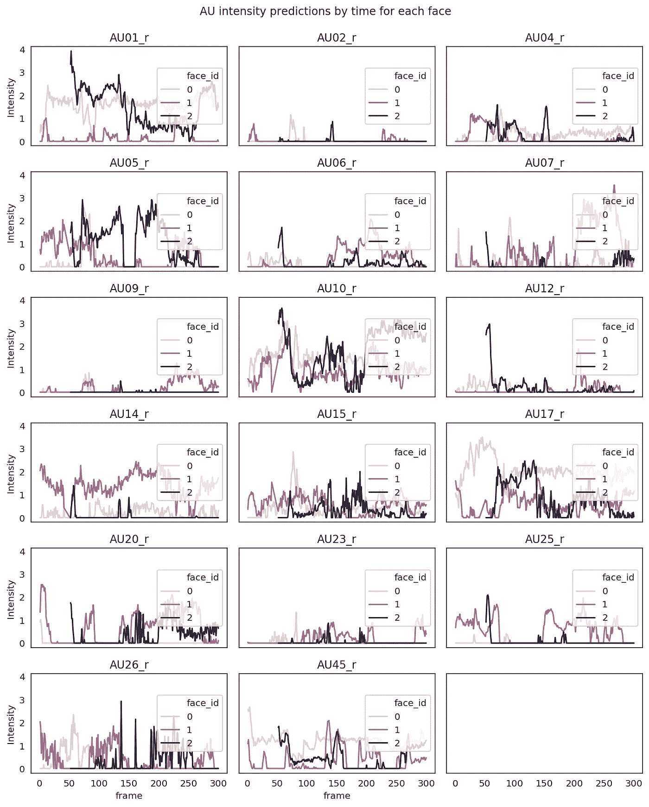

每个 face_id 的 AU 强度预测随时间的时间序列

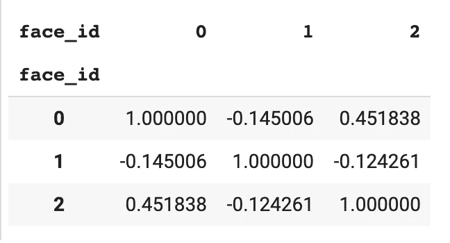

每对个体微笑的相关性(AU12)。

## 随着时间的推移分析眼睛凝视

最后，我们可以画出每个人在看哪里。这可能不是画弧度角的最好方法，但是你仍然可以感觉到每个面在看哪里。这通过了完整性检查，即左边的面(face_id==2)主要从原点(0，0)看向右边，右边的面(face_id==0)看向左边，中间的面看向两边。

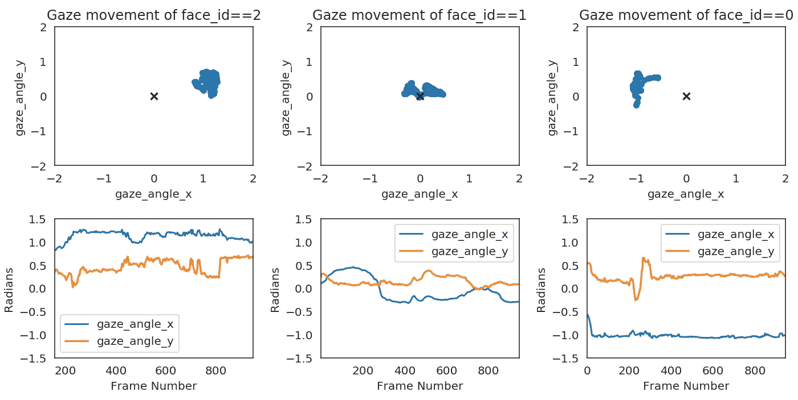

> 如果你想了解更多关于不同输出的信息，我强烈推荐你在 [OpenFace wiki](https://github.com/TadasBaltrusaitis/OpenFace/wiki/Output-Format) 中阅读更多关于每个输出代表什么的信息。

 [## 金玄昌-中

### 在媒体上阅读金贤昌的作品。人类行为和数据科学爱好者||认知神经科学博士…

medium.com](https://medium.com/@jinhyuncheong)