# 如何从维基百科中提取知识，数据科学风格

> 原文：<https://towardsdatascience.com/how-to-extract-knowledge-from-wikipedia-data-science-style-35f50f095d1a?source=collection_archive---------15----------------------->

## WikiData 和 SPARQL 查询语言简介

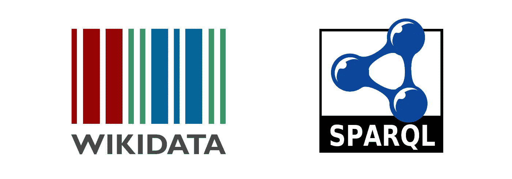

作为数据科学家，人们倾向于认为他们所做的是开发和试验复杂的算法，并产生最先进的结果。这在很大程度上是真实的。这是数据科学家最引以为豪的，也是最具创新性和回报最大的部分。但是人们通常看不到的是他们为收集、处理和整理数据而付出的汗水，这些数据带来了巨大的成果。这就是为什么你可以看到 SQL 出现在大多数数据科学家的职位要求上。

# SPARQL 是什么？

T 这是另一种查询语言，在从多个来源和数据库获取数据时可能非常有用，维基百科是其中最大的一个。查询语言叫做 [SPARQL](https://en.wikipedia.org/wiki/SPARQL) 。根据维基百科:

> **SPARQL** (读作" [sparkle](https://en.wiktionary.org/wiki/sparkle) "，是 **SPARQL 协议和 RDF 查询语言**的[递归缩写词](https://en.wikipedia.org/wiki/Recursive_acronym))是一种 [RDF 查询语言](https://en.wikipedia.org/wiki/RDF_query_language)——也就是说，一种用于[数据库](https://en.wikipedia.org/wiki/Database)的[语义](https://en.wikipedia.org/wiki/Semantic_Query) [查询语言](https://en.wikipedia.org/wiki/Query_language)——能够检索和操作存储在[资源描述框架(rdt23)中的数据](https://en.wikipedia.org/wiki/Resource_Description_Framework)

这不是一个很好的定义。它几乎没有告诉你它能做什么。把它翻译成人类可读的语言:

> SPARQL 是一种语法上类似于 SQL 的查询语言，但它工作在像 Wikipedia 这样的知识图数据库上，允许您通过定义一系列过滤器和约束来提取知识和信息。

如果这对你来说还是太抽象，请看下图:

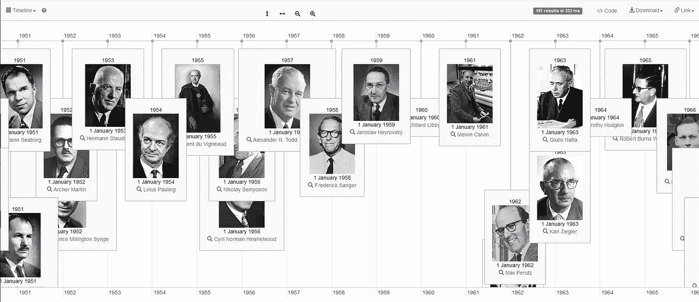

获得诺贝尔化学奖

这是一个诺贝尔化学奖的时间表，由[维基数据查询服务](https://w.wiki/4EU)网站使用以下代码生成:

```
#Awarded Chemistry Nobel Prizes
#defaultView:Timeline
SELECT DISTINCT ?item ?itemLabel ?when (YEAR(?when) as ?date) ?pic
WHERE {
  ?item p:P166 ?awardStat . # … with an awarded(P166) statement
  ?awardStat ps:P166 wd:Q44585 . # … that has the value Nobel Prize in Chemistry (Q35637)
  ?awardStat pq:P585 ?when . # when did he receive the Nobel prize

SERVICE wikibase:label { bd:serviceParam wikibase:language "en" . }
OPTIONAL { ?item wdt:P18 ?pic }
}
```

任何熟悉 SQL 的人都会发现上面的代码非常直观。我将使用另一个例子来解释基本上如何制定类似的查询来获得您感兴趣的结果。

# 起点:维基百科页面

PARQL 在多个知识图数据库上工作。要知道什么是知识图谱，先从大家都熟悉的东西说起:维基百科。当大多数人想要研究一个主题时，维基百科是他们的首选。如果你去 Python 创始人吉多·范·罗苏姆的页面，你会看到一个详细的页面，里面有各种有用的信息。

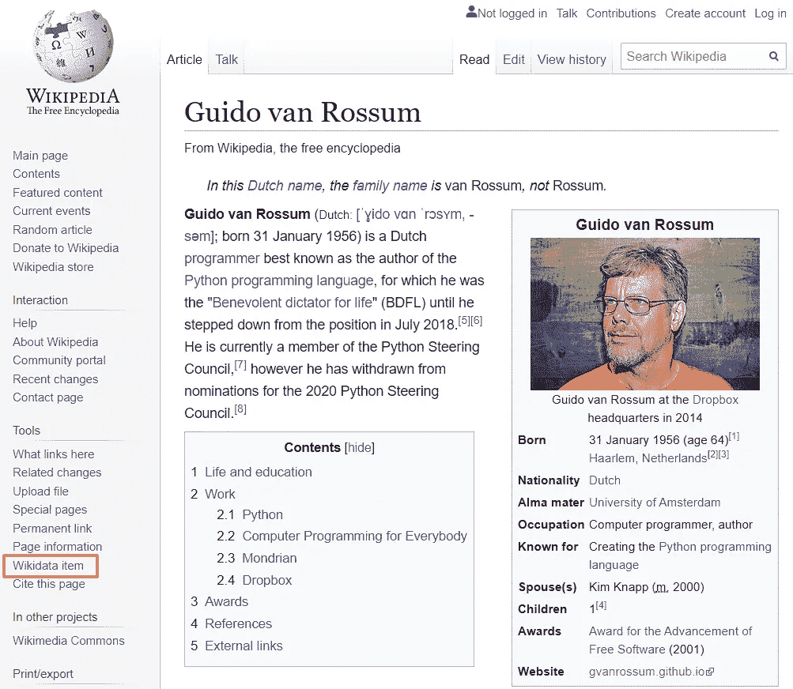

# 组织页面:维基数据

这个页面的问题在于它没有条理。你可以搜索关键词，但是你不能轻易地找出信息节点之间的关系。这就是知识图表发挥作用的地方。上面页面上的红色矩形拼写为“Wikidata Item”，单击它会将您带到同一页面的知识图表视图:


# 开始查询

在我们看到之前，所有关于 Guido 的信息都被很好地组织成类别，每个类别都有多个条目。使用 SPARQL，您可以很容易地查询这些信息。为此，维基百科提供了另一个页面，一个用户友好的查询服务，名为[维基数据查询服务](https://query.wikidata.org):

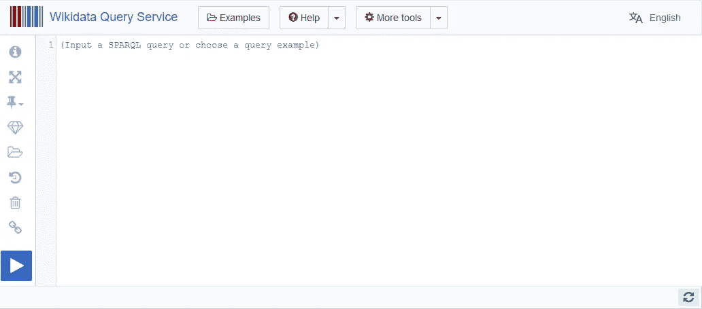

这是我们可以试验 SPARQL 的地方。在 WikiData 页面上，我们观察到 Guido 是一名程序员(显然！)，现在如果我们想知道在维基百科上有条目的其他程序员呢？让我们看看 SPARQL 代码:

```
SELECT ?personWHERE {?person wdt:P106 wd:Q5482740 .}
```

这里我们定义了一个`?person`作为感兴趣的**主题**，这也是我们的查询结果中的一列。然后我们用`WHERE`指定一些约束。约束是`wdt:P106`需要是`wd:Q5482740`。什么？你说。让我更详细地解释一下。`wdt`是主语的“谓语”或“属性”的前缀，而`wd`是属性的值(SPARQL 术语中的对象，但这并不重要)的前缀。`wdt:`表示我将在这里指定主题的一个属性，`wd:`表示我将指定这个属性的值。那么什么是`P106`和`Q5482740`？这些只是特定属性和值的代码。`P106`代表‘职业’，`Q5482740`代表‘程序员’。这行代码的意思是，我想让`?person`主题有一个‘程序员’的‘职业’属性。没那么可怕了，对吧？你可以在上面提到的维基数据页面上很容易地找到这些代码。

运行查询，您将获得以下结果:

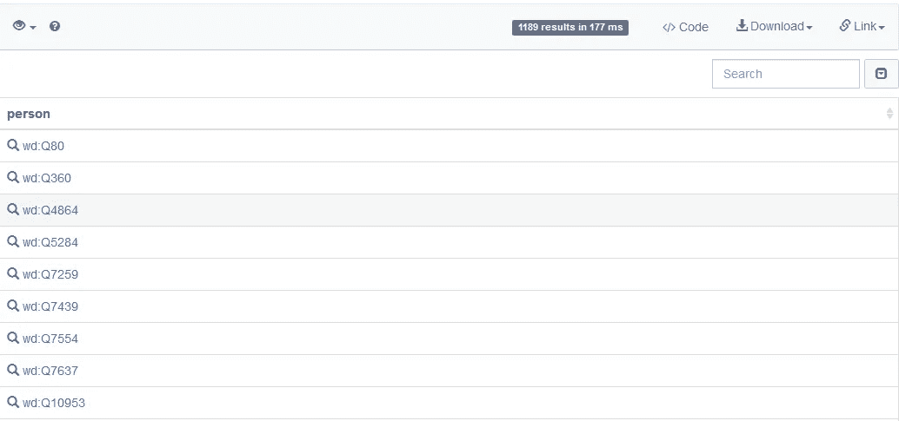

# 从代码到名称

我们得到了一堆`person`不同`wd:value`的物品。如果你仔细观察这个值，它们实际上是另一个人的代码。比如第一个`wd:Q80`是[WWW 的发明者蒂姆·伯纳斯·李](https://www.wikidata.org/wiki/Q80)。这是不直观的，我们希望能够直接看到名字。为此，我们添加了一个 WikiData“标签服务”,帮助我们将代码转换为名称，如下所示:

```
SELECT ?person ?personLabelWHERE { ?person wdt:P106 wd:Q5482740 .
  ?person rdfs:label ?personLabel .
  FILTER ( LANGMATCHES ( LANG ( ?personLabel ), "fr" ) ) 

}
```

类似的语法，我们希望`person` 有一个‘label’属性，我们定义了一个`personLabel` 值变量来保存这些值，这样我们就可以在查询结果中显示它们。此外，我们将`personLabel`添加到我们的`SELECT`短语中，因此它将被显示。请注意，我还在下面添加了一个过滤器，只显示法语语言标签，否则将为一个人显示多个语言标签，这不是我们想要的:

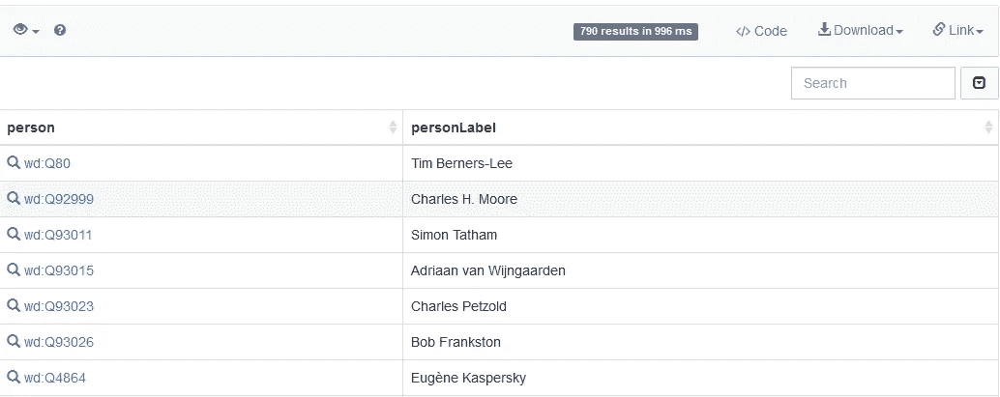

# 缩小范围

从上面的结果中，我们可以看到我们有大约 790 个结果。这太多了。让我们把范围缩小到那些在行业中“重要”的人。具有“值得注意的工作”属性的人:

```
SELECT ?person ?personLabel ?notableworkLabelWHERE {?person wdt:P106 wd:Q5482740 .
  ?person rdfs:label ?personLabel .
  FILTER ( LANGMATCHES ( LANG ( ?personLabel ), "fr" ) ) 

  ?person wdt:P800 ?notablework .
  ?notablework rdfs:label ?notableworkLabel .
  FILTER ( LANGMATCHES ( LANG ( ?notableworkLabel ), "fr" ) ) 

}
```

再次，`wdt:P800`表示‘值得注意的作品’属性，其他都类似。然后我们得到以下结果:

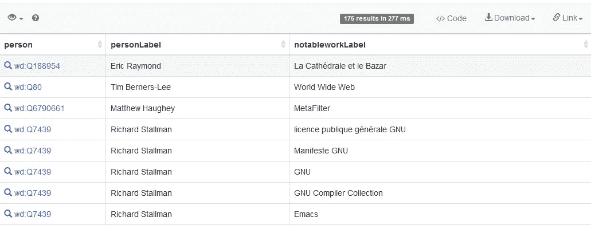

# 组合多个标签

现在我们只有 175 个结果，每个人值得注意的工作也列出来了。但是等等，为什么我们有五个理查德·斯托尔曼？原来，理查德有不止一部著名的作品，因此在搜索结果中多次出现。让我们通过将所有值得注意的工作归入一个属性来解决这个问题:

```
SELECT ?person ?personLabel ( GROUP_CONCAT ( DISTINCT ?notableworkLabel; separator="; " ) AS ?works )WHERE {?person wdt:P106 wd:Q5482740 .
  ?person rdfs:label ?personLabel .
  FILTER ( LANGMATCHES ( LANG ( ?personLabel ), "fr" ) ) 

  ?person wdt:P800 ?notablework .
  ?notablework rdfs:label ?notableworkLabel .
  FILTER ( LANGMATCHES ( LANG ( ?notableworkLabel ), "fr" ) ) 

}GROUP BY ?person ?personLabel
```

这里用的是‘T1’。还有，`GROUP_CONCAT`函数用于将多个`notableworkLabel` 串联成一个新列`works` ( *我不会解释这些函数是如何工作的，只是想快速向您展示 SPARQL 能做什么。如果你想了解更多，请随时谷歌，那里有大量的教程文章和视频)*:

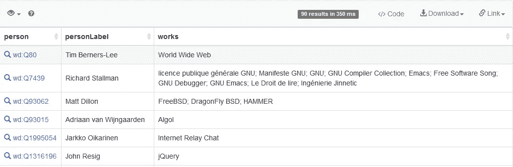

# 表面

现在我们有一个 90 个结果的列表，包括软件工程世界中所有的“名人录”。但是 SPARQL 可以做得更多。让我们给这些名字添加一些面孔:

```
SELECT ?person ?personLabel ( GROUP_CONCAT ( DISTINCT ?notableworkLabel; separator="; " ) AS ?works ) ?imageWHERE {?person wdt:P106 wd:Q5482740 .
  ?person rdfs:label ?personLabel .
  FILTER ( LANGMATCHES ( LANG ( ?personLabel ), "fr" ) ) 

  ?person wdt:P800 ?notablework .
  ?notablework rdfs:label ?notableworkLabel .
  FILTER ( LANGMATCHES ( LANG ( ?notableworkLabel ), "fr" ) ) 

  OPTIONAL {?person wdt:P18 ?image}

}GROUP BY ?person ?personLabel ?image
```

同样的模式，我们只是添加了一个`OPTIONAL` 关键字 prior，因为我们不想排除那些在个人资料中没有图片的人。我们还将视图切换到“图像网格”:

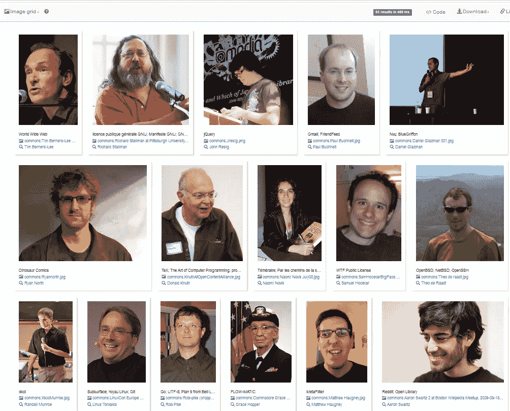

# 他们在哪里？

哇！这样好多了。我看到了一些熟悉的面孔！也许你想知道这些家伙在哪里？让我们来看看:

```
#defaultView:ImageGridSELECT ?person ?personLabel ( GROUP_CONCAT ( DISTINCT ?notableworkLabel; separator="; " ) AS ?works ) ?image ?countryLabel ?coodWHERE {
  ?person wdt:P106 wd:Q5482740 .
  ?person rdfs:label ?personLabel .
  FILTER ( LANGMATCHES ( LANG ( ?personLabel ), "fr" ) ) 

  ?person wdt:P800 ?notablework .
  ?notablework rdfs:label ?notableworkLabel .
  FILTER ( LANGMATCHES ( LANG ( ?notableworkLabel ), "fr" ) ) 

  OPTIONAL {?person wdt:P18 ?image} OPTIONAL {?person wdt:P19 ?country .
           ?country rdfs:label ?countryLabel .
            ?country wdt:P625 ?cood .
            FILTER ( LANGMATCHES ( LANG ( ?countryLabel ), "fr" ) )
           }}GROUP BY ?person ?personLabel ?image ?countryLabel ?cood
```

你也许可以破译你上面的密码。基本上就是说我要这个人有一个属性`country`，放入一个变量`country`，然后找出国家的`coordinates` ，放入一个变量`cood`。有了坐标，我们可以激活“地图”视图:

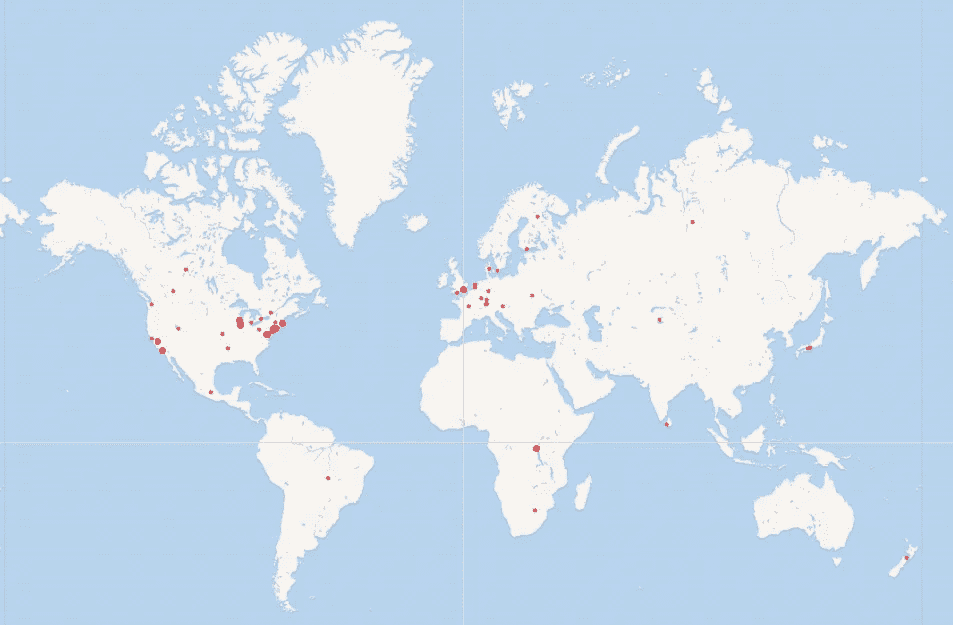

我们可以看到，美国有很多，欧洲有一些，世界其他地方也有一些。

# 更多示例

通过几行代码，我们找出了软件行业中的重要影响者，他们为人所知，他们在哪里，他们看起来怎么样。如你所见，这里的潜力是无限的。

你可以点击维基数据页面上的“**示例**”按钮，找到更多有趣的例子。

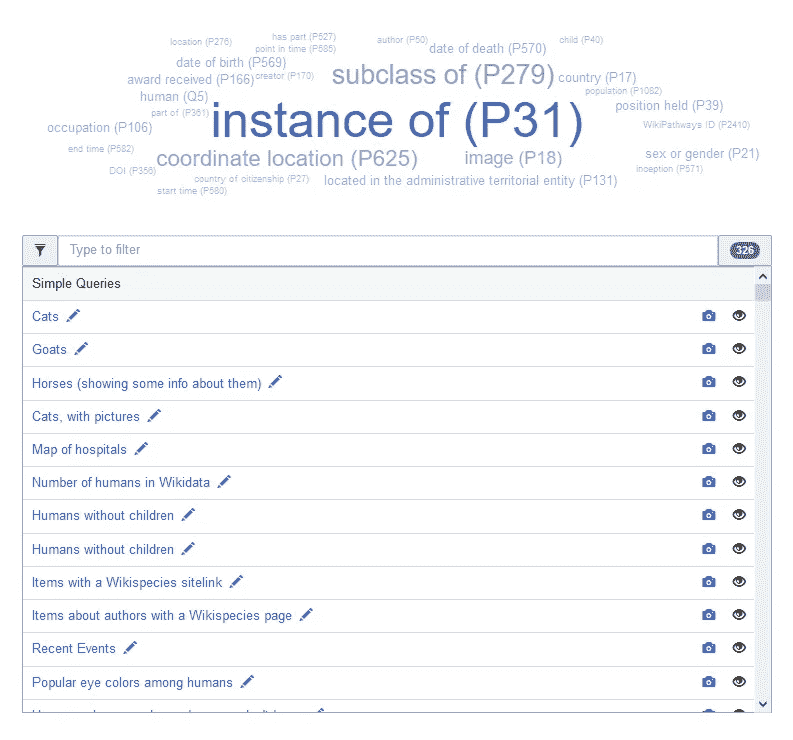

作为本文的一项任务，您能想出如何添加“出生日期”属性并生成一个类似本文开头的时间线图吗？

# 结论

在这篇文章中，我们使用 WikiData 作为知识图示例来介绍 SPARQL 查询语言。还有其他知识图表，如 [DBpedia](https://en.wikipedia.org/wiki/DBpedia) 等。这篇文章绝不是一个全面的教程。我只是想把这种语言介绍给更多的人，这样知识和信息的提取就能更有效地进行。

觉得这篇文章有用？在 Medium 上关注我([李立伟](https://medium.com/u/72c98619a048?source=post_page-----dbe7106145f5----------------------))或者你可以在 Twitter [@lymenlee](https://twitter.com/lymenlee) 或者我的博客网站[wayofnumbers.com](https://wayofnumbers.com/)上找到我。你也可以看看我下面最受欢迎的文章！

[](/this-is-cs50-a-pleasant-way-to-kick-off-your-data-science-education-d6075a6e761a) [## “这是 CS50”:开始数据科学教育的愉快方式

### 为什么 CS50 特别适合巩固你的软件工程基础

towardsdatascience.com](/this-is-cs50-a-pleasant-way-to-kick-off-your-data-science-education-d6075a6e761a) [](/two-sides-of-the-same-coin-fast-ai-vs-deeplearning-ai-b67e9ec32133) [## 一枚硬币的两面:杰瑞米·霍华德的 fast.ai vs 吴恩达的 deeplearning.ai

### 如何不通过同时参加 fast.ai 和 deeplearning.ai 课程来“过度适应”你的人工智能学习

towardsdatascience.com](/two-sides-of-the-same-coin-fast-ai-vs-deeplearning-ai-b67e9ec32133) [](/what-you-need-to-know-about-netflixs-jupyter-killer-polynote-dbe7106145f5) [## 你需要了解网飞的“朱庇特黑仔”:冰穴📖

### 是时候让 Jupyter 笔记本有个有价值的竞争对手了

towardsdatascience.com](/what-you-need-to-know-about-netflixs-jupyter-killer-polynote-dbe7106145f5)