# 解决基于人工智能的搜索引擎的最大挑战之一:相关性

> 原文：<https://towardsdatascience.com/how-to-extract-relevance-from-clickstream-data-2a870df219fb?source=collection_archive---------27----------------------->

## 让我们学习如何实现点击模型，以便从点击流数据中提取相关性。

图片作者:约书亚·戈德

构建搜索引擎系统通常遵循一些众所周知的步骤:

*   为搜索操作选择合适的数据库。
*   保存一组文档。
*   将转换应用到文档字段(删除重音符号、过滤复数、断开空格……)。
*   创建检索这些文档的查询规则。

这些步骤往往是为给定应用程序实现足够有效的搜索引擎系统所必需的。

最终，可能需要升级系统以提供定制的结果。这样做应该很简单。人们可以从一组机器学习排序算法中进行选择，训练一些选定的模型，为生产做准备并观察结果。

事实上，除了一个缺失的部分之外，它可能就是这么简单:不管选择的排名模型是什么，我们仍然需要以某种方式准备一个能够教授算法如何正确排名的训练数据集。无论如何，一定会有一个数据集告诉算法什么是好文件，什么是坏文件。

这将是这篇文章的重点。为了用人工智能算法推动搜索引擎更上一层楼，一个“教导”算法如何正确排列结果的训练数据是根本。

我们将讨论如何使用 [ClickModels](https://github.com/varepsilon/clickmodels) ，一个使用[概率图形模型](https://en.wikipedia.org/wiki/Graphical_model) (PGM)的字段，来开发一组解释用户和检索到的文档之间的交互的变量。这些变量将为我们提供相关性(或判断，也在文献中已知)的概念，它基本上作为一个标记，表明一个文档对于给定的搜索查询有多少价值。

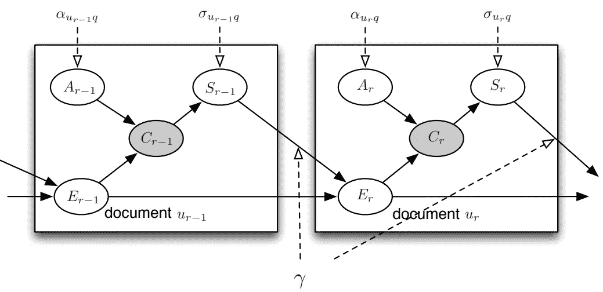

用于从点击流数据推断相关性的图形模型示例。图片摘自 [clickmodels 图书](https://clickmodels.weebly.com/uploads/5/2/2/5/52257029/mc2015-clickmodels.pdf)公开发售。

我们的挑战将是创建一个概率模型，从用户交互中学习每个查询和上下文有多少相关文档。基于 Cython 构建的最终代码可以在 [pyClickModels](https://github.com/WillianFuks/pyClickModels) 存储库中找到(Cython 是必需的，因为这些算法的优化过程可能需要相当长的时间才能收敛)。

所以，事不宜迟，让我们看看如何将搜索引擎提升到一个新的水平。

# 那么，相关性为什么？

弄清楚什么对人们是相关的可能是相当具有挑战性的。想象一下，为一个电子商务商店建立一个搜索引擎。

搜索查询“智能手机”的搜索结果示例。图片作者。

在这种环境下(我们可以说大多数检索引擎在相似的环境下工作)，观察到的数据包含:

*   用户在搜索什么。
*   搜索的背景(用户的地区、人口统计数据、他们的偏好等等)。
*   他们点击的产品。
*   他们点击后购买的产品。

我们期望从搜索结果页面购买的产品是非常相关的，所以它们应该有一个良好的相关性得分。但是后来我们意识到，可能有一些产品没有展示给用户(例如，在第 2 页或更高的页面上的产品)，他们最终会享受到更多！

不仅如此，在向用户排列项目时，往往会观察到几个模式。例如，结果页面上的第一个文档[往往比其他文档获得更多的点击](https://static.googleusercontent.com/media/research.google.com/en//pubs/archive/46485.pdf)，这不一定是因为它是适合查询的产品，而仅仅是因为它位于目录的第一个位置(也称为“位置偏差”)。

现在事情开始变得棘手了。

找到什么与人们相关的一个方法就是简单地问他们。有趣的是，这实际上是一些公司使用的一种可用的解决方案。但是这种方法的缺点是，它不能很好地扩展，而且通常不太准确。

另一种方法，也是我们感兴趣的方法，从点击流的数据中推断出隐含的相关性。*点击流*数据基本上是用户与搜索引擎系统本身的浏览交互的记录。这里有一个例子:

*点击流*数据示例。

我们可以使用这些信息来模拟每个文档与每个查询的相关程度。

# 点击救援模型！

从*点击流*数据中提取相关性的一种方法是使用由 PGM 组成的*点击模型*，以推断用户点击文档的可能性。我们可以假设点击的概率越高，相应地，文档可能越相关。

接下来，这里讨论的想法和概念是从 Aleksandr Chuklin 和其他人的书[网络搜索的点击模型](https://www.amazon.com/Synthesis-Lectures-Information-Concepts-Retrieval/dp/1627056475)中摘录的。

我们有许多方法来模拟用户与文档排序列表的交互。这里，[动态贝叶斯网络](https://en.wikipedia.org/wiki/Dynamic_Bayesian_network#:~:text=A%20Dynamic%20Bayesian%20Network%20(DBN,other%20over%20adjacent%20time%20steps.) (DBN)方法将被选为讨论和实现的方法。请记住，一旦您理解了模型背后的概念和理论，您就可以使用您认为合适的任何变量来推断这些知识。例如，亚历山大的书讨论了其他几种模型。

首先，这里是用于从数据中提取相关性的 DBN 的图形表示:

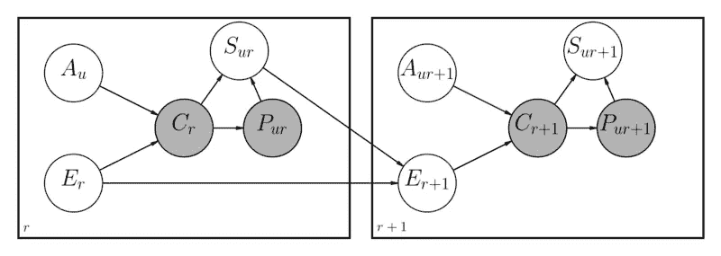

为查找与搜索引擎结果相关联的文档的相关性而实现的图形模型的示例。图片作者。

这个模型中的所有变量都遵循伯努利分布，这意味着它们可以是 0 或 1，有一定的概率 p。这些是从网上掌握的主要概念:

*   `r`表示与搜索页面中给定文档相关联的位置；`r=0`表示第一个文件，`r+1`表示从`r`位置开始的下一个文件。
*   `u`是文档的标识符。
*   `E_r`是一个被称为“考试”的随机变量。顾名思义，它决定了用户是否检查了文档(即 E=1)或 E=0)。如果没有经过检查，文档就不会有点击和购买。
*   `A_u`表示对应文档`u`对结果是否有吸引力。如果文档是吸引人的(A=1)，则观察到点击事件。
*   `S_ur`表示位置 r 的文件是否令客户满意。当他们满意时(S=1)，他们停止检查新文档。购买的文件被认为是令人满意的。
*   `C_r`是观察到的点击变量，来自点击流数据集。
*   `P_r`与观察到的购买事件相关。如果 P=1，那么 S=1。这个变量只有在文档出售时才有意义。
*   *γ* 是用户在不满意时继续检查大于`r`位置的文档的概率。

使用我们之前的智能手机示例，以下是 DBN 的表示方式:

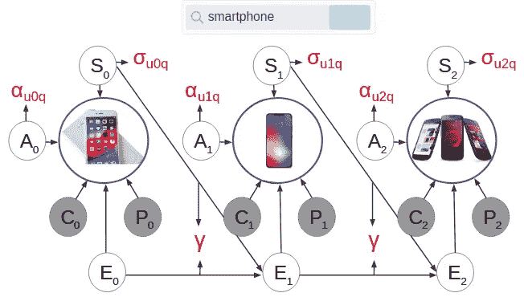

与智能手机搜索结果关联的 DBN 模型。图片作者。

请注意，对于每个文档，我们都关联了一组潜在变量(**A**t 吸引力， **S** 满意度， **E** 检查)，这些变量模拟了用户如何以及为什么与引擎结果交互。*点击*和*购买*用灰色填充，因为它们是观察变量(*点击流*数据)。

这里有一个问题:如果我们指定代表每个潜在变量的概率的值，我们可以使用这些相同的值来推断每个文档与每个搜索查询的相关性。

例如，假设我们将 *α* 与 *σ* 相关联，以表示给定文档对用户有吸引力的概率。如果我们使用一些优化技术从数据中学习这些值应该是什么，我们可以找到每个文档的相关性。

为此，让我们开始用一组规则来描述我们的网络(这些规则将用于优化过程):

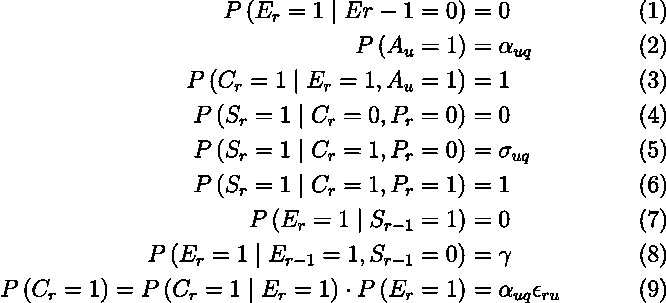

DBN 主要方程用来描述优化过程应该如何操作。

以下是对每条规则的简要解释:

**(1)** 表示在`r-1`处的先前文档未被检查的情况下，用户检查给定等级`r`处的给定文档的概率为零。

**(2)** α是决定吸引力概率等于 1 的参数。

**(3)** 如果一个文档被检查并且有吸引力，我们必须观察点击。

**(4)** 如果一个文档没有被点击也没有被购买，那么对于给定的查询，它不能被认为是满意的。

**(5)** 如果一个文档被点击但没有被购买，文档满意的概率是σ。

**(6)** 如果观察到点击和购买，满意度为 1。

**(7)** 如果之前的文档令人满意，用户将不会继续检查新产品。

**(8)** 如果一份文件不符合要求，且之前的文件已经过检查，则客户将继续检查新文件，可能性为 *γ。*

**(9)** 观察到点击的概率由点击给定检查的概率乘以由α * ε给出的检查概率(贝叶斯规则，其扩展为与被点击和检查的概率相同)给出。

有了支配 DBN 模型的方程，可以使用一些技术来找到最好地解释观察到的数据的α、σ和 *γ* 的值。

第一种技术是最大似然估计( [MLE](/probability-concepts-explained-maximum-likelihood-estimation-c7b4342fdbb1) )的直接实现。它基本上包括找到模型可能性的表达式(用对数表示)，即在给定模型变量的情况下观察到数据的概率。

在我们的例子中，我们的 DBN 具有以下对数似然表达式:

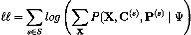

*   **X** 是用于描述数据的每个伯努利变量(在我们的例子中，是“A”、“S”和“E”)。
*   **C** 和 **P** 是观察到的点击量和购买量。
*   **ψ** 是我们要寻找的描述数据的变量集合(α，σ和 *γ* )。

求和发生在代表会话的“ *s* 上，它代表用户与搜索引擎的交互。

在 MLE 方法中，我们可以简单地对每个潜在变量取这个表达式的导数，并使其等于零。但是这种方法效果不太好。问题是，由于潜在的变量，最终的表达式很难求解。

这实际上是一个已知的问题。事实证明，除了 MLE，另一种技术是[期望最大化](https://medium.com/@jonathan_hui/machine-learning-expectation-maximization-algorithm-em-2e954cb76959)算法(EM)(它的工作方式有点像流行的 [*kMeans*](/k-means-clustering-algorithm-applications-evaluation-methods-and-drawbacks-aa03e644b48a) 算法)。

它首先将随机期望值分配给潜在变量α、σ和 *γ* 。然后，通过使用特定的成本函数，继续迭代优化过程。为变量分配新值，并重复该过程，直到达到收敛或总迭代次数。

用作优化参考的成本函数由下式给出:

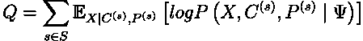

它类似于前面看到的对数似然表达式，但它用随机变量的期望值代替了表达式的一部分，这使得求导变得容易得多(但它最终也是最优解的近似值)。

这是我们的模型中定义的成本函数 **Q** :

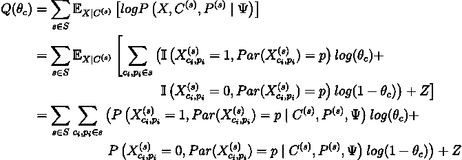

*Par(****X****)= p*指变量 **X** 的双亲。例如，在我们的 DBN 中，给定网络的边连接，变量 **S** (满意度)将点击和购买作为其父变量。变量 **θ** 代表我们试图寻找的潜在参数(α等)。 **I** 是[指示函数](https://en.wikipedia.org/wiki/Indicator_function)， **Z** 只是与 **θ** 无关的值的参考，在推导过程中会被丢弃。

通过使用随机变量的期望值，我们所完成的是，现在推导这个方程要简单得多。这是我们已经得到的 **θ** 的隔离结果:

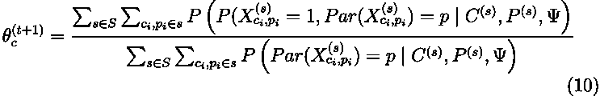

这基本上是期望最大化算法的本质。我们首先将对数似然表达式中的随机变量替换为它们的期望值，然后推导出使其等于零的方程。我们获得了用于每个变量的优化规则(等式 10 ),该优化规则应该缓慢地收敛到局部或全局最小值。

让我们看看如何使用等式 10 的定义来调整每个变量。

# 吸引力——α

首先，吸引力变量被定义为:

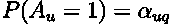

*q* 表示查询，而 *u* 表示文档。在我们的 DBN 表示中，注意α没有任何父代，所以它是直接定义的。

为了开发它的优化方程，首先我们需要如下描述与文档检查相关联的概率:

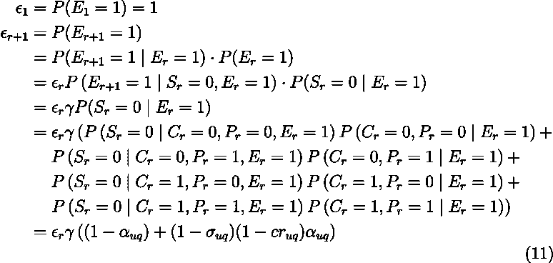

其中`cr`是给定查询`q`的给定文档`u`的转化率，定义为总销售额除以该文档在给定查询 *q* 的结果页面中出现的总次数。它只在文件出售时定义，否则它被认为是零。

到目前为止，我们知道:

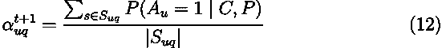

其中|S|是查询 *q* 的搜索结果页面返回文档 *u* 的所有会话的基数。

注意，给定我们的 DBN 的架构，变量`C`和`P`是[独立的](https://en.wikipedia.org/wiki/Conditional_independence)给定`C`，这意味着我们只需要考虑前者:

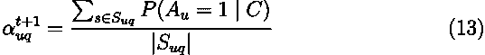

等式 13 可以进一步展开如下:

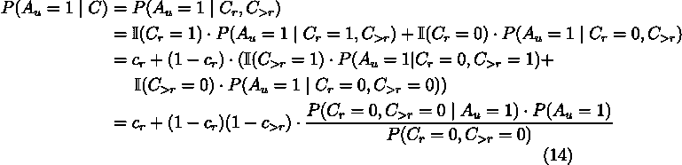

如果在`r`上方观察到任何点击，则`C_{>r}`为 1，否则为 0。

对于分子 14，我们可以进一步展开为:

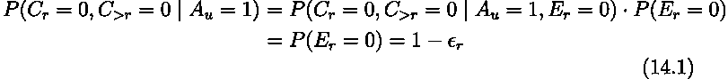

分母有点复杂:

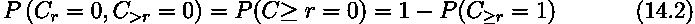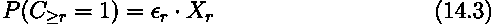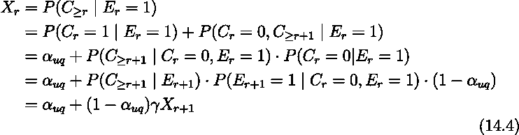

等式 14.4 应该递归实现。你可以在 [pyClickModels](https://github.com/WillianFuks/pyClickModels/blob/master/pyClickModels/DBN.pyx#L380) 上看到它是如何完成的，这里有一个例子:

最后，我们可以使用所有这些等式，并将它们融合在一起，得出调整吸引力变量的最终规则:

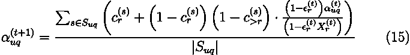

您可以在这里看到这个规则是如何在 pyClickModels 上实现的:

# 满意度——σ

在我们的 DBN 中，满意度变量σ确实有双亲。因此，根据等式 10，我们只需要在定义变量的地方使用会话，给定适当的父变量。

具体来说，等式 5 已经描述了它。我们有:

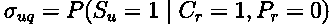

因此，使用等式 10，我们得到:

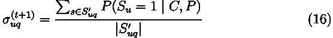

`S'_{uq}`包含文档`u`被点击但未被购买的所有会话。

(16)的分子可以进一步展开为:

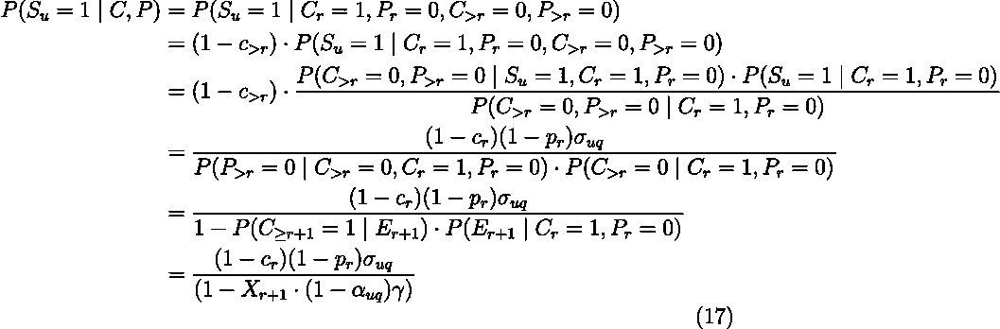

这直接归结为满足的适应规则:

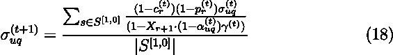

这比吸引力更直接。这个等式是如何实现的:

# 坚持——𝛾

现在，最具挑战性的变量出现了。

注意，正如我们的 DBN 中所定义的，持久性是全局定义的，也就是说，它不依赖于要定义的查询或文档。

如前所述，它由下式给出:

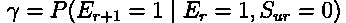

为了获得𝛾的更新规则，我们将使用以下预期充分统计(ESS):

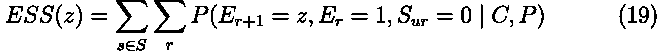

其中`E_r`和`S_ur`是`E_{r+1}`的父母。

为了进一步开发 19，可以实现辅助功能**φ**。我们会有:

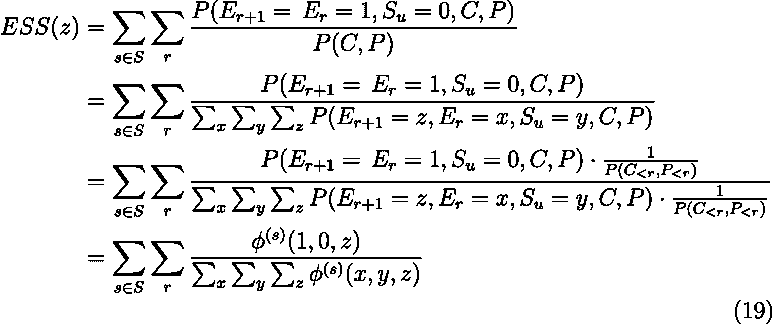

其中:

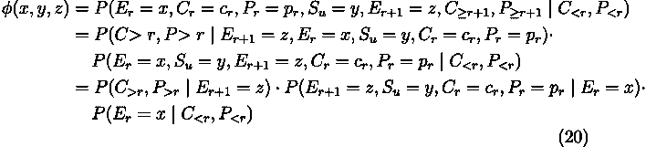

策略是将等式 20 分成 3 个主要部分:

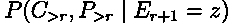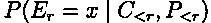

第三个发展为:

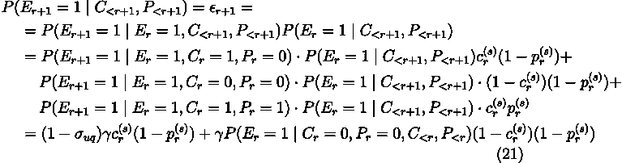

为了发展内部概率方程，我们有:

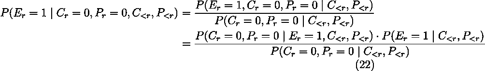

还有一点:

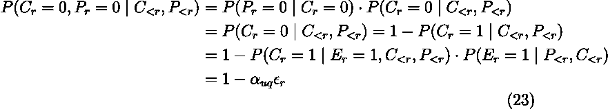

用 22 和 23 乘以 21，我们最终得到:

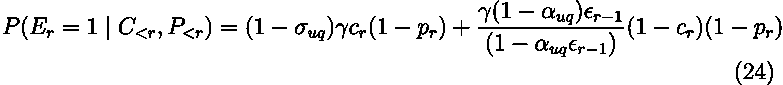

第一个公式为(注意可变转换率在这里被称为“w”):

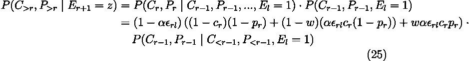

最后，第二个等式是等式 1 至 9 的直接实现。

你可以在这里看到这三个等式是如何实现的:

更新参数很简单:

最后，这就是实现前面定义的 DBN 所需的全部工作。

好吧，现在回到我们的主要目标，我们如何从中提取相关性？

# 最后…相关性

现在很简单了。在使用点击流数据训练模型之后，我们将获得吸引力和满意度的优化值(记住这些值仍然可以指局部最优值)。

排名相关性或判断仅仅是两者的产物，即:

在 pyClickModels 中，可以在拟合模型后导出判断值。为每个搜索查询/上下文和所有相应的文档创建一个换行符分隔的 JSON 文件。

# 将所有这些放在一起:编码时间

现在让我们来看看所有这些概念的实际应用。

事实证明，我们可以使用谷歌大查询上的[公共数据集](https://console.cloud.google.com/marketplace/product/obfuscated-ga360-data/obfuscated-ga360-data?filter=solution-type:dataset&filter=category:analytics&id=45f150ac-81d3-4796-9abf-d7a4f98eb4c6&project=pyclickmodels&folder=&organizationId=)来测试这些想法。在实践中，我们将查询 Google Analytics 的一个样本，从中我们可以提取客户，他们搜索、点击和购买了什么(尽管如此，我们只能访问很少的数据，所以这仍然是一个简单的实验)。

下面是我们测试所需的代码:

它需要 GCS 客户端和 pyClickModels，两者都可以安装:

`pip install pyClickModels google-cloud-storage`

只需将代码复制并粘贴到您的本地，然后用 Python 运行它。文件将在`/tmp/pyclickmodels/model/model.gz`保存。打开该文件，您应该看到几行 JSON 代码，如下所示:

请注意，库返回整个搜索上下文作为关键字(在这种情况下，它使用用户通过哪个渠道组访问网站以及他们的平均消费券作为信息)。值是该搜索上下文的每个文档以及相关联的相应判断，范围从 0 到 1。

# 结论

差不多就是这样了！

通过使用 PGMs，我们可以使用尽可能多的潜在变量来描述观察数据的行为。正如我们已经看到的，我们这样做的方式是，我们可以提取一些概念，如一个文档可能有多吸引人，以及用户在看到该文档时有多满意。

有了这些相关性值，我们可以训练学习来排列模型，使搜索引擎进入下一个操作级别，使它们能够为每个用户及其各自的上下文检索个性化结果，只要这些已经在模型中训练过。

从那时起，可以在搜索引擎内部定制更复杂的算法，从简单的决策树到从数据中完全捕捉统计细微差别的深度学习网络。不过，只有在相关性数据可用的情况下，这才是可能的，否则就没有办法教授学习算法如何正确排序。

完整的代码实现可以在 pyClickModels 开源存储库中找到:

 [## WillianFuks/pyClickModels

### ClickModels 的 Cython 实现，使用概率图形模型来推断用户在交互时的行为…

github.com](https://github.com/WillianFuks/pyClickModels) 

# 参考

[1][https://www . Amazon . com/Synthesis-讲义-信息-概念-检索/dp/1627056475/ref=sr_1_1？ie = UTF8&qid = 1449345891&Sr = 8-1&keywords = chuk Lin](https://www.amazon.com/Synthesis-Lectures-Information-Concepts-Retrieval/dp/1627056475/ref=sr_1_1?ie=UTF8&qid=1449345891&sr=8-1&keywords=chuklin)

[2]https://clickmodels.weebly.com/

[3]https://github.com/varepsilon/clickmodels

[https://www.cs.ubc.ca/~murphyk/Thesis/thesis.html](https://www.cs.ubc.ca/~murphyk/Thesis/thesis.html)

[https://en.wikipedia.org/wiki/Maximum_likelihood_estimation](https://en.wikipedia.org/wiki/Maximum_likelihood_estimation)

[6][https://medium . com/@ Jonathan _ hui/machine-learning-expectation-maximization-algorithm-em-2e 954 CB 76959](https://medium.com/@jonathan_hui/machine-learning-expectation-maximization-algorithm-em-2e954cb76959)

[7]h[ttps://static . Google user content . com/media/research . Google . com/en//pubs/archive/46485 . pdf](https://static.googleusercontent.com/media/research.google.com/en//pubs/archive/46485.pdf)

[https://en.wikipedia.org/wiki/Conditional_independence](https://en.wikipedia.org/wiki/Conditional_independence)