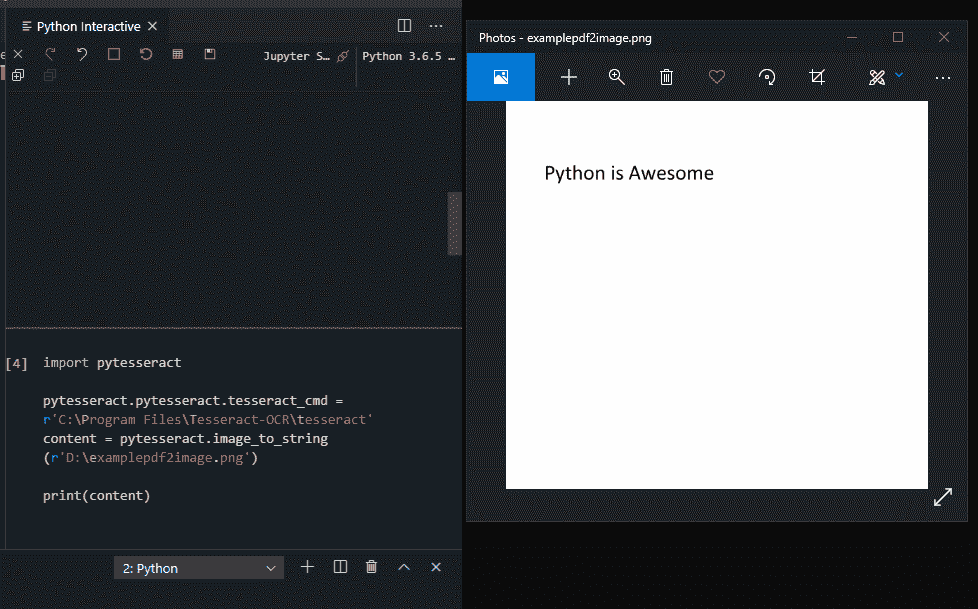

# 如何用 Python 从图像中提取文本

> 原文：<https://towardsdatascience.com/how-to-extract-text-from-images-with-python-db9b87fe432b?source=collection_archive---------0----------------------->

## 学习用 3 行代码从图像中提取文本


肖恩·林在 [Unsplash](https://unsplash.com?utm_source=medium&utm_medium=referral) 上的照片

在这篇短文中，我将向您展示如何使用 Python 从图像中提取文本。这项技术的应用是无止境的。一些例子包括:

*   机器学习(ML)项目的数据挖掘
*   拍摄收据照片并读取内容进行处理

# Python 库

为了解决这个问题，我们将使用一个名为 Python Tesseract 的库。来自[图书馆的网站](https://pypi.org/project/pytesseract/):

> Python-tesseract 是 Python 的光学字符识别(OCR)工具。也就是说，它将识别并“读取”嵌入图像中的文本。
> 
> Python-tesseract 是 Google 的 Tesseract-OCR 引擎的包装器。它作为 tesseract 的独立调用脚本也很有用，因为它可以读取 Pillow 和 Leptonica 图像库支持的所有图像类型，包括 jpeg、png、gif、bmp、tiff 等。此外，如果用作脚本，Python-tesseract 将打印识别的文本，而不是将其写入文件。

# 设置事物

当设置要使用的 Python 库时，通常是一步到位的过程。然而，对于 PyTesseract，我们需要做两件事:

1.  安装 Python 库
2.  安装宇宙魔方应用程序

首先，要安装 Python 库，只需打开命令行窗口并键入:

```
pip install pytesseract
```

然后，前往[这个](https://github.com/UB-Mannheim/tesseract/wiki)网站，下载并安装宇宙魔方 OCR 可执行文件。在撰写本文时，我使用的是 2020 年 3 月 28 日编译的 64 位 Alpha Build v5.0.0。

我们需要知道我们在哪里安装它，因为我们需要让你的 python 脚本知道。

一旦你完成了以上步骤，你就可以开始了。

# Python 代码



正如所承诺的，用 3 行代码，你就能从一幅图片中读出文字:

```
import pytesseractpytesseract.pytesseract.tesseract_cmd = r'C:\Program Files\Tesseract-OCR\tesseract'print(pytesseract.image_to_string(r'D:\examplepdf2image.png'))
```

如果您喜欢上面的文章，您可能也会喜欢:

[](/learn-how-to-quickly-create-uis-in-python-a97ae1394d5) [## 了解如何用 Python 快速创建 ui

### 最后，你可以在 10 分钟内找到一个图书馆

towardsdatascience.com](/learn-how-to-quickly-create-uis-in-python-a97ae1394d5) [](https://medium.com/better-programming/estimating-a-software-deadline-is-really-hard-lets-talk-about-why-44687a6baf9d) [## 估算一个软件的最后期限真的很难——让我们来谈谈为什么

### 规划时你需要知道的 5 条法则

medium.com](https://medium.com/better-programming/estimating-a-software-deadline-is-really-hard-lets-talk-about-why-44687a6baf9d)