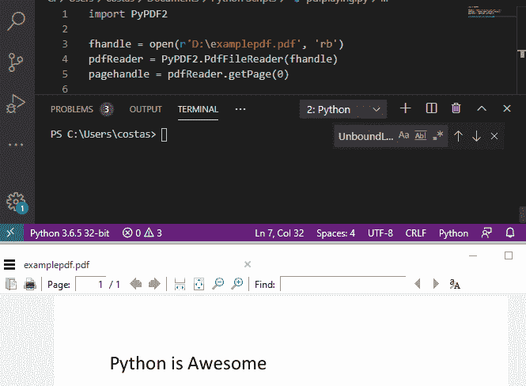
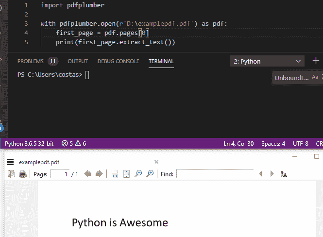
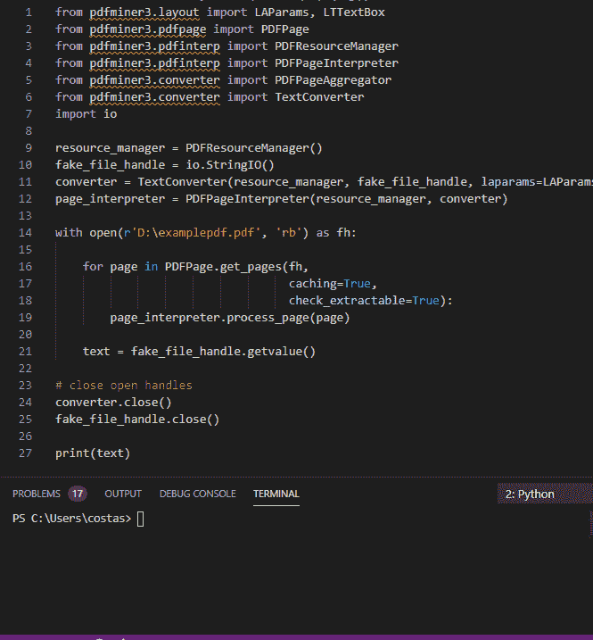

# 如何从 PDF 中提取文本

> 原文：<https://towardsdatascience.com/how-to-extract-text-from-pdf-245482a96de7?source=collection_archive---------1----------------------->

## 学习使用 Python 从 pdf 中提取文本


卡尔·海尔达尔在 [Unsplash](https://unsplash.com?utm_source=medium&utm_medium=referral) 上拍摄的照片

在这篇博客中，我们将研究用 Python 处理 pdf 的最流行的库。很多信息都是以 PDF 的形式分享的，往往我们需要提取一些细节做进一步的处理。

为了帮助我识别最流行的 python 库，我查看了 [StackOverflow](https://stackoverflow.com/questions/34837707/how-to-extract-text-from-a-pdf-file) 、 [Reddit](https://www.reddit.com/r/learnpython/comments/ffbedf/what_do_we_use_for_pdf_parsing_these_days/) 以及大量的谷歌搜索。我识别了许多包，每个包都有自己的优点和缺点。具体来说，整个互联网的用户似乎都在使用:PyPDF2，Textract，tika，pdfPlumber，pdfMiner。

然而，在我的研究中，由于这样或那样的原因，我只能让其中的 3 个库正常工作。对于其中一些库来说，设置太复杂了(缺少依赖项，奇怪的错误信息，等等。)

让我们快速回顾一下所有这些库。

# PyPDF2

## 评分:3/5

PyPDF2 的好消息是安装起来很容易。文档有些缺乏容易理解的例子，但是如果你足够注意，你最终会明白的。

然而，坏消息是结果并不好。



如您所见，它识别了正确的文本，但出于某种原因，它将文本分成了多行。

代码:

```
import PyPDF2fhandle = open(r'D:\examplepdf.pdf', 'rb')pdfReader = PyPDF2.PdfFileReader(fhandle)pagehandle = pdfReader.getPage(0)print(pagehandle.extractText())
```

# Textract

## 评分:0/5

许多人对这个图书馆赞不绝口，这是一个有希望的开始。[文档](https://textract.readthedocs.io/en/latest/python_package.html)也不错。

不幸的是，最新版本有一个 bug，每次你试图从 PDF 中提取文本时[都会抛出一个错误。通过图书馆的开发论坛跟踪这个 bug，可能会有一个修复。手指交叉。](https://github.com/deanmalmgren/textract/issues/256)

# 阿帕奇蒂卡

## 评分:2/5

Apache Tika 有一个 python 库，显然可以让你从 pdf 中提取文本。安装 Python 库非常简单，但是除非安装了 JAVA，否则它无法工作。

至少理论上是这样。我不想安装 JAVA 因此我停留在:*“runtime error:无法启动 Tika 服务器。”*错误。

根据[这个媒体博客](https://medium.com/@justinboylantoomey/fast-text-extraction-with-python-and-tika-41ac34b0fe61)(无关联)，然而，一旦你让它工作，它是了不起的。所以，我们用 2/5 评级吧。

该代码看起来像这样:

```
from tika import parserfile = r'D:\examplepdf.pdf'file_data = parser.from_file(file)text = file_data['content']print(text)
```

# pdf 木材

## 评分:5/5

正当我开始对从 pdf 中挖掘文本的简单易用的 python 库的存在失去信心时，出现了 pdfPlumber。

[文档](https://github.com/jsvine/pdfplumber)不算太差；几分钟之内，整个事情就开始了。结果好得不能再好了。

然而，值得注意的是，该库确实明确表示，它在机器生成的 pdf 上工作得最好，而不是扫描文档；我用的就是这个。



代码:

```
import pdfplumberwith pdfplumber.open(r'D:\examplepdf.pdf') as pdf:
    first_page = pdf.pages[0]
    print(first_page.extract_text())
```

# pdfMiner3

## 评分:4/5

我会诚实；以典型的 pythonic 方式，我扫了一眼[文档](https://github.com/gwk/pdfminer3/blob/master/README.md)(两次！)并且不明白我应该如何运行这个包；这包括 pdfMiner(也不是我在这里讨论的版本 3)。我甚至安装了它，并尝试了一些没有成功的事情。

唉，来救我的是一个善良的陌生人。一旦你看完了提供的例子，实际上就很容易理解了。哦，结果和你预期的一样好:



代码可以在[链接的堆栈溢出帖子](https://stackoverflow.com/questions/56494070/how-to-use-pdfminer-six-with-python-3)中找到。

# PDF -> JPEG ->文本

解决这个问题的另一种方法是将 PDF 文件转换成图像。这可以通过编程或截取每个页面的屏幕截图来完成。

一旦有了图像文件，就可以使用 tesseract 库从其中提取文本:

[](/how-to-extract-text-from-images-with-python-db9b87fe432b) [## 如何用 Python 从图像中提取文本

### 学习用 3 行代码从图像中提取文本

towardsdatascience.com](/how-to-extract-text-from-images-with-python-db9b87fe432b) 

在你离开之前，如果你喜欢这篇文章，你可能也会喜欢:

[](/learning-to-use-progress-bars-in-python-2dc436de81e5) [## 学习使用 Python 中的进度条

### 4 个不同库的介绍(命令行和用户界面)

towardsdatascience.com](/learning-to-use-progress-bars-in-python-2dc436de81e5) [](/building-a-python-ui-for-comparing-data-13c10693d9e4) [## 构建用于比较数据的 Python UI

### 如何快速让您的非技术团队能够比较数据

towardsdatascience.com](/building-a-python-ui-for-comparing-data-13c10693d9e4)