# 如何有效提取 Web 数据:4 种方法

> 原文：<https://towardsdatascience.com/how-to-extract-web-data-efficiently-4-ways-926434ac6c46?source=collection_archive---------7----------------------->

## 这些被忽视的方法将为你节省时间和金钱


卢卡斯·布拉塞克在 [Unsplash](https://unsplash.com?utm_source=medium&utm_medium=referral) 上的照片

作为一名程序员和经常使用数据的人，我经常很难找到好的完整数据集来使用。开源数据库是有限的，API 使用起来可能很昂贵——更不用说每分钟、每天、每月调用次数的限制了。

在几个项目的过程中，我总结了一些为 Python(和 Excel)用户提取和导入 web 数据的基本方法。我非常依赖这些方法来完成任何需要自己获取数据并将其导入工作空间的项目。

最后，对于非编码项目，我将演示一个有价值的 Excel 工具，它允许您从网页中抓取格式化数据，自动将值填充到电子表格中。

以下是四种方法。我将用同样的目标数据集来说明它们:截至 2020 年 3 月的 ATP 网球运动员排名。

# 1.使用熊猫:read_html

网球数据的一个奇妙来源是 tennisabstract.com 的 T4。这是 ATP 官方排名的网页。


ATP 排名更新 2020 年 3 月 9 日，[tennisabstract.com](http://tennisabstract.com/reports/atpRankings.html)

检查 HTML 后，结构看起来很简单——有四个 table 标记，最后一个包含逐行列出的玩家排名。

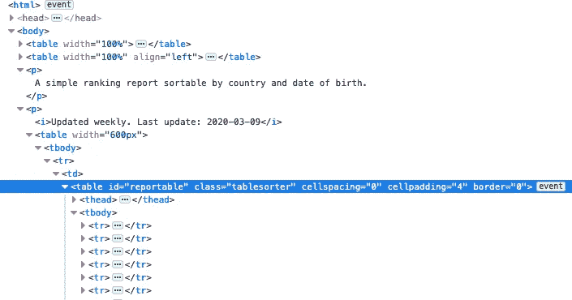

当数据已经被很好地格式化成 HTML 表时，检索它的最快方法是使用 Pandas 的 [**read_html**](https://pandas.pydata.org/pandas-docs/version/0.23.4/generated/pandas.read_html.html) 。这个方法只是将一组 HTML 表读入一个 DataFrame 对象列表。

注意:有一个字符串参数， **match** ，它确保只返回包含与给定字符串匹配的文本的表。这对于包含大量 HTML 表格的页面非常有用。

```
import pandas as pdtables = pd.read_html("[http://tennisabstract.com/reports/atpRankings.html](http://tennisabstract.com/reports/atpRankings.html)")rankings = tables[-1]
rankings.iloc[:200]
```

以下是前 200 名选手。

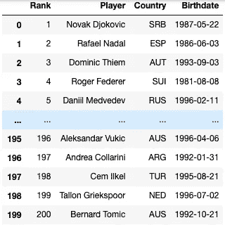

Top 200 强选手排名，[http://tennisabstract.com](http://tennisabstract.com/reports/atpRankings.html)

# 2.使用 HTML 解析器:美丽的汤

然而，事情并不总是那么简单。根据配置的不同，一些网站禁止使用 **read_html** 函数直接访问，导致 HTTP 错误 403。无论如何，如果您想抓取表中没有格式化的数据，该怎么办呢？

这就是像 Beautiful Soup 这样的 HTML 解析器派上用场的地方。

我们试试用美汤从 ATP 官方[网站](https://www.atptour.com/en/rankings/singles)提取排名。安装说明可以在[这里](https://www.crummy.com/software/BeautifulSoup/bs4/doc/)找到。

```
import requests
from bs4 import BeautifulSoupurl = "[https://www.atptour.com/en/rankings/singles"](https://www.atptour.com/en/rankings/singles)
response = requests.get(url)
page = response.text
soup = BeautifulSoup(page, 'lxml')
```

有了这段简短的代码，我们现在有了网页的 HTML。我们可以使用 **soup.find_all("table")** 获得所有表的列表。可以通过传入 id 来定位一个特定的表——就此而言，页面上的任何对象都可以通过它的 HTML 标签和传入唯一的属性来访问(参见 [docs](https://www.crummy.com/software/BeautifulSoup/bs4/doc/) )。

```
table = soup.find(class_="mega-table")
[row.text.split() for row in table.find_all("tr")]
```

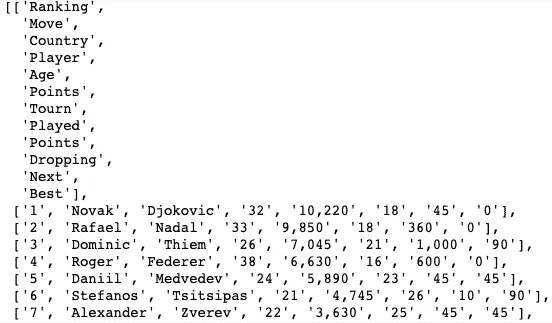

嵌套列表，包含(1)标题列和(2)播放器行

经过一点清理后，我们可以将数据组织成一个标题列表和另一个播放器行列表。剩下的工作就是将信息存储在数据帧中。

```
header = [j for j in [i.strip("  ") for i in table.find_all("tr")[0].text.splitlines()] if j != ""]
header.remove("Country")
header.remove("Move")data = []
for row in table.find_all("tr")[1:]:
    x = row.text.split()
    name = " ".join(i for i in x if i.isalpha() or "-" in i)
    res = [i for i in x if not (i.isalpha() or "-" in i)]
    res.insert(1, name)
    if len(res) == 8:
        res.pop(2)
    data.append(res)rankings2 = pd.DataFrame(data, columns=header)
rankings2
```

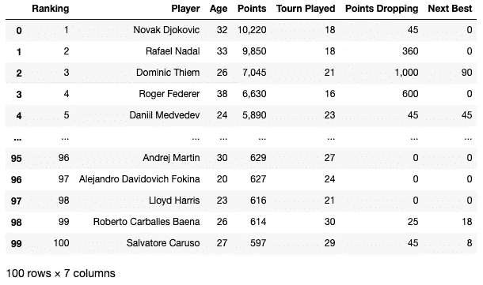

ATP 排名前 100，[https://www.atptour.com](https://www.atptour.com/en/rankings/singles)

# 3.使用 JSON 请求

第三种方法是提取 JSON 格式的数据。作为一个例子，我们将从[ultimatetennisstatistics.com](https://www.ultimatetennisstatistics.com/rankingsTable)检索排名。

如果您愿意右键单击并检查页面，您会在“Network”选项卡下看到一个 GET 请求是由 JSON 类型构成的。

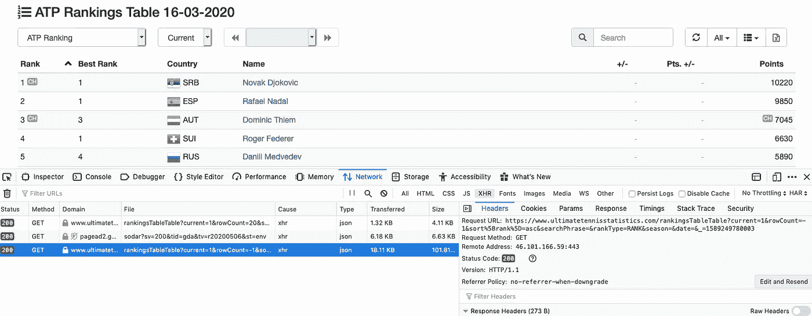

只需点击相关的链接，就会产生下面的 JSON 输出页面。

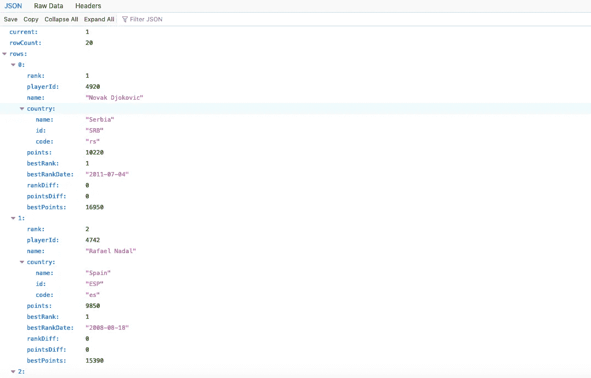

使用**请求**和 **json** 库可以很容易地将 JSON 数据读入 Python，然后导入到 Pandas 数据帧中。这个简单的函数完成了这个任务。

```
import requests
import jsondef get_json(url):
    response = requests.get(url)
    rows = json.loads(response.text)['rows']
    data = pd.DataFrame.from_dict(rows)
    return datarankings3 = get_json(["https://www.ultimatetennisstatistics.com/rankingsTableTable?current=1&rowCount=-1&sort%5Brank%5D=asc&searchPhrase=&rankType=RANK&season=&date=&_=1589249780003](https://www.ultimatetennisstatistics.com/rankingsTableTable?current=1&rowCount=-1&sort%5Brank%5D=asc&searchPhrase=&rankType=RANK&season=&date=&_=1589249780003)")rankings3
```

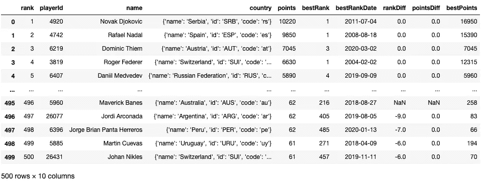

ATP 排名前 500，[ultimatetennisstatistics.com](https://www.ultimatetennisstatistics.com/rankingsTable)

# 4.额外收获:使用 Excel 下载 HTML 数据

无需一行代码，您就可以将任何 HTML 文件下载到 Excel 电子表格中。我将使用来自[tennisabstract.com](http://tennisabstract.com/reports/atpRankings.html)的相同排名数据集来演示这一点。

## Excel for Windows

1.  找到包含所需数据的网页。复制网址。
2.  打开 Excel，导航到“数据”选项卡，然后单击“从 Web”。
3.  将网站的 URL 粘贴到弹出框中，并按照提示匿名连接到该页面。
4.  打开“导航”菜单，在“显示选项”下找到所需数据。检查数据是否正确显示，并将其“加载”到电子表格中。

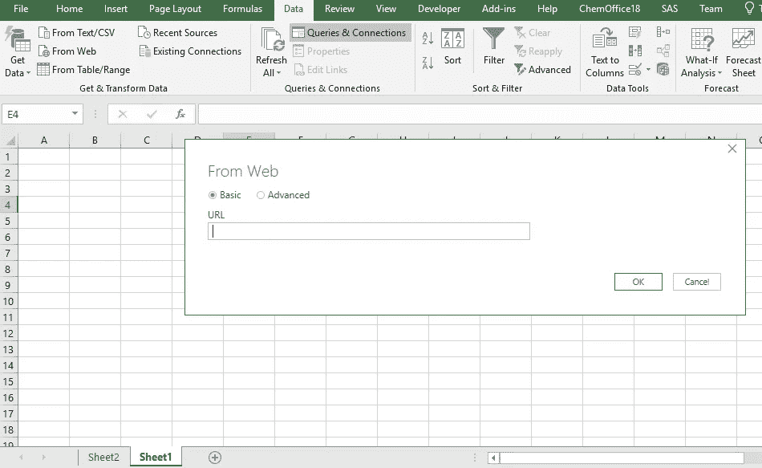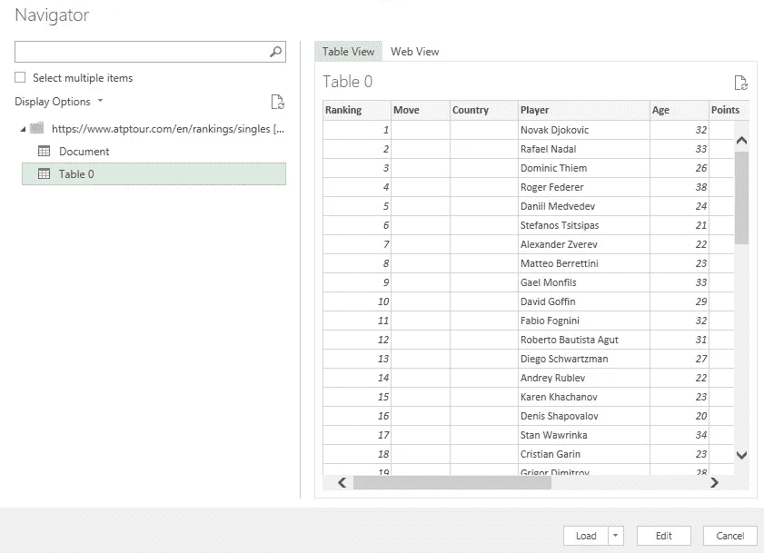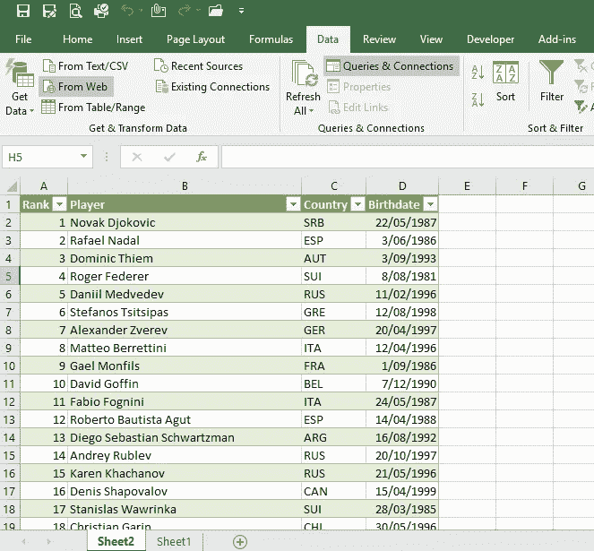

ATP 排名[(tennisabstract.com](http://tennisabstract.com/reports/atpRankings.html))，导入 Windows Excel

## **苹果电脑版 Excel】**

1.  当在网页上时，右键单击，您应该会看到一个类似于“另存为…”或“将页面另存为…”的选项，这取决于您的浏览器。继续将文件以 HTML 格式保存在本地。
2.  打开 Excel，导航到“数据”选项卡，然后单击“来自 HTML”。注意，该选项可能位于子菜单“获取外部数据”中。
3.  从弹出菜单中找到并打开保存的 HTML 文件。按照提示将数据加载到电子表格中。

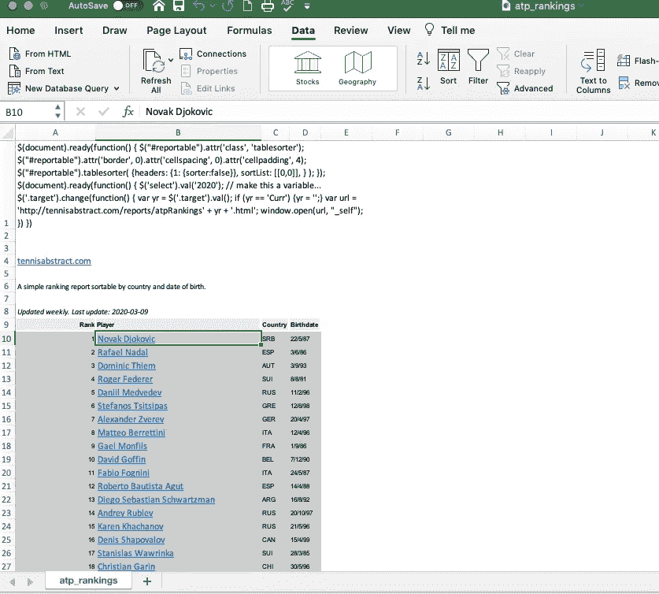

ATP 排名【tennisabstract.com[，导入 Excel for Mac](http://tennisabstract.com/reports/atpRankings.html)

就是这样！现在，数据已经被导入并格式化，每个值都在单独的单元格中。

# 事后思考

这些方法对于抓取网络数据并将其导入到一种更易处理的格式中是必不可少的——从这种格式中，你可以根据需要对数据进行清理、过滤、建模和可视化。

因此，如果您的第一反应是使用 API，您可能需要再考虑一下。尽管在某些情况下这可能是不可避免的，但是许多在线数据可以在不使用 API 的情况下被访问，这样就省去了您获取 API 密钥和浏览文档的精力和费用。

我希望这些工具对你的下一个数据分析项目有用。

感谢阅读！