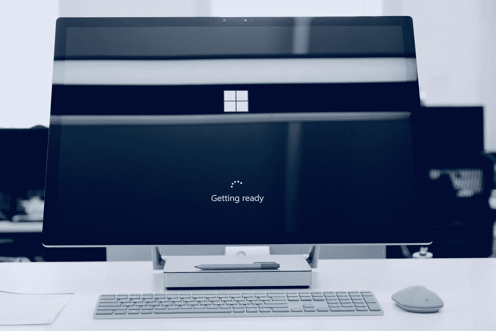

# 如何通过 Azure 基础认证

> 原文：<https://towardsdatascience.com/how-to-fail-the-azure-fundamentals-certification-e37a650a251e?source=collection_archive---------10----------------------->

## 看看参加 AZ-900 考试时应该做什么(和不应该做什么)

[张诗钟·维诺](https://unsplash.com/@johnyvino?utm_source=medium&utm_medium=referral)在 [Unsplash](https://unsplash.com?utm_source=medium&utm_medium=referral) 上的照片

A Z-900 是世界上最受欢迎的云服务的最受欢迎的认证。Azure Fundamentals 是许多使用云的人的起点。

这表明你对 Azure 有很好的、高水平的理解，这很好，但也让很多人感到困惑。它不是关于您是否可以设计一个 web 应用程序，并通过 CI/CD 管道自动化您的部署。

相反，该认证的优势来自于它所针对的业务用户视角，但这也是我们中许多更倾向于技术的人将会努力的地方。

这并不是说这个认证对技术人员没有用；的确如此。事实上，对云概念、基础架构、安全性和服务的概述是任何从事云工作的人的必备知识。

这门课程在技术上没有挑战性，但范围很广。我们将讲述全天候访问客户电话线路所需的支持级别，或者我们的 IT 管理员使用 Powershell 脚本部署虚拟机所需的设置。

因此，尽管表面上看起来很蓬松，但这是可以理解的——这是一个棘手的认证方法。让我们来演练一下第一次使用 AZ-900 时应该做什么和不应该做什么。

# 准备时间

你需要准备考试的时间会有很大的不同。如果你是一名从 AWS 转移到 Azure 的高级云工程师，你可能最多不需要超过一天的时间。

如果你想知道为什么微软提供一个覆盖天空中那些毛茸茸的白色东西的认证，给自己多几天时间。

如果你是一名开发人员，但是还没有接触过云。**每天三到四个小时，持续一周应该足够了**——或者两周才安全。

## 官方 Azure 基础学习路径

很容易，最好的起点是比尔自己的 [Azure 基础学习路径](https://docs.microsoft.com/en-us/learn/paths/azure-fundamentals/?source=learn)。

官方说法是，总共需要 9 小时 48 分钟。对我来说，需要更长的时间。

如果你只是简单地通读，并观看短视频，不到十个小时可能是正确的。但我会推荐一种更积极的方法，尝试以下几种方法的组合:

1。做大量笔记。我对记笔记的一个小建议——尝试一下【T2 概念】(太棒了)。

2。当你看到新的术语时，比如负载平衡器[阅读更多相关信息](https://docs.microsoft.com/en-us/azure/virtual-machines/windows/tutorial-load-balancer#:~:text=An%20Azure%20load%20balancer%20is,traffic%20to%20an%20operational%20VM.)。询问类似这样的问题— [为什么它是第 4 层负载平衡器？](https://www.nginx.com/resources/glossary/layer-4-load-balancing/)等。

3。尝试使用服务。在一些迷你项目中使用 Azure 会让你的理解达到一个全新的水平。

同时，不要在这些额外的步骤上走极端。在接下来的步骤中，我们将继续这种更积极的学习方法，所以不要让自己筋疲力尽。

总的来说，我建议在这上面花大约 15 个小时——当然，按照你自己的节奏工作。

## FreeCodeCamp 的 Azure 基础教程

接下来是 FreeCodeCamp 在 YouTube 上的 [AZ-900 教程视频](https://www.youtube.com/watch?v=NKEFWyqJ5XA)。在经历了微软的学习历程后，这是一个受欢迎的步伐变化。

这个视频是我见过的最好的 AZ-900，在三个小时长，它涵盖了很多。

虽然它在很高的层次上解释了一切，但仅凭这个视频，你可能无法通过这门课程。但是这对于巩固我们在官方学习途径中学到的东西是非常好的。视频格式也使它更容易跟随！

同样的积极学习的方法也适用于这里。做笔记，做一些额外的阅读，并进行一些练习。

## 模拟测试

最初，我对支付在线模拟测试的费用犹豫不决。在我完成第一次考试后，我只得了可怜的 56%分——肯定不及格。

因此，如果有一件事我可以推荐，甚至比官方的学习路径，或 FreeCodeCamp 的视频更值得推荐。你应该投资做一次模拟测试。

其次，如果有什么比买模拟试题更值得我推荐的话。阅读测试评论！

很多模拟测试已经过时了，所以要小心一点。

我使用了 [Skillcertpro](https://skillcertpro.com/product/microsoft-azure-fundamentals-az-900-practice-exam-tests-2020/) ，它附带了七个模拟测试。

无论你使用 Skillcertpro 还是其他平台，完成他们提供的每一个考试。我发现我会在一次考试中获得 92%的高分，然后在下一次考试中获得 60%的高分。它们可以变化很大。

最后，在这个阶段，**积极的方法是非常重要的**。参加模拟考试，通读结果——记下你做对了什么，并通过官方 Azure 文档或其他地方调查你做错了什么。

# 要记住的最后几点

对于考试，有一些额外的事情需要注意:

*   门槛根据考试难度变化。以 700 分(满分 900 分)为目标应该能让你及格。
*   问题的数量可能变化很大；许多资源总共引用了 40-65 个问题。我得了 29 分——不要对此感到惊讶！
*   考试时间也各不相同，但实际上你不必着急。慢慢来，在点击提交之前仔细检查你的问题。
*   如果你在家考试，早点登录。在开始之前，你需要下载他们的软件，验证你的 ID，拍摄你周围的照片等等。

学习完本文中的所有材料后，你将会为考试做好充分的准备。

我希望你喜欢这篇文章！如果你有任何其他资源可以推荐，或者有任何问题，请通过[推特](https://twitter.com/jamescalam)或者在下面的评论中联系。

祝你好运！

有兴趣应用你新发现的 Azure 知识吗？试试我的 Azure 网络应用部署指南:

 [## 如何使用 Azure 部署 Web 应用

### 利用 Angular 和 Azure 应用服务快速轻松地部署应用

towardsdatascience.com](/how-to-deploy-web-apps-with-azure-52ca340b41b9)