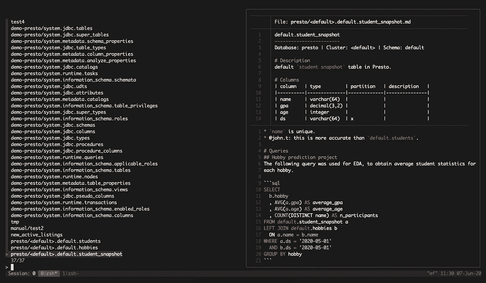

# 如何从命令行查找和组织数据

> 原文：<https://towardsdatascience.com/how-to-find-and-organize-your-data-from-the-command-line-852a4042b2be?source=collection_archive---------49----------------------->

## metaframe 简介:面向数据科学家的基于 markdown 的文档工具和数据目录。

**回购:**【https://github.com/rsyi/metaframe】T2



如果你是一名数据科学家，你的工作就是从数据中提取价值。但是在你的职业生涯中，你可能会花费(并且已经花费)大量的时间*去寻找和获取*所说数据的背景。以我的经验来看，这通常是徒劳的——你问团队中最资深的人，谁让你去找别人，谁让你去找别人，谁告诉你他们不知道你在说什么。然后你重复这个过程，直到你找到一个人可以给你一个有用的表。

```
person = senior_data_scientist
while person and not_tired:
  response = ask(person)
  if type(response) == Table
    rejoice()
  if type(response) == Person
    person = response
```

但是这个算法真的是蛮可怕的！这绝不是一个彻底的搜索，您最终会得到一个无人维护、无人使用的表。如果你决定冒险把它用在你的生产流水线上，当你六个月后发现这张桌子并不像你想象的那样工作时，你可能会让你的公司损失一大笔钱。更何况这是一个**巨大的时间浪费！**有时你会忘记几个月后桌子做了什么，你不得不再次做这个*，让你的同事沮丧*。*那么你能做什么呢？*

# *简要介绍数据目录及其局限性*

*幸运的是，这个问题已经有了解决方案:**数据目录**。数据目录名副其实，因为它们只是为您提供一个数据目录。它们允许您按名称搜索和查找表，查看它们的列和元数据，并使用附加文档丰富这些元数据。存在许多闭源播放器，如 [Alation](https://www.alation.com/) 和 [Collibra](https://www.collibra.com/) ，许多科技公司已经发布了开源版本，包括网飞的 [Metacat](https://github.com/Netflix/metacat) ，Lyft 的 [Amundsen](https://lyft.github.io/amundsen/) ，以及 LinkedIn 的 [Datahub](https://engineering.linkedin.com/blog/2019/data-hub) 。许多公司都在为自己开发这些工具(Airbnb、优步、谷歌、脸书等等)。*

*这就引出了一个问题:**为什么不使用/实现这些解决方案中的一个呢？***

*嗯，你可能想认真考虑一下，最终*，但是有巨大的进入壁垒:建立目录往往是昂贵的，或者，在开源工具的情况下，很难建立。对于只有少数数据科学家和分析师的公司来说，花费几十万美元或几个月的工作来实现一个工具几乎是不值得的，这个工具最多可以节省你转向你的邻居并再次向他/她询问那张桌子的几分钟时间。**

**我和一些在小型创业公司工作的朋友谈过这个问题，虽然数据文档和数据发现的问题即使在最小的规模上也很突出，但成本效益权衡根本没有意义。但是，仅仅因为问题太昂贵而无法用现有方法解决，并不意味着不存在划算的解决方案。**

# **那么解决办法是什么呢？**

**我想，“T7 比 T8 更容易建立目录。”日复一日，我只想寻找我的数据，检查列名，并做一些笔记。为什么这么难？我已经可以通过将所有内容保存在团队范围的电子表格中来手动完成这项工作。**

**所以我想我应该试着 80/20 这个。结果呢？**

**[**元框架**](https://github.com/rsyi/metaframe) **。****

**[Metaframe](https://github.com/rsyi/metaframe) 是一个基于 CLI 的数据目录，带有一个定制的基于 Markdown 的元数据后端，一个基于 fzf 的搜索服务，以及一个用 bash 和 python 编写的 ETL 管道，构建于 lyft 的 amundsendatabuilder 库之上。**

**但这很难理解。这里有一个快速演示:**

****

**本质上， [metaframe](https://github.com/rsyi/metaframe) 只是一个有点固执己见的文档工具。想只为一桌写笔记？很简单，只需键入以下内容:**

```
**mf new table_name**
```

**您将进入一个位于`~/.metaframe/metadata/table_name.docs.md`的文本文件，您可以在此表格上添加您的注释。然后，通过运行以下命令，可以在您的搜索中访问这些内容**

```
**mf**
```

**这并不局限于表格——您可以为 SQL 查询、ML 模型、jupyter 笔记本等创建新的文档。我个人在`~/.metaframe/`中保存了一个名为`recipes`的子文件夹，在那里我存储了 SQL 的命名片段。**

**如果您想要更全面的数据目录体验，metaframe 还支持本地运行的 ETL 作业。您所需要做的就是通过运行`mf connections edit`在 yaml 中指定一个连接，然后运行`mf etl`，您所有的数据都可以使用`mf`来访问。搜索并找到要做笔记的表格后，可以按 enter 编辑与所选表格相关联的文档，该文档将在以后的搜索中附加到元数据预览窗口。**

**因为文件结构完全是基于文本的，您甚至可以导航到`~/.metaframe/metadata`并用 git 跟踪它的版本。在一个有许多想要共享笔记的合作者的公司中，一个简单的模式可以是设置 CI/CD(或一个气流作业)来自动填充 git 存储库中的数据，并让用户将他们的个人文档推送到这个 repo 中的分支。因为这是版本跟踪的，所以通过检查您的同事的个人分支的提交历史，您应该能够很容易地看到您的同事了解哪些表，而不必询问他们。**

# **有什么警告吗？**

**我注意到 metaframe 的唯一问题是，它会在 100，000 张左右开始突突。但是对于具有这种规模的公司来说，谨慎的做法可能是:( a)不在本地运行 ETL 作业,( b)限制正在提取的模式。在 metaframe 中，这只是简单地给你的`mf connections edit`文件添加几个标志，比如`included_schemas`或者`excluded_schemas`。更多详情参见[文档](https://docs.metaframe.sh/)。**

**Metaframe 支持 presto 或 neo4j 上的手动文档和 ETL(amundsen ),但是我们也支持定制的[构建脚本](https://docs.metaframe.sh/connection-setup/custom-etl),以支持定制的提取作业(从任何仓库，从预先抓取的数据库存储，等等。).我们也正在建立更多的本地连接(例如，雪花和 Postgres 正在工作中)。如果您热衷于让它为您的特定设置工作，请随时提出问题，我们会帮助您。或者，如果你愿意，做点贡献吧！:)**

# **摘要**

**数据文档和数据发现是严重的问题，但它们不是数据科学家通常考虑的事情。我们很容易忽视一个每周浪费不到一个小时的问题，但我在这里告诉你，在所有规模上都有解决这个问题的办法。试试 metaframe 吧，我保证一旦你尝到了它的味道，你就离不开它了。**

****回购:**【https://github.com/rsyi/metaframe】T2**