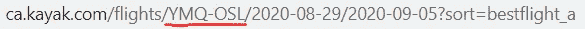
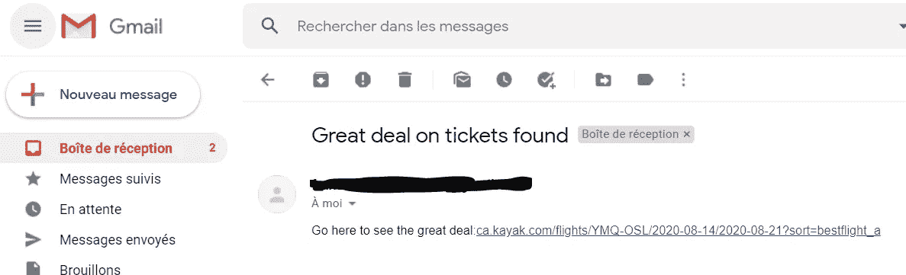

# 如何用 80 行代码找到便宜的航班

> 原文：<https://towardsdatascience.com/how-to-find-cheap-flights-in-80-lines-of-code-ba4f492587db?source=collection_archive---------26----------------------->

## 使用 Python 毫不费力地找到划算的交易


来源:[https://unsplash.com/photos/Nukqi6L_5DU](https://unsplash.com/photos/Nukqi6L_5DU)

由于旅行已经变得几乎不可能，我决定考虑如何开始为我的下一次旅行做准备。是的，我想到了旅行。

正如大多数人所知，飞机票价格相差很大。这是因为航空公司使用收益管理，这是一种旨在预测消费者行为以实现利润最大化的定价策略。

例如，用下面的代码，我连续两天每天 48 次查看一张从蒙特利尔到奥斯陆的机票。**价格在 891 美元到 1298 美元之间**(所有数据都是从 Kayak 报废的，右边[这里](https://www.ca.kayak.com/flights))。同样的日期，同样的目的地，价格却相差很大。

> 考虑到这一点，我编写了一个代码，可以搜索便宜的机票，如果找到了，就通过电子邮件通知我。

这是代码。

## 包和参数

让我们从导入必要的包开始:

```
**# import libraries** from bs4 import BeautifulSoup
from selenium import webdriver
import pandas as pd
import datetime, re, time, itertools, smtplib, ssl
from email.mime.text import MIMEText
from email.mime.multipart import MIMEMultipart
```

然后，我们定义代码工作所需的参数:

```
**#Define parameters** start_date = datetime.datetime(2020,9,13)
days_range = 2
trip_length, min_length, max_length = 7, 6, 12
price_goal = 900
cities = 'YMQ-OSL'
```

*   航班起飞的最早日期。
*   `days_range`:离开`start_date`的最大天数。基本上，旅行最晚什么时候开始(这里是 9 月 15 日)。
*   `trip_length, min_length, max_length`:期望的行程长度，以及可接受的最小和最大长度。可以等同于`trip_length`。
*   `price_goal`:您希望收到电子邮件提醒的价格。
*   `cities`:出发和到达的城市。为了找到正确的缩写，请在网站上搜索航班时查看网址。



## 创建日期组合

既然已经定义了所有参数，下面是如何为旅行创建所有可能的出发/返回日期组合。

事实上，你可能有灵活的日期，无论是出发/返回还是旅行的长度。下面的代码将根据前面定义的参数生成所有可能的旅行日期。

首先，我使用`itertools`库生成所有可能的日期组合。

然后，下面的循环允许我们去掉所有不尊重条件的日期(旅行的最小/最大长度)或不连贯的日期(出发日期之前返回)。

最后，下面几行代码清除了日期，使它们可用于后面的循环。

```
**#Cleaning dates to make them usable in loop** for i in range(len(departing)):
    departing[i]=re.sub(' 00:00:00', '', departing[i])
    returning[i]=re.sub(' 00:00:00', '', returning[i])
```

## 抓取数据并接收警报

现在，说点实际的。这是用来找到最佳航班的算法，并确保当价格足够低时，您会收到提醒。

1.  在 URL 中插入城市和日期
2.  获得 Kayak 使用硒和美丽的汤提议的最佳飞行的价格
3.  如果找到一个价格，保存它，如果没有，返回“没有找到航班”(try-expect 循环)
4.  如果找到的价格低于`price_goal`参数，发送一封电子邮件提醒，其中包含找到价格的 URL。

这是完整的代码。

这里我想提三件事。首先，不要忘记下载一个 chrome 驱动程序(并在第 6 行调整可执行路径)来使用 Selenium。

第二，不要忘记更新发送者、密码和接收者参数。这些指定了发送电子邮件的地址和接收电子邮件的地址。如果你愿意，你也可以改变邮件内容(主题或正文)。

第三，代码当前是为 Gmail 地址发送者设置的。对于任何其他类型的地址，应该更改端口(第 22 行)和`stmp.gmail.com`(第 37 行)。

收到的电子邮件警报应该是这样的:



## 使用任务计划程序

所有这些都是一个好的开始，但是不断地手工运行代码是浪费时间，直到找到一个好的交易。还不如像任何人一样，手动在 Kayak 上寻找交易。

幸运的是，任务调度程序是存在的。这个想法很简单。您可以安排您的代码每天运行 N 次，时间长短由您决定。你甚至可以在电脑睡眠时让它工作(但不要关机)。

关于如何用 python 脚本设置 Windows 任务调度器的教程，请点击[这里](/automate-your-python-scripts-with-task-scheduler-661d0a40b279)。使用这个工具在很多情况下都非常有用，我强烈建议你学会使用它！

现在，当你坐下来喝杯啤酒时，你可以让你的电脑搜索廉价航班。你不仅节省了时间和金钱，而且是免费的。

非常感谢你的阅读！

完整的代码可在[这里](https://github.com/francoisstamant/cheap_flights_finder)。