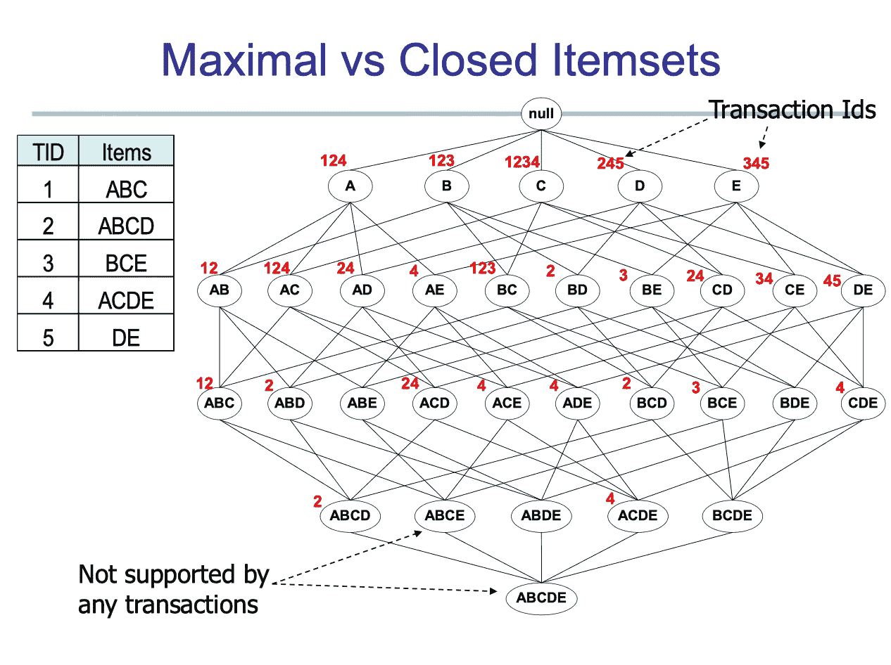
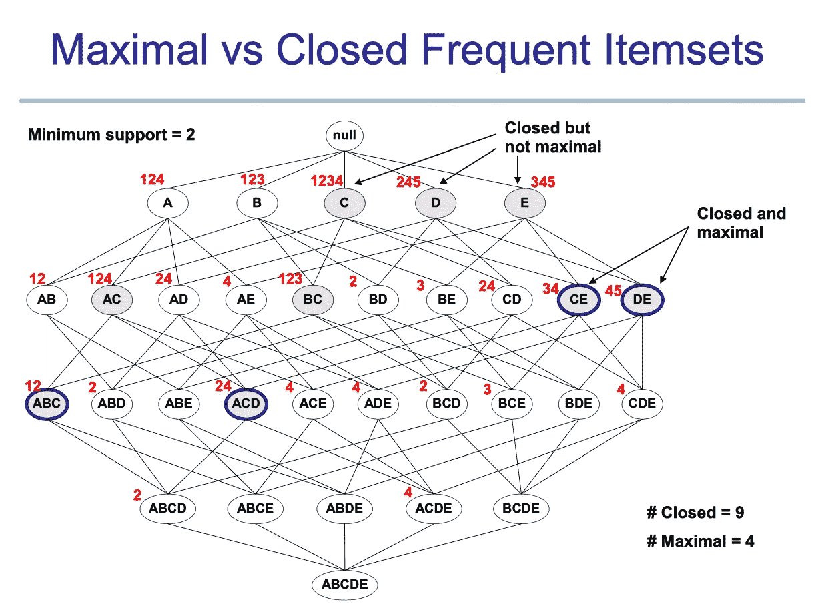
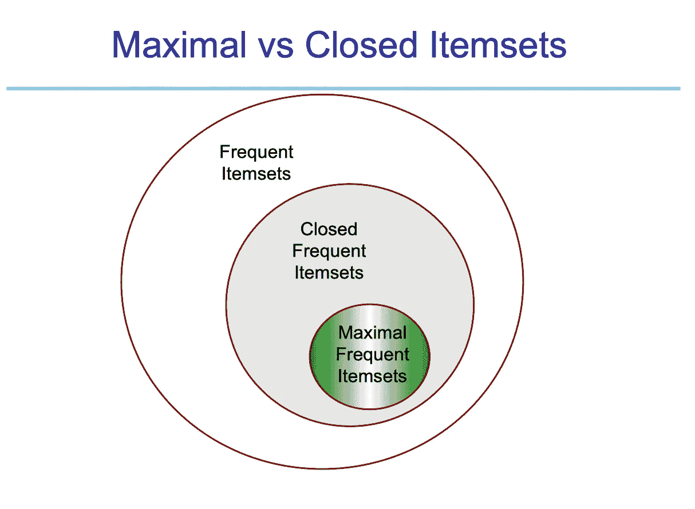

# 如何从 FP-Growth 中发现闭和最大频繁项集

> 原文：<https://towardsdatascience.com/how-to-find-closed-and-maximal-frequent-itemsets-from-fp-growth-861a1ef13e21?source=collection_archive---------11----------------------->

Python 优化寻找闭和最大频繁项集

在上一篇文章中，我已经详细讨论了什么是 FP-growth，以及它是如何发现频繁项集的。此外，我从头开始演示了 python 实现。在这篇文章中，我将介绍关联规则挖掘中的两个重要概念，闭项集和最大频繁项集。为了理解这个概念，你需要对什么是 FPtree 和什么是频繁项集有一些基本的了解。我的上一篇文章涵盖了所有的基础知识。

[理解并构建 Python 中的 FP-Growth 算法](/understand-and-build-fp-growth-algorithm-in-python-d8b989bab342)


由[马库斯·斯皮斯克](https://unsplash.com/@markusspiske?utm_source=medium&utm_medium=referral)在 [Unsplash](https://unsplash.com?utm_source=medium&utm_medium=referral) 上拍摄的照片

# 什么是闭频繁项集和最大频繁项集

这里我们快速回顾一下频繁项集的概念。项目集的支持度大于或等于 minsup(最小支持度)阈值。支持度是项目集出现的频率。例如，给定一组事务 T，我们希望找到在所有事务中出现 2 次以上的所有项集。这可以看作是寻找所有 minsup ≥2 的频繁项集。

**那么什么是闭和最大频繁项集呢？**

根据定义，如果一个项目集的直接超集都不是频繁的，那么这个项目集就是最大频繁项目集。如果一个项集的直接超集都不具有与该项集相同的支持度，则该项集是封闭的。让我们用一个例子和图表来更好地理解这个概念。

这里我们有 5 个事务的事务 T，让我们用一个树形图表示所有的项集层次结构，并用红色写下项集出现在顶部的事务。



示例演示。

如果我们将 minsup 设置为 2，那么任何出现两次以上的项集都将是频繁项集。在这些频繁项集中，我们可以通过比较它们的支持度(出现频率)和它们的超集来发现闭的和最大的频繁项集。



突出显示所有封闭和最大频繁项目集

我们可以看到最大项集是闭项集的子集。同样，最大项目集作为一个边界，任何低于最大项目集的都不是频繁项目集(任何最大项目集的超集都不是频繁的)。



频繁、闭和最大项目集之间的关系

# Python 实现

有许多不同的方法试图有效地找到最大和最接近的频繁项目集。这仍然是数据挖掘领域的一个热门研究问题。有兴趣的话可以找很多不同算法的研究文章来解决这个问题。我将演示一种相对简单的方法，通过比较每个项目的支持度和它们的超集来发现基于频繁项目集的闭和最大频繁项目集。然而，考虑到 O(n)的运行时间复杂度，这种方法可能相当耗时。为了在处理大型数据库时优化算法，我们需要利用 python 字典。通过将具有相同支持计数的所有项目集存储到一个字典中，使用支持作为关键字，我们可以将复杂度降低到 O(n)。因为我们不需要比较每一项，因为所有超集都有来自其父代的≤支持。并且我们在寻找封闭项集时只需要比较具有相同支持计数的项。同样的事情也适用于寻找最大项目集。

为了实现，我首先使用 MLXtend 库和 fpgrowth 函数来计算频繁项集，并编写自己的函数来从第一步的结果中挖掘封闭和最大频繁项集。

```
#Import all basic libray
import pandas as pd
from mlxtend.preprocessing import TransactionEncoder
import time
from mlxtend.frequent_patterns import fpgrowth#Task1 : Compute Frequent Item Set using  mlxtend.frequent_patterns
te = TransactionEncoder()
te_ary = te.fit(dataset).transform(dataset)
df = pd.DataFrame(te_ary, columns=te.columns_)start_time = time.time()
frequent = fpgrowth(df, min_support=0.001, use_colnames=True)
print('Time to find frequent itemset')
print("--- %s seconds ---" % (time.time() - start_time))# Task 2&3: Find closed/max frequent itemset using frequent itemset found in task1su = frequent.support.unique()#all unique support count#Dictionay storing itemset with same support count key
fredic = {}
for i in range(len(su)):
    inset = list(frequent.loc[frequent.support ==su[i]]['itemsets'])
    fredic[su[i]] = inset#Dictionay storing itemset with  support count <= key
fredic2 = {}
for i in range(len(su)):
    inset2 = list(frequent.loc[frequent.support<=su[i]]['itemsets'])
    fredic2[su[i]] = inset2#Find Closed frequent itemset
start_time = time.time()cl = []
for index, row in frequent.iterrows():
    isclose = True
    cli = row['itemsets']
    cls = row['support']
    checkset = fredic[cls]
    for i in checkset:
        if (cli!=i):
            if(frozenset.issubset(cli,i)):
                isclose = False
                break

    if(isclose):
        cl.append(row['itemsets'])print('Time to find Close frequent itemset')
print("--- %s seconds ---" % (time.time() - start_time))  

#Find Max frequent itemset
start_time = time.time()ml = []
for index, row in frequent.iterrows():
    isclose = True
    cli = row['itemsets']
    cls = row['support']
    checkset = fredic2[cls]
    for i in checkset:
        if (cli!=i):
            if(frozenset.issubset(cli,i)):
                isclose = False
                break

    if(isclose):
        ml.append(row['itemsets'])print('Time to find Max frequent itemset')
print("--- %s seconds ---" % (time.time() - start_time))
```

感谢您的阅读，我期待听到您的问题和想法。如果你想了解更多关于数据科学和云计算的知识，可以在 [**Linkedin**](https://www.linkedin.com/in/andrewngai9255/) **上找我。**


照片由[阿尔方斯·莫拉莱斯](https://unsplash.com/@alfonsmc10?utm_source=medium&utm_medium=referral)在 [Unsplash](https://unsplash.com?utm_source=medium&utm_medium=referral) 上拍摄

*参考文献*

[*http://rasbt . github . io/mlx tend/user _ guide/frequent _ patterns/FP growth/*](http://rasbt.github.io/mlxtend/user_guide/frequent_patterns/fpgrowth/)