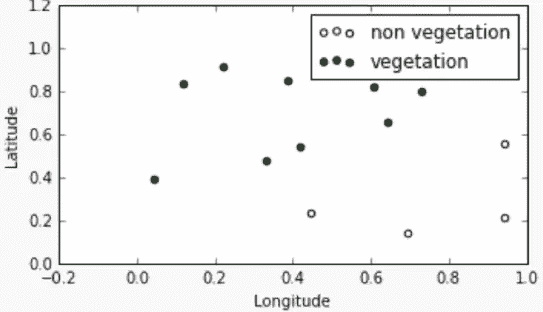
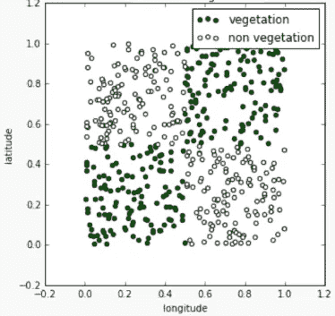
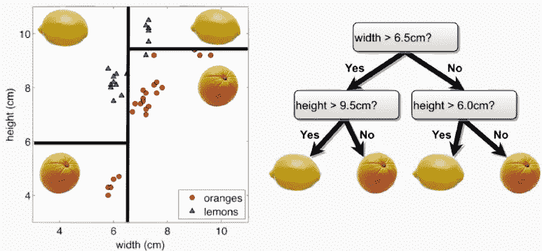
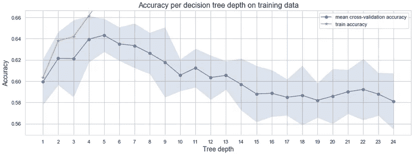
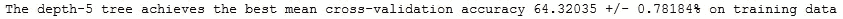
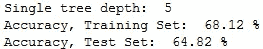

# 如何通过交叉验证找到决策树深度

> 原文：<https://towardsdatascience.com/how-to-find-decision-tree-depth-via-cross-validation-2bf143f0f3d6?source=collection_archive---------6----------------------->

## 消化偏差-方差权衡、过拟合、欠拟合、K 倍交叉验证背后的直觉。

RegalShave 在 [Pixabay](https://pixabay.com/photos/oak-tree-tree-huge-old-charleston-2018822/) 拍摄的照片

# 什么是决策树？

假设我们有一组经度和纬度坐标，对应于两种类型的区域:植被和非植被。我们可以建立一个逻辑回归模型，能够将任何坐标分类为植被或非植被。**如下图所示，当类别在特征空间**中很好地分离时，用于分类的逻辑回归工作得最好。

资料来源:哈佛大学 P. Protopapas 教授的讲稿

现在，让我们设想一种情况，植被分布在几个地区。如下图所示，现在解释非线性决策边界就不那么简单了。

资料来源:哈佛大学 P. Protopapas 教授的讲稿

事实证明，在这种情况下，一个简单的流程图可以被公式化为用于分类的数学模型。它们的优势是可以被人类理解。我们用一个简单的例子来说明这些**决策树**是如何工作的，在这个例子中，一种水果应该被识别为柠檬或橙子。

资料来源:哈佛大学 P. Protopapas 教授的讲稿

# 如何训练决策树？

为任何给定的训练数据集学习最小的决策树是一项困难的任务。在每个节点中，**我们需要选择分裂**的最佳预测值，**需要选择分裂**的最佳阈值。在前面的示例中，我们首先通过查看水果的宽度并使用阈值 6.5 厘米来决定。我们也可以从水果的高度开始，或者为宽度选择不同的阈值。我们的选择对树的区域形状有影响。

理想情况下，随着分裂次数的增加，这些区域应该逐渐变得更纯。每个区域应该专门针对一个类(柠檬或橙)。通常通过测量**分类误差**来评估这种分割的质量。也可以使用所谓的**基尼指数**来评估该区域的纯度。或者，区域的**熵**可以告诉杂质的级别。

# 什么是偏差-方差权衡？

在训练期间，该树将继续增长，直到每个区域恰好包含一个训练点(100%训练准确度)。这产生了一个完整的分类树，该分类树分割训练数据，直到每个树叶包含单个观察值。换句话说，整个树会过度适应训练数据。

## 过度拟合

**过拟合的树将实现训练观察的完美分类，并且偏差(误差)将为 0** 。然而，这样的树会非常敏感，因为训练观察的微小变化会导致预测的类别发生很大变化，这意味着**模型方差会非常高**。这个模型不能很好地概括看不见的数据。

# 权衡取舍

为了防止过拟合的发生，**我们需要定义一个停止条件**。低深度的树不能捕捉分隔类的非线性边界。通过减少树的深度，我们增加了 biais(训练的误分类误差),但是我们也减少了方差。**偏差-方差权衡寻求偏差和方差之间的折衷，这里使用交叉验证。**

# 什么是交叉验证？

适当的深度可以通过交叉验证在保留的数据集上评估树来确定。通过多次对数据进行重新采样，将分为训练折叠和验证折叠，在训练折叠上拟合不同大小的树，并查看验证折叠上的分类精度，我们能够找到树的深度，这提供了最佳的偏差-方差权衡。这种树不能完美地预测训练集(可接受的偏差)，但是如果我们稍微改变训练集(可接受的方差)，它的性能将大致相同。

[来源](https://scikit-learn.org/stable/modules/cross_validation.html)—Scikit-learn.org

# 通过 K-fold 交叉验证找到最佳深度

诀窍是选择一系列树深度进行评估，并使用 K 倍交叉验证绘制每个深度的估计性能+/- 2 标准偏差。我们提供了一个 Python 代码，可以在任何情况下使用，在这种情况下，您需要调整给定预测张量 X 和标签 y 的决策树。该代码包括图中的训练集性能，同时缩放 y 轴以关注交叉验证性能。

该方法选择树深度 5，因为它使用大小为 5 的交叉验证折叠来实现对训练数据的最佳平均准确度。准确度置信区间的下限足够高，使得该值有意义。当更多的节点被添加到树中时，很明显，交叉验证的准确性向零变化。

深度为 20 的树在训练集上实现了完美的准确度(100%)，这意味着树的每一片叶子恰好包含一个样本，并且该样本的类别将是预测。深度为 20 的树过度适合训练集。

我们通过交叉验证选择的树深度 5 有助于我们避免过度拟合，并提供了一个更好的机会来重现准确性，并根据测试数据概括模型，如下所示。

# 结论

本文中的想法是使用 K-fold 交叉验证和搜索算法。搜索的输入是超参数网格，这是在训练模型之前选择的参数。在我们的例子中，这是一个简单的潜在树深度范围。

我们提供了易于复制的 Python 代码，不仅可以用于调整决策树，还可以用于一般的模型选择任务。其他方法包括[嵌套交叉验证](https://mlfromscratch.com/nested-cross-validation-python-code)。

感谢 [Anne Bonner](https://medium.com/@annebonner) 和 [Amber Teng](https://medium.com/@angelamarieteng) 来自《走向数据科学》的编辑评论。