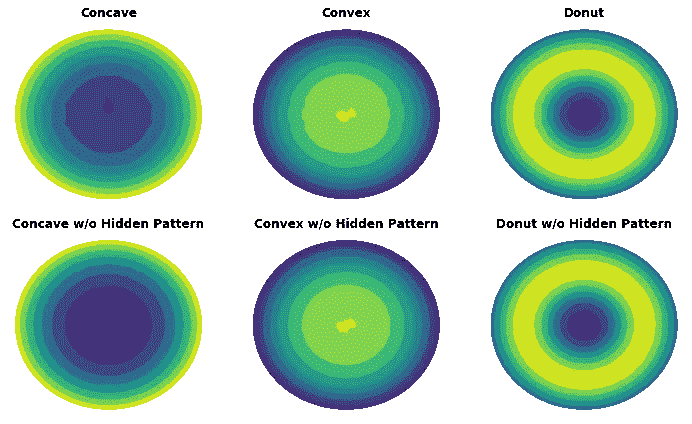

# 如何在数据中找到隐藏的局部模式

> 原文：<https://towardsdatascience.com/how-to-find-hidden-local-patterns-in-your-data-8e3e50501a0f?source=collection_archive---------29----------------------->

## 应用局部偏差变换来揭示数据中微小的局部空间扰动

随着半导体和光电子器件性能的快速提高，相关制造工艺的规范也在快速收紧。这些流程中使用的制造设备必须保持领先，以保持路线图目标。这意味着对现有设备本身的改进是不够的，必须同时为 N+1 或更远的一代开发解决方案。

典型的半导体和光电器件制造包括在半导体晶片或其他衬底上的几十到上千个薄膜沉积、蚀刻、图案化和后处理封装步骤。最终的器件产量高度依赖于衬底上各个薄膜层的空间均匀性。这些不均匀性通常是由硬件的限制或工艺条件的稳定性造成的。因此，理解关键薄膜性质(例如厚度、导电性或光学性质)的不希望的空间变化是设计更好的制造硬件和增加最终器件产量的关键。

半导体晶片上薄膜的不均匀性正在经历戏剧性的改善，从 90 年代初的> 30%到 2000 年代初的 10–15 %,现在正在快速接近并在某些情况下超过< 1%的目标。实现这种改进的难度一级比一级增加得快。

虽然从 30%到 20%可能只花了几年时间，但对于一些流程来说，从 15%到 5%却花了近十年时间。进步不仅是渐进的，而且在许多情况下也是连续的。很容易想象，在总体变化为 10–15%的数据中，很难看到< 1%的变化模式。然而，如上所述，等待发现隐藏的模式不再是一个选项。

早期，许多过程的不均匀性通常是由长期空间趋势决定的。随着制造设备变得越来越复杂以及长期问题的解决，局部不均匀性的重要性开始增加。然而，尽管人们知道下一个大的非均匀性问题将是由局部模式引起的，但是找到这些模式的能力仍然有限。

在本文中，我们描述了在通过化学气相沉积沉积的薄膜的均匀性中搜索隐藏的局部图案的真实生活用例(出于保密的目的，真实的薄膜均匀性数据被替换为质量上相似的趋势，并且真实的隐藏的局部图案被替换为人工生成的图案)。

我们讨论一种通过执行**局部偏差变换(LDT)** 在整体长期趋势中发现隐藏的局部空间模式的方法。 **LDT** 通过将每个点的输入值替换为这些值与特征空间中周围邻域点的加权平均值的偏差来转换数据。通过限制邻域的大小和最小化更远的邻居的贡献，长期趋势的影响被最小化并且局部模式出现。

## 可视化数据

让我们在下图中用凹形、凸形和环形的长期趋势来可视化表示半导体衬底上的薄膜特性的数据，其中有和没有局部隐藏图案，等高线图中色阶显示薄膜特性的变化(蓝色:低；绿色:mid 黄色:高)。

**你能看出有什么不同吗？**

由于每个集合中的总体模式包含大约 0.5%的随机噪声，来自隐藏模式(当存在时)的贡献不到 2%，其余来自长期径向趋势，因此很难看出上部和下部地图集合之间的任何差异。

也许我们看径向图比看 2D 地图更幸运？

隐藏局部模式的径向图

现在我们有进展了！看到我们橙色线上的蓝色小波浪了吗？好吧，我们可以确认我们的数据中有一些奇怪的东西，但它是什么呢？

## 局部偏差变换

我们在寻找小扰动方面运气稍好一些(记得<2% hidden pattern?) in the data on the radial profile plots above, but we cannot easily tell the 2D locations or say anything at all about the 2D shape of these perturbations. Thus, we would not be able to link these spatial non-uniformities to specific hardware features causing them in the thin film deposition tool.

那么，我们如何着手寻找这些特征呢？我们可以通过只检查小的局部子集——邻域——的变化来最小化数据中压倒性的长期趋势的重要性。通过计算每个点的值与其周围点的差异，限制邻域的半径，并缩放更远的邻居的重要性，我们可以放大其他长期趋势中的局部模式。局部偏差变换的数学表达式如下:

**V** 是我们要变换的值，***R****local***是邻域的半径，*****p***是谢泼德距离加权倒数法中的幂参数[1]。****

****使用这些等式，让我们对数据集进行 **LDT** 变换，看看会得出什么结果。下面的代码片段是 **LDT** 算法的 Python 实现。****

****同时，我们还对不包含隐藏模式的数据执行转换以进行比较。****

****************************

局部偏差变换在起作用。**** 

****可以使用两个参数来针对各种使用情况微调 LDT 变换:邻域半径、 ***R*** *local* ，以及邻域距离灵敏度*、* ***p*** ，这是 Shepard 方法中用于逆距离加权的功率参数。****

****较大的局部邻域半径将对转换后的数据产生较强的长期影响。而大的功率参数将降低更远的邻居的相对重要性(当距离敏感度等于零时，所有邻居被同等对待)。****

****虽然 **LDT** 在过滤随机噪声方面相当有效，但是转换并不完美。当“远程”效果的范围与 **LDT** 变换邻域半径、**T21***局部相当时，就会出现一个限制。*在这种情况下，转换不能完全移除“长程”特征(见圆环的残余部分，甚至在 **LDT** 转换后的数据上可见，用于*圆环*图案)。另一个影响是笛卡尔空间中采样点网格的不均匀性，这会导致在没有隐藏模式的凹和凸集合的 **LDT** 变换上最明显的人工特征。****

****尽管有这些限制， **LDT** 是一种非常有效的技术，已经在发现隐藏的局部模式中得到证明，该模式对实际半导体加工应用的整体趋势贡献不到 2%。****

> ******LDT 不仅可以有效地应用于 2D 等高线地图数据，而且可以有效地应用于由多个叠加空间模式组成的任何维度的数据，以搜索隐藏的局部模式。******

## ****你能在你的数据分析中应用局部偏差变换吗？****

****我很想听听你对 LDT 可能的应用的想法或主意。****

******参考文献**:****

****[1][https://en.wikipedia.org/wiki/Inverse_distance_weighting](https://en.wikipedia.org/wiki/Inverse_distance_weighting)****