# 如何用 Voronoi 图找到最近的医院

> 原文：<https://towardsdatascience.com/how-to-find-the-nearest-hospital-with-voronoi-diagram-63bd6d0b7b75?source=collection_archive---------54----------------------->

## 给定美国医院的大型数据集，我们如何快速找到最近的医院？

# 动机

有了美国医院的数据集，创建一个简单的应用程序，在患者需要时找到最近的医院，难道不是很有帮助吗？这听起来像是一个简单的任务。毕竟，你只需要在美国所有医院中找到最短的距离，对吗？

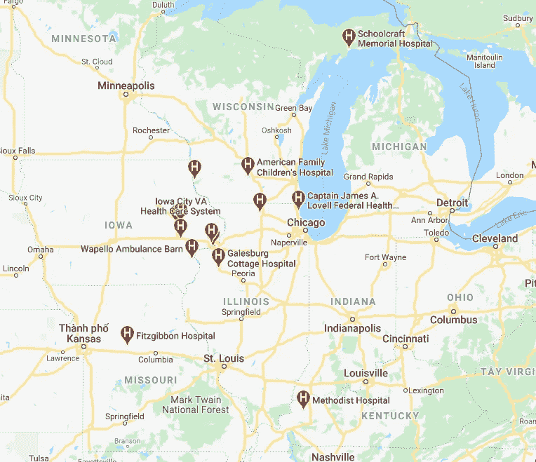

谷歌地图上医院位置的截图

显而易见的解决方案可能不是最佳解决方案。每次用户请求最近的医院时，搜索医院**将会是**耗时的**，更不用说有数千用户同时使用应用程序的情况了。那么解决办法是什么呢？**

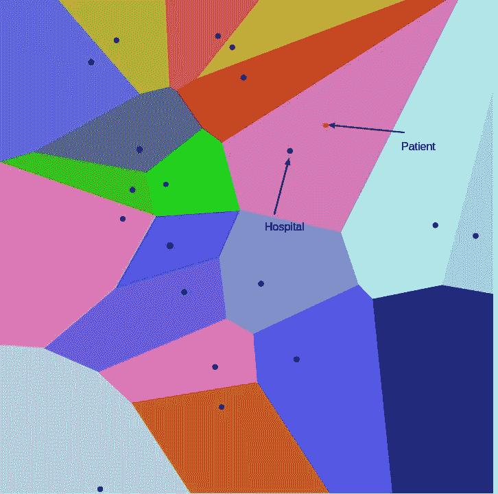

检索自[维基百科](https://en.wikipedia.org/wiki/Voronoi_diagram)

我们可以像上面一样预先建立区域，点是医院。每当患者需要医院时，我们只需要知道他们在哪个地区，并把他们带到与该医院相关的地区。例如，如果一个病人在粉色区域，我们 100%确定最近的医院是该区域内的点。

是什么让这个方法如此伟大？我们只是提前计算一次图**。当收到医院的请求时，医院会立即被发现。听起来这个实现值得一试！**

**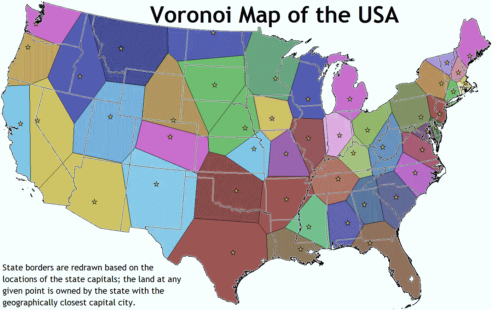**

**检索自[维基百科](https://en.wikipedia.org/wiki/Voronoi_diagram)**

# **Voronoi 图简介**

**上面的图是一个 Voronoi 图。Voronoi 图是将一个平面划分成靠近一组给定对象中的每一个的区域。为了创建 Voronoi 图，我们首先需要抓住它的一些特征。**

**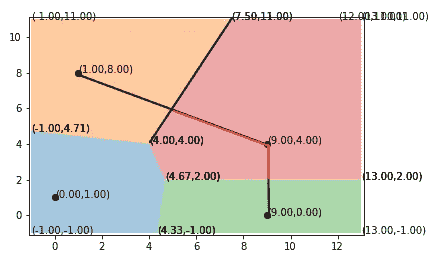**

**作者图片**

**在上图中，点(1，8)到边界的距离等于点(9，4)到边界的距离。相同的规则适用于点(9，4)到(9，0)。2 点之间的边界是**平分线，是将另一条线段切割成相等部分的线。****

# **用迭代算法实现**

**我选择用增量算法创建 Voronoi 图。由于目前还没有这个实现的 Python 源代码，所以我决定从头开始实现这个算法。**

**为了使这个算法工作，我们需要的数据结构是一个**双连通边列表**。双连通边列表是被分成半边的列表，每个半边指向不同的方向。这种方向上的差异将有助于识别哪个**面对与**相关的边缘。**

**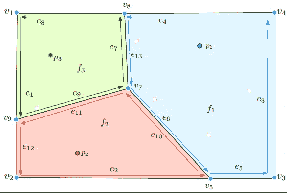**

**作者图片**

**一次计算每个点的 Voronoi 图将是困难的和计算昂贵的。相反，我们将从一个小问题开始。假设我们已经有了 Voronoi 图，我们如何为**创建一个额外的点**的 Voronoi 图？**一次更新一个点**肯定会比一次更新多个点更容易。**

**从一个空的双连通边列表开始**

**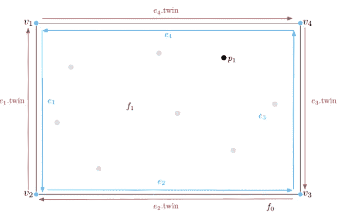**

**作者图片**

**然后画两点之间的平分线。请注意，每个点到平分线的距离是相等的。**

**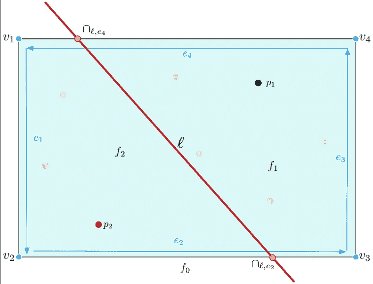**

**作者图片**

**当第三点出现时:**

*   **先找离最近点最近的点，就是 p2！**
*   **在两点之间画一条平分线。这条平分线将与另一条边界相交。使用该交点作为另一条平分线的起点**
*   **因为 p1 是与直线相交区域相关的点，所以画出 p2 和 p3 之间的平分线。**

**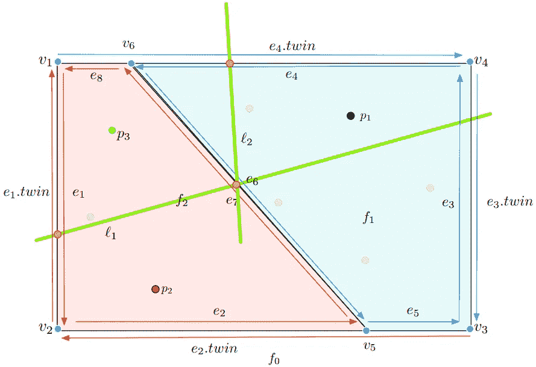**

**作者图片**

**这应该给我们一个更新的 Voronoi 图，有 3 个点！**

**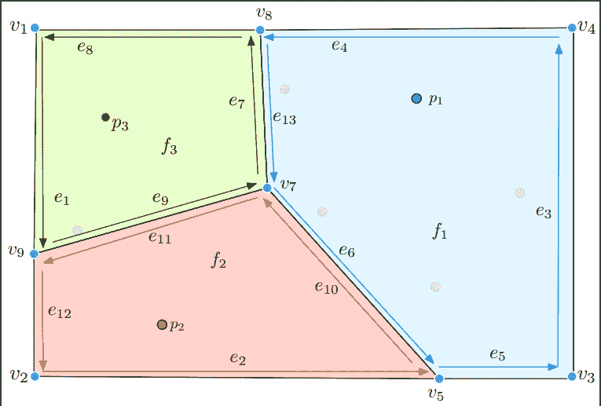**

**作者图片**

**如果我们有第四点，同样的策略被应用。**

# **让我们试试这个！**

**经过一个多月的努力理解算法、实现和调试，我终于让它工作了。这是我实现的一个 [Github repo](https://github.com/khuyentran1401/Voronoi-diagram) 。**

**要尝试这一点，克隆 repo 并转到目录**

```
git clone [https://github.com/khuyentran1401/Voronoi-diagram.git](https://github.com/khuyentran1401/Voronoi-diagram.git)
cd Voronoi-diagram
```

**在该目录中打开 Jupyter 笔记本或. py 文件并运行**

**你应该会看到这样的东西**

**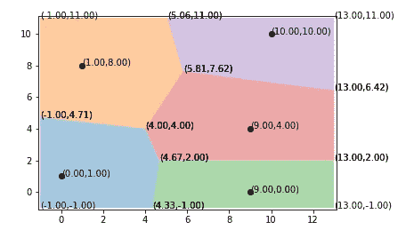**

**作者图片**

**plotVoronoi 的第一个参数是点列表(元组列表)。其他参数是可选的，并且是 Voronoi 图的边界(xmin，xmax，ymin，ymax)。**

**要查看算法如何更新 Voronoid 图，请运行**

**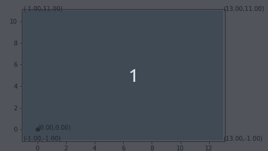**

# **在医院数据上使用 Voronoi 图**

**当然，我们仍然需要将这个图表应用于医院数据。因为我的代码仍然需要改进来处理每种情况，所以我不能在超过 7581 个数据点的情况下工作。所以我从美国四个不同医院的纬度中挑选了四个数据点来看看它是什么样子的**

**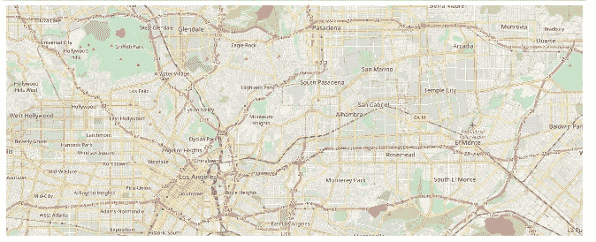**

**作者图片**

**我得到了这个**

**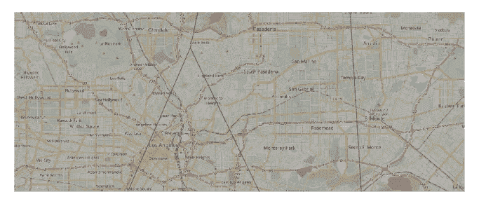**

**作者图片**

**创建地图和 Voronoi 图的代码可以在这里找到。如您所见，地图被分成 4 个不同的区域，每个区域有一家医院。如果患者需要找医院，我们只需要**找到患者属于哪个地区**，指引患者去最近的医院！**

# **结论**

**恭喜你！你刚刚学会了一种用 Voronoi 图在地图上最大化你的发现的技术。实现这种算法是一种冒险，但我觉得看到这种工作是值得的。仍然有错误，我需要修复，以涵盖每一种情况，并使这在地图上的工作。另一个任务也是找出如何用 Voronoi 图搜索。我仍在努力，如果您有任何反馈或想法，我将不胜感激。**

**如果你想尝试这种算法或者在你的项目中使用它，请选择这个回购协议。**

**我喜欢写一些基本的数据科学概念，并尝试不同的算法和数据科学工具。你可以通过 [LinkedIn](https://www.linkedin.com/in/khuyen-tran-1401/) 和 [Twitter](https://twitter.com/KhuyenTran16) 与我联系。**

**如果你想查看我写的所有文章的代码，请点击这里。在 Medium 上关注我，了解我的最新数据科学文章，例如:**

**[](/convex-hull-an-innovative-approach-to-gift-wrap-your-data-899992881efc) [## 凸包:包装数据的创新方法

### 如何利用包装算法实现数据可视化

towardsdatascience.com](/convex-hull-an-innovative-approach-to-gift-wrap-your-data-899992881efc) [](/how-to-visualize-social-network-with-graph-theory-4b2dc0c8a99f) [## 如何用图论可视化社交网络

### 找出《权力的游戏》中的影响者

towardsdatascience.com](/how-to-visualize-social-network-with-graph-theory-4b2dc0c8a99f) [](/how-to-create-interactive-and-elegant-plot-with-altair-8dd87a890f2a) [## 如何用 Altair 创建交互式剧情

### 在 5 行简单的 Python 代码中利用您的数据分析

towardsdatascience.com](/how-to-create-interactive-and-elegant-plot-with-altair-8dd87a890f2a) [](/how-to-learn-non-linear-separable-dataset-with-support-vector-machines-a7da21c6d987) [## 如何用支持向量机学习非线性数据集

### 支持向量机简介及其在非线性数据集上的应用

towardsdatascience.com](/how-to-learn-non-linear-separable-dataset-with-support-vector-machines-a7da21c6d987)**