# 如何找到 KNN K 的最优值？

> 原文：<https://towardsdatascience.com/how-to-find-the-optimal-value-of-k-in-knn-35d936e554eb?source=collection_archive---------0----------------------->

## 可视化误差率与 K 的关系图，找出最合适的 K 值。

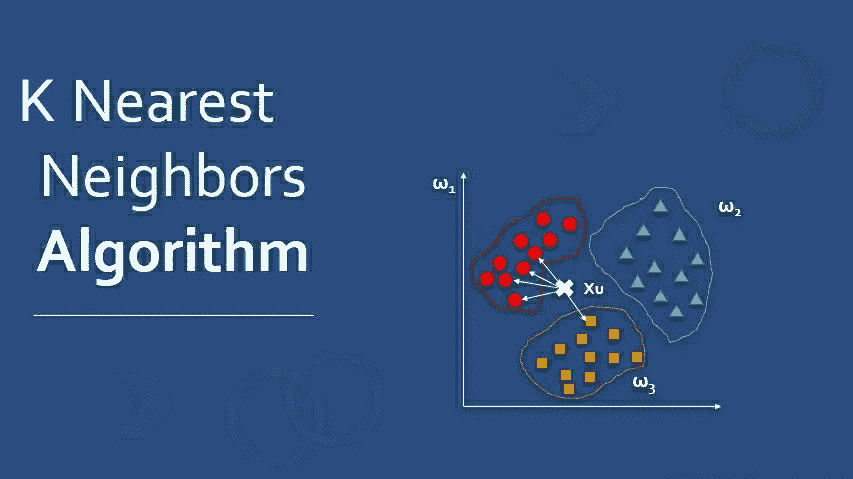

图 1:通过[educba.com](https://www.educba.com/nearest-neighbors-algorithm/)拍摄的照片

## 介绍

**K-最近邻**是**T5 用于分类和回归的监督机器学习算法。它处理训练数据，并基于距离度量对新的测试数据进行分类。它找到测试数据的 k 个最近邻，然后由大多数类别标签执行分类。**

对于数据科学家来说，选择最佳 K 值以实现模型的最大准确性始终是一项挑战。我希望你们都知道 knn 背后的基本思想，但是我将在本文后面阐明 KNN 的概述。要全面了解这个算法的工作原理，我建议阅读下面的文章:

> [k 近邻介绍:强大的机器学习算法](https://www.analyticsvidhya.com/blog/2018/03/introduction-k-neighbours-algorithm-clustering/)

在本文中，我将演示在 knn 算法中感知 K 的理想值的可实现方法。

# 目录

1.  KNN 概况
2.  距离度量
3.  如何选择一个 K 值？
4.  KNN 模式实施
5.  关键要点

我们开始吧，

# 1.KNN 概况

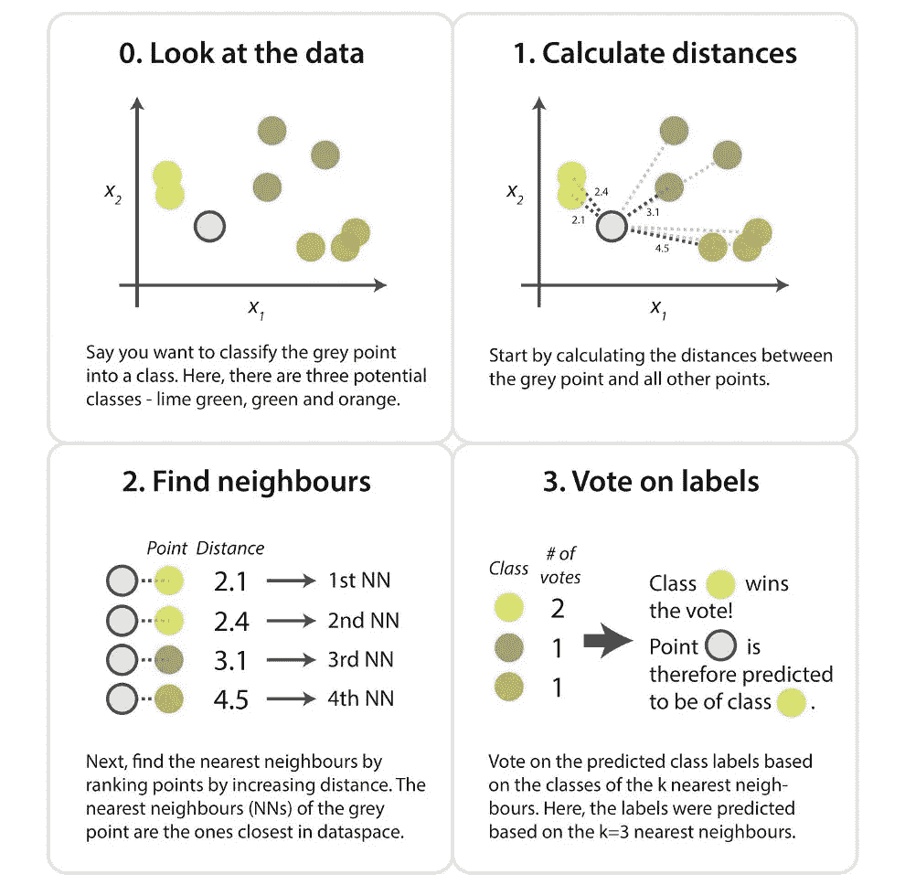

图 2:照片通过[kdnuggets.com](https://www.kdnuggets.com/2016/01/implementing-your-own-knn-using-python.html)

使用 K-最近邻，我们通过找到测试点和训练的 K 个最近特征值之间的距离，从可用的类别标签中预测测试点的类别。通过分析所有的信息，你会提出一个问题，

## 距离怎么算？

让我在距离度量的下一部分回答你的热情问题。

# 2.距离度量

距离度量是有效的超参数，通过它我们测量数据特征值和新测试输入之间的距离。

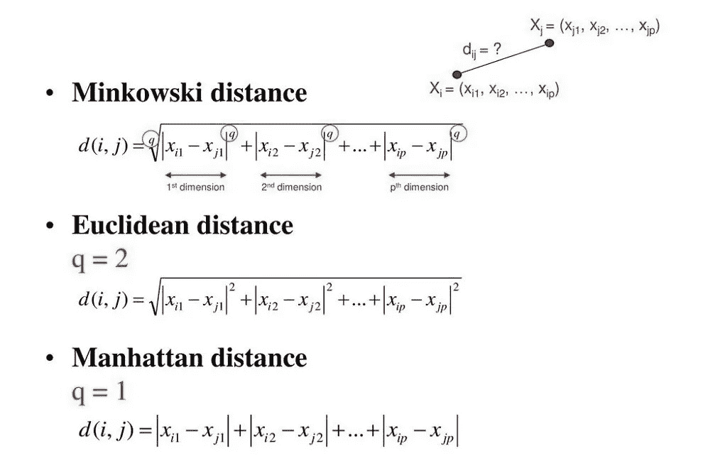

图 3:通过[slideplayer.com](https://slideplayer.com/slide/12735721/)拍摄的照片

通常，我们使用欧几里得方法，这是最广泛使用的距离度量，用于计算测试样本和训练数据值之间的距离。我们沿着从点(x1，y1)到点(x2，y2)的直线测量距离。

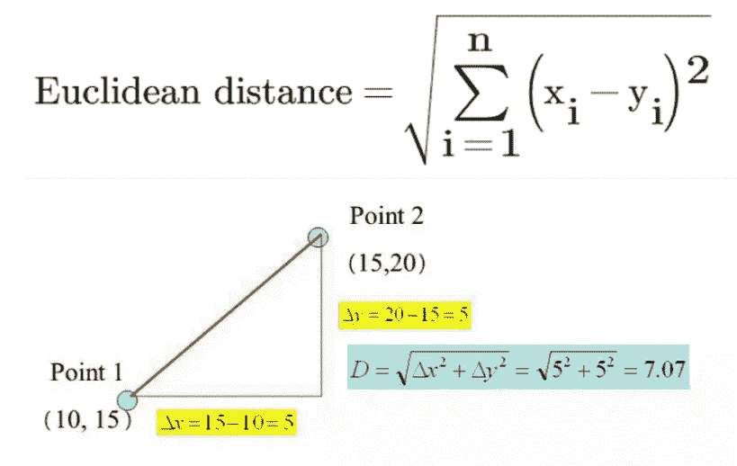

图 4:照片通过[slideplayer.com](https://slideplayer.com/slide/7529915/)

通过分析上面的计算，我希望你能理解我们是如何计算欧几里德距离的。让我们来解释一下 KNN 的预测方法。

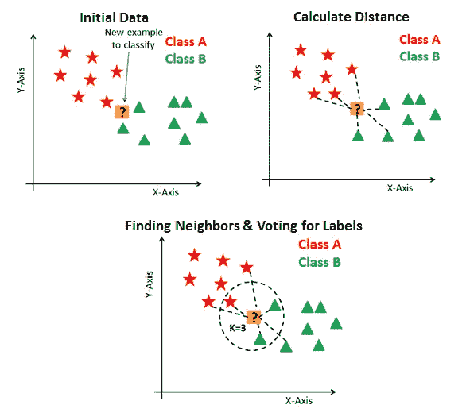

图 5:通过[datacamp.com](https://www.datacamp.com/community/tutorials/k-nearest-neighbor-classification-scikit-learn)的照片

## 要对未知记录进行分类:

*   初始化 K 值。
*   计算测试输入和 K 个训练好的最近邻之间的距离。
*   检查最近邻的类别，并确定测试输入属于哪种类型。
*   将通过获得多数票来进行分类。
*   返回班级类别。

我们理解对未知记录进行分类的过程，但是选择一个最优的 K 值呢？

我们来回答一下。

# 3.如何选择一个 K 值？

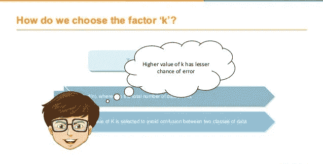

图 6:simplilearn.com 通过[的照片](https://www.simplilearn.com/)

K 值表示最近邻居的计数。我们必须计算测试点和训练标签点之间的距离。每次迭代更新距离度量的计算代价很高，这就是为什么 KNN 是一个懒惰的学习算法。

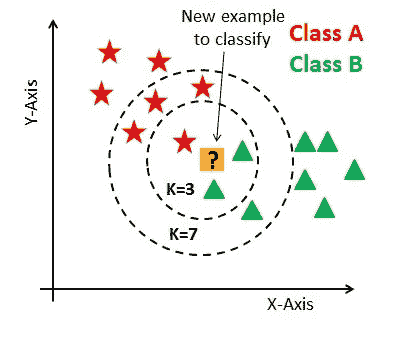

图 7:通过[datacamp.com](https://www.datacamp.com/)拍摄的照片

*   从上图可以看出，如果我们从 K=3 开始，那么我们预测测试输入属于 B 类，如果我们从 K=7 开始，那么我们预测测试输入属于 a 类。
*   这就是你如何想象 K 值对 KNN 性能有强大的影响。

## 那么如何选择最优的 K 值呢？

*   没有预先定义的统计方法来寻找最有利的 k 值。
*   初始化一个随机的 K 值，开始计算。
*   选择小的 K 值会导致不稳定的决策边界。
*   较大的 K 值对于分类更好，因为它导致平滑决策边界。
*   **绘制误差率和 K 之间的曲线图，表示定义范围内的值。然后选择具有最小误差率的 K 值。**

现在你会得到通过实现模型来选择最优 K 值的想法。

# 4.KNN 模式实施

让我们通过导入所有必需的包来启动应用程序。然后使用 **read_csv()** 函数读取电信数据文件。

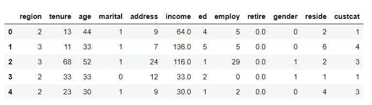

图 8:主数据集

> 如您所见，有 12 列，即地区、任期、年龄、婚姻、地址、收入、学历、雇佣、退休、性别、居住和客户。我们有一个目标列，**“cust cat”**将客户分为四组:

*   1-基本服务
*   2-电子服务
*   3+服务
*   4-全面服务

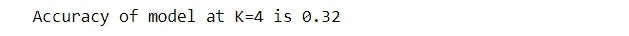

图 9:K = 4 时的精度测量

*   我们将所有独立的数据特征收集到 X 数据框中，并将目标字段收集到 y 数据框中。然后我们处理数据并使其正常化。
*   分割数据后，我们将 0.8%的数据用于训练，其余用于测试。
*   我们从 sklearn 库中导入分类器模型，并通过初始化 **K=4 来拟合模型。**所以我们在这里达到了 **0.32** 的精度。

现在是时候改进模型，找出最优 k 值了。

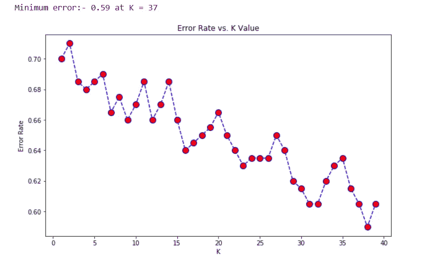

图 10:误差率与 K 值的关系

从图中可以看出，在 K=37 时，我们得到的最小误差为 0.59。接下来，我们可视化了**精度和 K 值之间的关系。**

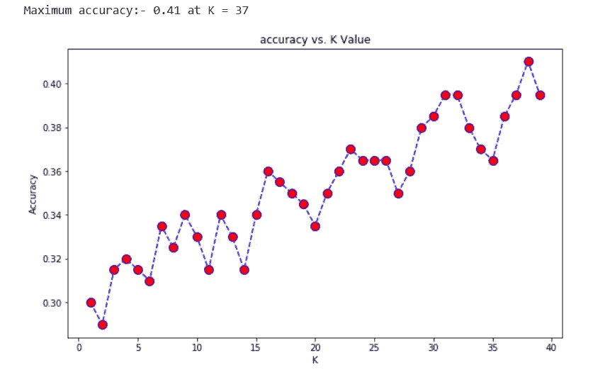

图 11:精度与 K 值的关系

现在您看到了改进的结果。我们在 K=37 得到了 **0.41 的精度。由于我们已经推导出了误差图，并在 k=37 时获得了最小误差，因此我们将在该 K 值下获得更好的效率**。****

因为我们的主要重点是确定最佳 K 值，但是，您可以执行探索性数据分析，甚至可以实现更高的准确性。数据文件和代码在我的**[**GitHub**](https://github.com/Amey23/Machine-Learning/tree/master/K-Nearest%20Neighbor)库中。**

# **5.关键要点**

*   **我们在 k=37 时获得了 **0.41 的精度，比 k=4 时计算的效率要高。****
*   ****小 K 值不适合**分类。**
*   **通常找到的最佳 K 值是 N 的平方根**，**其中 N 是样本总数。**
*   **使用误差图或精度图找到最有利的 K 值。**
*   **KNN 在处理多标签类时表现良好，但是您必须注意异常值。**
*   **KNN 广泛应用于**模式识别**和**分析评价**领域。**

**所有人都在这里，**

**在我的下一篇文章中再见。**

> **你好👋我希望你能从我的文章中获得知识。如果你愿意支持我，请随意给我买些咖啡🙏☕**
> 
> **[**https://www.buymeacoffee.com/amey23**](https://www.buymeacoffee.com/amey23)**
> 
> ****或通过 ameypband23@gmail.com 联系我****
> 
> ****乐意为您效劳。****
> 
> **参考文献:[监督机器学习中的肘方法](https://medium.com/@moussadoumbia_90919/elbow-method-in-supervised-learning-optimal-k-value-99d425f229e7)**

** [## amey 23/机器学习

github.com](https://github.com/Amey23/Machine-Learning/tree/master/K-Nearest%20Neighbor)**