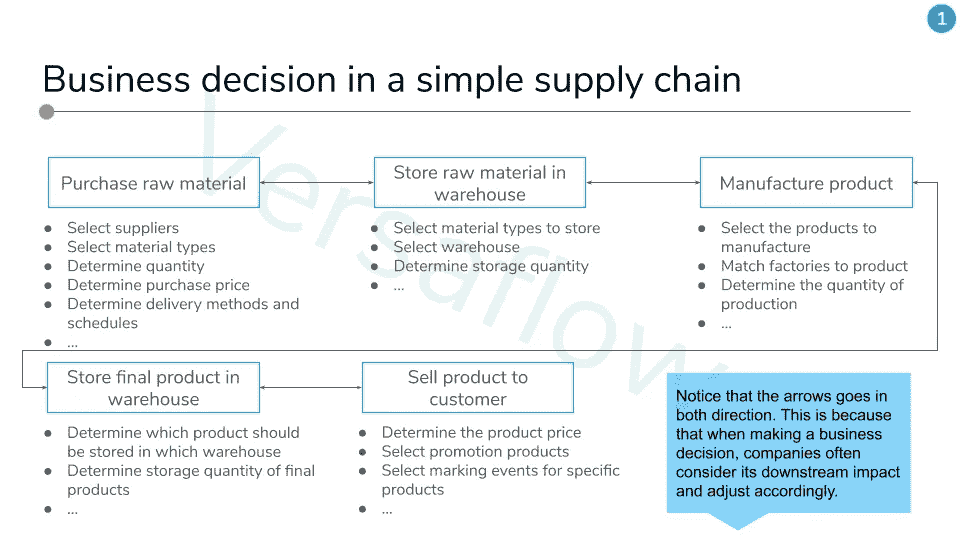
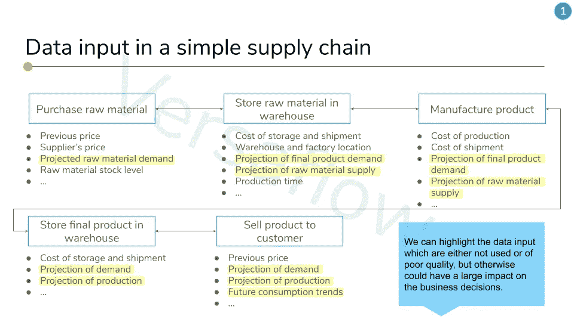
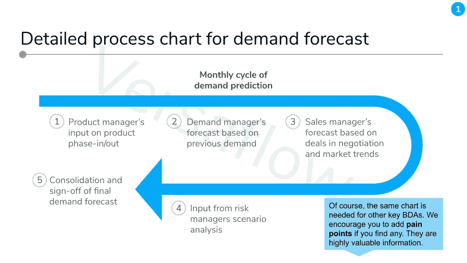
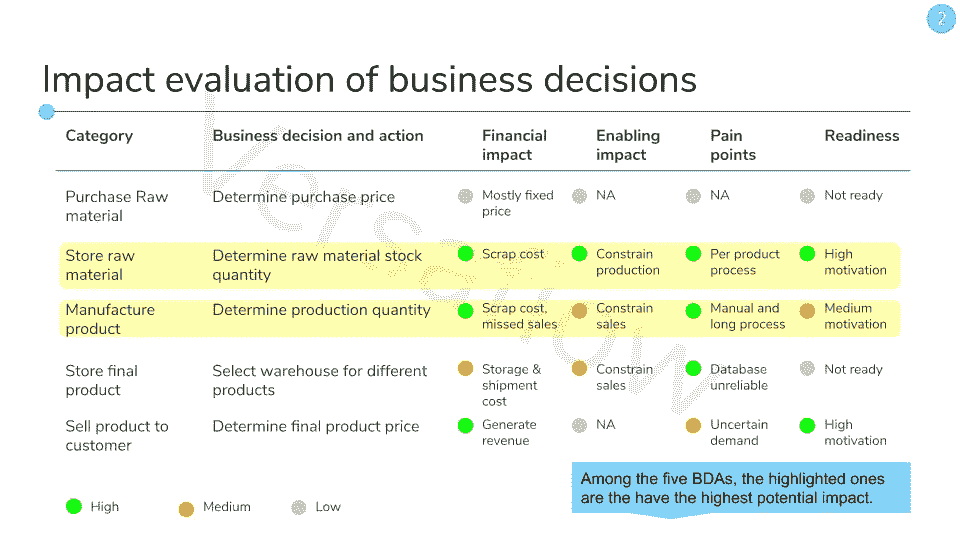
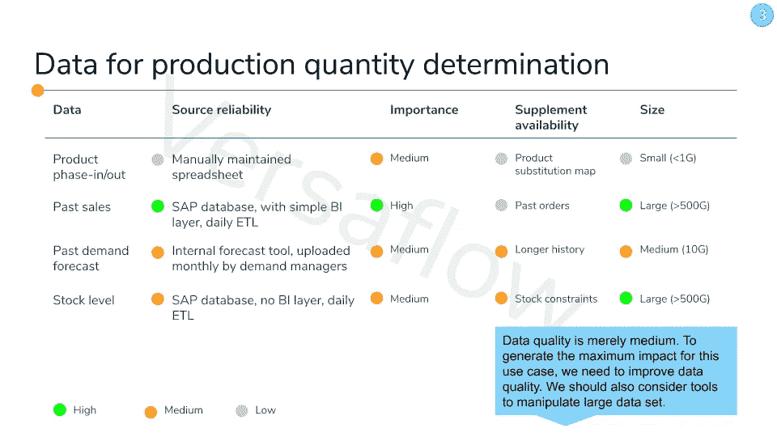
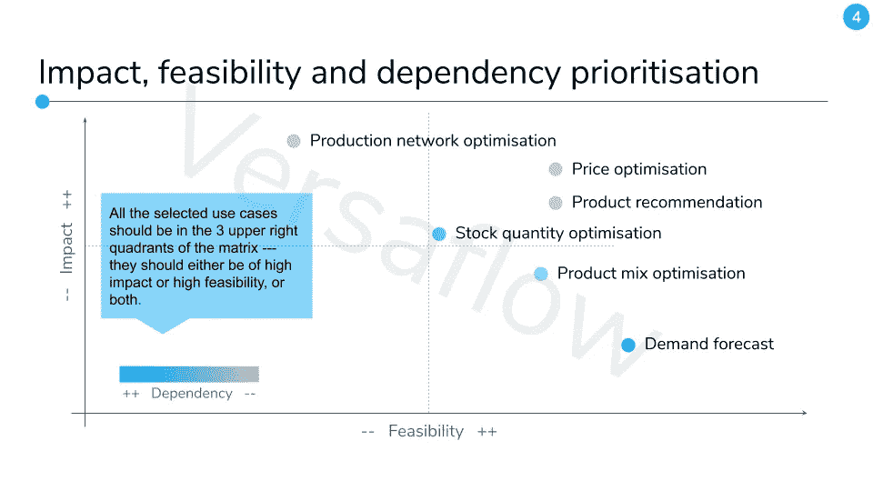
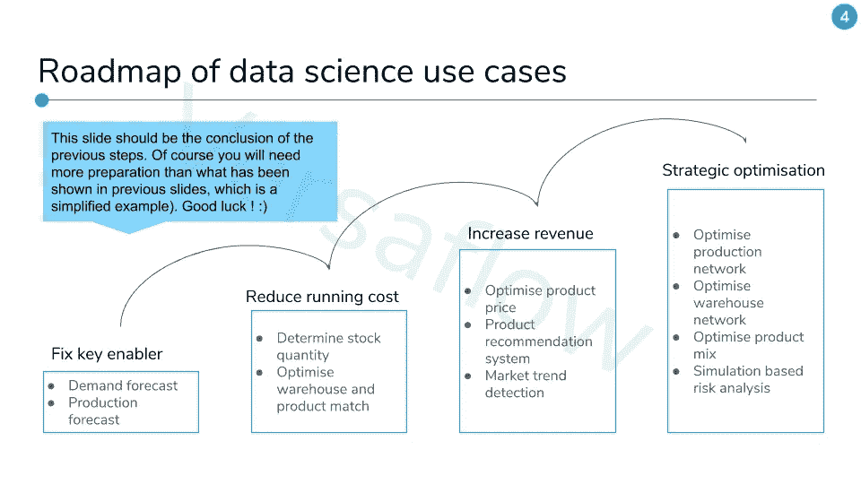

# 如何为您的企业找到合适的数据科学用例

> 原文：<https://towardsdatascience.com/how-to-find-the-right-data-science-use-cases-for-your-business-55002d0cde2b?source=collection_archive---------35----------------------->

## 数据科学和商业战略

## 第 1/4 集—识别

照片由[杰米街](https://unsplash.com/@jamie452?utm_source=medium&utm_medium=referral)在 [Unsplash](https://unsplash.com?utm_source=medium&utm_medium=referral)

# 介绍

如果你在谷歌上搜索“数据科学用例”，你会发现数百个这样的列表，每个条目都以一个时髦词开头，比如*欺诈检测*、*推荐系统*或其他更花哨的术语。接下来是一小段，试图用 200 个词来解释它，勉强够将这个术语与其他术语放在一起，如人工智能、数据科学、机器学习、深度学习，所有这些都用最高级来调味。反正数据科学(或者 AI，或者机器学习，或者深度学习)应该让事情变得更好，要不然，有什么意义？

看着这些清单，对于一个试图弄清楚实际需要做什么的 DS 来说，这可能是令人困惑的。它们充其量只是灵感，但不是配方，也不包含任何诀窍。作为(好的)DS，我们应该能够识别潜在的用例，找到并掌握解决它的工具，并与我们的业务同事一起产生影响。先从识别开始，下面是你如何做好。

# 确定数据科学使用案例

数据科学用例至少有两个先决条件，一个是数据(不足为奇)，另一个是导致行动的业务决策。数据科学提供工具来检查数据背后的机制，以便可以利用它来制定更好的业务决策。以一种非常示意性的方式，我们可以设计一个练习，通过 4 个步骤找出最佳数据科学用例:

**第一步:理解上下文**

*   画出你感兴趣的业务部门的关键决策和后续行动(BDA)的结构，就像这样。所有 BDA 都分组在一个节点下，代表拥有决策或行动的单位。节点之间的箭头表示它们如何通过材料影响(工厂的生产取决于原材料供应)或信息交换(仓库库存水平在很大程度上取决于工厂的需求)相互影响。

[点击此处查看全部资料](https://docs.google.com/presentation/d/e/2PACX-1vTu1dhtaGvLC69N-d7WS3nbSYFa8Um9Fj6uMNV1UUBkDTwlUp-9tU24ljvOFuXZIZ3FLtCvnmoq3xI0/pub?start=false&loop=false&delayms=30000)

*   然后列出用于驱动此 BDA 的数据。问问你自己，这些数据是否质量良好，或者是否可以引入任何其他数据来改进决策，也把它们记下来。

[点击此处查看全部资料](https://docs.google.com/presentation/d/e/2PACX-1vTu1dhtaGvLC69N-d7WS3nbSYFa8Um9Fj6uMNV1UUBkDTwlUp-9tU24ljvOFuXZIZ3FLtCvnmoq3xI0/pub?start=false&loop=false&delayms=30000)

*   最后，添加一些关于推动这些 BDA 的流程的信息，注意所需的时间、涉及的人员或业务部门、技术支持的程度以及是否有任何难点。

[点击这里看完整版](https://docs.google.com/presentation/d/e/2PACX-1vTu1dhtaGvLC69N-d7WS3nbSYFa8Um9Fj6uMNV1UUBkDTwlUp-9tU24ljvOFuXZIZ3FLtCvnmoq3xI0/pub?start=false&loop=false&delayms=30000)

这个过程可能需要一段时间，因为了解公司其他部门的情况并不容易。然而，对驱动 BDA 的机制和原理有一个很好的理解是至关重要的，否则我们可能会忽略要解决的实际问题，最终得到一个完美但无用的模型。因此，搜索文档和演示文稿，最重要的是，与人交谈。

**第二步:缩小关注范围**

是时候为您的数据科学项目评估和选择最佳的 BDAs 了。尝试回答以下每个问题:

*   它是否有很大的财务影响，即要么产生高成本，要么产生可观的收入？
*   它是否是许多其他 BDA 的必要投入，因而需要高质量？
*   是否存在可以通过使用更好的技术和数据科学来缓解的紧迫痛点？
*   OP 接受新技术和改变工作方式的可能性有多大？

对于理想的 BDAs，你应该能够回答“是”所有这些问题。他们是从数据科学中受益最多的人，这就是为什么我们应该关注他们。

**第三步:高级数据评估**

数据质量对于数据科学用例的可行性至关重要。早期评估可以帮助我们确定优先级，并选择正确的方法和技术。为了更好地了解数据质量，我们可以考虑以下几个方面:

*   数据是决策的关键输入(如果不是主要输入)吗？如果不是，那么使用一些数据作为关键/主要输入是否会更好？
*   数据来源可靠吗？ETL 是如何工作的？它是否依赖于传统的 it 系统？需要人工操作吗？数据库维护得如何？
*   使用的数据量有多大？可能用于决策的数据量有多大？
*   我们有多大可能获得改善当前决策所需的额外数据？

[点击此处查看全部资料](https://docs.google.com/presentation/d/e/2PACX-1vTu1dhtaGvLC69N-d7WS3nbSYFa8Um9Fj6uMNV1UUBkDTwlUp-9tU24ljvOFuXZIZ3FLtCvnmoq3xI0/pub?start=false&loop=false&delayms=30000)

在最好的情况下，数据源应该是可靠的，并用作决策的主要输入。数据大小可以向我们指示正确的工具(例如，当数据大小较大时，应考虑分布式系统)和经常使用的方法(例如，对于小数据集，优选线性回归或传统统计方法等简单算法，以避免过度拟合)。

**第四步:总结归纳**

通过比较第 2 步和第 3 步的结果，我们应该能够根据这些基于两个维度(影响和可行性)的标准来选择甚至排列 BDAs:

*   *【影响】*无论在财务还是非财务方面，它都有很大的影响
*   *【影响】*数据科学和技术可以极大地改善其结果
*   *【可行性】*关键利益相关者愿意接受新技术和变革
*   *【可行性】*所需数据输入可用且质量良好
*   *【可行性】*ds 和 SE⁴团队拥有部署所需技术的技能

[点击此处查看全部资料](https://docs.google.com/presentation/d/e/2PACX-1vTu1dhtaGvLC69N-d7WS3nbSYFa8Um9Fj6uMNV1UUBkDTwlUp-9tU24ljvOFuXZIZ3FLtCvnmoq3xI0/pub?start=false&loop=false&delayms=30000)

然后，可以通过将具有重叠数据需求和关键利益相关者的紧密联系的 BDA 分组在一起来定义用例。最后，为了找出从哪里开始和从哪里结束，我们将再次查看每个用例的影响和可行性，但是现在有了一个额外的维度——依赖性。不用说，其他案件所依赖的案件应该尽早开始。现在，您的数据科学使用情形有了一个坚实的路线图！

[点击此处查看全部资料](https://docs.google.com/presentation/d/e/2PACX-1vTu1dhtaGvLC69N-d7WS3nbSYFa8Um9Fj6uMNV1UUBkDTwlUp-9tU24ljvOFuXZIZ3FLtCvnmoq3xI0/pub?start=false&loop=false&delayms=30000)

**符号**

DS:数据科学家，但也是机器学习工程师，他们更擅长建模而不是软件工程

BDA:商业决策和行动。

运营和生产，确保日常业务良好运转的人。

SE⁴:软件工程师，但也有数据工程师，他们更感兴趣的是制造良好和强大的产品或管道。