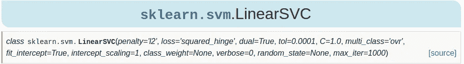
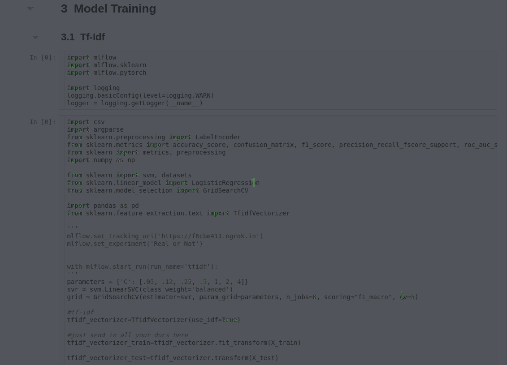
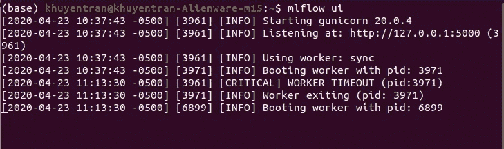
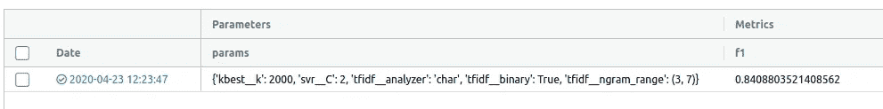

# 如何有效地微调你的机器学习模型

> 原文：<https://towardsdatascience.com/how-to-fine-tune-your-machine-learning-models-with-ease-8ca62d1217b1?source=collection_archive---------12----------------------->

## 发现为您的 ML 模型寻找最佳参数非常耗时？用这三招

# 动机

您是否曾经想为您的模型试验不同的参数，但发现这样做真的很耗时？假设您想要使用支持向量机(SVM)来训练和预测模型。



你争论什么可能是`C`的最佳值，所以你继续手动试验`C`的不同值，希望得到好的结果。这很费时间，但还不算太糟。

但是如果要先用`sklearn.feature_extraction.text.TfidfVectorizer`提取重要文本，再用`sklearn.feature_selection.SelectKBest`寻找最佳特征，最后用`sklearn.SVM.LinearSVC`训练预测模型呢？在中会有很多**参数需要调整。此外，你需要找到一种方法来记录结果进行比较。所以你的笔记本可以看起来乱七八糟！**



有没有更好的方法来选择参数，缩短代码，以及保存结果进行比较？是的，当然！我们的方法就像一个美味的蛋糕，有三种简单的配料:

*   合并不同模型的管道
*   网格搜索以找到每个模型的最佳参数
*   MLflow 记录结果

有你需要的所有成分吗？厉害！现在我们准备把它们放在一起。


照片由[德鲁·帕特里克·米勒](https://unsplash.com/@drewpatrickmiller?utm_source=medium&utm_medium=referral)在 [Unsplash](https://unsplash.com?utm_source=medium&utm_medium=referral) 上拍摄

# 管道

什么是管道？`[**sklearn.pipeline.Pipeline**](https://scikit-learn.org/stable/modules/generated/sklearn.pipeline.Pipeline.html)`允许我们**将一系列转换和一个最终估计器组合成一个链。**

例如，为了预测一条推文是否具有攻击性，在处理文本后，我们使用`tfidf_vectorizer,`和`SelectKBest`作为变压器，使用`svm.LinearSVC`作为最终估计器。

上面的代码可以合并到一个管道中，管道中有一列表示为元组的步骤。在每个元组中，第一个参数是类名，第二个参数是类。

短得多，有条理！我们可以很容易地将任何步骤切换到另一个转换器或估计器。确保管道中的类来自`sklearn.`如果不是，你可以像这样用`def __init__, def fit(),`和`def transform()`轻松创建定制的`sklearn`类。

在这里找到示例源代码

# 网格搜索简历

因此，我们准备好了转换和预测数据的管道。但是参数调优呢？通过`[***sklearn.model_selection.GridSearchCV***](https://scikit-learn.org/stable/modules/compose.html)***.***`，我们可以很容易地找到管道中变压器和估算器的最佳参数

假设我们想要找到`SelectKBest`的最佳值`k`，最佳值`C`的最佳值`svm.LinearSVC,`，最佳值`analyzer, ngram_range,`和`binary`的最佳值`TfidfVectorizer.`，我们可以给网格几个参数来搜索。参数表示为嵌套在字典中的列表。

为了设置特定类的参数，我们使用`class_name__parameter = [para_1, para_2, para_3].`确保类名和参数之间有两个下划线。

`grid_search.fit(X_train, y_train)` 使用不同的参数、指定的转换和估算器创建几次运行。将为转化步骤选择产生最佳结果的参数组合。

我们还可以用不同的变压器和估算器创建其他管道，并再次使用 GridSearchCV 来寻找最佳参数！但是我们如何保存所有运行的结果呢？

可以通过上下滚动屏幕或拍摄结果照片来观察结果。但是这很费时间，没有考虑到我们可能希望在以后的项目中看到结果。有没有更好的方法来跟踪我们的结果？这就是我们需要像 MLflow 这样的跟踪工具的时候

# MLflow

[MLflow](https://mlflow.org/docs/latest/index.html) 是一个管理端到端机器学习生命周期的工具，包括跟踪实验、以可复制的形式打包 ML 代码以供共享和部署。我们将利用这个工具来记录我们的结果。

MLflow 的安装可以像这样简单

```
pip install mlflow
```

让我们将目前为止所做的与物流跟踪工具结合起来

在这段代码中，我们只添加了三个元素来记录结果:

*   `mlflow.set_experiment('name_of_experiment')`创造新的实验
*   `mlflow.start_run()`我们要运行实验的代码在里面
*   `mlflow.log_param()`和`mlflow.log_metric()`来记录参数和指标

将上面的文件保存为`train.py.`最后一步是运行文件

```
python train.py
```

代码运行完成后，我们可以通过运行

```
mlflow ui
```



访问链接 [http://localhost:5000](http://127.0.0.1:5000) ，我们应该会看到这个



正如我们从上面可以看到的，实验的指标和参数都被记录下来了！我们可以创建几个实验并记录这些实验的结果，以便进行简单有效的比较。

# 结论

恭喜你！您已经学习了如何使用 Pipeline、GridSearchCV 和 MLflow 高效地调整机器学习模型的参数。您可以在这里找到本文[的类似示例代码。我鼓励你在现有的机器学习项目中尝试这些方法。从长远来看，编码方法上的一点点改变就能产生很大的不同。有效地进行实验并跟踪结果不仅会节省您的时间，还会使您更容易找到最佳参数并从实验中学习。](https://github.com/khuyentran1401/Machine-learning-pipeline)

我喜欢写一些基本的数据科学概念，并尝试不同的算法和数据科学工具。你可以在 [LinkedIn](https://www.linkedin.com/in/khuyen-tran-1401/) 和 [Twitter](https://twitter.com/KhuyenTran16) 上联系我。

如果你想查看我写的所有文章的代码，请点击这里。在 Medium 上关注我，了解我的最新数据科学文章，例如:

[](/how-to-organize-your-data-science-articles-with-github-b5b9427dad37) [## 如何用 Github 组织你的数据科学文章

### 被新信息淹没？现在，您可以轻松地跟踪文章并为其创建自定义注释

towardsdatascience.com](/how-to-organize-your-data-science-articles-with-github-b5b9427dad37) [](/how-to-create-a-drop-down-menu-and-a-slide-bar-for-your-favorite-visualization-tool-3a50b7c9ea01) [## 如何为你最喜欢的可视化工具创建下拉菜单和滑动条

### 使用 Python Widget，您可以用 3 行代码升级可视化

towardsdatascience.com](/how-to-create-a-drop-down-menu-and-a-slide-bar-for-your-favorite-visualization-tool-3a50b7c9ea01) [](/how-to-share-your-jupyter-notebook-in-3-lines-of-code-with-ngrok-bfe1495a9c0c) [## 如何用 Ngrok 用 3 行代码分享你的 Jupyter 笔记本

### 想象一下，让你的朋友在远程机器上使用你的本地 Jupyter 笔记本

towardsdatascience.com](/how-to-share-your-jupyter-notebook-in-3-lines-of-code-with-ngrok-bfe1495a9c0c) [](/how-to-monitor-and-log-your-machine-learning-experiment-remotely-with-hyperdash-aa7106b15509) [## 如何使用 HyperDash 远程监控和记录您的机器学习实验

### 培训需要很长时间才能完成，但你需要去洗手间休息一下…

towardsdatascience.com](/how-to-monitor-and-log-your-machine-learning-experiment-remotely-with-hyperdash-aa7106b15509) [](/cython-a-speed-up-tool-for-your-python-function-9bab64364bfd) [## cy thon——Python 函数的加速工具

### 当调整你的算法得到小的改进时，你可能想用 Cython 获得额外的速度，一个…

towardsdatascience.com](/cython-a-speed-up-tool-for-your-python-function-9bab64364bfd)