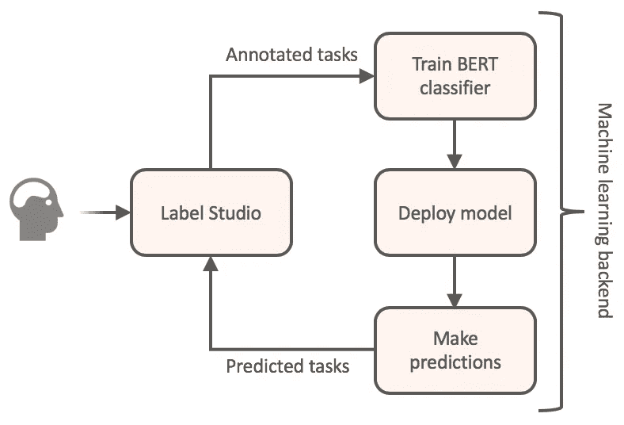
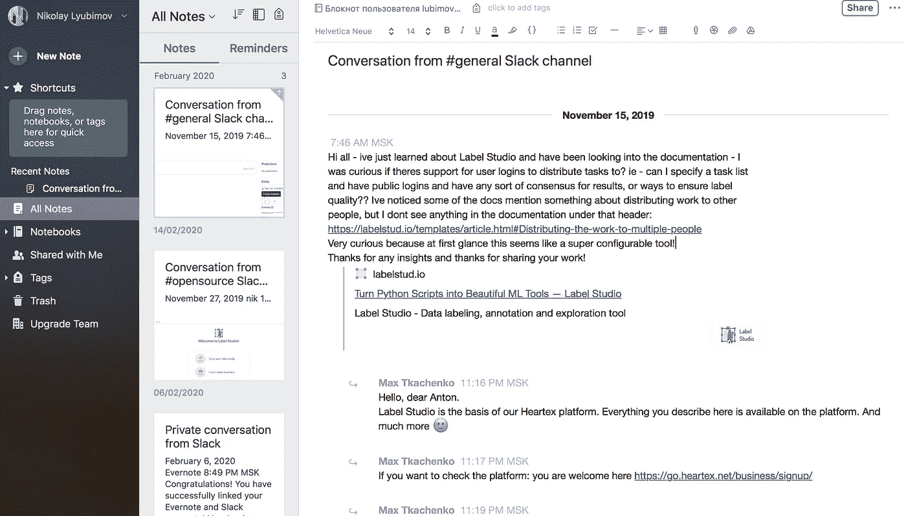
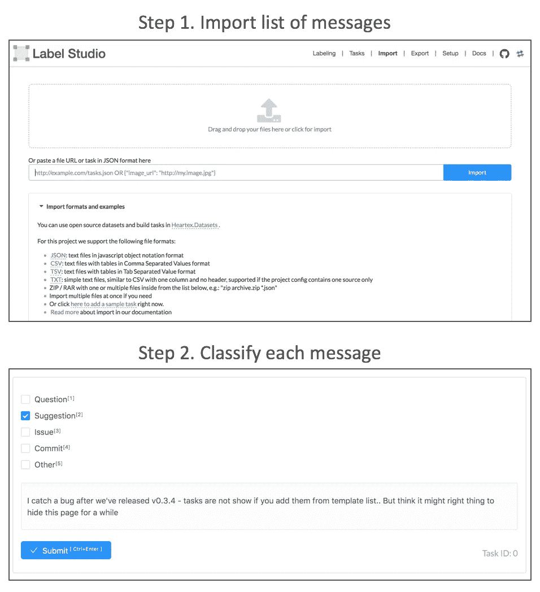
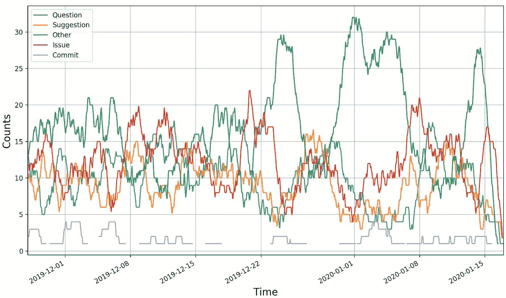
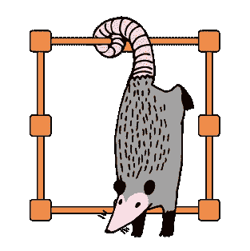

# 如何在不编码的情况下微调 BERT 来对您的空闲聊天进行分类

> 原文：<https://towardsdatascience.com/how-to-finetune-bert-to-classify-your-slack-chats-without-coding-3a7002936bcf?source=collection_archive---------17----------------------->


伯特图摘自[原始论文](https://arxiv.org/pdf/1810.04805.pdf)

随着时间的推移，松散的聊天会变得混乱，难以提取有意义的信息。在这篇文章中，我想介绍一种快速的无代码方式来微调和部署常用的 [BERT 分类器](https://arxiv.org/abs/1810.04805)来进行会话分析。我们将使用该系统从我们的空闲对话中提取任务、事实和其他有价值的信息。它可以很容易地扩展到分类任何其他文本数据，如支持请求，电子邮件等。

我们想从 Slack 中提取什么？这可能取决于您的团队使用它的目的，以及共享的信息类型。对我们来说，我们发现很多 todo 任务迷失在不停的文本流中，还有一些有价值的信息可以进一步添加到产品文档中，或者需要在日常会议中讨论。



从标签工作室的角度看机器学习生命周期

[Label Studio](https://labelstud.io/) 提供了一种简单的方法来试验 NLP 机器学习，在不到一个小时的时间内覆盖了从原始未标记数据到部署预测服务的整个 ML 生命周期。如果你想随意聊天，请遵循以下简单步骤:

# 收集数据

从 Slack 收集数据可以通过使用 Evernote Slack bot integration[来完成。这很简单，只需设置并运行 */clip* 进入您想要卸载的松弛通道。然后你会在 Evernote 应用中找到相应的文档:](https://evernote.com/intl/ru/integrations/slack)



使用 Evernote 应用程序删除松散的对话

那么原始文档应该被分割成单独的消息。保存时间戳也有助于进一步分析。使用以下项目列表创建一个 JSON 格式的文件 *tasks.json* :

```
[{
  "text": "Hello, dear Anton.\nLabel Studio is the basis of our Heartex platform. Everything you describe here is available on the platform. And much more:)",
  "date": "November 15, 2019"
}]
```

# 微调伯特分类器

你可以将 Label Studio 连接到机器学习后端，并在新数据可用时使用它进行预测和重新训练。模型在每次接收到新的带注释的任务时更新其状态，并且重新部署新的状态以对新进入的任务进行推理。一旦设置好了，微调就变得非常容易——您只需要做一件事就是标记您的任务——过一会儿，您就可以通过 REST API 服务获得一个可用的工作模型。

我们专门构建了一个[应用](https://github.com/heartexlabs/label-studio-transformers)，它将 Label Studio 与机器学习后端集成在一起，后者由开源[变形金刚](https://github.com/huggingface/transformers)库中的 BERT 模型提供支持。假设您安装了 docker-compose，您可以用以下命令启动它:

```
git clone [https://github.com/heartexlabs/label-studio-transformers](https://github.com/heartexlabs/label-studio-transformers)
cd label-studio-transformers
docker-compose up
```

这个命令在本地启动位于 [http://localhost:8200 的 Label Studio。](http://localhost:8200.)进入[导入页面](http://localhost:8200/import)，上传之前创建的 *tasks.json* 文件。就这样，所有的设置都完成了，现在你可以对来自标签 UI 的消息进行分类，检查模型的建议是否随着时间的推移而改进。



用 Label Studio 微调 BERT 分类器。

数百条消息可能就足够了，这取决于您愿意解决的任务有多复杂，以及您期望的准确度有多高。在我们的例子中，我们将消息分为五类:问题、议题、建议、提交和其他。可接受的质量是在三百个任务之后建立起来的，并且需要大约一个小时的注释。如果时间不够，也可以让奶奶对分类器进行微调。

# 识别聊天信息

由于在注释过程中已经部署了模型，所以您可以使用 right away 通过 REST API 预测新消息的未知标签:

```
curl -X POST -H 'Content-Type: application/json' -d '{"text": "Its National Donut Day."}' [http://localhost:8200/predict](http://localhost:8200/predict)
```

如果一切正常，您将看到 JSON 响应:

```
[
  {
    "cluster": null,
    "result": [
      {
        "from_name": "label",
        "to_name": "text",
        "type": "choices",
        "value": {
          "choices": [
            "Other"
          ]
        }
      }
    ],
    "score": 1.6718149185180664
  }
]
```

其中“其他”是带有某种“分数”的预测消息类型(有关格式的更详细解释，请联系 [Label Studio docs](https://labelstud.io/guide/format.html#Completion-format) )

除了通过 Label Studio API 使用模型之外，您还可以在*存储/label-studio-ml-backend/* 模型目录中找到所有检查点，并使用 [Tensorboard](https://github.com/heartexlabs/label-studio-transformers#run-tensorboard) 检查训练进度。

# 我们学到了什么

松散的聊天是混乱的，但是感谢现代的 NLP，它变得很容易把你的对话组织起来并获得有用的见解。例如，你可以探索在某个时间段内你的对话中发生了什么，就像我们通过汇总过去几个月我们的信息预测所做的那样:



根据伯特模型，我们过去几个月的轻松谈话

我们从这张图表的一些观察模式中得出的结论是:

*   圣诞节和新年假期期间的许多随意交谈
*   当有问题/错误报告时，不要随意交谈
*   代码提交后，接下来是对问题的讨论
*   问题与建议相关联，这显然是正常的
*   建议引发问题和讨论

我们实际学到的是**花一个小时注释你的文本足以构建一个合理的 ML 工具**。我相信标记更多的数据会让您受益于更高的细粒度准确性。

# 结论



通过创建 Slack analytics 应用程序，我们展示了如何通过仅使用数据注释来解决复杂的机器学习任务。你不用写代码，而是通过展示一个你如何解决的例子来教模型执行任务。可以更深入地将 Label Studio 与其他机器学习框架一起使用，例如，微调一些用于分割、姿势估计、场景检测等的计算机视觉任务。很想听听你有什么想法和实现

快乐贴标签！