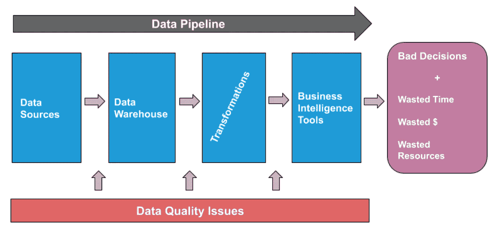

# 如何解决您的数据质量问题

> 原文：<https://towardsdatascience.com/how-to-fix-your-data-quality-problem-eb15372b61c6?source=collection_archive---------36----------------------->

## 介绍一种更好的方法来防止坏数据。

巴尔·摩西授权下的图片。

*数据质量是每一个数据专业人员最关心的问题，这是有充分理由的。* ***坏数据*** ***耗费公司宝贵的时间、资源，最重要的是，收益*** *。那么，为什么我们中的许多人都在努力信任我们的数据呢？没有更好的办法吗？*

数据环境在不断发展，每时每刻都在为更丰富的洞察力创造新的机会。新旧数据源混合在同一个数据湖和数据仓库中，有供应商可以满足您的每一种需求，从帮助您构建更好的[数据目录](https://medium.com/@barrmoses/what-we-got-wrong-about-data-governance-365555993048)到生成令人垂涎的可视化效果([让 NYT 来让抵押贷款看起来更性感](https://blog.udacity.com/2015/01/15-data-visualizations-will-blow-mind.html))。

毫不奇怪，客户问我的最常见的问题之一是“*您推荐什么数据工具？*

更多的数据意味着更深入地了解您的业务。与此同时，更多的数据增加了出错和不确定性的风险。难怪数据领导者争先恐后地[购买解决方案](https://medium.com/@barrmoses/what-we-got-wrong-about-data-governance-365555993048)并建立团队，既支持更明智的决策，又管理数据固有的复杂性。

> 但是我认为我们应该问自己一个稍微不同的问题。相反，请考虑: ***“我们的组织需要什么来充分利用和信任我们的数据？”***

# 数据质量并不总能解决坏数据

用不可信的数据做决策是一种可怕的前景，然而，即使是最有能力、最有经验的数据团队也是如此。许多团队首先将数据质量视为数据健康和可靠性的轶事。我们喜欢说“垃圾进来，垃圾出去”这是一个真实的陈述——但是在今天的世界里，这就足够了吗？

企业花费时间、金钱和资源购买解决方案并建立团队来管理所有这些基础设施，梦想有一天成为一台运转良好的数据驱动机器——但从摄取到洞察，数据问题可能发生在管道的任何阶段。简单的行数、特别的脚本，甚至摄取时的标准数据质量约定都不能满足要求。

我在一家大型运输公司采访的一位数据主管告诉我，平均而言，他的 45 名工程师和分析师团队每周**花费 140 个小时** **来手动检查管道中的数据问题。**即使你有一个 10 人的数据团队，那也是整整五天的时间，可以用来开展创收活动。

*数据质量问题可能发生在管道中的任何地方，导致错误决策、资源浪费和沉没成本。虽然对于识别这类问题很有用，但是数据质量本身只能帮你做到这一步。(图片由* [*蒙特卡洛*](http://www.montecarlodata.com) *提供)。*

无论有多少花哨的工具、训练有素的工程师和管理层的支持，都无法防止坏数据破坏您的管道。虽然组织在构建良好的基础设施方面投入了大量资金，但他们经常发现自己在系统整体的完整性方面不知所措，或者说:数据宕机。

[**数据宕机**](/the-rise-of-data-downtime-841650cedfd5) ，换句话说，数据丢失、出错或以其他方式受损的时刻，既是数据生态系统最大的痛点，也是全面了解数据质量的关键。数据宕机会导致时间浪费、决策失误，而且最重要的可能是**损失收入和客户信任**。

如果不跟踪数据停机时间，工具再先进也没用。(为了帮助我的客户解决这个问题，我创建了一个简单的 KPI[来衡量数据停机时间，作为更好地了解数据可靠性的函数。)](/data-quality-youre-measuring-it-wrong-8863e5ae6491)

> 虽然直觉决策有时是有用的，但我坚信使用坏的或不完整的数据比没有数据更糟糕。

# 数据可观察性是数据质量 2.0

有很多解决方案将自己推销为一个魔术箱，毫不费力地消耗原始数据来吐出可操作的见解，但在我看来，“数据”和“魔术”是永远不应该出现在同一个句子中的两个术语(好吧，也许只是在某些情况下……)。相反，重要的是将数据视为应该频繁跟踪和监控的东西，作为数据管理“控制台”方法的一部分。

为了释放数据的真正价值，我们需要超越数据质量。我们需要确保我们的数据无论在哪里都是可靠和值得信赖的。实现这一目标的唯一途径是创造可观察性——从源头到消费的整个过程。 [**数据可观察性**](/what-is-data-observability-40b337971e3e?source=friends_link&sk=db5d16e059c4c1c84f9d436f1e686c5b) ，组织完全了解其系统中数据健康状况的能力，通过将 DevOps 的最佳实践应用于数据管道，消除了这种神奇的感觉。

是的，数据可能因为一百万种不同的原因而变得“糟糕”。但是根据我的经验，通过关注数据可观察性的五大支柱****——新鲜度、容量、模式、分布和沿袭——你不仅可以主动发现数据中的问题，而且实际上可以从一开始就防止它们发生。(查看[我最近关于数据可观察性的文章](/what-is-data-observability-40b337971e3e?source=friends_link&sk=db5d16e059c4c1c84f9d436f1e686c5b),了解一些可行的策略，以及对这 5 个支柱的更全面的解释。)****

****数据可观察性可能不会告诉你下一步应该购买哪种新奇的数据工具，但它可以让你避免对数据做出糟糕的(可能代价高昂的)决策。****

*******得到了坏数据？*** [***加入我们的候补名单***](http://montecarlodata.com?utm_source=blog&utm_medium=medium&utm_campaign=data_quality_fix) ***获得帮助。*******