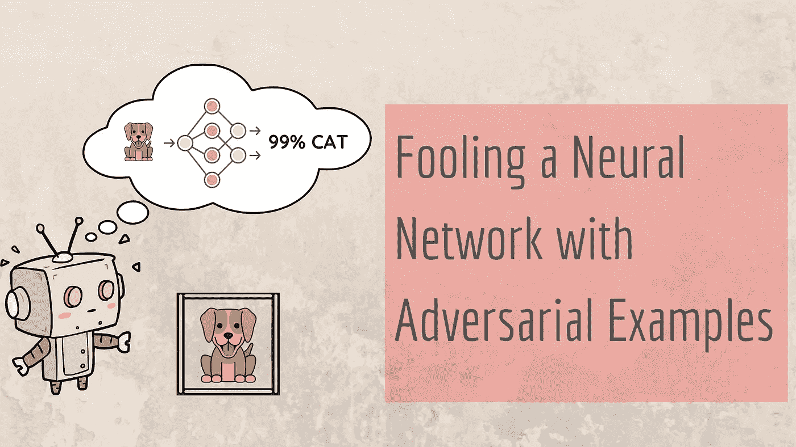
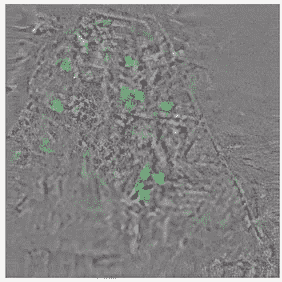
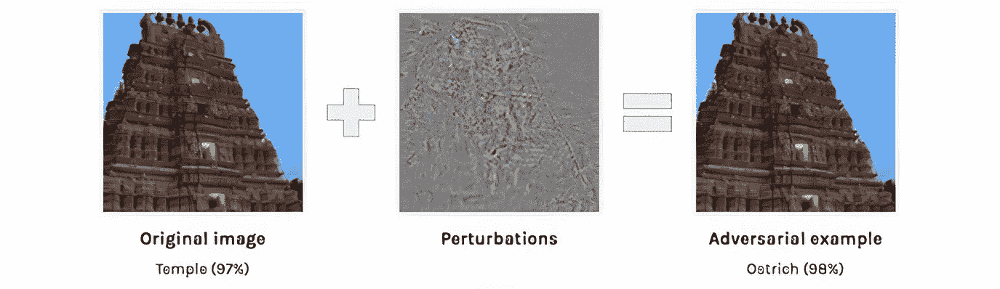
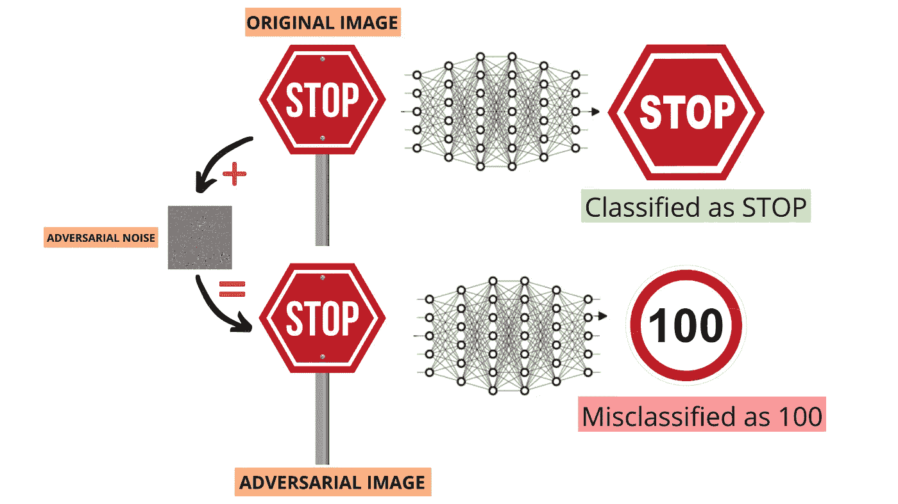
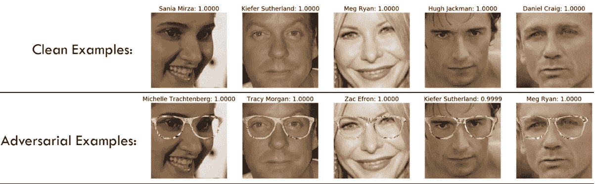
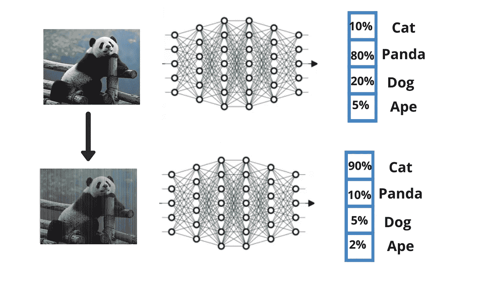
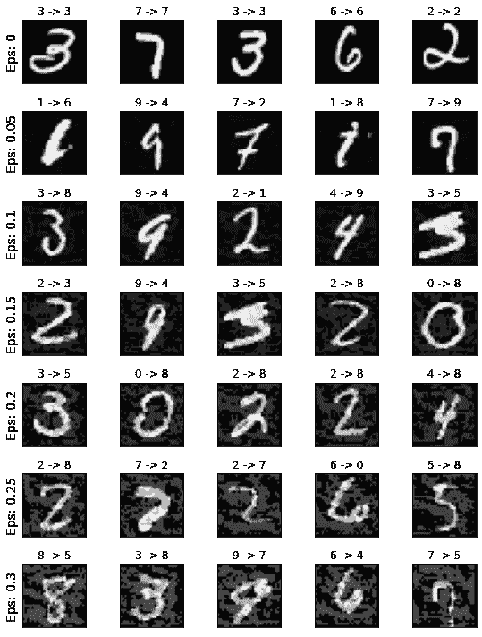
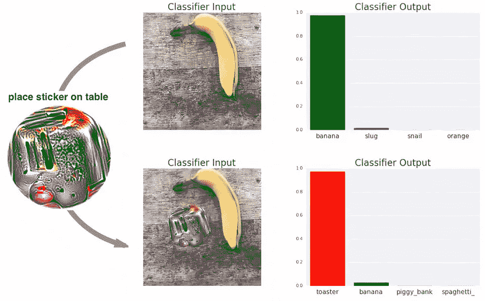
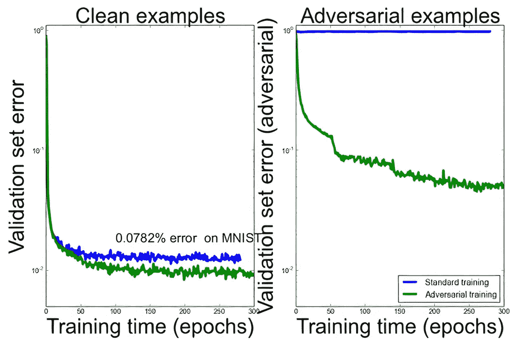

# 如何骗过一个神经网络？

> 原文：<https://towardsdatascience.com/how-to-fool-a-neural-network-958ba5d82d8a?source=collection_archive---------36----------------------->

## 通过一些对抗性的输入，神经网络很容易被欺骗



使用 Canva 设计

想象一下，你在 2050 年，你正坐在自动驾驶汽车去上班的路上(很可能)。突然，你意识到你的车在穿过十字路口后以 100 公里的时速行驶在繁忙的道路上，但你不知道为什么。

**纯粹的恐怖！**

会发生什么事？

嗯，可能有很多原因。但是在这篇文章中，我们将关注一个特殊的原因——**汽车被骗了**。

准确地说，在十字路口看到招牌的神经网络被欺骗，认为停止标志是 100 公里/小时的标志，并导致其瞬时加速。

这可能吗？

是的，它是。但是在深入了解之前，我们先来了解一下一个神经网络经过训练后看到了什么。据信，网络中的每个独立神经元的工作方式都与我们的生物神经元类似，我们假设神经网络在观看图像时的思维方式与我们的大脑相同。实际上，情况并非如此。我们来看一个例子。

猜猜下图是什么。


[来源](https://www.popsci.com/byzantine-science-deceiving-artificial-intelligence/)

你猜对了。这是一座寺庙，神经网络以 97%的置信度预测它是一座寺庙。

现在，猜猜这个图像是什么。


[来源](https://www.popsci.com/byzantine-science-deceiving-artificial-intelligence/)

又是寺庙？

他们看起来一模一样，但事实并非如此。上面的图像被预测为一只鸵鸟，有 98%的可信度，与我们之前使用的模型相同。网络现在被这个形象忽悠了。但是怎么做呢？

第二张图像不是来自真实世界的相机，而是手工设计的，专门用来欺骗神经网络分类器，同时与我们的视觉系统相同。



[来源](https://www.popsci.com/byzantine-science-deceiving-artificial-intelligence/)

这个吵闹的家伙要对模型的错误分类负责。将该噪声添加到第一图像中导致了修改的第二图像，这被称为对抗示例。增加的外部噪声称为扰动。



[来源](https://www.popsci.com/byzantine-science-deceiving-artificial-intelligence/)

同样，汽车可能以这种方式将停车标志与 100 公里/小时标志错误分类。



使用 Canva 设计

让我告诉你，除了上面的自动驾驶汽车案例，为什么这对许多现实世界的机器学习应用程序来说是一个非常重大的威胁。

*   也有可能创建一副 3D 打印眼镜，但当你戴上它们时，你突然无法被任何现有的面部识别软件识别。



[来源](https://www.inovex.de/blog/machine-perception-face-recognition/)

*   此外，打印一个定制的车牌，看起来完全正常，但会被任何现有的交通监控摄像头误注册。

这样，神经网络容易受到大量不同的攻击。有白盒攻击，黑盒攻击，物理攻击，数字攻击，可感知和不可感知的攻击等等。在任何真实环境下工作时，网络必须能够抵御所有此类攻击。

# 这是如何工作的？

安德烈·卡帕西写了一个非常有趣的博客，你可以在这里[阅读。这里有一个小的先睹为快。](http://karpathy.github.io/2015/03/30/breaking-convnets/)

那么，在传统的培训过程中，我们该怎么做呢？我们得到损失函数，我们反向传播，计算梯度，采用这个梯度并使用它来执行**参数更新**，它在正确的方向上稍微摆动模型中的每个参数，以增加预测分数。这些参数更新负责增加输入图像的正确类别的置信度得分。

注意这是如何工作的。我们保持输入图像不变，并调整模型参数以增加我们想要的任何类别的分数。反过来说，我们可以很容易地翻转这个过程来创造出愚蠢的图像。也就是说，我们将保持模型参数不变，取而代之的是，我们将计算输入图像中所有像素在我们希望的任何类上的梯度。例如，我们可以问一个问题—

> 当我调整图像的像素时,(你想要的任何类)的分数会怎样？



使用 Canva 设计

我们像以前一样用反向传播计算梯度，然后我们可以执行**图像更新**而不是参数更新，最终结果是我们增加我们想要的任何类的分数。例如，我们可以拍摄一张*熊猫*图像，并根据该图像在*猫*类上的渐变来调整每个像素。这会稍微改变图像，但是*猫*的分数现在会增加。有点不直观的是，事实证明你不需要过多地改变图像就可以将图像从被正确分类为*熊猫*切换到被分类为任何其他种类(例如*猫*)。

现在你已经对这是如何工作的有了一个基本的概念，有一个你应该知道的流行技术叫做**快速梯度符号方法，**用于产生对立的例子，这是由 Ian J. Goodfellow 在[解释和利用对立的例子](https://arxiv.org/pdf/1412.6572.pdf)中讨论的。

# 快速梯度符号法

在这种方法中，您获取一个输入图像，并使用损失函数相对于输入图像的梯度来创建一个新图像，使现有损失最大化。通过这种方式，我们获得了视觉系统几乎察觉不到变化的图像，但是同一个神经网络可以看到显著的差异。这个新形象被称为敌对形象。这可以用下面的表达式来概括:

```
adv_x = x + ϵ * sign(∇x * J(θ,x,y))
```

在哪里

*   adv_x:对抗性的形象。
*   x:原始输入图像。
*   y:原始输入标签。
*   确保扰动较小的ϵ:乘数。
*   θ:模型参数。
*   j:损失。

你可以通过在这个[笔记本](https://colab.research.google.com/drive/1trIwmGKQB-62pniDZnCby7y24i-BY217?usp=sharing)中为图像生成你自己的对立例子来试验这种方法。在这里，您将找到一个在 MNIST 数据集上训练的模型，您可以看到调整**ϵ**(ε)参数时置信度得分如何变化。



Colab 的结果

对于任何 x → y，x 表示实际类，y 表示预测类。

正如你所看到的，如果你增加ε值，扰动会变得更加明显，我们的视觉系统会有明显的变化。然而，我们的神经系统足够强大，可以预测正确的类别。

该方法通过找出给定输入图像中的每个像素对损失值的贡献来实现这一点，并相应地添加扰动。

不仅是快速梯度符号方法，我们还有其他一些流行的方法，称为对抗性补丁方法，单像素攻击方法，通过对抗性扰动创建 3D 模型，等等。让我们来看看其中的一些。

# 对抗性补丁

谷歌在 2018 年提出了一个独特的想法，以下列方式在图像框中放置一个对抗性的补丁。



[来源](https://arxiv.org/pdf/1712.09665.pdf)

这张[纸](https://arxiv.org/pdf/1712.09665.pdf)展示了如何向模特展示任何图像，它将给定的图像归类为*烤面包机*。这个补丁被设计成这样一种方式，它可以欺骗任何负责分类的底层神经网络，让它认为是一个*烤面包机，*不管你给它什么图像。你只需要把这个标签贴在物品旁边。它工作得很好，足以欺骗不够健壮的模型。

# 打印受到不利干扰的 3D 模型

不仅仅是图像，你还可以创建一个专门设计的 3D 模型，在任何角度愚弄模型。

[来源](https://www.labsix.org/physical-objects-that-fool-neural-nets/)

既然我们已经看到了这些对立的例子是如何欺骗神经网络的，那么同样的例子也可以用来训练神经网络，使模型免受攻击。这也可以作为一个良好的正则化。



[来源](http://www.marekrei.com/blog/26-things-i-learned-in-the-deep-learning-summer-school/)

从上图可以明显看出，在用对立的例子进行训练后，模型现在不太容易被愚弄了。

现在是最后一个问题。

> 我们人类自己有对立的例子吗？

我认为答案是肯定的！例如，如果你看一些像这样的视错觉，


[来源](https://boyslife.org/hobbies-projects/funstuff/1483/optical-illusions/)

你会注意到这些线起初看起来并不平行。但是当仔细观察时，这些线是相互平行。

是的，这些正是对立的例子。它们是我们看到不该看到的东西的图像。因此，我们可以看到，我们的人类视觉系统也可能被某些例子愚弄，但很明显，我们对愚弄我们的神经网络的对抗性例子非常敏感。

# 结论

这些对立的例子不仅仅局限于图像。从简单的感知器到自然语言处理模型的任何模型都容易受到这种攻击。但是这些可以通过一些策略在一定程度上得到控制，例如**被动**和**主动**策略，这些将在我接下来的文章中详细讨论。

从好的方面来看，我认为这些对立的例子暗示了一些非常有趣的新研究方向，我们可以用它们来改进现有的模型。我希望你今天能学到一些新东西！

如果你想联系我，请在 LinkedIn 上联系我。

# 参考

1.  [https://arxiv.org/pdf/1802.08195.pdf](https://arxiv.org/pdf/1802.08195.pdf)
2.  https://pytorch.org/tutorials/beginner/fgsm_tutorial.html
3.  [https://www . tensor flow . org/tutorials/generative/adversarial _ fgsm](https://www.tensorflow.org/tutorials/generative/adversarial_fgsm)