# 如何生成访问 API 端点的数据，甚至无需编码

> 原文：<https://towardsdatascience.com/how-to-generate-data-accessing-api-endpoints-without-even-coding-3d0f5b705a32?source=collection_archive---------18----------------------->


由[免费拍摄的照片](https://pixabay.com/users/free-photos-242387/)在 [Pixabay](https://pixabay.com/photos/monument-valley-utah-landscape-1081996/) 上

## [实践教程](https://towardsdatascience.com/tagged/hands-on-tutorials)

## Python 库——sandman 2 简介

作为任何 Web 或移动应用最常见的架构，数据库+后端 API +前端是非常典型和经典的。虽然不同的应用程序肯定会有自己的前端设计，但后端 API 通常非常相似。也就是说，他们必须能够访问数据库中的数据。换句话说，后端 API 的主要职责是充当中间件，接收来自前端的请求并根据请求检索数据库，然后将结果返回给前端，以便用户可以使用。

当然，对于大多数应用程序，后端 API 也需要一定程度的定制，尤其是安全需求，如 JWT 等。然而，当没有太多安全问题时，有一种方法可以“生成”您的后端 API，它甚至不需要编码就可以访问您的数据库。

在本文中，我将介绍一个 Python 库可以帮你做到这一点。假设你是一个前端开发人员，你只想在你的测试环境中测试一些前端特性，不想浪费太多时间去写自己的后端 API。在这种情况下，Python 库 **sandman2** 是最好的选择之一！

# 样本数据库的准备


照片由 [manniguttenberger](https://pixabay.com/users/manniguttenberger-17756982/) 在 [Pixabay](https://pixabay.com/photos/monument-valley-desert-road-highway-5499156/) 上拍摄

sandman2 库支持许多数据库管理系统，例如:

*   SQLite
*   关系型数据库
*   一种数据库系统
*   神谕
*   MS SQL Server
*   赛贝斯
*   下毛毛雨
*   火鸟

sandman2 库支持它们作为不同的 SQL“方言”，这意味着我们不需要担心我们正在使用哪个数据库，只需告诉 sandman2 是哪个数据库，它就可以开箱即用。

在本文中，我将使用 SQLite 作为例子，因为它是最简单的，我不需要下载、安装和配置任何东西。

在我以前的一篇文章中，我介绍了一个 Python 内置库 sqlite3，它可以非常容易地生成 sqlite 数据库。我将跳过 Python 中 SQLite 库的介绍。你可以看看我下面的文章了解详情。

[](/do-you-know-python-has-a-built-in-database-d553989c87bd) [## 你知道 Python 有内置数据库吗？

### Python 内置库 sqlite3 简介

towardsdatascience.com](/do-you-know-python-has-a-built-in-database-d553989c87bd) 

让我们创建一个名为“我的测试”的数据库。

```
import sqlite3 as slcon = sl.connect('sandman2/my-test.db')
```

然后，出于演示目的，创建一个名为`USER`的表。

```
with con:
    con.execute("""
        CREATE TABLE USER (
            id INTEGER NOT NULL PRIMARY KEY AUTOINCREMENT,
            name TEXT,
            age INTEGER
        );
    """)
```

之后，让我们插入一些示例行。

```
sql = 'INSERT INTO USER (id, name, age) values(?, ?, ?)'
data = [
    (1, 'Alice', 21),
    (2, 'Bob', 22),
    (3, 'Chris', 23)
]with con:
    con.executemany(sql, data)
```

好的。现在，我们可以查询该表。

```
with con:
    data = con.execute("SELECT * FROM USER")
    for row in data:
        print(row)# Output:
# (1, 'Alice', 21)
# (2, 'Bob', 22)
# (3, 'Chris', 23)
```

我们现在已经有了一个填充了表的数据库。让我们在下一节开始演示 sandman2 库。

# 基于 Web 的 SQL 客户端


照片由 [Pixabay](https://pixabay.com/photos/desert-sand-dry-dune-barren-3832488/) 上的[鲍尔摄影](https://pixabay.com/users/jbauer-fotographie-7755156/)拍摄

在一切之前，我们需要安装 sandman2 库。只用`pip`。

```
pip install sandman2
```

然后，正如我在标题中所说的，我们不需要编写任何代码，只需要使用命令行界面。

```
$ sandman2ctl sqlite+pysqlite:///sandman2/my-test.db
```

下图显示了连接字符串的构造方式。

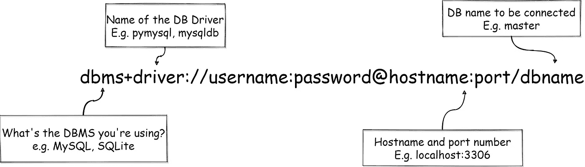

请注意，DB 驱动程序是可选的。如果我们保持它为空，SQLAlchemy (sandman2 构建在 SQLAlchemy 之上)将尝试使用默认驱动程序。但是，如果驱动程序不存在，它可能会抱怨。别担心，我们可以得到默认驱动库的名称，这样我们就可以使用`pip`来安装它。

运行该命令后，web 服务启动。

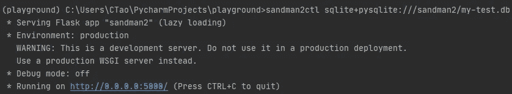

让我们尝试使用任何浏览器访问管理控制台的 web 客户端。

```
[http://localhost:5000/admin/](http://localhost:5000/admin/)
```

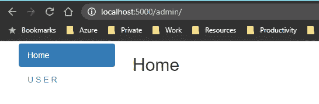

我们可以看到页面上已经有一个对象`USER`。这是因为我们创建了这个表。如果我们点击`USER`，我们可以看到我们之前插入的三行显示在数据表中。

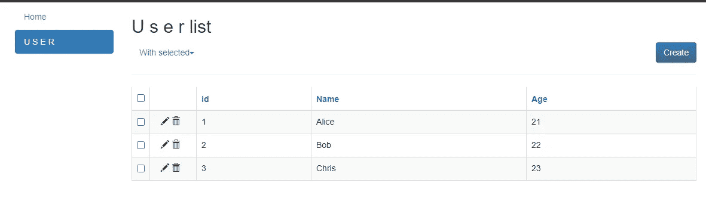

在此页面上，我们可以单击“创建”按钮来插入新行、更新现有行或批量删除行。您将能够很容易地找到这些特性，所以让我跳过这些内容，在下一节中向您展示最重要的特性。

# 数据访问 RESTful API


由[walker sk](https://pixabay.com/users/walkerssk-1409366/)在 [Pixabay](https://pixabay.com/photos/morocco-city-historic-village-clay-2349647/) 上拍摄的照片

sandman2 最酷的功能一定是我们已经连接的数据库自动生成的 RESTful API 端点。

在上面的部分中，保持 web 服务运行，那么 API 已经在那里供我们使用。您可能更喜欢 Postman 或失眠症等 API 测试工具，但在本文中，我将只使用“curl”命令来保持简单，因此如果您只想测试 API 端点，您不必下载任何东西。

## 1.获取表格中的数据条目列表

还记得我们有一张桌子叫`USER`吗？现在，我们可以简单地向下面的 URL 发送 GET 请求来获取条目列表。

```
http://localhost:5000/user/
```

请注意

1.  大多数 DBMS 如 SQLite 和 MySQL 不区分大小写，所以我们可以安全地使用小写的表名。
2.  URL 末尾的正斜杠`/`一定不能错过。

然后，让我们使用`curl`测试 GET API。

```
curl [http://localhost:5000/user/](http://localhost:5000/user/)
```

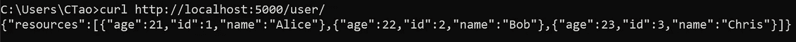

它返回表中的所有记录。但是，如果我们在一个表中有太多的条目，并且想要进行分页，该怎么办呢？是的，睡魔 2 支持开箱即用！

```
curl "[http://localhost:5000/user/?page=1&limit=2](http://localhost:5000/user/?page=1&limit=2)"
curl "[http://localhost:5000/user/?page=2&limit=2](http://localhost:5000/user/?page=2&limit=2)"
```

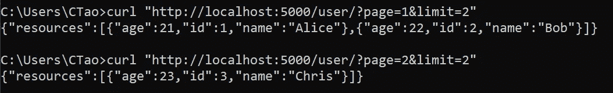

在这个例子中，我们使用`page`参数来指定页码，使用`limit`参数来指定页面大小。在第 1 页中，我们得到了前两个用户 Alice 和 Bob。然后，在第 2 页，我们得到了 Chris 的第三行，由于没有其他行，所以只返回了 1 行。

## 2.按键获取行

既然我们定义了主键，我们也可以通过它来查询表。

```
curl [http://localhost:5000/user/](http://localhost:5000/user/)3
```

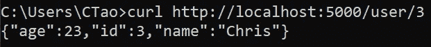

## 3.按任意字段筛选行

我们也可以按任何字段过滤行。

```
curl "http://localhost:5000/user/?name=Chris"
```

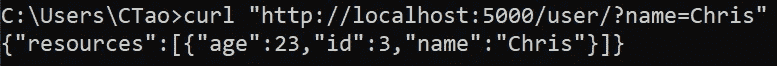

目前，有一个限制，即不支持对比较`>, <, >=, <=`进行过滤。

## 4.插入新行

要插入新行，我们需要使用 POST 方法。

```
curl -X POST -d "{\"age\":24, \"name\":\"David\"}" -H "Content-Type: application/json" http://localhost:5000/user/
```

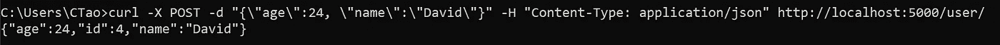

请注意，我使用的是 Windows，所以单引号在 cmd 中不起作用，我必须使用反斜线来转义双引号。如果你使用 Linux 或 Mac OS，你可能不需要这些。

此外，当我们创建`USER`表时，我们已经将“id”字段设置为自动递增，所以我们不需要传入“id”值。

我们无法使用基于 Web 的 SQL 客户端来查看该表。新用户 David 已成功插入。

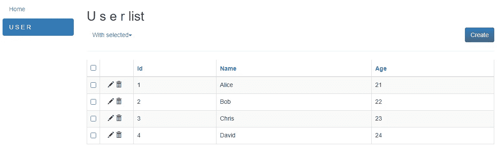

## 5.更新行

我们可以使用 PATCH 方法来更新一行。

```
curl -X PATCH -d "{\"age\":30}" -H "Content-Type: application/json" http://localhost:5000/user/3
```

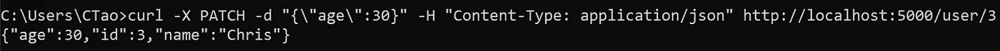

如示例所示，在 URL 中传递当前主键“id”很重要，在我们的示例中是“3”。Sandman2 依靠主键找到要更新的记录。

如果我们回到网络客户端，可以看到克里斯的年龄已经更新。

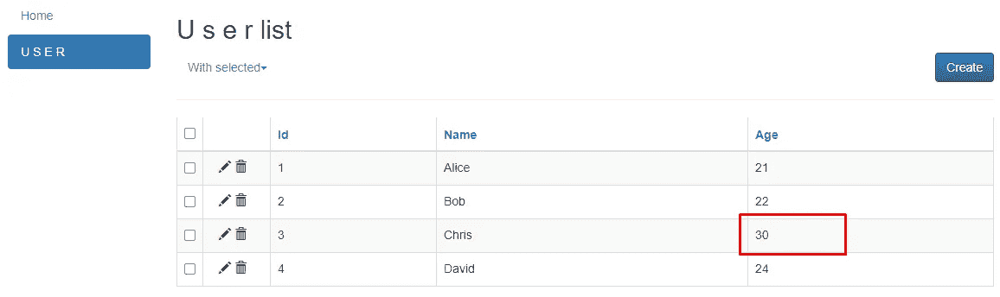

## 6.删除一行

我们可以使用 DELETE 方法删除一行。

```
curl -X DELETE -H "Content-Type: application/json" http://localhost:5000/user/3
```

运行上面的 CURL 命令后，id=3 的用户被删除了。

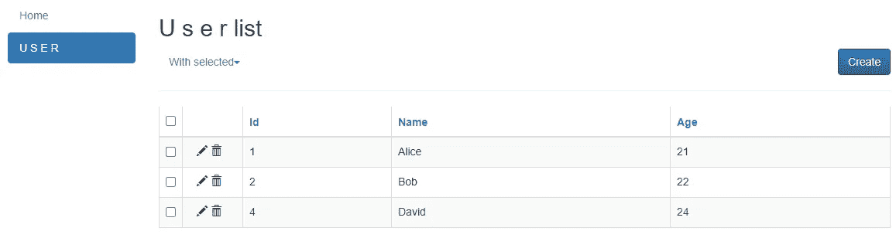

## 7.表的定义

sandman2 库不仅支持一般的数据访问 API，还支持其他一些高级 API，比如获取表的元数据。

```
curl http://localhost:5000/user/meta
```

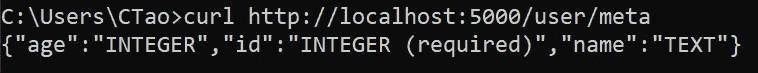

## 8.将表格导出到 CSV 文件

最后，它还支持将数据导出到 CSV 文件。

```
curl -o user.csv "http://localhost:5000/user/?export"
```

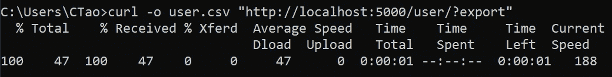

# 摘要


照片由 [jplenio](https://pixabay.com/users/jplenio-7645255/) 在 [Pixabay](https://pixabay.com/photos/road-sky-desert-landscape-nature-3133502/) 上拍摄

在本文中，我介绍了一个令人惊叹的 Python 库，名为 sandman2。它是用 Python 写的，但是你不需要写任何 Python 代码来使用它。只需用有效的数据库连接字符串运行它，您将获得

*   基于 Web 的 SQL 客户端
*   一整套访问 RESTful API 的数据

原来《睡魔 2》并没有太多的安全实现，所以请千万不要在生产中使用。然而，安全问题通常意味着定制实现，这几乎不可能在开箱即用的工具集中通用。因此，sandmand2 是一个优秀的库，可以节省我们大量的测试和实验时间。

[](https://medium.com/@qiuyujx/membership) [## 通过我的推荐链接加入 Medium 克里斯托弗·陶

### 作为一个媒体会员，你的会员费的一部分会给你阅读的作家，你可以完全接触到每一个故事…

medium.com](https://medium.com/@qiuyujx/membership) 

如果你觉得我的文章有帮助，请考虑加入 Medium 会员来支持我和成千上万的其他作者！(点击上面的链接)