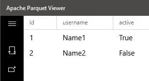

# 如何在 Java 中生成拼花文件

> 原文：<https://towardsdatascience.com/how-to-generate-parquet-files-in-java-64cc5824a3ce?source=collection_archive---------19----------------------->


马丁·范·登·霍维尔在 [Unsplash](https://unsplash.com/s/photos/files?utm_source=unsplash&utm_medium=referral&utm_content=creditCopyText) 上的照片

Parquet 是 Apache 为 Hadoop 基础设施开发的一种开源文件格式。嗯，它最初是 Hadoop 的一种文件格式，但后来变得非常流行，甚至 AWS 等云服务提供商也开始支持这种文件格式。这只能意味着拼花地板应该做一些正确的事情。在这篇文章中，我们将看到什么是 Parquet 文件格式，然后我们将看到一个简单的 Java 例子来创建或编写 Parquet 文件。

# 拼花文件格式介绍

在传统方法中，我们将数据存储为行。但是 Parquet 采用了一种不同的方法，它在存储数据之前将数据展平成列。这允许更好的数据存储压缩，也允许更好的查询性能。此外，由于这种存储方法，该格式可以处理具有大量列的数据集。

由于所有这些特性，大多数大数据项目都使用 Parquet 文件格式。拼花文件还减少了所需的存储空间。在大多数情况下，我们对某些列使用查询。这种文件格式的优点是一列的数据都是相邻的，所以查询运行得更快。

由于文件格式的优化和流行，甚至亚马逊也提供内置功能，在保存到 [S3](https://blog.contactsunny.com/?s=s3) (其中[充当数据湖](https://blog.contactsunny.com/data-science/how-to-build-a-simple-data-lake-using-amazon-kinesis-data-firehose-and-amazon-s3))之前，将传入的数据流转换为拼花文件。我在亚马逊的“雅典娜”和一些 Apache 服务中广泛使用了这个。关于 Parquet 文件系统的更多信息，可以参考官方文档。

# 依赖关系

在我们开始写代码之前，我们需要注意依赖关系。因为这是一个 [Spring Boot](https://blog.contactsunny.com/?s=spring+boot) Maven 项目，我们将在 *pom.xml* 文件中列出我们所有的依赖项:

```
<dependencies>
    <dependency>
        <groupId>org.springframework.boot</groupId>
        <artifactId>spring-boot-starter</artifactId>
    </dependency>
    <dependency>
        <groupId>org.apache.parquet</groupId>
        <artifactId>parquet-hadoop</artifactId>
        <version>1.8.1</version>
    </dependency>
    <dependency>
        <groupId>org.apache.hadoop</groupId>
        <artifactId>hadoop-core</artifactId>
        <version>1.2.1</version>
    </dependency>
</dependencies>
```

如您所见，我们正在添加 Spring Boot 启动包和几个其他 Apache 依赖项。对于这个例子，这就是我们所需要的。

# 属性

和往常一样，我们有一个 *application.properties* 文件，我们在其中指定所有属性。对于这个例子，我们只需要两个属性:一个指定模式文件的路径，另一个指定输出目录的路径。稍后我们将了解更多关于该模式的内容。因此，属性文件如下所示:

```
schema.filePath=
output.directoryPath=
```

因为这是一个 Spring Boot 应用程序，我们将使用 *@Value* 注释来读取代码中的这些值:

```
@Value("${schema.filePath}")
private String schemaFilePath;

@Value("${output.directoryPath}")
private String outputDirectoryPath;
```

# 拼花文件的模式

我们需要指定将要写入 Parquet 文件的数据的模式。这是因为当创建一个 Parquet 二进制文件时，每一列的数据类型也会保留。基于我们在模式文件中提供的模式，代码会在将数据写入 Parquet 文件之前相应地格式化数据。

在这个例子中，我尽量保持简单，正如您从下面的模式文件中看到的:

```
message m { 
    required INT64 id; 
    required binary username; 
    required boolean active; 
}
```

让我解释一下这是什么。第一个参数的类型是 INT64，这是一个整数，它被称为 *id* 。第二个字段是二进制类型，它只是字符串。我们称之为*用户名*字段。第三个是名为*活动*的布尔字段。这是一个非常简单的例子。但是不幸的是，如果你的数据有一百列，你必须在这里声明所有的列。

字段声明前的*必需的*关键字用于验证，以确保为该字段指定了值。这是可选的，对于非必填字段，您可以删除它。

# 拼花作家

声明时间，我没有写这两个类，我在这一节讨论。几个月前，当我研究这个的时候，我在 StackOverFlow 上发现了这两个类。我不知道这是谁写的，但我一直在到处使用这两个类。但是是的，我已经重新命名了这些类来适应这个项目。

首先是 *CustomParquetWriter* 类。这扩展了 Apache 提供的 *ParquetWriter* 类。该类的代码如下:

```
public class CustomParquetWriter extends ParquetWriter<List<String>> {

    public CustomParquetWriter(
            Path file,
            MessageType schema,
            boolean enableDictionary,
            CompressionCodecName codecName
    ) throws IOException {
        super(file, new CustomWriteSupport(schema), codecName, DEFAULT_BLOCK_SIZE, DEFAULT_PAGE_SIZE, enableDictionary, false);
    }
}
```

这里没什么好说的。下一个是 *CustomWriteSupport* ，您可以在上面的代码片段中看到它是 super()构造函数的第二个参数。这是很多事情发生的地方。您可以检查完整类的 [repo](https://github.com/contactsunny/Parquet_File_Writer_POC) ，看看它做了什么。

基本上，该类检查模式以确定每个字段的数据类型。之后，使用 *RecordConsumer* 类的一个实例，数据被写入文件。我不会过多谈论这两个类，因为 a)它们不是我写的，b)代码简单到任何人都能理解。

# 为拼花文件准备数据

让我们准备一些数据来写入 Parquet 文件。字符串列表表示拼花文件的一个数据集。列表中的每一项都是模式文件中更正字段的值。例如，假设我们有一个如下所示的列表:

查看 scheme 文件，我们可以看出数组中的第一个值是 ID，第二个值是名称，第三个值是活动字段的布尔标志。

因此，在我们的代码中，我们将有一个字符串列表来表示多行。是的，你没看错，这是一个字符串列表:

```
List<List<String>> columns = getDataForFile();
```

让我们看看这个函数，看看我们是如何生成数据的:

```
private List<List<String>> getDataForFile() {
    List<List<String>> data = new ArrayList<>();

    List<String> parquetFileItem1 = new ArrayList<>();
    parquetFileItem1.add("1");
    parquetFileItem1.add("Name1");
    parquetFileItem1.add("true");

    List<String> parquetFileItem2 = new ArrayList<>();
    parquetFileItem2.add("2");
    parquetFileItem2.add("Name2");
    parquetFileItem2.add("false");

    data.add(parquetFileItem1);
    data.add(parquetFileItem2);

    return data;
}
```

这很简单，对吧？那我们继续吧。

# 获取模式文件

正如我们已经讨论过的，我们有一个模式文件。我们需要将该模式放入代码中，特别是作为 *MessageType* 类的实例。让我们看看如何做到这一点:

```
MessageType schema = getSchemaForParquetFile();

...

private MessageType getSchemaForParquetFile() throws IOException {
    File resource = new File(schemaFilePath);
    String rawSchema = new String(Files.readAllBytes(resource.toPath()));
    return MessageTypeParser.parseMessageType(rawSchema);
}
```

如您所见，我们只是将文件作为字符串读取，然后使用 Apache 库提供的 *MessageTypeParser* 类中的 *parseMessageType()* 方法解析该字符串。

# 让拼花作家

这几乎是整个过程的最后一步。我们只需要获得我们之前讨论过的 CustomParquetWriter 类的一个实例。这里，我们还提供了 writer 将写入的输出文件的路径。这方面的代码也很简单:

```
CustomParquetWriter writer = getParquetWriter(schema);

...

private CustomParquetWriter getParquetWriter(MessageType schema) throws IOException {
    String outputFilePath = outputDirectoryPath+ "/" + System.currentTimeMillis() + ".parquet";
    File outputParquetFile = new File(outputFilePath);
    Path path = new Path(outputParquetFile.toURI().toString());
    return new CustomParquetWriter(
            path, schema, false, CompressionCodecName.SNAPPY
    );
}
```

# 将数据写入拼花文件

这是最后一步，我们只需将数据写入文件。我们将循环我们创建的 list 列表，并使用我们在上一步中创建的 writer 将每个列表写入文件:

```
for (List<String> column : columns) {
    writer.write(column);
}
logger.info("Finished writing Parquet file.");

writer.close();
```

差不多就是这样。您可以转到输出目录并检查创建的文件。例如，这是我运行这个项目后得到的结果:



如果你想直接从工作示例开始，你可以在我的 [Github repo](https://github.com/contactsunny/Parquet_File_Writer_POC) 中找到 Spring Boot 项目。如果你有任何疑问，欢迎在评论中问我。

> 最初发表于 2020 年 4 月 7 日 https://blog.contactsunny.com。