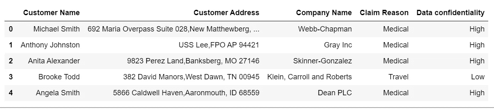

# 如何用 Python 生成伪随机数据集:用 Numpy & Faker 从头开始

> 原文：<https://towardsdatascience.com/how-to-generate-pseudo-random-datasets-in-python-start-from-scratch-with-numpy-faker-c5661e3bc58b?source=collection_archive---------20----------------------->

## 当数据丢失时，创建它！(负责任地)

照片由[帕特里克·福尔](https://unsplash.com/@patrickian4?utm_source=medium&utm_medium=referral)在 [Unsplash](https://unsplash.com?utm_source=medium&utm_medium=referral) 拍摄

# 介绍

您即将开始下一个数据项目，但是您立即遇到了一个障碍:您希望使用的数据不容易访问。

发生这种情况有多种原因，例如:

1.  您试图访问的数据是机密的，不能共享
2.  数据可以共享，但是签订数据共享协议在时间和金钱上都是昂贵的
3.  你获得了一些数据，但样本量太小，你无法根据代表性的数据源做出任何相关的统计推断或建模
4.  您一直在寻找公共在线数据集，但就是找不到符合您特定需求的数据集

这些是同样面临的共同问题:

a)希望为其下一个数据解决方案开发 MVP 的企业家

b)希望模拟数据可视化解决方案的数据分析师

c)希望为客户开发概念验证解决方案的分析顾问

无论是哪种用例，本文的目标都是向您展示一个简单的例子，说明如何使用 Python 来生成伪随机数据集，其目的是尽可能地模拟真实世界的数据。

尽管生成伪随机数据将不可避免地具有给定的限制:

1.  数据中人为构建的相关性和相互关系
2.  样本数据集构建方式的固有偏差(通常由作者驱动)
3.  缺失混杂因素和其他关键变量

为了让您的数据项目获得初步启动，并让您能够向投资者或您的下一个客户展示您的数据解决方案的潜力，该活动可能至关重要。

这项活动甚至可能说服你的同事与你分享真实世界的数据，这是你的最终目标。在咨询行业中，这样的同行是您的实际客户和数据的看门人，一旦数据解决方案的初步探索的可行性得到积极评估，这种情况就会经常发生。

现在让我们来看看 Python 中一个简单的数据生成工作流，在这个工作流中，您将主要利用 Numpy 和 Faker 包。

# 第一步:掌握正确的事实

假设您必须生成一个数据集，该数据集包含来自特定细分市场的保险索赔请求列表。您不是保险专家，并且希望得到至少 200，000 行与现实至少有一些相似之处的保险索赔，以便您可以将这些数据用于您将在前端创建的应用程序的示例用户界面。

你在网上找，你什么也没找到，因为你的新应用将覆盖一个你认为是行业空白的市场。

我称之为“询问专家”是一个很好的起点。实际上，这可能意味着:

1.  向拥有相关行业经验或背景知识的朋友和同行伸出援手
2.  在网上寻找行业报告、市场展望或相关文章

来源:作者

这项活动的目标是了解尽可能多的背景信息，以便以尽可能接近您试图代表的细分市场现实的方式生成数据。在本例中，这可能意味着询问数据的地理划分(即，如果您所在市场中 30%的索赔来自澳大利亚和日本，您可能希望您的数据反映这一点)以及与手头问题相关的任何其他问题。

这里的关键是不断地以迭代的方式收集有用的信息，这样当您生成数据时，您就可以返回到您的源并对照它们检查您的结果，并相应地调整您的数据生成活动。

为了获得有意义的生成数据样本，这可能是最重要的一步，而且这肯定需要相当长的时间，因为你会想要考虑各种变量和关系。

一旦完成了第一个关键步骤，就该使用一些 Python 代码来生成数据了！

# 步骤 2:生成数据

现在让我们看一下生成来自客户的 200，000 行随机保险索赔所需的代码。

1.  **导入相关的包**:作为第一步，您需要导入相关的 Python 包。您可以使用*熊猫*和 *numpy* 操作数据，*请求*和 *BeatifulSoup* 处理网页， *random* 和*F*[*aker*](https://pypi.org/project/Faker/)生成随机数据。在进行过程中，您将会用到所有这些包。当你开始设置的时候，不要忘记初始化一个 *faker* 生成器。

**2。生成 200，000 个随机保险客户和相关变量**

**2.1 *客户名称、地址、公司名称、索赔原因、*保密等级**

您可以生成的前五个变量是客户姓名、家庭地址、公司(假设每个客户都是公司的雇员)、保险索赔的原因以及索赔所附带的数据保密级别。

在这种情况下，您还隐式地定义了样本大小 *n_names=200，000* 。您可以使用 *fake.name()* 生成 *n_names* 名字，并存储到*名字列表*中*。*还可以使用 *fake.company()* 和 *fake.address()* 生成假的客户地址和公司名称。

假设步骤 1 中的专家告诉您，提出索赔的常见原因类型是“医疗”、“旅行”、“电话”或“其他”。对于这些原因中的每一个，都有一定程度的数据保密性(从“非常低”到“高”)，这也是您需要考虑的。您可以通过定义一个字典(这里称为*claim _ confidential _ dict*)来做到这一点，该字典存储每个索赔原因并将其映射到其相对数据机密性级别。

假设您还阅读了一份声誉良好的行业报告，该报告指出，所有索赔的分布严重偏向医疗索赔原因，这占所有索赔原因的 55%，其他索赔原因各占其余 45%的份额。然后，您可以使用 *random.choice* 函数创建一个 *claim_reasons 列表*，设置列表的长度等于 *n_names (200，000)* 以及使用 *p* 参数挑选给定索赔原因的概率。该参数是包含每个原因的可用概率的列表，允许我们提取 200，000 个索赔原因的有意义分布，以与我们的客户名称配对。

最后，您还可以生成一个包含所有保密级别的列，然后映射到您刚刚生成的 200，000 *claim_reasons* 列。为此，您可以使用之前定义的*claim _ confidential _ dict*字典作为查找参考，在索引 *i* 处生成一个保密级别，该索引与 *claim_reasons* 列表的相同索引位置配对。

创建了所有五列之后，现在可以将它们放入一个名为 *df 的 *pandas DataFrame* 对象中。*并调用 *df* 。head()来可视化全新的 200，000 行乘 5 列数据集的前 5 行。

图片:作者

**2.2 *国家、销售经理、*索赔金额**

现在让我们看看如何添加一个*国家*列，它标识客户的国籍，以及客户的索赔金额和处理索赔所需的指定销售经理。

你希望这家保险公司在世界各地开展业务，因此假设 200，000 名客户的样本具有国家频率，该频率等于特定客户来自 X 国的概率，给定其总人口。

因此，您可以使用列出所有国家和相关人口的[维基百科页面](https://en.wikipedia.org/wiki/List_of_countries_and_dependencies_by_population)来确定从特定国家挑选客户的概率。您首先需要导入一个国家列表及其人口列表。

让我们将代码分解如下:

你首先定义 *URL* 变量，它指向在线[数据源](https://en.wikipedia.org/wiki/List_of_countries_and_dependencies_by_population)。然后建立两个空列表， *countries_list* 和 *pop_list，*，用于存储来自网页的数据。

在 Python 中，你可以用漂亮的汤和请求包抓取网页。可以用 *request.get* 方法获取相关的 [URL](https://en.wikipedia.org/wiki/List_of_countries_and_dependencies_by_population) 内容。然后，您可以用*提取它的文本。text 方法，*最后把它解析成一个漂亮的 Soup 对象。

然后，为了在 HTML 中定位包含列表以及国家和人口的表格，您可以检查页面的代码(这可以通过在 Google Chrome 上单击 Ctrl + Shift + I 来完成)，并看到您感兴趣的表格元素有一个类 *wikitable。*然后您可以迭代它的 rows ("tr ")元素，对于表中的每一行(代码中的*数据*组件)，您可以提取相应的*国家*和*人口*元素。

提取后，您可以将它们添加到 *countries_list* 和 *pop_list* 中，并移动到下一个元素，直到到达表的末尾。

通过接下来的三行代码，您可以获得从 Wikipedia 页面返回的按人口排列的前 100 个国家(网页上的表格有已经排序的国家和人口列表，因此通过选择列表的前 100 个元素，您可以立即选择人口最多的国家)，以及相关人口规模的列表。

然后，通过将每个国家的人口除以前 100 个国家的总人口来获得相应的概率，并将这些概率用作选取随机国家的权重，以附加到新创建的*国家*列，该列插入到 *df* 数据集中。

最后两行代码还为数据集的每个索赔分配了一个索赔管理器，假设总共有 5 个 claim _ managers(简化),被分配一个索赔的概率相等。

您知道需要生成一个“索赔金额”列。你知道每笔索赔金额往往因索赔原因而异。

以下是您从另一份行业报告中获得的每个索赔原因类别的典型范围:

a)医疗:1300-3200 美元

b)差旅费:300-900 美元

c)电话:200-270 美元

d)其他:1-100 美元

如何根据索赔原因类别，将给定范围内的索赔金额分配给每一行？

您可以初始化一个空的“索赔金额”列，然后用分配给每个类别的给定范围内的随机整数填充它。索赔金额通过 *numpy* 提供的 *np.random.randint(低，高)*生成。然后你可以在数据集上调用 *df.head()* 来看一下你到目前为止得到了什么。

图片:作者

**2.3 已付保费和索赔请求输出**

您要创建的最后三列是:

1.  *Category Premium，*基本上是一个列，记录每个客户在给定索赔原因类别中支付的平均保险费金额
2.  *保费/金额比率，*基本上是登记索赔金额与平均类别保费的比率的列
3.  *索赔请求输出，*基本上是一个“是”/“否”列，说明索赔金额最终是否由保险公司承保。

让我们假设您的市场研究也发现，在您给定的细分市场中，支付的保费平均比给定类别中的平均索赔额高 8 倍。假设您还知道您的数据集想要一家保险公司，出于效率原因，该公司自动支付平均类别保费的 6%或更低的索赔额(因为该公司不想花时间验证某项索赔背后的合理性，因为小额金额不值得为此付出巨大努力)。

您可以通过使用 pandas *groupby* 然后在*索赔原因*列使用 *mean()调用*来计算您的平均索赔金额，如下所示。然后，您可以将每个平均索赔额乘以 8，以获得您的平均类别保费，并将它们存储在一个列表中。完成后，您可以创建一个新的 *Category Premium* 列，根据特定行的索赔原因，列出每行的平均保费金额。

然后，您可以通过简单地将*索赔金额*列除以*类别保费*列来创建*保费与金额比率*列。

如果按类别细分，你会发现平均而言，每项索赔占该类别保费的 13%左右

现在让我们计算最后一列，即*索赔请求输出*，方法是为所有保费/金额比率低于 6%的索赔分配一个“Yes”值。您可以使用 [*np.where*](https://numpy.org/doc/stable/reference/generated/numpy.where.html) 函数轻松创建新列，并通过调用控制台来可视化整个数据集。

图片:作者

# 第三步:外卖

你完了！您已经成功地生成了 200，000 行和 11 列的伪随机数据，准备用于项目。

这个数据集绝不是一个封闭的解决方案，您可以根据自己的数据生成需求扩大或缩小这个方法。

记住关键的一步是第一步。在这里，您试图收集尽可能多的关于问题的上下文知识，这样，即使您仍然得到随机的行，您也可以在第一次尝试中建立一定程度的逻辑和连贯性。

我鼓励您将数据生成作为一种迭代练习。Python 是一种很好的从头构建数据的编程语言，但是当你在代码中灌输关于用例的技能和直觉时，真正的价值就会增加，这样输出就可以尽可能地(伪随机)。

从这个意义上说，主题专家、在线资源和你的团队是你最好的助手。

**访问我的免费数据科学资源清单** [**这里**](https://landing.mailerlite.com/webforms/landing/k1n3r2)

 [## 通过我的推荐链接加入 Medium-Edoardo Romani

### 作为一个媒体会员，你的会员费的一部分会给你阅读的作家，你可以完全接触到每一个故事…

edo-romani1.medium.com](https://edo-romani1.medium.com/membership)